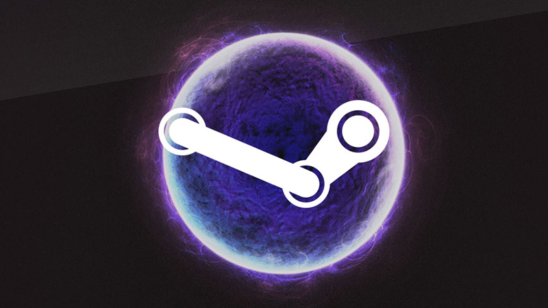
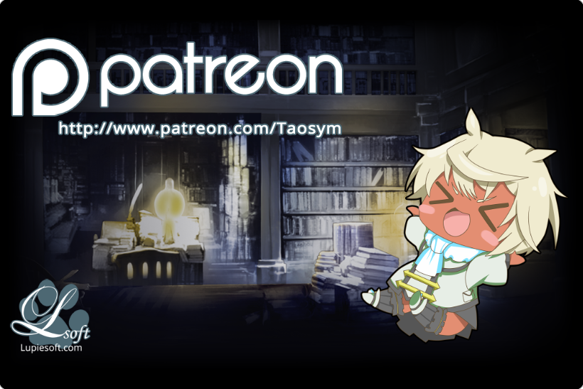
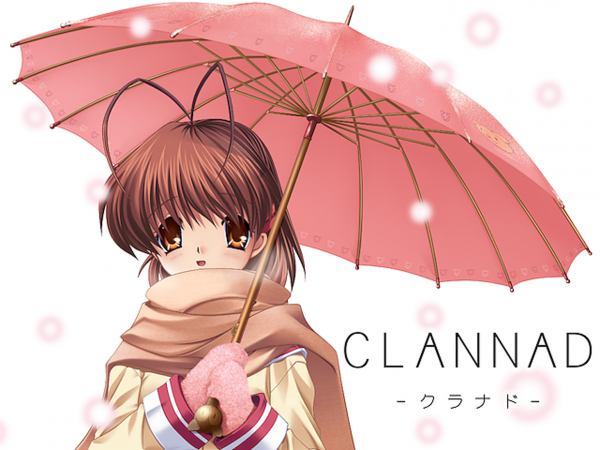

---
{
	title: "A Call for Transparency and the Issue with Steam's Eroge(?) Purge",
	published: "2018-05-18T01:17:00-04:00",
	tags: ["Rockmandash Rambles", "Reikaze", "Visual novels"],
	kinjaArticle: true
}
---

On May 17th, 2018, two prominent English Visual Novel developers (HunieDev and Lupiesoft) were sent warnings from Valve that their games will be removed from Steam because of “reports of pornographic content”. This may not seem particularly weird or pressing on first impression, but what makes this situation bizarre is the context in which this happened: these games follow all of Steam’s guidelines, and they’ve have been on the platform for years. Valve’s actions today set a dangerous precedence for Steam as a platform as a whole and it creates uncertainty for a growing western Visual Novel industry that has used Steam as an engine for sustainability in our modern world.

**Update: **As time passes, it’s clear that this isn’t just a small thing isolated to these two VNs. Mangagamer, one of the largest VN publishers in the west, just wrote a blog post about it because *Kindered Spirits* got hit with a warning, Nekopara also got hit, etc. [Here’s a running list of all the VNs that are getting hit with these take down threats.](https://docs.google.com/spreadsheets/d/1UglwdtWkWm51NNZplqd1_pUOLE8IyjDmdTQ8CdRsggo/edit#gid=0)

**Update 2: **On May 19th, 2018, Valve sent messages to every developer that got a warning to disregard the previous emails about violations. No clarification to policy or any information about why the warnings were sent out was released.

***

I highly suggest you read through Lupiesoft’s and HunieDev’s threads about this before you keep on reading, so I’m going to link them here.

**TL;DR** though: Both of these devs got warnings that games will be taken down because of reports of “pornographic content”. Both of these games on steam are censored so neither of these games are actual eroge, they haven’t violated Valve’s guidelines, and Valve has not specified what in particular caused these games to be taken down. Hell, Lupiesoft’s publishers Mangagamer meet with valve in person and asked if ecchi material was OK on the platform, but have now done a complete 180. There is a complete lack of transparency here, and what this means is that if Valve doesn’t like your particular game, it can now just use it’s power as the holder of the platform and take down your game from the platform.

This take down is only of Visual Novels, and sends a message to Visual Novel devs that they aren’t welcome on the platform. As Lupiesoft’s dev says:

> Games are being pulled simply because they look a certain way and there is a stigma behind the look of a game. In the future this could easily extend to anyone who even makes visual novels no matter how ‘sexy’ they might appear to be.

With a completely arbitrary decision, and even if you follow Steam’s rules, Visual Novel devs can see their livelihood and income disappear in an instant.

I’m not particularly fond of ecchi Visual Novels and have been on record for complaining about them because of this exact stigma they put on the entire Visual Novel medium/genre as a whole. Even as a detractor of these games though, it’s clear to me that this is a terrible thing for the Visual Novel industry as a whole. As a fan of Visual Novels, a fan of PC gaming in general and a fan of the platform as a whole, I hope that Valve takes the higher road and explains their decision. Without transparency, a platform cannot be trusted: here’s already a level of risk to quit your day job and put your heart and soul into what you love, but now because of the whims of a platform owner, the risk is even higher.

It is at this point where you might ask - Why can’t Eroges and Visual Novels in general use other platforms to sell their games? You already know that answer: Visual Novels are and have been dependent on the PC platform for decades at this point and when people buy PC games in the West, they get the game from Steam. Steam has been stabilizing the Visual Novel industry and lead to sales numbers otherwise impossible. A great example of this is the release of *Clannad:* when it came out on steam it was the 3rd best selling game on the platform, and these sales wouldn’t have been possible otherwise without Steam. Before the western Visual Novel industry was using Steam, the publishers sold much less or were using Kickstarter, which is much riskier and much worse for consumers as a whole.

Steam let Visual Novels be less dependent on Kickstarters (we can see this in major releases like* G-Senjou no Maou* or other Key games that don’t even need a Kickstarter thanks to steam), and Steam lets the genre reach a larger audience while allowing the games be much more accessible for everyone. Without Steam, Visual Novels aren’t really that viable - Visual Novel companies aren’t all that profitable in general and when distribution is a hurdle, it’s much harder for a product to be successful. Japanese VN companies will be much less inclined to target a western audience, and we’ll see less compelling and engaging Visual Novels come out in the west thanks to this.

While steam might not particularly like these Visual Novels, arbitrary decisions to remove one’s livelihood in a manner that undermines is absolutely not the way to do it. This effects more than just these 2 games, and this effects the medium as a whole: Transparency is the key to a great platform. So, I ask Valve: please explain why this is happening. Now is the time where transparency would be appreciated the most, and I hope for everyone this gets resolved in a proper manner.

***

*Thank you for reading! This is Rockmandash Reviews, a blog focused on everything revolving Visual Novels, with stuff like tech and anime every now and then. If you want to check out more of my writing, check out *[*FuwaReviews*](https://fuwanovel.net/reviews-hub/)* and *[*AniTAY*](http://anitay.kinja.com/#_ga=2.29830716.283022684.1516595779-1252363867.1516472140)* where I am a contributor!*