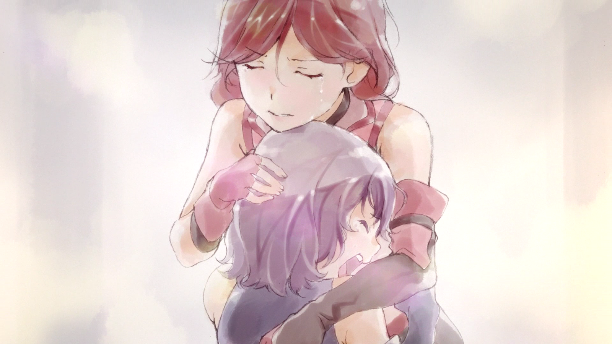
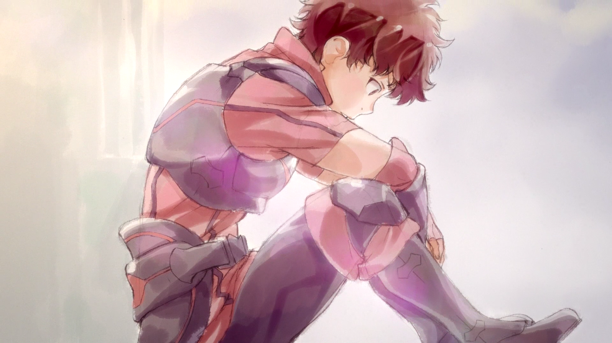
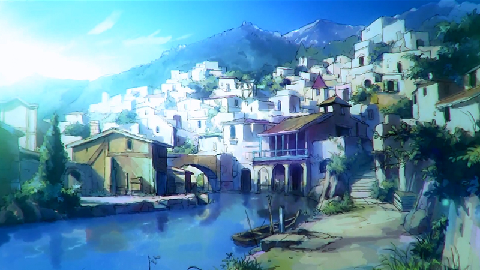
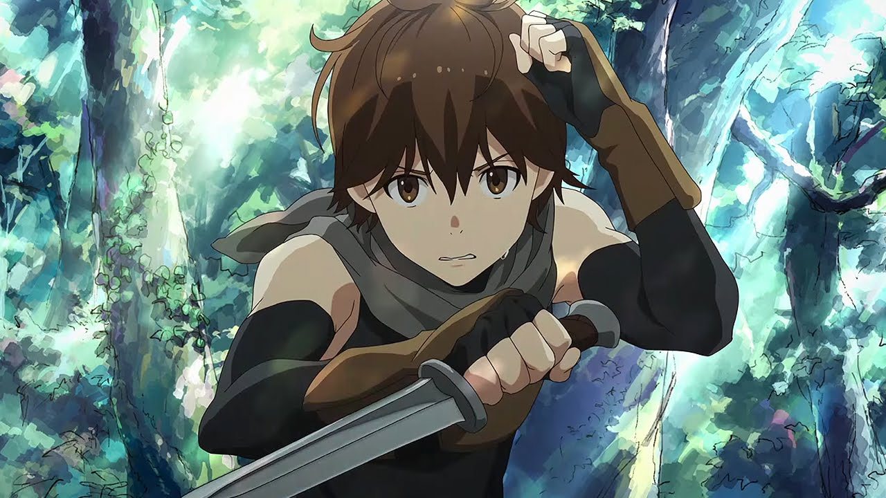
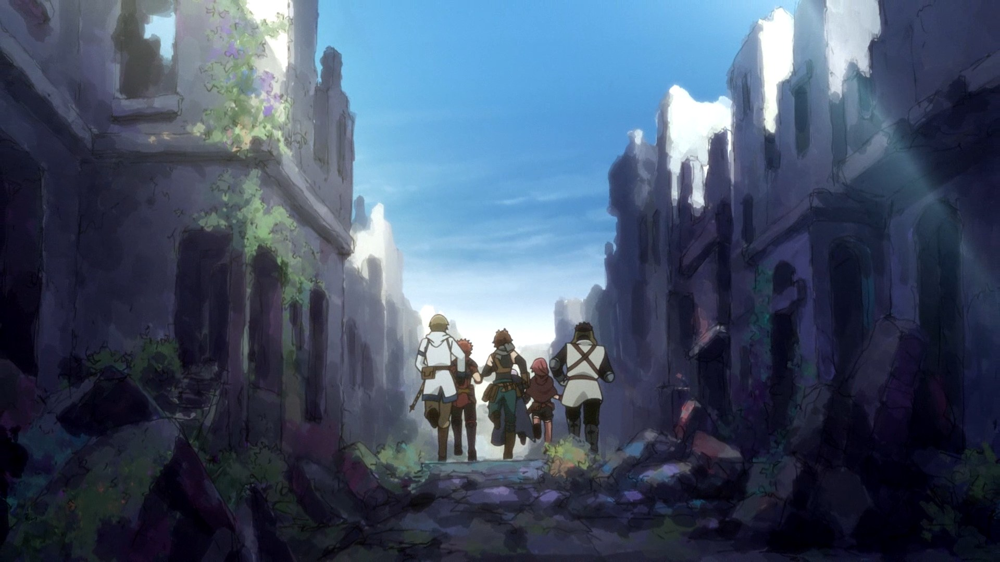
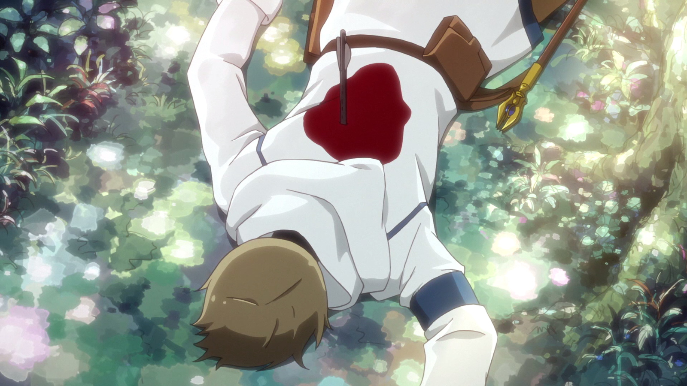
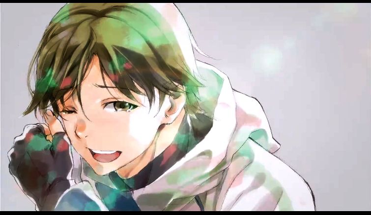
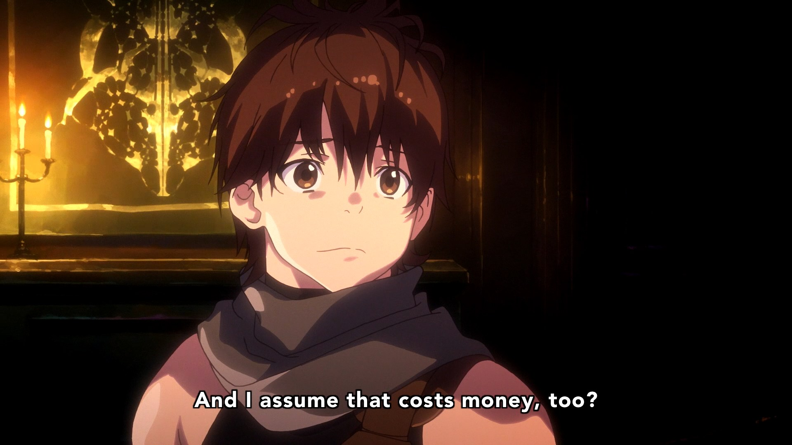
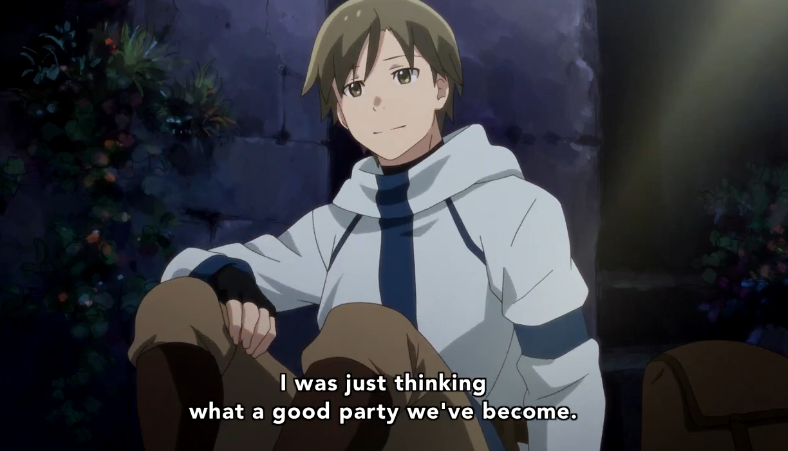

---
{
  title: "A Discussion About Death in Grimgar of Fantasy and Ash",
  tags:
    [
      "Grimgar",
      "grimgar of fantasy and ash",
      "Anitay",
      "winter 2016",
      "Rockmandash Rambles",
    ],
  published: "2016-02-20T05:54:43-05:00",
  attached: [],
  license: "cc-by-4",
  oldArticle: true,
}
---

Death. It’s a concept imposed on us that we cannot avoid, the defining conflict
  and attribute about humans that make us who we are, and to see this conflict unfold in front of our eyes, forced to
  pick a side in the decision.. it’s fascinating but horrifying at the same time, something that shakes us to our core.
  This is what <em>Grimgar of Fantasy and Ash</em> presents us, and how it does this is surprisingly similar to the
  concept it’s dealing with. 

<em><strong>DISCLAIMER - this post will contain spoilers on the Show Grimgar,
  primarily discussing the events after episode 3, my thoughts on it and how it effects the show itself. For those who
  have not seen Grimgar,</strong></em> 
<h3 class="sc-1bwb26k-1 fvCjqJ" id="h103859"><em><strong>DO
  NOT READ ON. SERIOUSLY. DON’T. GO BACK AND WATCH THE SHOW, OR LEAVE. </strong></em></h3>

<em><strong>Get it? Got it? Good. After you stare at these pictures which serve as buffer for those who dare to scroll
    even though they haven’t seen the show, we’re moving on.</strong></em>

<video autoplay="" loop="" muted=""><source src="tbi5hwfsniyr5owgwydw.mp4" type="video/mp4"/></video>

<video autoplay="" loop="" muted=""><source src="./ipdrugd9caspooepwruj.mp4" type="video/mp4"/></video>
<video autoplay="" loop="" muted=""><source src="./izc6fjxjetgs9tsl7wj3.mp4" type="video/mp4"/></video>

<em>Grimgar of Fantasy and Ash</em> is a fantasy drama show made by A-1 pictures
  that does not hold anything back, a show based around the experiences and promises it holds about the premise and the
  world it is based upon. It’s a show that runs with a rather tried and true premise of dropping and trapping people
  into a fantasy world that we’ve been seeing lately after the explosion that is <em>Sword Art Online</em>, but then
  deconstructs (as much as you may dislike the word, it is descriptive of <em>Grimgar</em>) it to show how such a
  premise could work in the real world, with a darker and more dramatic twist. While it’s definitely not the first or
  arguably the best deconstruction in anime, (see <em>Now and Then, Here and There</em> for that IMO) it is definitely
  what it says it is, A grim work that focuses on the reality of the fantasy world, but also the promises of a future
  that comes with a new world. 

You see, the characters it focuses on are young teenagers were ripped out of a world
  that was most likely ours and thrown into the fantasy world of <em>Grimgar</em> with their memories of the old world
  wiped in the process. This death of their past life, while interesting and seemingly horrible, it isn’t all bad:
  because we know nothing about it, they make have came on good conditions and more practically, it can serve as a
  reboot of their young life with a promise for a future. They have a whole new world to explore, a whole new life to
  experience, and for better or for worse, it’s totally different. <em>Grimgar</em> shows us that one must move on even
  through harsh times, and in the process of moving on, you can surpass the point you were at before. Thing is though,
  <em>Grimgar</em> is no <em>Konosuba</em>, and even though one can argue that it’s our worldview that is skewing our
  view of <em>Grimgar</em>, this world is not all fine and dandy - it’s a much harsher world, a world where kill or be
  killed is not the exception but the rule in comparison to the world they are from, and our young teenagers are thrown
  into this kill or be killed life, and there are casualties involved.

Enter Episode 4 of <em>Grimgar</em>. The past few episodes have been all good for
  our little team of volunteer soldiers, finally killing their first goblin and making money in an abandoned city, but
  the world of Grimgar isn’t a walk in the park and hands the squad a casualty of it’s own after the death of many
  goblins: the death of their leader Manato, who was essentially running the show. He was a big brother to our MC, the
  team’s healer that essentially kept the team alive, he was a manager that organized everything, but he was a control
  freak who had a bad habit of going <strong>LEROY JENKINS</strong> on the cast, essentially dooming his fate and
  explaining the Ash in the title.  

<video autoplay="" loop="" muted=""><source src="pmrarksqugu0l6c03hbb.mp4" type="video/mp4"/></video>

As a drama that focuses on reality, the death of Manato was all that much harder
  than death on other works, and it was brilliant yet horrifying at the same time. Due to the deconstructive nature of
  the work, it wasn’t just a cheap death that means nothing ala <em>Akame ga Kill</em>: it got us to think of death in
  the context of a real death, and it’s a works that is able to bring so much more, to get you to think about all sorts
  of elements - the loss of potential, the loss of a good friend, etc. It was a strong and effective move for the show
  to kill him off, and in no way was it meaningless, shaping the show to be the way it has to be but like death itself
  and in the show, there are positives and negatives to everything. 

Thematically, it made more sense to kill him off, but I don’t think it may have been
  the best in relation to how characters develop or structurally in general, because so many things are connected
  through Manato. We aren’t going to get the dialogue between Haru and Manato anymore, the dialogue that was rather
  interesting and really one of the few ways to learn Haru’s personality, we are going to get a totally different show
  with different character dynamics that may not be as engaging and powerful, But above all else, killing off Manato
  kills of the potential the show has with him, the life that could have been.

This may be selfish of me, but I really liked Manato, to the point where I wanted a
  show where he was the MC. He was my favorite character by far, not just because he played the role of an older brother
  and a leader, but because he was someone who was interesting because he was rather developed in comparison to the rest
  of the rather flat cast. There’s a lot to his character: his interactions with Haru and characters in general, his
  personality that provides hints about his life in the past world even though there was no way to know, positive
  outlook on the world, all of this added up to me. It was only 4 episodes so many may not be invested with him as a but
  for those that were, he was a promise from the show that was killed off, a life and show I will never be able to see.
  Gone is the potential character arcs about him and what he dealt with, gone is any hope that they will have success in
  the near future, gone is the fantasy that the show roped us in. It’s a decision that makes complete sense as a drama,
  but man, did it crush me inside.

Yes, this is the point of the whole decision and the show will absolutely use his
  death the the full advantage by dealing and accepting it to develop and yes, it’s a wake-up call to the characters and
  the cast in it that this show doesn’t care about your dreams of a fantasy, but I can’t help but feel like, as a show,
  they could have done it in a better way in regards to the story. Seeing any young person die makes you think about the
  potential, the what if, and as a young person, I think about the the potential of my life so it felt rather impactful.
  At the same time however, they killed off my main connection with the show, and potentially many others, so I ended up
  rather conflicted. As an experience first (which this show is essentially running off of) this could potentially ruin
  the experience for certain viewers. With myself in particular, every time I go to watch the show, I become less and
  less interested because they killed the character I cared about the most. 

It definitely has its shock factor and this will definitely make the show more
  memorable, but it begs the question, is that at a hindrance of the promises that the show makes, or does it promise a
  better show instead? Could they have managed to shock us in a way that didn’t lead to a changing of the character’s
  dynamics, and would that have been a better show? I think they probably could have done so, maybe through the loss of
  everything they own or something else, but that’s just speculation, something we may never know.. and that may be for
  the better. Who knows? It was definitely an interesting way of handling death in a work and I’d like to see more
  realistic approaches to death like this, but at the same time, it still burns. It shows the strengths of the approach
  this show makes in regards to it’s handling of issues and drama, but at the same time it handled it’s events in a way
  that one may disapprove of. It was exactly like the concept itself, an action imposed on us that we cannot avoid, the
  defining conflict and attribute about the show that makes it what it is. It’s fascinating but horrifying at the same
  time, something that shakes us to our core, a great work that can fascinate people for days on end, and one that truly
  gets you thinking to the point that it makes one appreciate what the media truly is.

<em><small>Thanks for reading! For those who stuck around, I’d
  be really greatful if you chimed in, a discussion with one person is rather lonely after all. For those of you not in
  the know, you’re reading Ani-TAY, the anime-focused portion of Kotaku’s community-run blog, Talk Amongst Yourselves.
  Ani-TAY is a non-professional blog whose writers love everything anime related. Click </small></em><a class="sc-1out364-0 hMndXN sc-145m8ut-0 gIacKn js_link" data-ga='[["Embedded Url","External link","http://anitay.kinja.com/",{"metric25":1}]]' href="http://anitay.kinja.com/" rel="noopener noreferrer" target="_blank"><small><em>here</em></small></a><small><em> to check us out. If you want to read more
  of my writing, check out </em></small><a class="sc-1out364-0 hMndXN sc-145m8ut-0 gIacKn js_link" data-ga='[["Embedded Url","External link","http://rockmandash12.kinja.com/",{"metric25":1}]]' href="http://rockmandash12.kinja.com/" rel="noopener noreferrer" target="_blank"><small><em>RockmanDash Reviews</em></small></a><small><em>
  and </em></small><a class="sc-1out364-0 hMndXN sc-145m8ut-0 gIacKn js_link" data-ga='[["Embedded Url","External link","http://kmtech.kinja.com/",{"metric25":1}]]' href="http://kmtech.kinja.com/" rel="noopener noreferrer" target="_blank"><small><em>KMTech</em></small></a><small><em>.</em></small>

