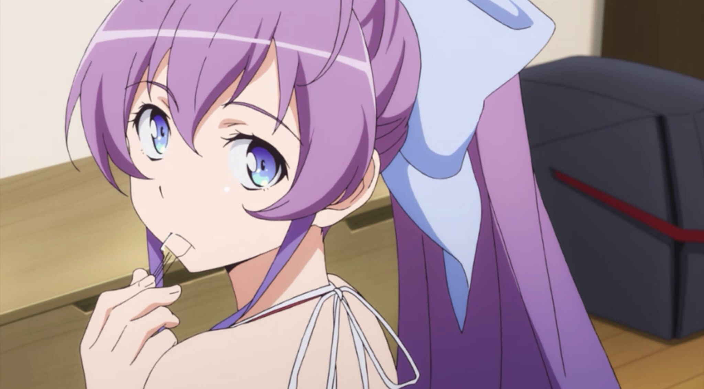

---
{
	title: "2014: A Great Anime Year & The Birth of AniTAY",
	published: "2019-12-30T09:00:00-05:00",
	tags: ["DECADE IN REVIEW", "Anime Decade in Review", "Anime", "#retrospective", "2014", "Rockmandash Rambles"],
	kinjaArticle: true
}
---

While as a year 2014 might have not been all that remarkable overall, in regards to anime 2014 was one of the best that I’ve ever seen. From a hoard of romance and sports anime to classic action anime sprouting out of nowhere, Anime and AniTAY in 2014 was a fun time, and let’s take a trip down memory lane to look back on what I would consider to be one of the fondest moments in regards to anime and AniTAY.

This is the 4th article in AniTAY’s[ Decade In Review ](https://anitay.kinja.com/c/decade-in-review)series, with the previous being [2013](https://anitay.kinja.com/2013-the-year-of-attacking-titans-and-one-trigger-hap-1840624552), [2012](https://anitay.kinja.com/2012-where-did-we-go-wrong-1840331795), [2011](https://anitay.kinja.com/2011-the-year-of-survival-tactics-bah-sah-cars-and-sa-1840468041) and [2010](https://anitay.kinja.com/2010-where-were-we-and-where-were-we-going-1840432460). Feel free to check them out!

***

## 2014 As A Year

2014 was a bit more of an innocent time. This was before Brexit and Trump, before disney took over, before algorithms started to invade all facets of life, when [YouTube Rewind](https://www.youtube.com/watch?v=zKx2B8WCQuw) didn’t suck. The iPhone got big for the first time with the iPhone 6 and iPhone 6 Plus, Bitcoin was booming for the very first time, the Seattle Seahawks won the SuperBowl, the Winter Olympics were in Russia, the Hobbit’s faster frame rate tripped everyone out, the Ukraine crisis was a thing and the world was afraid of ebola. While scary stuff still happened, in 2014, there was still plenty of great everything seemed like it was going to be alright. That being said, let’s talk about Anime!

***

## 2014’s Anime Highlights

### Winter 2014

Winter 2014 was **PACKED**. But before we can talk about the 2014 shows themselves, we need to talk about Winter leftovers from 2013: 2014 was in the transition phase to shorter anime, before anime basically moved completely over to 12-13 episode shows, but not comprising of mostly 24 episode series. Because of this, a core part of the seasonal experience was the leftovers and the season was basically split in half, with the new winter 2014 shows, and the 2nd half of Fall 2013 as well.

With just the leftovers alone, there’s more I watched in the leftovers in winter 2014 than I do in entire seasons. [*Kill La Kill*](https://tay.kinja.com/kill-la-kill-the-ani-tay-review-1554090665) was the return of GAINAX in the form of everyone’s favorite studio TRIGGER, and boy did they make a splash. Basically everyone was talking about this show, and basically everyone liked it’s crazy symbolism, unique designs and amazing action. *Kill La Kill* was/is Trigger at it’s finest, and we were all there for that. If you were a sports anime fan, this was a good time to be watching as two of what I would consider to be the best sports anime, [*Yowapedal*](https://anitay.kinja.com/yowamushi-pedal-the-ani-tay-review-1599570106), [*Ace of Diamond*](https://anitay.kinja.com/ace-of-diamond-seasons-1-2-the-anitay-review-1765876386) just started and were (and still are for the most part) excellent.

Thanks to 2012’s *Sword Art Online *popularity, we got a lot of copycat shows, and one of the first ones to do it and one of the few that actually serve as competition in both quality and fanbase was the first season of [*Log Horizon*](https://tay.kinja.com/dexs-review-log-horizon-1550619505). This was before the juggernaut isekai genre took over the industry and we all called the shows “the trapped in an MMO” subgenre, but *Log Horizon* was special not just because it was a* Sword Art Online* clone but because it an actually good show. Everyone had the catchy DATABASE, DATABASE stuck in their head, the more MMORPG approach and more strategic outlook on the show made it a fun watch week by week.

[*Golden Time*](https://tay.kinja.com/ani-tay-golden-time-review-and-discussion-1556588276) and [*Nagi no Asukara*](https://rockmandash12.kinja.com/rockmandash-reviews-nagi-no-asukara-anime-1567969970?_ga=2.183147936.723137645.1577221223-586534572.1576987508) were the romance shows of the leftovers, and they were fairly controversial at the time. *Nagi no Asukara* quickly became one of my favorite shows thanks to it’s amazing presentation, atmosphere and engaging character dynamics (that you may love or hate), and *Golden Time* was *Toradora* 2.0 but in college and with crazy shit like Ghost Banri, but overall both were an amazing time.

As for the headlining new shows, The waifu wars was in full force this season with the ever controversial [*Nisekoi*](https://tay.kinja.com/nisekoi-is-a-harem-romantic-comedy-anime-that-centers-a-1582395958). While not everyone liked it’s fairly troopy style of romantic comedy, everyone watched it which lead to a lot of fun discussions on the Skype chat we had for AniTAY. Everyone was blown away by the wonderful *Noragami* which followed the minor got Yato that does odd jobs for 5 yen a piece. The character drama and action was quite good and the show was fairly consistently engaging throughout the show.

2014 was a weird place for anime in the west - with shows like *Space Dandy*, it was clear that now the western world definitely had a voice and an impact on a show. *Space Dandy* was a show made for the west, created by the legendary Shinichirou Watanabe co-funded by adult swim and airing the dub before the sub. I personally didn’t watch the show but it was a wacky and episodic in nature. Anyone who was unfortunate enough to watch Chuunibyou 2 was bored to tears as literally nothing happened, in a stark contrast to the first season. It’s weird to see KyoAni stumble, but even then they do every now and then.

Even the smaller shows were fun too - [*The Pilot’s Love Song*](https://tay.kinja.com/the-pilots-love-song-the-ani-tay-review-1555500259) was a surprisingly beautiful romantic drama that many in AniTAY had a blast with, [*Silver Spoon 2nd season*](https://tay.kinja.com/silver-spoon-the-ani-tay-review-1557927076) from the writer of *Full Metal Alchemist* continued it’s excellent slice of life, Sakura Trick was a master class in yuri, if you enjoy dirty humor *Seitokai Yakuindomo* was a show you really should have been watching, *Inori Kon Kon *was one of the most enjoyable shows I’ve seen through a cute slice of life,* *[*Tonaro no Seki Kun*](https://tay.kinja.com/tonari-no-seki-kun-the-ani-tay-review-1581524248) is one of my favorite shorts to this day with*, Nobunaga the Fool* was an absolutely batshit show that is about Nobunaga but has the Satelight craziness. There was plenty of entertaining stuff in shows that I didn’t watch too: *World Conquest Zvezda Plot* had a cult following that really adored it, [*Witch Craft Works*](https://tay.kinja.com/witch-craft-works-the-ani-tay-review-1552369867), *Hamatora The Animation* were also fairly well received.

For AniTAY, Winter 2014 was a defining moment for the community: 3 of us, [Dex](https://tay.kinja.com/dexs-five-anime-of-winter-2014-you-should-be-watching-1521420484), [Fruitydrinks](https://tay.kinja.com/fruitys-winter-anime-perspective-1521356755) (we miss you!) and [Koda](https://tay.kinja.com/kodas-six-more-winter-2014-anime-worth-watching-1524099965) wrote anime lists that all did exceedingly well. We as a community looked at that though and were like - let’s make sure this never happens again and thus the cornerstone of the community, the seasonal collab was born! (next season, you’ll see!)

***

### Spring 2014

Following up that winter was an almost equally as strong spring, headlined by arguably the best sports anime ever, [*Haikyuu*](https://anitay.kinja.com/haikyuu-the-ani-tay-review-1637543181)! This show is fun to watch thanks to its blend of comedy and action, it does an incredible job of making you feel the action, the character interactions are on point, and it’s not just winning - *Haikyuu* does an incredible job of showing losing too. Production IG knocked this one out of the park, and it’s fantastic. PS: it also has a kickass soundtrack.

Also one of the best sports anime aired this season through Yuasa’s *Ping Pong The Animation*. This show was kind of a sleeper hit, as most people didn’t watch this until after the season ended, and it was limited by the fact that a lot of people just refuse to watch sports anime. If you wanted to watch one though, this was it - This show was perfectly paced, the story was an extremely well done coming of age show, the animation is extremely unique, etc. All in all, it’s another Yuasa great and comes highly recommended.

Probably AniTAY’s favorite of the season, [*The Kawai Complex Guide to Manors and Hostel Behavior*](https://anitay.kinja.com/the-kawai-complex-guide-to-manors-and-hostel-behavior-1594442961) had an amazing cast of characters with great comedy, and a really beautiful art style and romance. Unfortunately, this was the age of magical high school shows, and we got the biggest name in that genre - [*The Irregular at Magic High School*](https://anitay.kinja.com/the-irregular-at-magic-high-school-the-ani-tay-review-1651151319). Fun times with japanese atomic batman and oniichan, we got a show with the main lead tatsuya acting like he wasn’t good at stuff then proceed to wreck everyone’s shit.

Who could forget Jojo’s, which had Part 3, [*Stardust Crusaders*](https://anitay.kinja.com/jojos-bizarre-adventure-stardust-crusaders-the-anitay-1713076402) air this season. Full of action and Ham, the series has become a favorite among the anime community, with many people considering this part to be where it “gets good”. *Knights of Sidonia* was a completely CG SciFi anime that turned a lot of heads[ including Hideo Kojima](https://www.animenewsnetwork.com/interest/2014-06-20/metal-gear-hideo-kojima-praises-knights-of-sidonia-anime/.75701) for its gripping narrative, unique representation of it’s world and the action the show had.

[*No Game No Life*](https://tay.kinja.com/no-game-no-life-the-ani-tay-review-1595368572) feels like a show that gained a lot of popularity after the show aired and is a show that desperately needs another season, but it’s interesting premise of a world that’s defined by competing in various games, and fun mind games was propelled it to be one of the most fun shows this season.

As for some of the other shows: Speaking of shows that still needs a second season,[ *Nanana’s Buried Treasure*](https://anitay.kinja.com/nananas-buried-treasure-rockmandashs-ani-tay-review-1593651624) was an overlooked show that was a fun romp through with mystery rooms and fun character interactions. [*Chika - The Coffin Princess*](https://anitay.kinja.com/chaika-the-coffin-princess-the-ani-tay-review-1596282862) was a cult hit among AniTAYers with it’s enjoyable characters and fun fantasy setting, Isshuukan friends was a charming slice of life show about a girl who loses memories about people every week. [*Mekakucity Actors*](https://anitay.kinja.com/mekakucity-actors-rockmandashs-ani-tay-review-1594049265) was a show based on a series of vocaloid shows that was pretty mediocre to me imo but a lot of people quite liked it, including everyone’s favorite Protonstorm who made an account and joined ship because of my review. [*Date A Live II*](https://anitay.kinja.com/dexs-review-date-a-live-2-1590778711) was a continuation of the silliness that was Date a Live and both me and dex really enjoyed it. If you wanted a well rounded shoujo with a strong lead heroine, *Soredemo Sekai wa Utsukushii* was your show. [*Kanojo ga Flag wo Oraretara*](https://anitay.kinja.com/kanojo-ga-flag-wo-oraretara-rockmandashs-ani-tay-revie-1595020190) was a harem trope show that was fun but ultimately blew up in the end. Captain Earth was a big waste of time, M3 was a beautiful disaster by our good ol friends at satelight.

With all of these shows, how could we have kept up with them? Maybe, an article telling us the best anime that’s worth watching, perhaps? Welcome to the birth of the [AniTAY Collab](https://anitay.kinja.com/the-twelve-anime-of-spring-2014-worth-watching-1564569045), the list of anime worth watching that season! This one was huge, as it was AniTAY’s very first and did extremely well, wracking up ~35k reads. This season was also the birth of AniTAY proper, as before this season AniTAY was a tag on TAY. While there was some controversy in the creation of the blog itself, the community that’s grown as a result of this decision is nothing but amazing.

***

### Summer 2014

Summer 2014 as a whole could be argued as weaker than the extremely strong winter and springs, but the headlining shows still were up there in quality and community engagement, competing with the best of times. [*Tokyo Ghoul* ](https://anitay.kinja.com/tokyo-ghoul-the-ani-tay-review-1636678069)was the big show of the season. Fantastic OP, interesting premise, great voice work and a shounen style story is a quick way to draw a crowd.

[*Gekkan Shoujo Nozaki Kun*](https://anitay.kinja.com/gekkan-shoujo-nozaki-kun-rockmandashs-ani-tay-review-1634657276) was my personal favorite and one of my favorites of the year, a hilarious romantic comedy that subverts and lampshades shoujo tropes to create entertaining comedy. The cast really stood out here, as the main leads Nozaki and Sakura are just adorable dorks who are fun to watch and the supporting cast is one of the best in anime. Kinema Citrus showed their prowess with one of the best coming of age comedy shows out there in the form of [*Barakamon*](https://anitay.kinja.com/barakamon-the-ani-tay-review-1642020651). The show really makes you feel like you’re in rural japan with authentic dialect and charming moments about normal life that would be ignored in a more urban setting. Seeing Handa grow throughout the show and seeing the adorable naru be a cute little kid made for an engaging show, and with Nozaki Kun this was a one-two punch for anyone who liked comedies, and as a fan of anime comedy, this was my jam.

Probably the most important show to this community as a whole, [*Aldnoah Zero*](https://anitay.kinja.com/aldnoah-zero-the-ani-tay-review-1637330529) had characters so bad that it spawned the community we lovingly refer to as the [Animsasochists](https://getslained.kinja.com/) with their [Golden Slaine Awards](https://get-slained.kinja.com/the-2014-golden-slaine-awards-1783295261). Supposedly written by Gen Urobuchi, it was a hot mess of a mecha show that has the most unlikable, dumbest characters in existence. I’ll like to just say here that I told everyone it was going to be shit from the beginning. [*Akame ga Kill* ](https://anitay.kinja.com/akame-ga-kill-the-ani-tay-review-1671140613)was the show everyone was talking about this season - a show about a band of assassins and their conflict. I thought it was fun but needlessly “dark”, and wrote an article about that called [*“Dark & Serious” Anime - A Paradigm of Disappointment*](https://anitay.kinja.com/dark-serious-anime-a-paradigm-of-disappoint-1655310470), which is still one of my most viewed and favorite articles to this day. Zankyou no Terror was another Shinichiro Watanabe show about a group of terrorists, I felt like it was a bit style over substance but plenty of people loved it.

[*Sword Art Online II*](https://anitay.kinja.com/sword-online-ii-phantom-bullet-the-ani-tay-review-1656712327) was the continuation of the ever popular Sword Art Online and this time we had a very feminine looking Kirito and guns! I thought quality wise it was pretty good SAO but I’m sure there are plenty that would disagree with me. KyoAni, not content with one season of a free cash stream, made another season of *Free!* In the form of *Free!: Eternal Summer*, and of course many people fawned over the hot dudes.

As for other shows: If you seriously, actually loathed yourself and wanted to inflict pain to your soul, [*Glasslip*](https://anitay.kinja.com/glasslip-ani-tay-review-and-discussion-1641880502) was the show for you! PA Works put a lot of production value and effort into its presentation as it is a very nice looking and sounding show, but uh they didn’t put that production value into nothing else. If bad, uninspiring mecha was your jam, *Argevollen* was there for you! Don’t watch it. [*Ao Haru Ride*](https://anitay.kinja.com/ao-haru-ride-rockmandashs-ani-tay-review-1631496186) was a pleasant shoujo with an anime made by Production IG. [*Sabagebu!*](https://anitay.kinja.com/sabagebu-the-ani-tay-review-1638485806) was a fun slice of life comedy about a group of girls and their survival game club. [*Hanayamata*](https://anitay.kinja.com/hanayamata-the-ani-tay-review-1639781820) was one of the best cute girls doing cute things shows I’ve ever seen, fixated on an obscure Japanese dance style called yosakoi.[ *Invaders of the Rokujyoma!?*](https://anitay.kinja.com/invaders-of-the-rokujyouma-rockmandashs-ani-tay-revi-1639945045) Was a fun harem comedy that was dragged down by poorly done drama, but still a good time nonetheless.

So, while the summer season still had some strong shows, it wasn’t a very deep season and many of the smaller shows ended up being fairly disappointing. That being said, it was still a fun season overall and I had a fun time watching and reviewing plenty of these series. This season I with a few others started the now defunct [Seasonal Overview](https://anitay.kinja.com/ani-tay-summer-2014-seasonal-overview-1644181408) which looking back on it, I kinda wish we could do again, but I think is a pretty good overview of what the season was like at the time.

***

### Fall 2014

So, I’m a big VN guy, and one of my favorite VN series is Fate. As a result, when Fall 2014 rolled around, I was [really looking forward](https://rockmandash12.kinja.com/rockmandash-rambles-fate-stay-night-hype-1633708239) to Ufotable’s adaptation of [*Fate/stay night: Unlimited Blade Works*](https://rockmandash12.kinja.com/fate-stay-night-unlimited-blade-works-tv-is-beautifu-1642722982) and while it’s a stunning show and production values are incredibly high, I can’t for the life of me come to actually like this adaptation due to pacing issues and lack of character in the adaptation.

Turns out that wouldn’t be the only show that was considered best show of the season though as it had incredible competition, Your Lie in April and Parasyte being standouts of the season. [*Your Lie in April*](https://anitay.kinja.com/your-lie-in-april-the-ani-tay-review-1691904314) basically created a cult on AniTAY, being one of the most touching and moving coming of age dramas that anime has to offer. Add to it the uplifting Goose House OP, the stunning visuals and characters that could be so relatable that it hurts and it’s not hard to see why so many fell in love with a work like this.

Fall 2014 was a great time to be a fan of classic style action anime, with Parasyte leading the charge. [*Parasyte*](https://anitay.kinja.com/parasyte-the-maxim-the-ani-tay-review-1693768288) was an incredible show - a classic Seinen Sci-Fi Action Horror anime made by Madhouse that’s adaptation of a well received 90s manga. Parasyte was a throwback to shows that were just about action, and its style is incredibly refreshing vs many modern shows. The show had brilliant pacing, an interesting premise and the awesome characters, all of which made for a great time.

To go alone with Parasyte, was [*GARO*](https://anitay.kinja.com/garo-the-animation-the-ani-tay-review-1695909572), a show that radiates 80’s anime energy to the point that it even has a JAM Project OP. The premise with Makai Knights was very cool, the classic styling really satisfies a specific anime itch that simply can’t be with modern shows and the action was really impressive. Somehow, [*Rage of Bahamut: Genesis*](https://anitay.kinja.com/rage-of-bahamut-genesis-the-ani-tay-review-1676327262) ended up being a pretty amazing anime, which is damning given that the source material is a mobile card game. It’s an Action Adventure Fantasy anime which harkens back to the late 90’s/early 2000s style shows that basically

While people weren’t really high up on it as it was airing, [*Shirobako*](https://anitay.kinja.com/shirobako-the-ani-tay-review-1691227634) has quickly become a favorite in the anime community, being an incredible and relatable slice of life anime about making anime. Legitimately one of my favorites of the year, PA Works really knocked it out of the park with this one. In this season we would see KyoAni again knocking it out of the park with their brilliant [*Amagi Brilliant Park*](https://anitay.kinja.com/ani-tay-review-amagi-brilliant-park-1676761418). An incredibly fun comedy slice of life show with a quirky cast, the was a blast and the show was a fun watch throughout.

This season had no shortage of shows - the sheer quantity of this season makes it hard to talk about it all, but let’s rapid fire these: [*Twin-tail*](https://anitay.kinja.com/1649271584) was a fun fanservice romp that blends magical girl power rangers with a silly obsession with Twin Tails. If you were looking for a trashy harem, you could do a lot worse than Trinity Seven, which had a really enjoyable cast and an even better lead. If you hated yourself you could have watched either Deen’s[ Log Horizon 2](https://anitay.kinja.com/log-horizon-2-the-ani-tay-review-1701424820) which was boring, slow and horribly animated, or [*Psycho Pass 2*](https://anitay.kinja.com/psycho-pass-2-the-ani-tay-review-1673700249) which has a notable absence of Gen Urobuchi. The 2nd seasons of [*Mushishi*](https://anitay.kinja.com/mushi-shi-zoku-shou-the-ani-tay-review-1594167682), [*YowaPedal*](https://anitay.kinja.com/yowamushi-pedal-grande-road-the-ani-tay-review-1697668045) and [*Chaika*](https://anitay.kinja.com/chaika-the-coffin-princess-avenging-battle-the-ani-1669678729) were more of the same great content from the originals and some of the best shows of the season.

[*Grisaia*](https://anitay.kinja.com/grisaia-no-kajitsu-the-anime-you-should-not-be-watchin-1651115065) was an awful adaptation of an [overrated Visual Novel](https://rockmandash12.kinja.com/rockmandash-reviews-grisaia-no-kaijitsu-visual-novel-1724385399), [*Inou Battle*](https://anitay.kinja.com/when-supernatural-battles-became-commonplace-the-ani-t-1675955982) was TRIGGER in name but not in anything else so it wasn’t really a great watch ([but did have this amazing scene](https://www.youtube.com/watch?v=nHd3xfDzTg8)), *Terra Formers* was a dumb show that a suprising amount of the AniTAY community watched. *Danna ga Nani wo Itteiru ka Wakaranai Ken* was a really cute adult romance show. *Gugure! Kokkuri-san* was notable because everyone’s favorite Gugsy had an avatar from that show for ages but is one of those anime that does the same show over and over again. And last but not least for this article, *Yuuki Yuna* was a unique take on the magical girl show that I’ve heard nothing but praise about but nobody really watched it.

Overall, it was a great time to be an anime fan. While there wasn’t many true standouts that would come t dominate the medium fo<!-- --> r years, t<!-- --> here<!-- --> was a huge variety oo<!-- --> f anime available, and many of them were of excellent quality, to the point that some of them can be seen as modern classics. Each season felt strong and every time there was dozens of sh<!-- --> ows worth watching. If I were to look back and think of an ideal anime year, 2014 would definitely be one of them and I would highly recommend you go back and watch some of these great shows.

***

## 2014 Anime from My Perspective

Feel free to skip this if you’re not interested, but I decided to write the 2014 article mostly because 2014 was a really important year for me in regards to anime and this community. Basically, this year of anime simultaneously got me into seasonal anime and was one of my favorite years of anime. When I was younger, I watched cartoons and some anime, but I definitely wouldn’t call myself an anime fan. I started playing Visual Novels and as a result watched some anime but I didn’t really get *into* anime as a hobby until when I joined AniTAY in late 2013/early 2014. I stumbled upon Dex’s old reviews and decided I’d join the TAY Platform. I eventually found the old Skype, and joined AniTAY full force in 2014.

When I say full force, I really meant it back in 2014, it was my junior & senior years of high school, my college applications were done, and there was a lot of time on my hands. I was really into seasonal watching thanks to the bustling community we have and watched like 3/4ths of the shows mentioned here as a result, wrote a ton for my blog RockmanDash Reviews and AniTAY. I think I watched more anime in 2014 than I did like the past 3 years combined or something like that, and that experience would have never been possible without you guys here on AniTAY. Even at the time I enjoyed this year of anime, a year of great shows that compelled me to start my[ top anime of the year lists](https://anitay.kinja.com/rockmandashs-top-ten-anime-of-2014-1676188044). I feel like both I and AniTAY grew tremendously during this year: when I look back on 2014, I look back on it incredibly fondly, as quite possibly my favorite year in regards to anime and one of the best years for AniTAY as a whole and for that, I thank you.
