---
{
title: "A Laptop Ahead of it's Time, but Stuck in the Past",
tags: ["whitenoise"],
authors: ['reikaze'],
published: '2015-03-10T05:01:00-04:00',
attached: [],
license: 'cc-by-4',
oldArticle: true
}
---

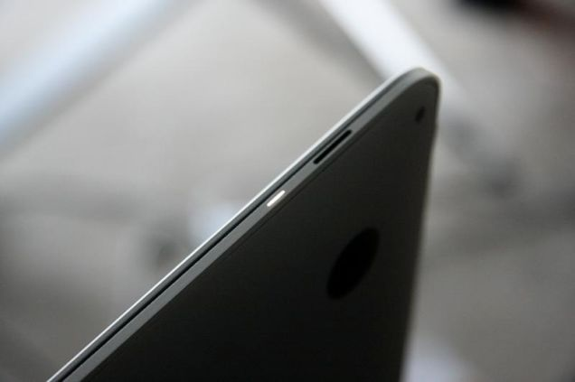
We've seen this before.  A laptop that is unbelievably thin, is missing a ton
  of stuff everyone uses like ports, and comes with an extremely under-powered chip for it's price point... where have I
  heard this again? In 2008, Steve Jobs announced the <a class="sc-1out364-0 hMndXN sc-145m8ut-0 gIacKn js_link" data-ga='[["Embedded Url","Internal link","https://gizmodo.com/macbook-air-review-348753",{"metric25":1}]]' href="https://gizmodo.com/macbook-air-review-348753">Macbook Air</a>,
  and like the air, the new <a class="sc-1out364-0 hMndXN sc-145m8ut-0 gIacKn js_link" data-ga='[["Embedded Url","Internal link","http://gizmodo.com/the-new-macbook-isnt-what-you-think-1690390617",{"metric25":1}]]' href="http://gizmodo.com/the-new-macbook-isnt-what-you-think-1690390617">Macbook </a>is
  riddled with compromises because the device is way ahead of it's time, but not. We've seen this all before, and it's
  time to look back on history to try predicting the future. 

<aside class="sc-1rh3ayr-6 jfFNjl inset--story branded-item branded-item--gizmodo" data-commerce-source="inset"><a class="sc-1out364-0 hMndXN sc-1rh3ayr-2 ihdhCm inset--story__thumb js_link" data-ga='[["Permalink page click","Permalink page click - inset photo"]]' href="https://gizmodo.com/macbook-air-review-348753" rel="noopener noreferrer" target="_blank">
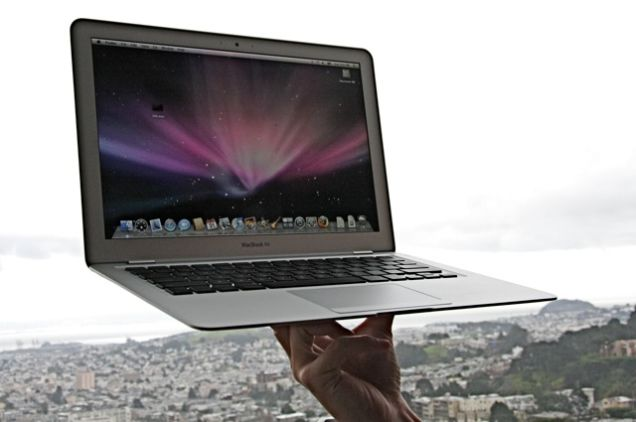
<svg aria-label="Gizmodo avatar" height="64" viewbox="0 0 64 64" width="64" xmlns="http://www.w3.org/2000/svg"><g fill="none" fill-rule="evenodd"><path d="M0 0h64v64H0z" fill="#18AFED"></path><path d="M16.67 46.94A22.04 22.04 0 0 1 11 32.43C11 16.09 24.58 10 33.15 10c8.41 0 14.6 4.13 14.85 4.3a4.22 4.22 0 0 1-1.48 7.58 4.1 4.1 0 0 1-3.1-.61c-.11-.07-4.5-2.9-10.27-2.9-5.37 0-12.77 3.54-12.77 14.06 0 5.98 4.45 13.04 12.6 13.04 4.6 0 7.83-1.23 9.7-2.42v-6.22h-6.36a4.16 4.16 0 0 1-4.13-4.18 4.16 4.16 0 0 1 4.13-4.19h10.5A4.2 4.2 0 0 1 51 32.64V45.1c0 1.13-.5 2.21-1.3 3-2.79 2.73-8.87 5.9-16.88 5.9a21.4 21.4 0 0 1-16.16-7.06z" fill="#FFF"></path></g></svg></a>

<a class="sc-1out364-0 hMndXN js_link" data-ga='[["Permalink page click","Permalink page click - inset headline"]]' href="https://gizmodo.com/macbook-air-review-348753" rel="noopener noreferrer" target="_blank"><h6 class="sc-1rh3ayr-3 jRIPES">MacBook Air Review</h6></a>

The MacBook Air is driving me insane. I want it like no other hardware. It’s thin,
      yea, ok, we know 
<a class="sc-1out364-0 hMndXN sc-1rh3ayr-0 idkyLZ js_readmore inset--story__readmore js_link" data-ga='[["Permalink page click","Permalink page click - inset read more link"]]' href="https://gizmodo.com/macbook-air-review-348753" rel="noopener noreferrer" target="_blank">Read more</a>

</aside><h3 class="sc-1bwb26k-1 fvCjqJ" id="h115306">Pushing the Boundaries</h3>
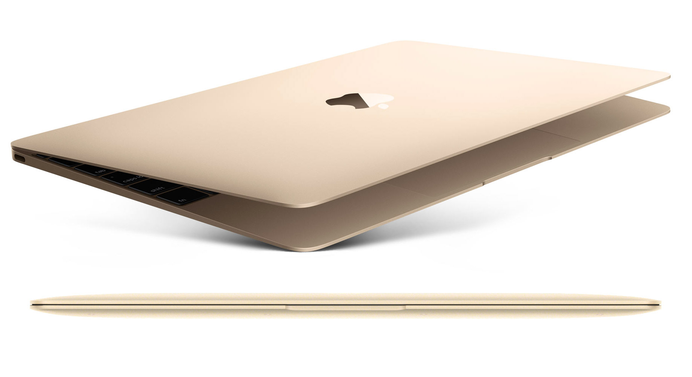

Both devices blew people's minds on what a laptop could be by being extremely thin,
  and light. Both devices also fundamentally change how laptops are designed, with the original air doing everything it
  can like shipping with SSDs, something that has never really been done. This time it's stacking batteries to fit the
  curve, something we've seen in mobile phones for a while now, but is pretty much unheard of in the construction of
  laptops. Technology keeps on marching forward, and devices keep on pushing the boundaries of what people believe is
  feasible. It's great.
<h3 class="sc-1bwb26k-1 fvCjqJ" id="h115307">Where are
  the ports?</h3>
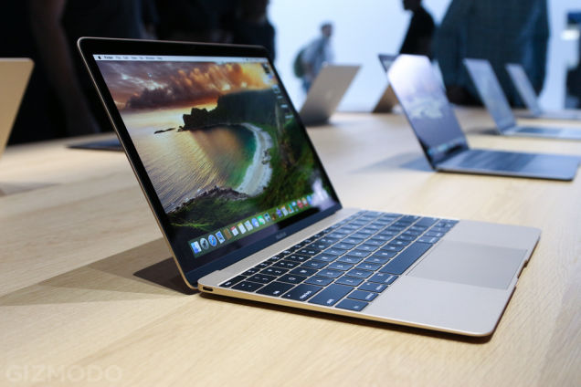

The most controversial issue of the new Macbook has got to be the <a class="sc-1out364-0 hMndXN sc-145m8ut-0 gIacKn js_link" data-ga='[["Embedded Url","Internal link","https://gizmodo.com/why-apple-could-leave-ports-behind-1677838462",{"metric25":1}]]' href="https://gizmodo.com/why-apple-could-leave-ports-behind-1677838462">ports</a>. Who in their right mind
  thought that having only one USB port that was Type-C was a good idea? Keep in mind that this is Apple, the company
  that ditched the DVD drive way before anyone was ready for it, and has been pushing to get rid of wires for a long
  time now. The first gen Air had way less ports than anyone expected, with one USB 2.0, 1 headphone jack, one micro-DVI
  port and a magsafe connector. If history repeats itself, you won't see most of it again, but maybe we'll get another
  USB port, like we did with the Macbook Air, which in it's got another USB port and an SD card slot for the 13 inch
  laptops. That being said, <a class="sc-1out364-0 hMndXN sc-145m8ut-0 gIacKn js_link" data-ga='[["Embedded Url","Internal link","http://gizmodo.com/your-next-laptop-could-have-the-holy-grail-of-usb-ports-1637772167",{"metric25":1}]]' href="http://gizmodo.com/your-next-laptop-could-have-the-holy-grail-of-usb-ports-1637772167">Type-C </a>is
  here to stay, as it's pretty much the holy grail of USB ports, and it's going to be great! Too bad nothing uses it
  right now though...

<aside class="sc-1rh3ayr-6 jfFNjl inset--story branded-item branded-item--gizmodo" data-commerce-source="inset"><a class="sc-1out364-0 hMndXN sc-1rh3ayr-2 ihdhCm inset--story__thumb js_link" data-ga='[["Permalink page click","Permalink page click - inset photo"]]' href="https://gizmodo.com/why-apple-could-leave-ports-behind-1677838462" rel="noopener noreferrer" target="_blank">
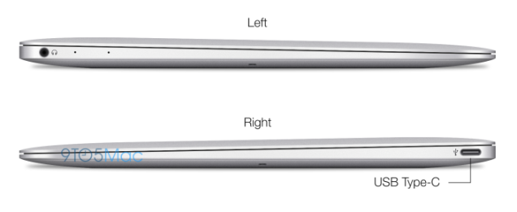
<svg aria-label="Gizmodo avatar" height="64" viewbox="0 0 64 64" width="64" xmlns="http://www.w3.org/2000/svg"><g fill="none" fill-rule="evenodd"><path d="M0 0h64v64H0z" fill="#18AFED"></path><path d="M16.67 46.94A22.04 22.04 0 0 1 11 32.43C11 16.09 24.58 10 33.15 10c8.41 0 14.6 4.13 14.85 4.3a4.22 4.22 0 0 1-1.48 7.58 4.1 4.1 0 0 1-3.1-.61c-.11-.07-4.5-2.9-10.27-2.9-5.37 0-12.77 3.54-12.77 14.06 0 5.98 4.45 13.04 12.6 13.04 4.6 0 7.83-1.23 9.7-2.42v-6.22h-6.36a4.16 4.16 0 0 1-4.13-4.18 4.16 4.16 0 0 1 4.13-4.19h10.5A4.2 4.2 0 0 1 51 32.64V45.1c0 1.13-.5 2.21-1.3 3-2.79 2.73-8.87 5.9-16.88 5.9a21.4 21.4 0 0 1-16.16-7.06z" fill="#FFF"></path></g></svg></a>

<a class="sc-1out364-0 hMndXN js_link" data-ga='[["Permalink page click","Permalink page click - inset headline"]]' href="https://gizmodo.com/why-apple-could-leave-ports-behind-1677838462" rel="noopener noreferrer" target="_blank"><h6 class="sc-1rh3ayr-3 jRIPES">Why Apple
    Could Leave Ports Behind</h6></a>

While rumors of a 12-inch MacBook Air have been merrily percolating these last few
      months, the most 
<a class="sc-1out364-0 hMndXN sc-1rh3ayr-0 idkyLZ js_readmore inset--story__readmore js_link" data-ga='[["Permalink page click","Permalink page click - inset read more link"]]' href="https://gizmodo.com/why-apple-could-leave-ports-behind-1677838462" rel="noopener noreferrer" target="_blank">Read more</a>

</aside>
<h3 class="sc-1bwb26k-1 fvCjqJ" id="h115308">Slow Processors?</h3>
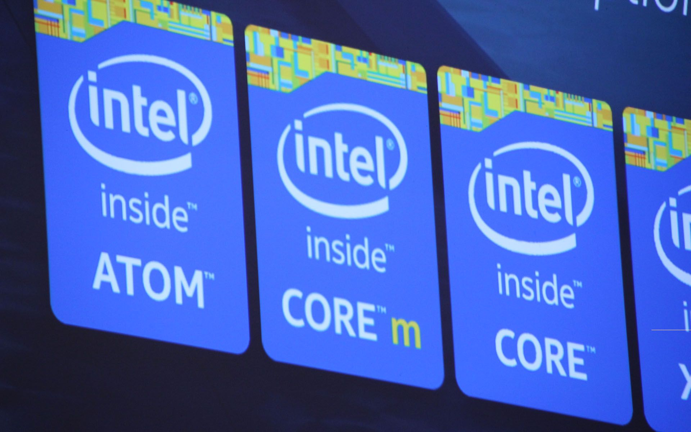

Apple's vision was much more far reaching than what intel imagined, and the original
  Macbook Air used an old Core 2 Duo, which combined with a slow hard drive didn't make it a pleasant experience. We may
  have another case of deja vu, as the new Macbook ships with a <a class="sc-1out364-0 hMndXN sc-145m8ut-0 gIacKn js_link" data-ga='[["Embedded Url","Internal link","https://gizmodo.com/intels-core-m-might-finally-give-us-the-laptop-tablet-h-1630778247",{"metric25":1}]]' href="https://gizmodo.com/intels-core-m-might-finally-give-us-the-laptop-tablet-h-1630778247">Core M processor</a>,
  that has been known to be <a class="sc-1out364-0 hMndXN sc-145m8ut-0 gIacKn js_link" data-ga='[["Embedded Url","Internal link","http://gizmodo.com/lenovo-yoga-3-pro-review-a-futuristic-laptop-that-lags-1668217125?utm_campaign=socialflow_gizmodo_twitter&amp;utm_source=gizmodo_twitter&amp;utm_medium=socialflow",{"metric25":1}]]' href="http://gizmodo.com/lenovo-yoga-3-pro-review-a-futuristic-laptop-that-lags-1668217125?utm_campaign=socialflow_gizmodo_twitter&amp;utm_source=gizmodo_twitter&amp;utm_medium=socialflow">pretty slow</a>.
  Not looking good for apple fans, but if we go by the Air's history, it'll probably get a better CPU in the future.

<aside class="sc-1rh3ayr-6 jfFNjl inset--story branded-item branded-item--gizmodo" data-commerce-source="inset"><a class="sc-1out364-0 hMndXN sc-1rh3ayr-2 ihdhCm inset--story__thumb js_link" data-ga='[["Permalink page click","Permalink page click - inset photo"]]' href="https://gizmodo.com/intels-core-m-might-finally-give-us-the-laptop-tablet-h-1630778247" rel="noopener noreferrer" target="_blank">
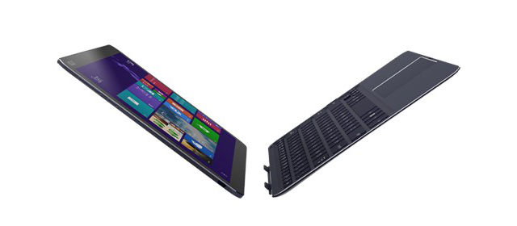
<svg aria-label="Gizmodo avatar" height="64" viewbox="0 0 64 64" width="64" xmlns="http://www.w3.org/2000/svg"><g fill="none" fill-rule="evenodd"><path d="M0 0h64v64H0z" fill="#18AFED"></path><path d="M16.67 46.94A22.04 22.04 0 0 1 11 32.43C11 16.09 24.58 10 33.15 10c8.41 0 14.6 4.13 14.85 4.3a4.22 4.22 0 0 1-1.48 7.58 4.1 4.1 0 0 1-3.1-.61c-.11-.07-4.5-2.9-10.27-2.9-5.37 0-12.77 3.54-12.77 14.06 0 5.98 4.45 13.04 12.6 13.04 4.6 0 7.83-1.23 9.7-2.42v-6.22h-6.36a4.16 4.16 0 0 1-4.13-4.18 4.16 4.16 0 0 1 4.13-4.19h10.5A4.2 4.2 0 0 1 51 32.64V45.1c0 1.13-.5 2.21-1.3 3-2.79 2.73-8.87 5.9-16.88 5.9a21.4 21.4 0 0 1-16.16-7.06z" fill="#FFF"></path></g></svg></a>

<a class="sc-1out364-0 hMndXN js_link" data-ga='[["Permalink page click","Permalink page click - inset headline"]]' href="https://gizmodo.com/intels-core-m-might-finally-give-us-the-laptop-tablet-h-1630778247" rel="noopener noreferrer" target="_blank"><h6 class="sc-1rh3ayr-3 jRIPES">Intel's
    Core M Might <em>Finally</em> Give Us True Laptop-Tablet Hybrids</h6></a>

The perfect in-between device—something that's as thin as a dedicated tablet and as
      powerful as a…
<a class="sc-1out364-0 hMndXN sc-1rh3ayr-0 idkyLZ js_readmore inset--story__readmore js_link" data-ga='[["Permalink page click","Permalink page click - inset read more link"]]' href="https://gizmodo.com/intels-core-m-might-finally-give-us-the-laptop-tablet-h-1630778247" rel="noopener noreferrer" target="_blank">Read more</a>

</aside>
<h3 class="sc-1bwb26k-1 fvCjqJ" id="h115309">What's with the dongles? </h3>
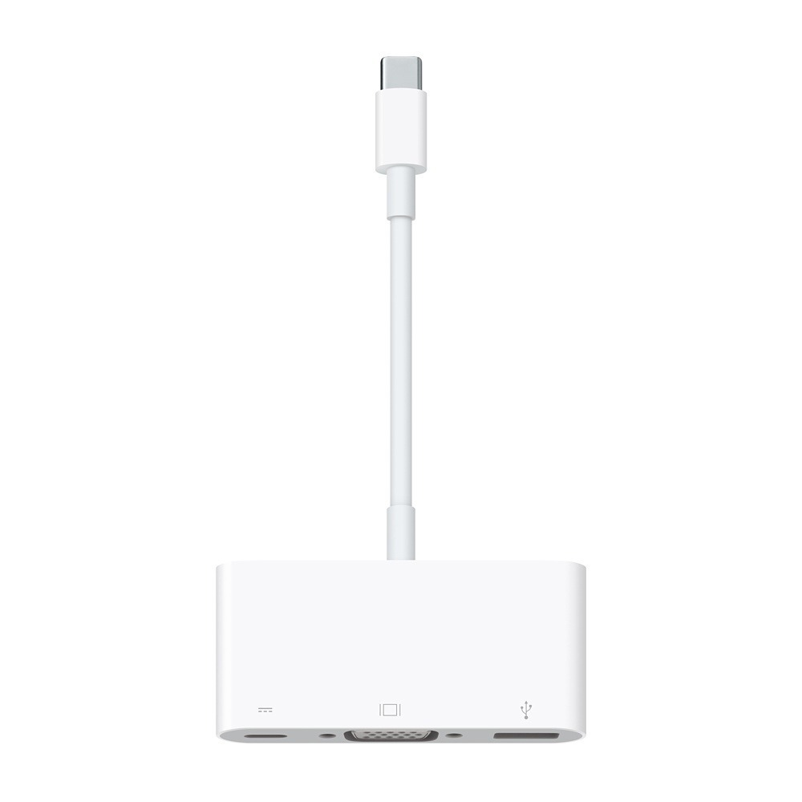

Due to the new type C connection, you can't connect anything you currently own with
  the new Macbook, but apple's going to ship a quite expensive 80 dollar dongle which will allow you to use your old
  stuff. Where have I heard that before? OH WAIT! When the Macbook Air came out, they charged 100 dollars for a
  "superdrive" which was equally as clunky and annoying as these dongles will be. Oh well.
<h3 class="sc-1bwb26k-1 fvCjqJ" id="h115310">High price? </h3>
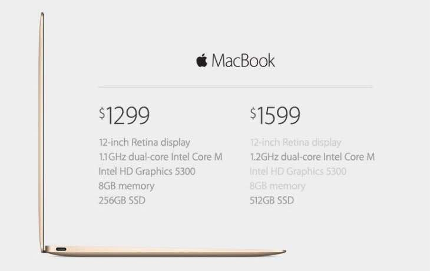

With new technologies comes a new way to stretch wallets? Once again the laptops are
  extremely poor values spec wise in comparison to everything available, but this time it's nowhere near as bad. The
  original Macbook Air launched at 1800 USD with an ipod HDD, and this time it's 1300 USD with an amazing display.
  Cutting edge has never been this affordable? 
<h3 class="sc-1bwb26k-1 fvCjqJ" id="h115311">480p Webcam</h3>

Have we stepped into a bizarre world where people still have 480p webcams in 2015?
  Yeah, we have, and that's one thing that the Macbook Air had in 2008 as well. Come on Apple! WTF?
<h3 class="sc-1bwb26k-1 fvCjqJ" id="h115312">Compromise...</h3>
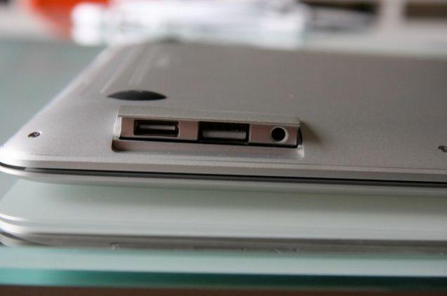

I'm sure everyone remembers how much of a mixed bag the original Macbook Air was,
  and if you can see from above, The Macbook seems like it's shaping up to be another compromise, in pretty much the
  same ways. Honestly, I'd rather OEMs work on making the best experience possible with what they have instead of trying
  to shoot for the future with compromise, but that's what the Macbook has done, for better or for worse.
<h3 class="sc-1bwb26k-1 fvCjqJ" id="h115313">Where does it differ?</h3>
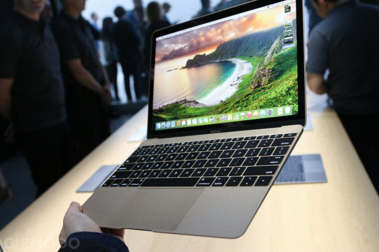

Well, the first place is that it's 2015 so we're more equipped for a device like
  this, but even now it's still too early, especially because apple put in the type c connector, an amazing port that is
  a standard, but hasn't gone mainstream yet. I think in comparison however, new Macbook does more to make the device a
  better experience: It's a fanless device with a great screen and less compromises in general, but who knows how it'll
  fare? I certainly don't.
<h3 class="sc-1bwb26k-1 fvCjqJ" id="h115314">Creating
  a Legacy</h3>
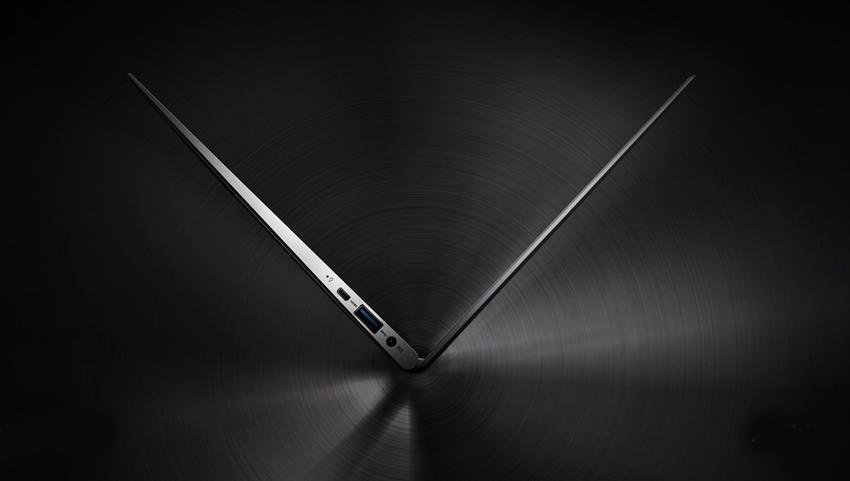

The Macbook Air had a strong impact on the PC industry, the incentivization of
  Intel's ultrabook platform which inspired windows OEMs to come up with thin and light devices of their own. The
  Macbook Air popularized this segment and because of that left a large impact on the market... so what about this next
  Macbook? I personally think that the Macbook is a laptop trying to emulate the tablet experience, to once again try to
  cut all possible cords and make a seemless, wireless experience.. but will people follow? I don't think it's that
  clear this time around, because unlike before, the competition already has a focus, and we already have devices like
  the <a class="sc-1out364-0 hMndXN sc-145m8ut-0 gIacKn js_link" data-ga='[["Embedded Url","Internal link","https://gizmodo.com/dell-xps-13-review-2015-the-windows-laptop-to-beat-1681976712",{"metric25":1}]]' href="https://gizmodo.com/dell-xps-13-review-2015-the-windows-laptop-to-beat-1681976712">Dell XPS 13</a>
  and the <a class="sc-1out364-0 hMndXN sc-145m8ut-0 gIacKn js_link" data-ga='[["Embedded Url","Internal link","http://gizmodo.com/surface-pro-3-review-the-greatest-laptop-tablet-hybrid-1581896186",{"metric25":1}]]' href="http://gizmodo.com/surface-pro-3-review-the-greatest-laptop-tablet-hybrid-1581896186">Surface Pro 3</a>
  that are extremely compact, thin and light but are heading in different directions. Who knows, but whatever happens,
  it'll be interesting to watch.

<aside class="sc-1rh3ayr-6 jfFNjl inset--story branded-item branded-item--gizmodo" data-commerce-source="inset"><a class="sc-1out364-0 hMndXN sc-1rh3ayr-2 ihdhCm inset--story__thumb js_link" data-ga='[["Permalink page click","Permalink page click - inset photo"]]' href="https://gizmodo.com/dell-xps-13-review-2015-the-windows-laptop-to-beat-1681976712" rel="noopener noreferrer" target="_blank">
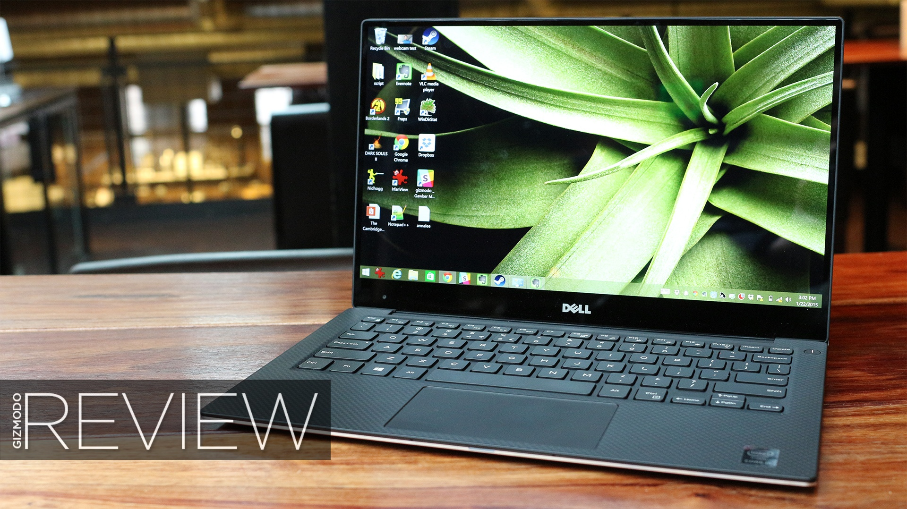
<svg aria-label="Gizmodo avatar" height="64" viewbox="0 0 64 64" width="64" xmlns="http://www.w3.org/2000/svg"><g fill="none" fill-rule="evenodd"><path d="M0 0h64v64H0z" fill="#18AFED"></path><path d="M16.67 46.94A22.04 22.04 0 0 1 11 32.43C11 16.09 24.58 10 33.15 10c8.41 0 14.6 4.13 14.85 4.3a4.22 4.22 0 0 1-1.48 7.58 4.1 4.1 0 0 1-3.1-.61c-.11-.07-4.5-2.9-10.27-2.9-5.37 0-12.77 3.54-12.77 14.06 0 5.98 4.45 13.04 12.6 13.04 4.6 0 7.83-1.23 9.7-2.42v-6.22h-6.36a4.16 4.16 0 0 1-4.13-4.18 4.16 4.16 0 0 1 4.13-4.19h10.5A4.2 4.2 0 0 1 51 32.64V45.1c0 1.13-.5 2.21-1.3 3-2.79 2.73-8.87 5.9-16.88 5.9a21.4 21.4 0 0 1-16.16-7.06z" fill="#FFF"></path></g></svg></a>

<a class="sc-1out364-0 hMndXN js_link" data-ga='[["Permalink page click","Permalink page click - inset headline"]]' href="https://gizmodo.com/dell-xps-13-review-2015-the-windows-laptop-to-beat-1681976712" rel="noopener noreferrer" target="_blank"><h6 class="sc-1rh3ayr-3 jRIPES">Dell XPS
    13 Review (2015): The Windows Laptop To Beat</h6></a>

Are you thinking of buying a Windows laptop? Don't, until you've read this review.
      The new Dell XPS 
<a class="sc-1out364-0 hMndXN sc-1rh3ayr-0 idkyLZ js_readmore inset--story__readmore js_link" data-ga='[["Permalink page click","Permalink page click - inset read more link"]]' href="https://gizmodo.com/dell-xps-13-review-2015-the-windows-laptop-to-beat-1681976712" rel="noopener noreferrer" target="_blank">Read more</a>

</aside>
<h3 class="sc-1bwb26k-1 fvCjqJ" id="h115315">Conclusion</h3>
All things considered, the new Macbook echoes the spirit of the 2008 Macbook while updating
  everything (except the webcam).... which is a good and bad thing. Looking at it, this device makes compromises, and I
  don't really think that this iteration will be a great device like the Air, but these are issues that can be fixed in
  later iterations, so let's hope that this new Macbook will be refined to be a solid computing experience, just like
  the Air did a few years back. History does have a tendency to repeat itself, and this is one I think will repeat. Too
  bad they couldn't get it right the first time!

<em>Rockmandash is a frequent writer of Visual Novels and
  Anime on </em><a class="sc-1out364-0 hMndXN sc-145m8ut-0 gIacKn js_link" data-ga='[["Embedded Url","External link","http://rockmandash12.kinja.com/",{"metric25":1}]]' href="http://rockmandash12.kinja.com/" rel="noopener noreferrer" target="_blank"><em>Rockmandash Reviews</em></a><em>
  and </em><a class="sc-1out364-0 hMndXN sc-145m8ut-0 gIacKn js_link" data-ga='[["Embedded Url","External link","http://anitay.kinja.com/#_ga=1.110743109.1523386611.1417386122",{"metric25":1}]]' href="http://anitay.kinja.com/#_ga=1.110743109.1523386611.1417386122" rel="noopener noreferrer" target="_blank"><em>AniTAY</em></a><em>, but has a large fascination with
  technology and is trying to write on </em><a class="sc-1out364-0 hMndXN sc-145m8ut-0 gIacKn js_link" data-ga='[["Embedded Url","Internal link","http://whitenoise.gizmodo.com/",{"metric25":1}]]' href="http://whitenoise.gizmodo.com/"><em>Whitenoise</em></a><em>
  because why not? Come and check them out if you are interested in reviews and opinion pieces on these topics, and
  please tell your thoughts on this and if I should continue in the future!</em>

<aside class="sc-1rh3ayr-6 jfFNjl inset--story branded-item branded-item--kinja" data-commerce-source="inset">

<a class="sc-1out364-0 hMndXN js_link" data-ga='[["Permalink page click","Permalink page click - inset headline"]]' href="http://rockmandash12.kinja.com/" rel="noopener noreferrer" target="_blank">
<h6 class="sc-1rh3ayr-3 jRIPES">RockmanDash Reviews</h6></a>

rockmandash12
<a class="sc-1out364-0 hMndXN sc-1rh3ayr-0 kOvmIi js_readmore inset--story__readmore js_link" data-ga='[["Permalink page click","Permalink page click - inset read more link"]]' href="http://rockmandash12.kinja.com/" rel="noopener noreferrer" target="_blank">Read more</a>

</aside>

