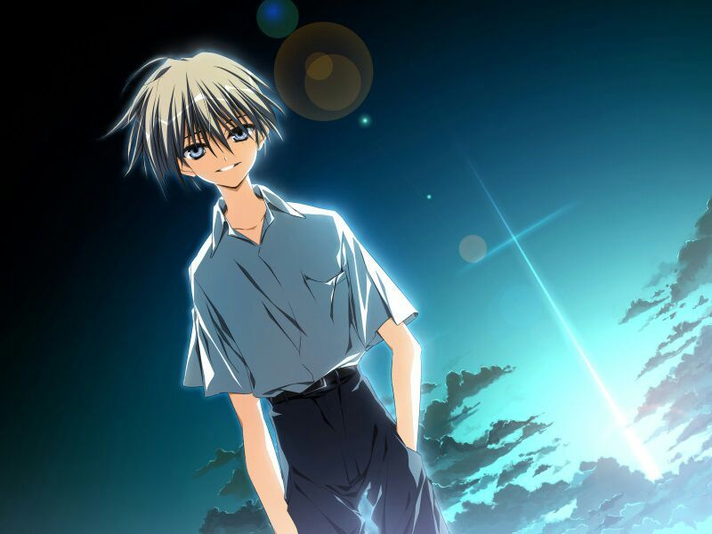
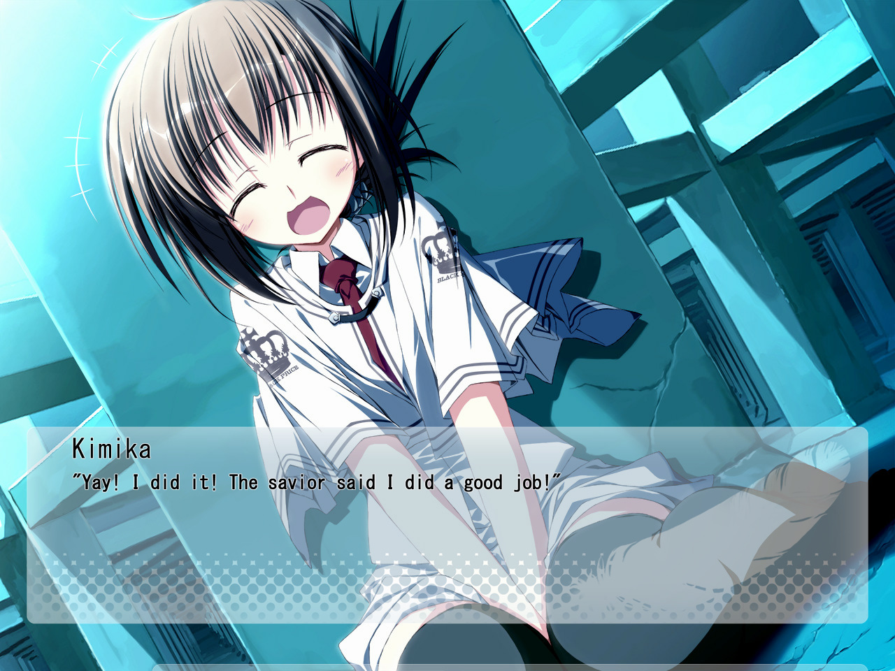
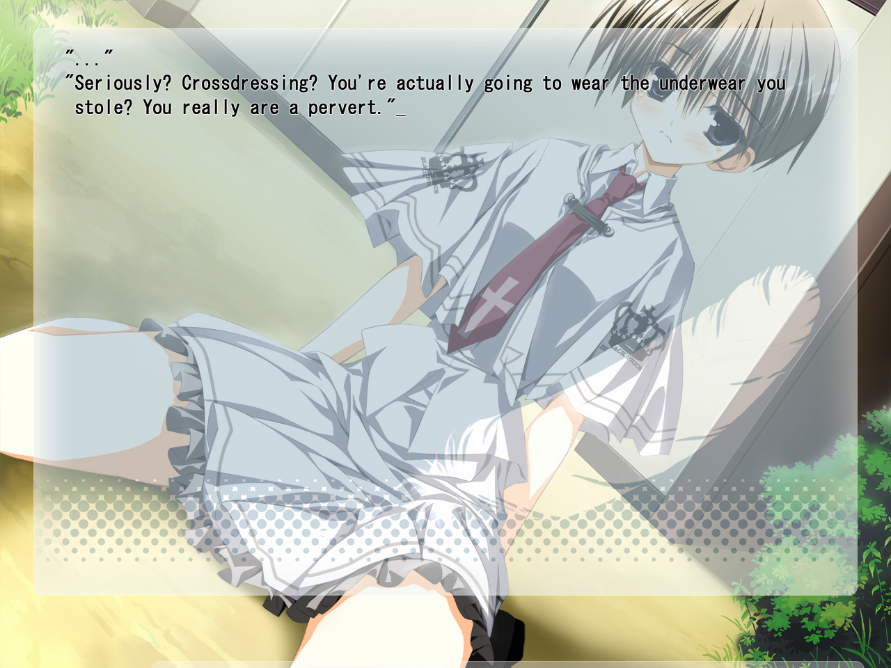
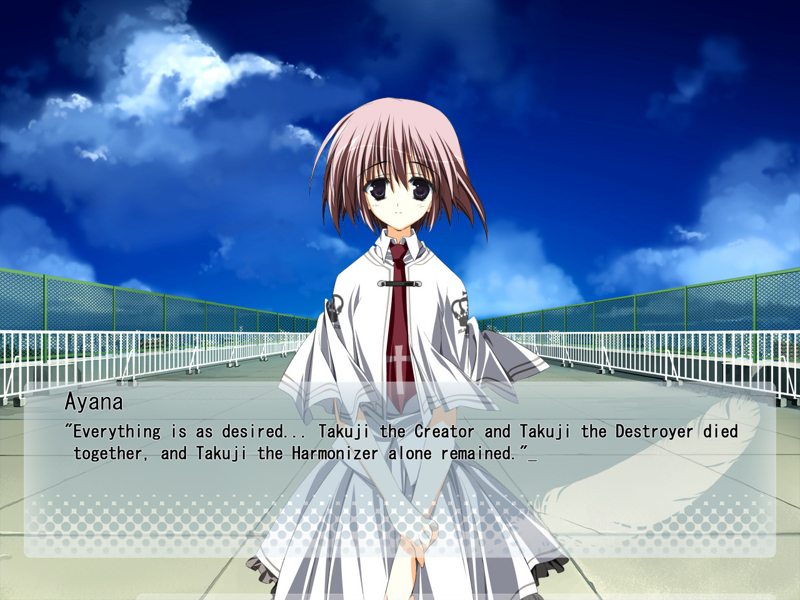
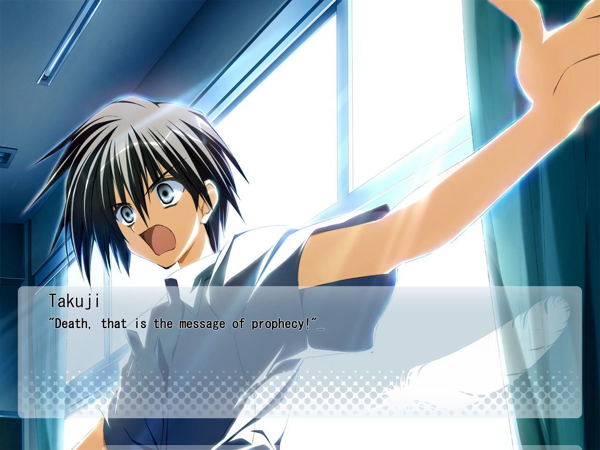
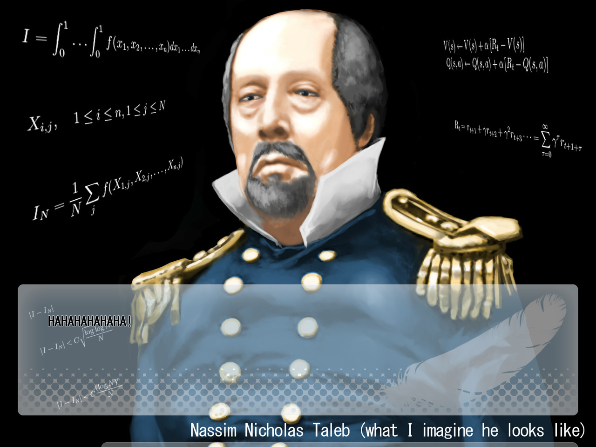

---
{
  title: "A Question of Quality & Catharsis (ft. Subihibi)",
  tags:
    [
      "Rockmandash Rambles",
      "Subarashiki Hibi",
      "SubaHibi",
      "FuwaReviews",
      "Wonderful Everyday",
      "catharsis",
    ],
  published: "2017-10-19T12:00:00-04:00",
  attached: [],
  kinjaArticle: true,
}
---

 What exactly is quality in respect to a work? Is quality how we describe
  execution, or is it based upon the ideas a work implements? Or, is quality a subjective take based on one’s
  experience? It takes a special game, a special experience to shake up one’s perception of quality, and after playing
  through the mind trip that was <em>Subahibi</em>, this was all I was thinking about… even if the reasons weren’t what
  you would expect. The thoughts on my mind weren’t of how amazing it was but because of the experience it provides,
  instead I was fixated on the concepts of quality itself, and the concept of catharsis: Is an unpleasant experience
  without catharsis inherently a bad thing, and is an unpleasant experience enough to warrant calling a work bad?

<strong>WARNING: There will be spoilers in this article for
  <em>Subahibi</em>. you have been warned. Proceed with caution.</strong>

<strong>FYI: <em>This article is a 2nd part of my thoughts on Subahibi, succeeding
  my main </em></strong><a class="sc-1out364-0 hMndXN sc-145m8ut-0 gIacKn js_link" data-ga='[["Embedded Url","External link","https://rockmandash12.kinja.com/rockmandash-rambles-subarashiki-hibi-1819665488",{"metric25":1}]]' href="https://rockmandash12.kinja.com/rockmandash-rambles-subarashiki-hibi-1819665488" rel="noopener noreferrer" target="_blank"><em><strong>pseudo-review</strong></em></a><em><strong>
  that has more general thoughts on the game. This is written as a complimentary piece to that review, discussing some
  ideas that I was thinking about when playing the work, so go read that first. Thank you for your
  understanding.</strong></em>

Why do we play games, read books, watch movies, etc? Generally, it’s to have a good
  time but if that’s the case, why do we enjoy tragedies, dramas, war films, etc so much? While the feeling of pity and
  depression can be an engaging experience, the main reason we tend to go back to these kind of works is of course,
  because the works use those unpleasant experiences to make an experience worthwhile, usually through the form of
  catharsis. 

Catharsis is a greek word which describes the effects of tragedy on
  the mind of a spectator, and it’s part of a work that takes negative emotions and gets rid of them in a pleasing
  manner. Catharsis is a key aspect in our experience with these kinds of works, and is one of those aspects of a work
  that is looked at fondly. When talking about <em>Subahibi</em> however, the concept of Catharsis is interesting not
  because of how it is implemented but because it is an element that is notably <em>absent </em>from the work.

<em>Subahibi</em>, for the most part strives to be an engaging philosophical
mystery that throws interesting experiences at you, but its two longest routes in particular (<em>It’s My Own
Invention</em> and<em> Looking Glass Insects</em>) has a notable lack of Catharsis. They are hard reads because of
the characters they follow, but they add additional pain by subjecting the player to acts of cruelty that are so
horrifying and absurd that they can break the suspension of disbelief. Here’s a few scenes that serve as terrifying
examples: In <em>Invention</em> we get to experience bullies force one of the characters to steal a classmate’s
uniform, dress up as a girl and then masturbate in front of them and in <em>Insects</em>, we get to witness our main
character for the route getting kidnapped and raped them under the name of bullying. While many people didn’t see
these scenes as deal breakers, they were what broke the straw of an already unenjoyable experience, making it feel
like <em>Subahibi</em> consistently punishes you for the mere fact that you are reading this work. What makes this all
worse is that these events that we are forced to see are almost completely unrelated to the events that lead to the
true end of the game, failing to lead to any matter of catharsis in my opinion.

While it makes an attempt to implement catharsis by succeeding such events with
  slice of life, it never truly does, and as a result <em>Subahibi </em>is a work that permeates its experience with
  pain, and never uses it’s pain to directly lead to anything worthwhile. Given that, is it then valid to say that the
  lack of any true catharsis alone is enough to say this game is bad? Can one call a work a well done work if it is made
  to provide a bad experience, and where do we draw the line between objective quality and a subjective one? 

This is a dilemma to me, as what I consider quality is inherently linked to my
  experience because a positive experience is my number one priority in a work. This doesn’t mean that a work has to be
  necessarily positive all the time, but the overall experience has to be a positive one for me. An example of this is
  an anime called <em>Now and Then, Here and There: </em> while it isn’t a very pleasant experience of the tragedies
  that occur throughout the work, it used these tragedies to a powerful extent, to make an overall positive experience.

A work with a lack of catharsis then, can only be good if it’s negative feelings add
  to make an overall positive experience. There’s a few works that I know that can do it, <em>Remember 11 </em>and<em>
    Devilman Crybaby </em>are both works that serve as a great counterexample to <em>Subahibi</em>, with similar
  structures and themes, but unlike <em>Subahibi </em>actually use the lack of relief and pain to directly and
  meaningfully make the story and themes better. 

Thus, my opinion on <em>Subahibi</em>: While there were aspects of the work I adored
  and I thought some of the moments were absolutely remarkable, they had no real direct relationship with the pain in
  the work, while being simply too overwhelming and horrific. Even though the work was written well, for the most part
  it executing it’s ideas and goals with finesse, what I found was a work that doesn’t bring quality to the player. So
  in the end, I can’t really call<em> Subahibi</em> a good, quality work because even though the lack of catharsis isn’t
  inherently bad, <em>Subahibi </em>was ultimately just painful for no reason - it doesn’t add to the story and provided
  a poor experience because of that.

I’m sure many will disagree with this statement, as it goes against the notion of
  the objective quality that so many people adhere to (and most people say <em>Subahibi</em>’s one of the best VNs out
  there). When you really think about it though, what exactly is objective quality? Objectivity is the state of
  something outside of personal biases, and there’s no physical law on what makes something good or bad in regards to a
  work. The only solution to what we call objective quality has to be collective take as the collective is the only
  opinion that is truly outside of individuals. 

 So, in this way, the objective
  definition of quality that is inherently related to the subjective experience. This relationship is in regards to
  aspects of a work -we agree to specific attributes of a work like how sloppy animation looks bad, but disagree on how
  those pieces slot together to make a complete work. So, in a way I believe I’m justified in saying that
  <em>Subahibi</em> is quality in terms of writing, presentation etc, but not in general, as the way it pieces things
  together does not coincide with what is deemed a good, quality work. 

Do you think that the absence of catharsis alone, the experience itself is enough
to qualitatively grade a work, or do you think that there’s more to that, like I mentioned before? What do you think
determines quality in a work? These are my thoughts on Quality and Catharsis, and I’d love to hear other people’s
takes on this topic. I’m sure this is rather long and nonsensical to some, and some of you might flat out disagree
with what I have to say, but that’s fine: it’s a part of the world we live in. I was compelled to write these things,
and these are what I think about the work itself. I hope you enjoyed reading the article regardless, and I appreciate
you reading it through even if you don’t.

<em>Thank you for reading! This is Rockmandash Reviews, a blog
  focused on everything revolving Visual Novels, with stuff like tech and anime every now and then. If you want to read
  more of my writing, check out </em><a class="sc-1out364-0 hMndXN sc-145m8ut-0 gIacKn js_link" data-ga='[["Embedded Url","External link","https://fuwanovel.net/reviews-hub/",{"metric25":1}]]' href="https://fuwanovel.net/reviews-hub/" rel="noopener noreferrer" target="_blank"><em>FuwaReviews</em></a><em>
  and </em><a class="sc-1out364-0 hMndXN sc-145m8ut-0 gIacKn js_link" data-ga='[["Embedded Url","External link","https://anitay.kinja.com/",{"metric25":1}]]' href="https://anitay.kinja.com/" rel="noopener noreferrer" target="_blank"><em>AniTAY</em></a><em> where I am a contributor or follow my
  twitter, </em><a class="sc-1out364-0 hMndXN sc-145m8ut-0 gIacKn js_link" data-ga='[["Embedded Url","External link","https://twitter.com/RockmanDash12",{"metric25":1}]]' href="https://twitter.com/RockmanDash12" rel="noopener noreferrer" target="_blank"><strong>@RockmanDash12</strong></a><em>.</em>  

Major edit on 4/17/18 , cutting out and rewording stuff - because the end half
  wasn’t really clear and the R11 stuff didn’t really add to the article itself.

