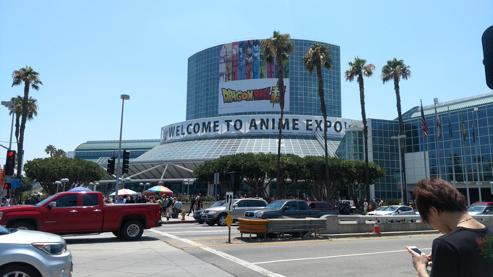
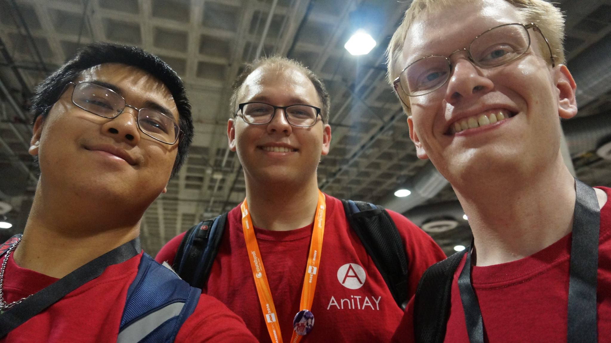
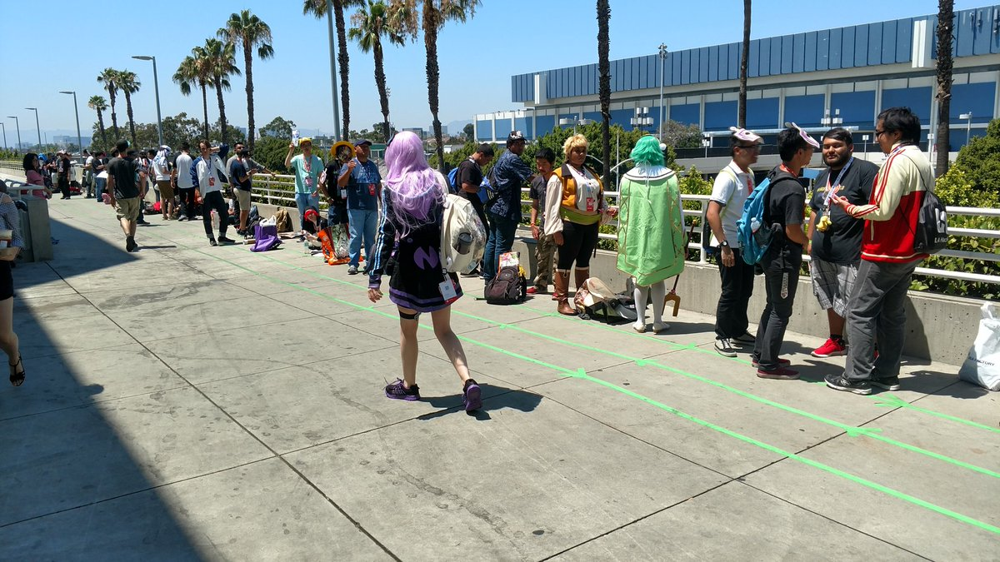
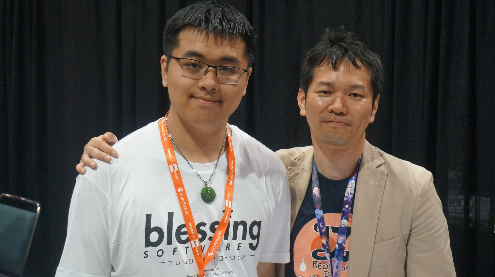
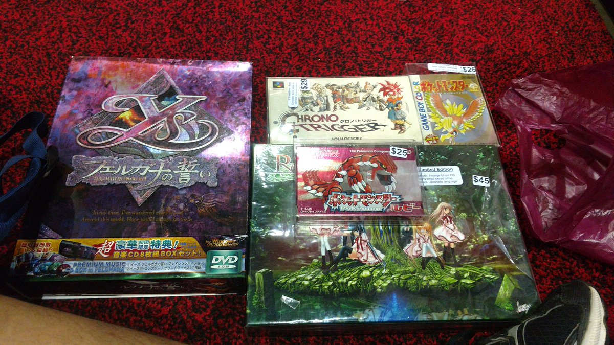
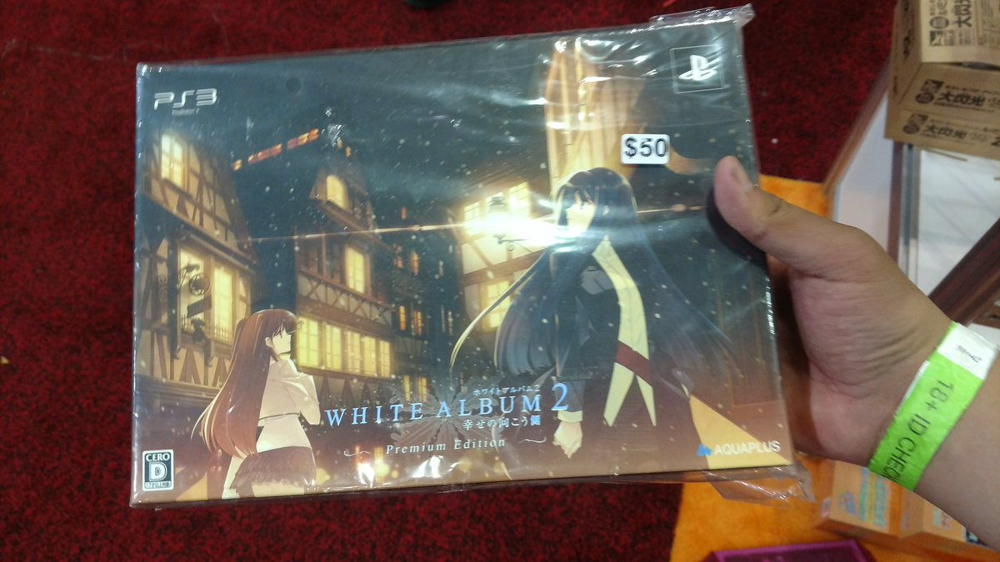
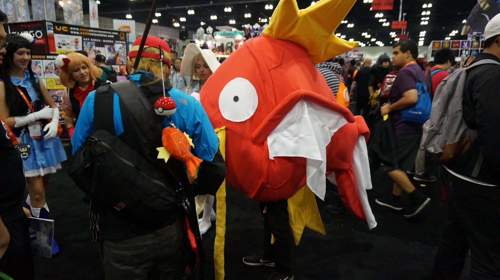

---
{
	title: "A Rock's Experience at Anime Expo 2017",
	published: "2017-07-09T14:21:10-04:00",
	tags: ["Anime Expo", "AX2017"],
	kinjaArticle: true
}
---

Anime Expo is a crazy convention: A convention of excitement, announcements, lines, craziness, mismanagement, cosplays and more. With ever pro, there are cons, and there’s so much to talk about, so I thought i’d spend some time talking about this year’s Anime Expo and my experience with it.

I haven’t been posting a lot of articles this year, instead deciding to [tweet stuff on my twitter account](https://twitter.com/RockmanDash12) about the convention instead of writing articles, so there was much less written here on AniTAY, but that doesn’t mean there is less to say about it. This is my second year here, and it was a fundamentally different beast than when I went last time, from con to my personal situation. As such, this is going to act as kinda a comparison article. For explanation of last con, A TL;DR of last year’s AX was that it was busy but an absolute blast, a longer explanation would be [to listen to our podcast about AX](https://anitay.kinja.com/anitay-podcast-season-2-episode-12-anitay-expo-2016-1783941331), and [to check out the articles we wrote](https://anitay.kinja.com/tag/ax-2016).

For me personally, the biggest change between this year and last year (which probably won’t effect others as much as the later things) was that while I went with a few people this year, there wasn’t a massive AniTAY meeting like last time: I was basically by myself. It was still fun, but it’s a fundamental paradigm shift: last year I was always with someone and even on off times I could always spend time hanging out with others. I still had a great time spending time with everyone I was with, but it’s just not the same. As a side note, because it’s basically impossible to have a meeting like that again as it was a massive coincidence we could all go, my first AX will always be my best AX. Uchikoshi, *Ever 17*,* Baldr Sky*, and *Your Name* don’t help with that either. It would take a miracle to match all of that.

The next major change doesn’t help that either: The next thing... Organization. If you looked at my tweets from this con, you’d see me commenting on a lot of it. While there will always be issues with organization with cons as large as this, I felt like last year had lines but was pretty organized, the management and organization never it seemed like a hindrance. I was ready for long lines both times, but organization was just bad. From nightmarish entry ticket lines to panel lines out in the sun for panels that weren’t cancelled to staff that didn’t know what to do...** **It effected every experience one would have with the con. There were way more overlapping panels this year too, basically forcing you to compromise your AX experience while in the past you didn’t have to make nearly as many compromises. It was a mess of a con, and because of that, it was significantly worse of an experience. 

The 3rd major change I noticed: The panels and events themselves. In comparison to last year where there was so much I was engaged in and interested in: The panels themselves wasn’t as exciting, there was a lot less announced that I was interested in (when it comes to VN announcements, AX is basically the E3 for VN localization), and I wasn’t able to go to a lot I wanted to. Though, I did get a nice surprise: I was expecting the VN gauntlet w/ anime sprinkled in, but this time I spent a lot of time with Falcom people barbecue NISA was here to promote *Ys VIII* which was totally unexpected to me and I quite enjoyed it. Last year I had a similar tangent with a video game series I love with the *Zero Escape *series, but I expected that because I went with the intention of doing ZE stuff and I’m a ZE nut, but I didn’t even realize Kondo and Falcom would be here until I was at the convention. I got a copy of *Ys: The Oath in Felghana *signed, and it was fun and hanging out with the Falcom Discord guys who were great! Zero regrets, other than I didn’t have* *[*Legend of Heroes, Trails in the Sky SC*](https://tay.kinja.com/the-legend-of-heroes-trails-in-the-sky-sc-the-tay-rev-1748211289)* *(Which is easily one of my top 5 favorite games) to get signed. 

 

Which leads me to the next thing... Stuff to buy. Whille the con was pretty similar in what they offered, there was some pretty noticeable differences for me: Visual Novels at the con. Nothing will ever beat the *Ever 17 *copy I managed to get last year, but Retro Saikou is definitely aiming to. CT SFC complete, Ys Oath, Rewrite, JP Gold and JP Ruby complete, all reasonably priced, with White Album 2 to spice things up? damn. If I saw this last year, I would have done the same. Was looking for something like this for years, and I finally got it. I’ve never been able to physically buy a shit ton of VNs like this, and I’m super happy with what I got. I blew a lot of money though, hopefully this doesn’t become a thing. 

All of this adds up to an overall worse experience than last year, but in the end, AX is AX. There’s nothing quite like the perfect blend of crazy crowds, the hub of visual novels AX has become, cosplayers, and world premieres. I would love to go again, and I most likely will, but I hope this isn’t a trend that continues. As more and more come, the more AX changes. An embrace of the west, the ever-changing anime and VN industry will have it always be different. Games will be stronger than ever, but the VN industry is growing stagnant more and more. Anime is an unpredictable ebb and flow.... It’s all up to the staff to make the con great though, and hopefully it’ll be better in the future. They have serious problems to deal with, and I hope at least some of them will be fixed to make it a better experience.