---
{
	title: "A Visual Novel Fan's Opinion on Eroge",
	published: "2015-01-22T17:30:00-05:00",
	tags: ["Opinion", "Rockmandash Rambles", "Visual Novels", "Eroge", "Storytelling", "H scenes", "Observation Deck", "TAY-Classic", "Ani-TAY", "Visual Novel"],
	kinjaArticle: true
}
---

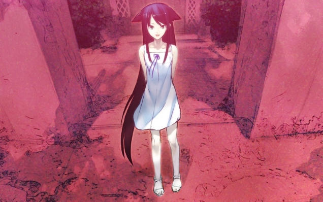

It seems like that the west has rediscovered the[ Visual Novel Genre](https://rockmandash12.kinja.com/the-beginners-guide-to-visual-novels-1541975662), commonly referred to as Dating Sim. Due to this, there is a lot of stereotyping and confusion about the genre (including what to even call them). Recently on Kotaku, Patrica Hernandez [wrote an article about eroge](http://kotaku.com/the-sex-games-that-steam-censors-1680718912), which tried to explain what is actually up with said genre, and I think it's decent way to try to understand what's actually going on it, I don't think that it provides the mindset and opinions of the fans of the genre: it's an outsider looking in. As one who loves visual novels and plays them very frequently, I thought I'd put out my two cents. **Disclaimer: While this doesn't contain graphic sexual scenes, it does talk about them quite a bit and reference them.**

Also, due to the nature of this topic, expect some opinions or issues you may disagree with, so I'd be really grateful if you came into this with an as open mind as possible. I'll try my best to represent both sides fairly. I do have my opinion though, and I'll spew them out. That being said, the article isn't exactly going to talk about the Eroge itself, which is more a moral issue that I don't want to sway people on. It's going to be more about the things that it influences rather than the content itself. I'm no SJW, and I'm not going to try to be one.

## It Creates a Stereotype, a Stigma, and it's one I can't stand.

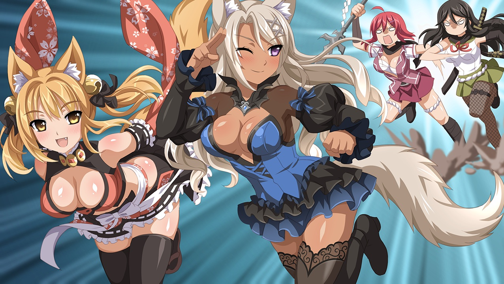

Visual Novels have always been the laughing stalk of the gaming industry in the west. While some have accepted this genre for what it is, many ignore everything about the genre and laugh it off. Even the name Dating Sim is a part of this stereotype, as Dating Sims are just a subgenre in the larger genre of Visual Novels and do not represent everything the genre has to offer. If you need proof that people view it this way, just look at Patricia's article:

> *"it's a long-standing cliche in the visual novel community that some people play raunchy anime games, not for the sex scenes or indulgent nudity, but rather for the story, writing, or mechanics (much in the same way that some people genuinely read Playboy 'for the articles')."*

It's not just a cliche, and definitely it's not like reading "Playboy for the articles". Sekai Project said it themselves in the article, saying that they hoped that Kotaku readers and writers don't

> *"have the impression that all visual and kinetic novels are chocked full of nothing but mature, 18+ content—a majority \[of visual novels] are quite engaging, have captivating stories to tell, breathtaking artwork, and fantastic voice over work too!"*

The H-scenes (aka Hentai Scenes, the scenes that display sex), dating elements, explicit content and everything that makes a dating sim so well known have overshadowed everything else about the genre, causing people to just assume that the genre is just weird text based adventure games with cute 2D anime girls that are focused around smut. This is a real shame, given that some of the most highly rated, [well known](https://rockmandash12.kinja.com/rockmandash-reviews-clannad-visual-novel-anime-1609437459) [anime are ](http://kotaku.com/steins-gate-the-kotaku-review-1559811854#_ga=1.50412905.1523386611.1417386122)[based off](http://anitay.kinja.com/rockmandash-reviews-kanon-visual-novel-anime-1605160517) [of visual novels](http://rockmandash12.kinja.com/rockmandash-reviews-fate-stay-night-visual-novel-1613176306), and it ignores that some[ visual novels](http://kotaku.com/danganronpa-trigger-happy-havoc-the-kotaku-review-1520857478) [are well](http://kotaku.com/danganronpa-2-goodbye-despair-the-kotaku-review-1629788491) [known for](http://rockmandash12.kinja.com/rockmandash-reviews-ever-17-the-out-of-infinity-vis-1626111485?rev=1415068987374#_ga=1.46190311.1523386611.1417386122)[ stellar stories](http://kotaku.com/kara-no-shojo-the-kotaku-review-1486926848#_ga=1.115016007.1523386611.1417386122), with [*Zero Escape: Virtue's Last Reward*](http://kotaku.com/why-zero-escape-virtues-last-reward-should-be-game-of-5972462) ([#Operationbluebird #ZE3](http://kotaku.com/fans-fight-to-bring-virtues-last-reward-back-to-life-1524369580)) almost winning a best game of the year from Kotaku. When looking from the outside in like Patricia did, you can't really tell, but if you delve in, it's like there are two genres in Visual Novels, but with the same name: The Visual Novel written for the sake of fanservice and sex scenes, and my preferred version of Visual Novel, the ones written for a story. Some of the best stories I've ever experienced have been from visual novels, because it's inherently a [great story](http://tay.kotaku.com/storytelling-and-gameplay-in-video-games-1571189453)[telling](http://tay.kotaku.com/understanding-the-makings-of-a-video-game-story-1572747131) [medium](http://tay.kotaku.com/what-is-a-video-game-1573864350), but eroge just hinders the spread of this genre because it creates a stigma.

I spend a lot of time over on AniTAY and TAY talking about stories in visual novels, and so does a lot of the visual novel community. Both of the largest visual novel communities ([Fuwanovel ](http://forums.fuwanovel.org/)and [Reddit](http://www.reddit.com/r/visualnovels/)) spend much of their time try to open peoples' minds and try the medium this medium already has a barrier of entry, because let's face it: How many gamers really want to spend their time reading? Adding Eroge into the mix just makes this even harder for people to get into it, and conflicts with the interest of many in the community. There are social norms that this community doesn't follow, and because of this, there are a lot of great works that are really hard to talk about. I can't just recommend stuff like [*G-Senjou no Maou*](https://rockmandash12.kinja.com/g-senjou-no-maou-the-tay-review-1524540625) to people, because there are people out there that would probably look down upon me because of this recommendation due to that one fact, and ignoring everything else (Usami Haru = Best Girl :P), which just gets me down. The stigma is real, and it's depressing.

# Eroge is there, whether you like it or not.

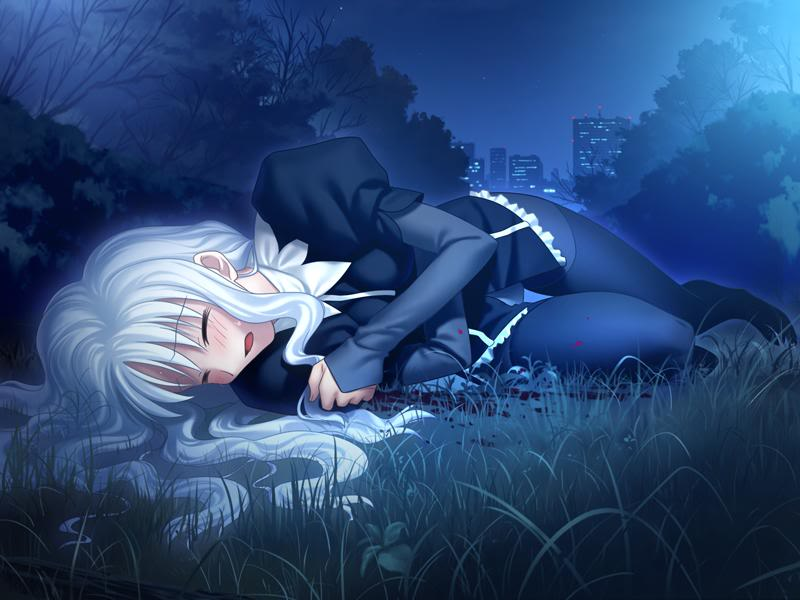

You take it, or you leave it. If you are here for the story and want to experience the genre, you'll have to deal with the eroge, and there is almost never an option for those who don't want to deal with them. I know there are people who do like them, and that's fine, but there really should be an option for whether you want them or not, and there isn't anything like that.

If you like VN's as a storytelling medium [like I do](https://rockmandash12.kinja.com/why-i-love-visual-novels-so-much-and-how-i-got-into-th-1571227739), you will run into these scenes whether you like them or not, and you have to deal with them if you want to experience them. Unlike with AA versions on Steam which make it very easy to get back H-Scenes (even with [*IMHHW*](http://kotaku.com/if-my-heart-had-wings-the-kotaku-review-876585712), you can easily go to Fuwa and get a 18+ version), if there's H-Scenes, you are pretty much stuck with them and there's very little to get around it. With many fan translated VNs and most of Mangagamer's releases, AA (All Ages) versions rarely get translated, and some of them years after the original. (It wasn't until 2014 that you could play a English version of *Fate/stay night* without the H-Scenes, and the game originally came out in 2004.) If you are interested in the story, you better be interested for eroge, because there is rarely a way to get them out. The translators and publishers for the most part don't give a shit whether you like them or not. Censorship patches are not common, while the other way around is pretty common for AA games. This is increasingly frustrating as more and more VNs enter the mainstream market like [*Steins;Gate*](http://kotaku.com/steins-gate-the-kotaku-review-1559811854) and [*Dangan*](http://kotaku.com/danganronpa-trigger-happy-havoc-the-kotaku-review-1520857478)[*ronpa*](http://kotaku.com/danganronpa-2-goodbye-despair-the-kotaku-review-1629788491) with a great storytelling experience, only to learn that these are a minority in a genre full of Hentai.

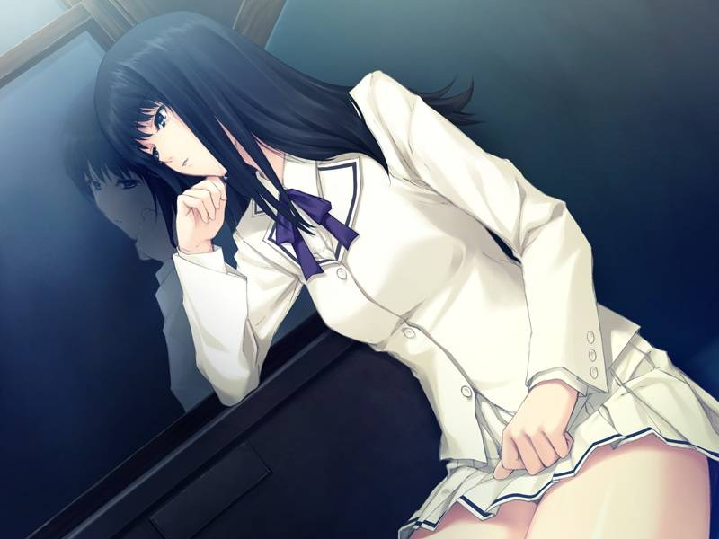

This lack of choice is frustrating primarily because it shows a complete disregard from the community about other people's opinion on this topic, and a lack of consideration for other people. I understand that fan translators have no obligation to disable the scenes, and the companies have no obligation to do so, but by doing so they [limit the people who are willing to try these stories](https://kotaku.com/why-i-am-reluctantly-okay-with-cutting-the-sex-out-of-v-919482294) and reducing the enjoyment of those that do not like it. 18+ means 18+. While I'm sure that every teenager out there has seen some porn, and the 18+ adulthood rules for pornography are pretty arbitrary, the fact of the matter is, it's still 18+, and illegal for minors to play many visual novels out there. This may not bother many of you out there, but it's something that deeply bothers me: it's technically illegal for me to play some of my favorite games out there. It also makes it a lot harder to get the games you want on platforms like Steam. It's not that everyone at Apple and Steam hate everything 18+, but it's just a corporate opinion that they follow because they adhere to social norms, and they won't budge on that. They won't change until society changes… and that won't change for a long time.

[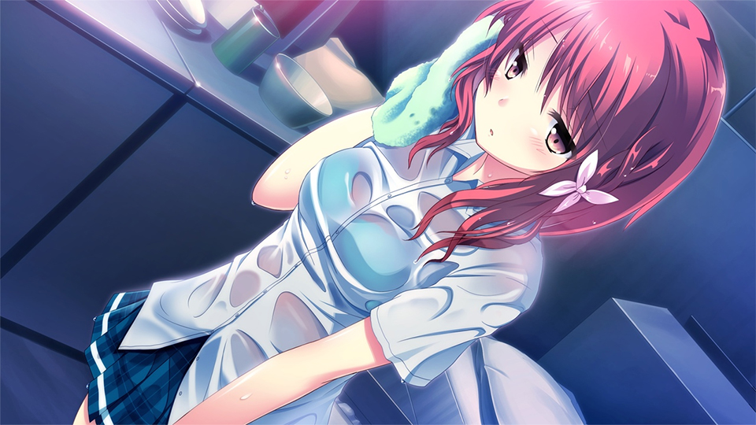 ](https://kotaku.com/why-i-am-reluctantly-okay-with-cutting-the-sex-out-of-v-919482294)

Every now and then, a very common complaint from the visual novel community appears: *"If you are playing an eroge, why are you complaining about the H-scenes?" ""Why must visual novels be censored?".* By asking these questions, the people are essentially ignoring other ideals and opinions out there, which infuriates me to no end. I'm not mad about the community holding the values they have: I'm mad about how the community as a whole does not respect the opinions of others when it comes to this topic, and does not acknowledge that others may have another viewpoint. While they are just scenes in an obscure medium, they represent something much bigger. This is an issue on morality, an issue based around the core viewpoints that surround things like sexuality, and those are things you can't really try to change. Ignoring the fact that there are other opinions here is just rude, and I wish the community as a whole would learn to be more accepting, considering what they are even dealing with. Telling others to be open and try something else, then being closed minded to the thoughts of the people who have been told to be open is hypocrisy at its finest, and I wish this sentiment went away.

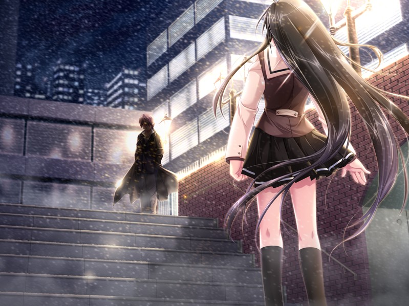

While I would personally love it if there weren't H-scenes in visual novels at all, I know that's just a pipe dream for me, and that would be really insensitive to others and frankly dumb. Really, the best way to go is giving a choice, which really isn't something that's that hard to do, and would make the enjoyment that much better for those who don't like these scenes. All I'm asking for is an ON/OFF switch or separate versions, is that really that much? I understand that converting 18+ to AA comes with its issues, but those don't really bother me, and I'm sure that there are other people out there that would prefer this, and wouldn't cry CENSORSHIP every time an AA version is announced. Like in the movie industry, making "clean" versions of the game shouldn't bother you if you can have the explicit one... (On the same vein, AA visual novels on Steam do not bother me, and in fact I really like seeing them. While I'll never play half of them, I find it great that the genre is spreading out to more people.)

As of late, because of the efforts of indies and publishers like Sekai project trying to branch out into the mainstream gaming audience, we've seen a lot more AA versions, which is really a step in the right direction…. but there are so many where you simply do not have the option, which to me is really frustrating. I don't like it in any of my media. I don't want to see it tied to a narrative, and I don't want to have any part with H-Scenes, but I'm forced to deal with it, even when there are versions out there that do not have these. The community forces it's opinion that 18+ is greater than AA, and more often than not doesn't even give you the option to pick.

## To me, H-scenes don't add anything to the experience...

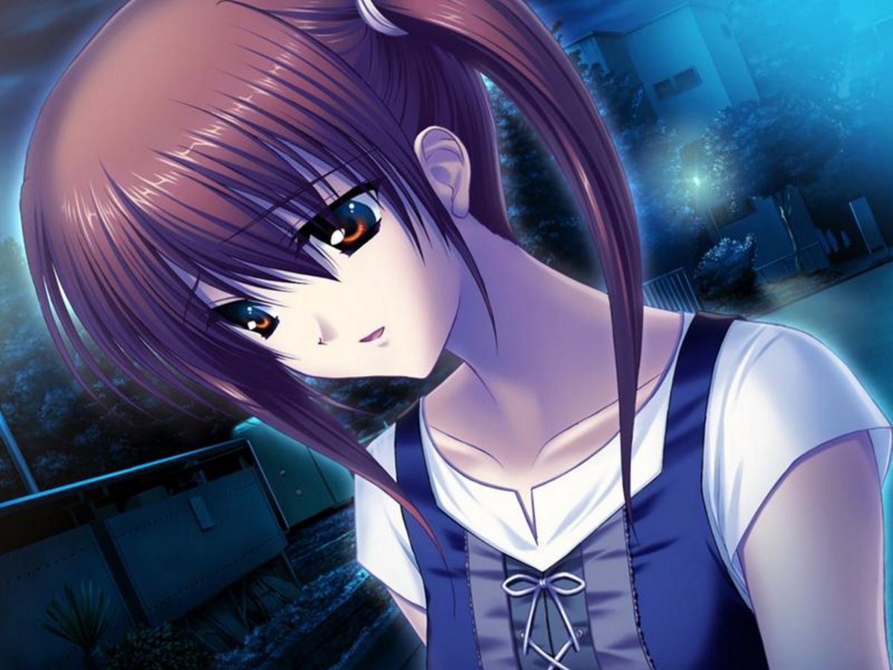

...and at times, they hinder the experience. I view H-Scenes in Visual Novels in pretty much the same way I view[ fanservice](https://gizmodo.com/ecchi-fan-service-is-a-sexist-relic-that-needs-to-go-aw-1580313926) in anime (With Eroge being way worse than fanservice) and I think it's hypocritical to argue against one yet be OK with another. They both essentially serve the same purpose and almost all of the scenes with either are absolutely pointless for anything other than the sake of porn/fanservice, and are there for the sake of being there: they don't help the story, they break the atmosphere and they destroy the flow. I stand by my belief that visual novels are better AA, and many of my favorite visual novels are AA. I know many people in the community try to argue that they do have a meaning and impact the story, thus getting rid of them is ["censorship"](http://www.reddit.com/r/visualnovels/comments/2t9ny5/nerfnow_on_the_recent_proliferation_of_vns_on/cnxb42q), but I think this is a silly claim. Every aspect that the scenes have on the story can be executed in other ways and done even more effectively, and you really don't cut out that much content. The information can be displayed in different ways, and you can retain the same meaning. Even if you just take the straight scene out, you can still get the impact that a H-Scene would have, which a lot of the fan done censorship patches do, and a a lot of western games do and that works just fine. An H-Scene inherently has a different atmosphere, a different point. They focus on different elements, have different music, and are inherently off base from the rest of the story,and can just be extremely awkward. The writers that make visual novels are usually not experts at writing H-Scenes, and most of them fall flat. A great example is any of Type-Moon's H-scenes… which are just garbage, serve next to no purpose, are lambasted by most people who play them, and really, just get in the way. (Mana transfer? I mean, REALLY? COULD YOU NOT FIND A MORE BS REASON THAN THAT? Agghhhh….. >\_>)

[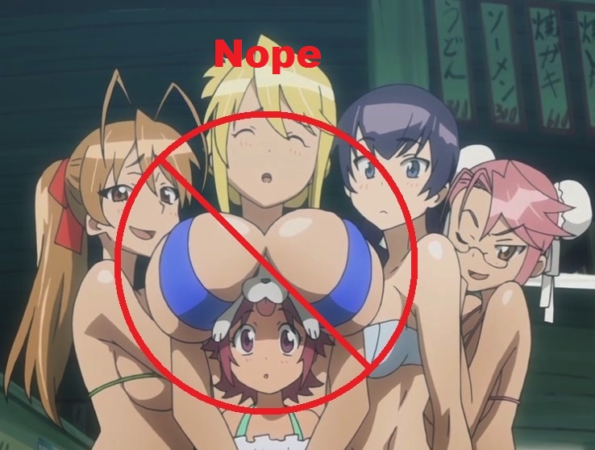 ](https://gizmodo.com/ecchi-fan-service-is-a-sexist-relic-that-needs-to-go-aw-1580313926)

I'm not saying that my experience is everything, but out of all of the Visual Novels I've played (which is probably around 40... There's a lot I want to go through but haven't gotten around to yet), I've only seen two of them that used H-scenes effectively to enhance the story and that's [*Saya no Uta*](https://kotaku.com/saya-no-uta-the-song-of-saya-the-kotaku-review-509012142), and [*Muv-Luv*](http://tay.kotaku.com/rockmandash-reviews-muv-luv-extra-alternative-visua-1567978967) [*Alternative*](http://tay.kotaku.com/muv-luv-alternative-the-tay-review-1546183909), both using it to show how fucked up the situation is, and to show you the horrors of the respective worlds, which most don't really aim for. The typical use of a sex scene in a narrative is to show that the relationship is closer, with sex being a peak of the relationship, but I find that this argument falls apart. There are so many other ways you can display a close bond, and those come without the inherent issues that a sex scene has, with its atmosphere/immersion breaking, alienating a section of the audience, distracting from the plot points and relationships that the characters have in hand. Take [Key's VNs](http://tay.kotaku.com/rockmandash-reviews-key-marathon-wip-1606707641?rev=1421965085410) for an example, one of the few exceptions people have with AA versions of VNs. They portray bonds via character interactions, and subtle changes in a relationship that build up into something great, something amazing.

[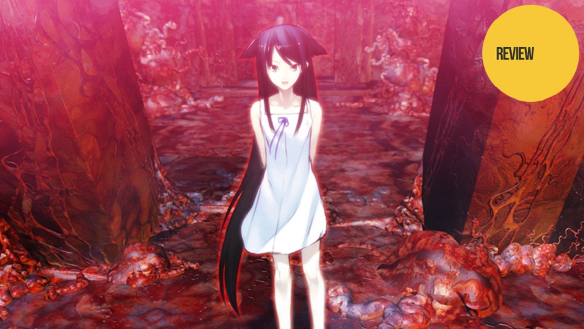 ](https://kotaku.com/saya-no-uta-the-song-of-saya-the-kotaku-review-509012142)

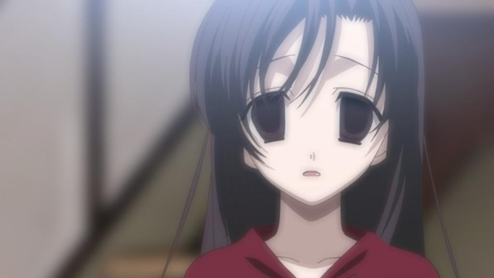

Plus, in our modern day society, sex doesn't necessarily correlate to a close bond as there's a lot of people who have casual sex, as stuff like [*School Days* ](https://kotaku.com/school-days-hq-is-a-beautiful-shocking-yet-flawed-tit-5937487)would tell you. As for themes of sexuality in a story, I'm sure that we've all seen stories that have shown themes relating to sexuality and pulling it off very well without actually having any mature content, and VNs can certainly do so. With them in, they risk alienating the player (which they almost do in my situation), and it's really not a tasteful way to execute it.

[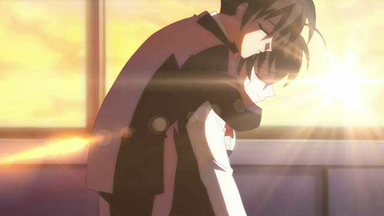 ](https://kotaku.com/school-days-hq-is-a-beautiful-shocking-yet-flawed-tit-5937487)

If you see any of my writing about Visual Novels, you will see that I am personally opposed to them, and just the inclusion of them can be a negative for me, but I'm opposed to them because I believe they serve no real value, they do not benefit your experience with the medium and only serve to stir trouble. I'm not opposed to them because of what they are, but how they are done. I'm not opposed to it because of moral reasons, and because this is an issue of morality, it's up to you to make your own viewpoint on this topic. I have mine, and I don't want them to sway yours. Thank you for reading what is essentially my rambling on my main thoughts on eroge in visual novels, and I hope you can learn to respect the different viewpoints and games that this genre has.

*Note: Edited on 1/23 to include the fanservice bit, and Edited on 1/27 to clarify my point of Eroge. **I DO NOT HATE YOU ALL AND WISH THERE WERE NO EROGE IN ACTUALITY. THAT'S JUST A PERSONAL PREFERENCE, NOT AN ACTUAL DREAM FOR THE COMMUNITY. >\_>***
