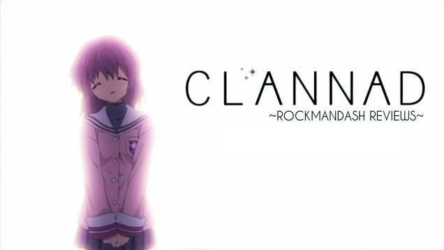

---
{
title: "A Visual Novel Fan's Opinion on Eroge",
tags: ["Opinion", "Rockmandash Rambles", "Visual Novels", "Eroge", "Storytelling", "H scenes", "Observation Deck", "TAY-Classic", "Ani-TAY", "Visual Novel"],
authors: ['reikaze'],
published: '2015-01-22T17:30:00-05:00',
attached: [],
license: 'cc-by-4',
oldArticle: true
}
---

It seems like that the west has rediscovered the<a class="sc-1out364-0 hMndXN sc-145m8ut-0 gIacKn js_link" data-ga='[["Embedded Url","External link","https://rockmandash12.kinja.com/the-beginners-guide-to-visual-novels-1541975662",{"metric25":1}]]' href="https://rockmandash12.kinja.com/the-beginners-guide-to-visual-novels-1541975662" rel="noopener noreferrer" target="_blank"> Visual Novel Genre</a>, commonly referred to as Dating Sim. Due to this, there is a
  lot of stereotyping and confusion about the genre (including what to even call them). Recently on Kotaku, Patrica
  Hernandez <a class="sc-1out364-0 hMndXN sc-145m8ut-0 gIacKn js_link" data-ga='[["Embedded Url","Internal link","http://kotaku.com/the-sex-games-that-steam-censors-1680718912",{"metric25":1}]]' href="http://kotaku.com/the-sex-games-that-steam-censors-1680718912">wrote an article about eroge</a>,
  which tried to explain what is actually up with said genre, and I think it's decent way to try to understand what's
  actually going on it, I don't think that it provides the mindset and opinions of the fans of the genre: it's an
  outsider looking in. As one who loves visual novels and plays them very frequently, I thought I'd put out my two
  cents.<strong> Disclaimer: While this doesn't contain graphic sexual scenes, it does talk about them quite a bit and
    reference them. </strong>

<aside class="sc-1rh3ayr-6 jfFNjl inset--story branded-item branded-item--kinja" data-commerce-source="inset"><a class="sc-1out364-0 hMndXN sc-1rh3ayr-2 lcMGRt inset--story__thumb js_link" data-ga='[["Permalink page click","Permalink page click - inset photo"]]' href="https://rockmandash12.kinja.com/the-beginners-guide-to-visual-novels-1541975662" rel="noopener noreferrer" target="_blank">
<video autoplay="" loop="" muted=""><source src="./dt2sgbswno93qzsckozl.mp4" type="video/mp4"/></video>
</a>

<a class="sc-1out364-0 hMndXN js_link" data-ga='[["Permalink page click","Permalink page click - inset headline"]]' href="https://rockmandash12.kinja.com/the-beginners-guide-to-visual-novels-1541975662" rel="noopener noreferrer" target="_blank"><h6 class="sc-1rh3ayr-3 jRIPES">
    Rockmandash's Beginner's Guide To Visual Novels</h6></a>

What exactly is a Visual Novel? Why should I care, and why are you talking about
      them? The Visual…
<a class="sc-1out364-0 hMndXN sc-1rh3ayr-0 kOvmIi js_readmore inset--story__readmore js_link" data-ga='[["Permalink page click","Permalink page click - inset read more link"]]' href="https://rockmandash12.kinja.com/the-beginners-guide-to-visual-novels-1541975662" rel="noopener noreferrer" target="_blank">Read more</a>

</aside>
Also, due to the nature of this topic, expect some opinions or issues you may
  disagree with, so I'd be really grateful if you came into this with an as open mind as possible. I'll try my best to
  represent both sides fairly. I do have my opinion though, and I'll spew them out. That being said, the article isn't
  exactly going to talk about the Eroge itself, which is more a moral issue that I don't want to sway people on. It's
  going to be more about the things that it influences rather than the content itself. I'm no SJW, and I'm not going to
  try to be one.

<h2 class="sc-1bwb26k-1 fvCjqJ" id="h113773">It Creates a Stereotype, a
  Stigma, and it's one I can't stand.</h2>

Visual Novels have always been the laughing stalk of the gaming industry in the
  west. While some have accepted this genre for what it is, many ignore everything about the genre and laugh it off.
  Even the name Dating Sim is a part of this stereotype, as Dating Sims are just a subgenre in the larger genre of
  Visual Novels and do not represent everything the genre has to offer. If you need proof that people view it this way,
  just look at Patricia's article:

<blockquote class="sc-8hxd3p-0 nvIqO" data-type="BlockQuote">
<em> "it's a long-standing
  cliche in the visual novel community that some people play raunchy anime games, not for the sex scenes or indulgent
  nudity, but rather for the story, writing, or mechanics (much in the same way that some people genuinely read Playboy
  'for the articles')."</em>
</blockquote>

It's not just a cliche, and definitely it's not like reading "Playboy for the
  articles". Sekai Project said it themselves in the article, saying that they hoped that Kotaku readers and writers
  don't

<blockquote class="sc-8hxd3p-0 nvIqO" data-type="BlockQuote">
<em> "have the impression
  that all visual and kinetic novels are chocked full of nothing but mature, 18+ content—a majority [of visual novels]
  are quite engaging, have captivating stories to tell, breathtaking artwork, and fantastic voice over work too!"</em>

</blockquote>

The H-scenes (aka Hentai Scenes, the scenes that display sex), dating elements,
  explicit content and everything that makes a dating sim so well known have overshadowed everything else about the
  genre, causing people to just assume that the genre is just weird text based adventure games with cute 2D anime girls
  that are focused around smut. This is a real shame, given that some of the most highly rated, <a class="sc-1out364-0 hMndXN sc-145m8ut-0 gIacKn js_link" data-ga='[["Embedded Url","External link","https://rockmandash12.kinja.com/rockmandash-reviews-clannad-visual-novel-anime-1609437459",{"metric25":1}]]' href="https://rockmandash12.kinja.com/rockmandash-reviews-clannad-visual-novel-anime-1609437459" rel="noopener noreferrer" target="_blank">well known</a> <a class="sc-1out364-0 hMndXN sc-145m8ut-0 gIacKn js_link" data-ga='[["Embedded Url","Internal link","http://kotaku.com/steins-gate-the-kotaku-review-1559811854#_ga=1.50412905.1523386611.1417386122",{"metric25":1}]]' href="http://kotaku.com/steins-gate-the-kotaku-review-1559811854#_ga=1.50412905.1523386611.1417386122">anime are </a><a class="sc-1out364-0 hMndXN sc-145m8ut-0 gIacKn js_link" data-ga='[["Embedded Url","External link","http://anitay.kinja.com/rockmandash-reviews-kanon-visual-novel-anime-1605160517",{"metric25":1}]]' href="http://anitay.kinja.com/rockmandash-reviews-kanon-visual-novel-anime-1605160517" rel="noopener noreferrer" target="_blank">based off</a> <a class="sc-1out364-0 hMndXN sc-145m8ut-0 gIacKn js_link" data-ga='[["Embedded Url","External link","http://rockmandash12.kinja.com/rockmandash-reviews-fate-stay-night-visual-novel-1613176306",{"metric25":1}]]' href="http://rockmandash12.kinja.com/rockmandash-reviews-fate-stay-night-visual-novel-1613176306" rel="noopener noreferrer" target="_blank">of visual novels</a>, and
  it ignores that some<a class="sc-1out364-0 hMndXN sc-145m8ut-0 gIacKn js_link" data-ga='[["Embedded Url","Internal link","http://kotaku.com/danganronpa-trigger-happy-havoc-the-kotaku-review-1520857478",{"metric25":1}]]' href="http://kotaku.com/danganronpa-trigger-happy-havoc-the-kotaku-review-1520857478"> visual novels</a>
<a class="sc-1out364-0 hMndXN sc-145m8ut-0 gIacKn js_link" data-ga='[["Embedded Url","Internal link","http://kotaku.com/danganronpa-2-goodbye-despair-the-kotaku-review-1629788491",{"metric25":1}]]' href="http://kotaku.com/danganronpa-2-goodbye-despair-the-kotaku-review-1629788491">are well</a>
<a class="sc-1out364-0 hMndXN sc-145m8ut-0 gIacKn js_link" data-ga='[["Embedded Url","External link","http://rockmandash12.kinja.com/rockmandash-reviews-ever-17-the-out-of-infinity-vis-1626111485?rev=1415068987374#_ga=1.46190311.1523386611.1417386122",{"metric25":1}]]' href="http://rockmandash12.kinja.com/rockmandash-reviews-ever-17-the-out-of-infinity-vis-1626111485?rev=1415068987374#_ga=1.46190311.1523386611.1417386122" rel="noopener noreferrer" target="_blank">known for</a><a class="sc-1out364-0 hMndXN sc-145m8ut-0 gIacKn js_link" data-ga='[["Embedded Url","Internal link","http://kotaku.com/kara-no-shojo-the-kotaku-review-1486926848#_ga=1.115016007.1523386611.1417386122",{"metric25":1}]]' href="http://kotaku.com/kara-no-shojo-the-kotaku-review-1486926848#_ga=1.115016007.1523386611.1417386122"> stellar stories</a>,
  with <a class="sc-1out364-0 hMndXN sc-145m8ut-0 gIacKn js_link" data-ga='[["Embedded Url","Internal link","http://kotaku.com/why-zero-escape-virtues-last-reward-should-be-game-of-5972462",{"metric25":1}]]' href="http://kotaku.com/why-zero-escape-virtues-last-reward-should-be-game-of-5972462"><em>Zero Escape: Virtue's Last Reward</em></a>
  (<a class="sc-1out364-0 hMndXN sc-145m8ut-0 gIacKn js_link" data-ga='[["Embedded Url","Internal link","http://kotaku.com/fans-fight-to-bring-virtues-last-reward-back-to-life-1524369580",{"metric25":1}]]' href="http://kotaku.com/fans-fight-to-bring-virtues-last-reward-back-to-life-1524369580">#Operationbluebird #ZE3</a>)
  almost winning a best game of the year from Kotaku. When looking from the outside in like Patricia did, you can't
  really tell, but if you delve in, it's like there are two genres in Visual Novels, but with the same name: The Visual
  Novel written for the sake of fanservice and sex scenes, and my preferred version of Visual Novel, the ones written
  for a story. Some of the best stories I've ever experienced have been from visual novels, because it's inherently a
  <a class="sc-1out364-0 hMndXN sc-145m8ut-0 gIacKn js_link" data-ga='[["Embedded Url","Internal link","http://tay.kotaku.com/storytelling-and-gameplay-in-video-games-1571189453",{"metric25":1}]]' href="http://tay.kotaku.com/storytelling-and-gameplay-in-video-games-1571189453">great story</a><a class="sc-1out364-0 hMndXN sc-145m8ut-0 gIacKn js_link" data-ga='[["Embedded Url","Internal link","http://tay.kotaku.com/understanding-the-makings-of-a-video-game-story-1572747131",{"metric25":1}]]' href="http://tay.kotaku.com/understanding-the-makings-of-a-video-game-story-1572747131">telling</a> <a class="sc-1out364-0 hMndXN sc-145m8ut-0 gIacKn js_link" data-ga='[["Embedded Url","Internal link","http://tay.kotaku.com/what-is-a-video-game-1573864350",{"metric25":1}]]' href="http://tay.kotaku.com/what-is-a-video-game-1573864350">medium</a>, but eroge just hinders the spread of
  this genre because it creates a stigma.

<aside class="sc-1rh3ayr-6 jfFNjl inset--story branded-item branded-item--kinja" data-commerce-source="inset">

<a class="sc-1out364-0 hMndXN js_link" data-ga='[["Permalink page click","Permalink page click - inset headline"]]' href="https://rockmandash12.kinja.com/rockmandash-reviews-clannad-visual-novel-anime-1609437459" rel="noopener noreferrer" target="_blank"><h6 class="sc-1rh3ayr-3 jRIPES">
    Rockmandash Reviews: <i>Clannad</i> [Visual Novel &amp; Anime]</h6></a>

It’s only once in a blue moon that you’ll run into a story that fundamentally changes
      who you are.…
<a class="sc-1out364-0 hMndXN sc-1rh3ayr-0 kOvmIi js_readmore inset--story__readmore js_link" data-ga='[["Permalink page click","Permalink page click - inset read more link"]]' href="https://rockmandash12.kinja.com/rockmandash-reviews-clannad-visual-novel-anime-1609437459" rel="noopener noreferrer" target="_blank">Read more</a>

</aside>

<iframe allow="accelerometer; autoplay; clipboard-write; encrypted-media; gyroscope; picture-in-picture" allowfullscreen="" frameborder="0" height="315" src="https://www.youtube.com/embed/zkvQte7JWpw" width="560"></iframe>

I spend a lot of time over on AniTAY and TAY talking about stories in visual novels, and so
  does a lot of the visual novel community. Both of the largest visual novel communities (<a class="sc-1out364-0 hMndXN sc-145m8ut-0 gIacKn js_link" data-ga='[["Embedded Url","External link","http://forums.fuwanovel.org/",{"metric25":1}]]' href="http://forums.fuwanovel.org/" rel="noopener noreferrer" target="_blank">Fuwanovel </a>and <a class="sc-1out364-0 hMndXN sc-145m8ut-0 gIacKn js_link" data-ga='[["Embedded Url","External link","http://www.reddit.com/r/visualnovels/",{"metric25":1}]]' href="http://www.reddit.com/r/visualnovels/" rel="noopener noreferrer" target="_blank">Reddit</a>) spend much
  of their time try to open peoples' minds and try the medium this medium already has a barrier of entry, because let's
  face it: How many gamers really want to spend their time reading? Adding Eroge into the mix just makes this even
  harder for people to get into it, and conflicts with the interest of many in the community. There are social norms
  that this community doesn't follow, and because of this, there are a lot of great works that are really hard to talk
  about. I can't just recommend stuff like <a class="sc-1out364-0 hMndXN sc-145m8ut-0 gIacKn js_link" data-ga='[["Embedded Url","External link","https://rockmandash12.kinja.com/g-senjou-no-maou-the-tay-review-1524540625",{"metric25":1}]]' href="https://rockmandash12.kinja.com/g-senjou-no-maou-the-tay-review-1524540625" rel="noopener noreferrer" target="_blank"><em>G-Senjou no Maou</em></a>
  to people, because there are people out there that would probably look down upon me because of this recommendation due
  to that one fact, and ignoring everything else (Usami Haru = Best Girl :P), which just gets me down. The stigma is
  real, and it's depressing.

<aside class="sc-1rh3ayr-6 jfFNjl inset--story branded-item branded-item--kinja" data-commerce-source="inset"><a class="sc-1out364-0 hMndXN sc-1rh3ayr-2 lcMGRt inset--story__thumb js_link" data-ga='[["Permalink page click","Permalink page click - inset photo"]]' href="https://rockmandash12.kinja.com/g-senjou-no-maou-the-tay-review-1524540625" rel="noopener noreferrer" target="_blank">
<video autoplay="" loop="" muted=""><source src="./1529558210760817480.mp4" type="video/mp4"/></video>
</a>

<a class="sc-1out364-0 hMndXN js_link" data-ga='[["Permalink page click","Permalink page click - inset headline"]]' href="https://rockmandash12.kinja.com/g-senjou-no-maou-the-tay-review-1524540625" rel="noopener noreferrer" target="_blank"><h6 class="sc-1rh3ayr-3 jRIPES">
    RockmanDash Reviews: <i>G-Senjou no Maou</i> [Visual Novel]</h6></a>

While Visual Novels usually slow affairs with either meticulous writing or Slice of
      life, There’s…
<a class="sc-1out364-0 hMndXN sc-1rh3ayr-0 kOvmIi js_readmore inset--story__readmore js_link" data-ga='[["Permalink page click","Permalink page click - inset read more link"]]' href="https://rockmandash12.kinja.com/g-senjou-no-maou-the-tay-review-1524540625" rel="noopener noreferrer" target="_blank">Read more</a>

</aside><h2 class="sc-1bwb26k-1 fvCjqJ" id="h113774">Eroge is there, whether you
  like it or not.</h2>

You take it, or you leave it. If you are here for the story and want to experience
  the genre, you'll have to deal with the eroge, and there is almost never an option for those who don't want to deal
  with them. I know there are people who do like them, and that's fine, but there really should be an option for whether
  you want them or not, and there isn't anything like that.

If you like VN's as a
  storytelling medium <a class="sc-1out364-0 hMndXN sc-145m8ut-0 gIacKn js_link" data-ga='[["Embedded Url","External link","https://rockmandash12.kinja.com/why-i-love-visual-novels-so-much-and-how-i-got-into-th-1571227739",{"metric25":1}]]' href="https://rockmandash12.kinja.com/why-i-love-visual-novels-so-much-and-how-i-got-into-th-1571227739" rel="noopener noreferrer" target="_blank">like I do</a>, you will run into these
  scenes whether you like them or not, and you have to deal with them if you want to experience them. Unlike with AA
  versions on Steam which make it very easy to get back H-Scenes (even with <a class="sc-1out364-0 hMndXN sc-145m8ut-0 gIacKn js_link" data-ga='[["Embedded Url","Internal link","http://kotaku.com/if-my-heart-had-wings-the-kotaku-review-876585712",{"metric25":1}]]' href="http://kotaku.com/if-my-heart-had-wings-the-kotaku-review-876585712"><em>IMHHW</em></a>, you can easily
  go to Fuwa and get a 18+ version), if there's H-Scenes, you are pretty much stuck with them and there's very little to
  get around it. With many fan translated VNs and most of Mangagamer's releases, AA (All Ages) versions rarely get
  translated, and some of them years after the original. (It wasn't until 2014 that you could play a English version of
  <em>Fate/stay night </em>without the H-Scenes, and the game originally came out in 2004.) If you are interested in the
  story, you better be interested for eroge, because there is rarely a way to get them out. The translators and
  publishers for the most part don't give a shit whether you like them or not. Censorship patches are not common, while
  the other way around is pretty common for AA games. This is increasingly frustrating as more and more VNs enter the
  mainstream market like <a class="sc-1out364-0 hMndXN sc-145m8ut-0 gIacKn js_link" data-ga='[["Embedded Url","Internal link","http://kotaku.com/steins-gate-the-kotaku-review-1559811854",{"metric25":1}]]' href="http://kotaku.com/steins-gate-the-kotaku-review-1559811854"><em>Steins;Gate</em></a>
  and <a class="sc-1out364-0 hMndXN sc-145m8ut-0 gIacKn js_link" data-ga='[["Embedded Url","Internal link","http://kotaku.com/danganronpa-trigger-happy-havoc-the-kotaku-review-1520857478",{"metric25":1}]]' href="http://kotaku.com/danganronpa-trigger-happy-havoc-the-kotaku-review-1520857478"><em>Dangan</em></a><a class="sc-1out364-0 hMndXN sc-145m8ut-0 gIacKn js_link" data-ga='[["Embedded Url","Internal link","http://kotaku.com/danganronpa-2-goodbye-despair-the-kotaku-review-1629788491",{"metric25":1}]]' href="http://kotaku.com/danganronpa-2-goodbye-despair-the-kotaku-review-1629788491"><em>ronpa</em></a> with a
  great storytelling experience, only to learn that these are a minority in a genre full of Hentai. 

<aside class="sc-1rh3ayr-6 jfFNjl inset--story branded-item branded-item--kinja" data-commerce-source="inset">

<a class="sc-1out364-0 hMndXN js_link" data-ga='[["Permalink page click","Permalink page click - inset headline"]]' href="https://rockmandash12.kinja.com/why-i-love-visual-novels-so-much-and-how-i-got-into-th-1571227739" rel="noopener noreferrer" target="_blank"><h6 class="sc-1rh3ayr-3 jRIPES">
    Rockmandash Rambles: Why I love Visual Novels so much, and How I got into this Insane Genre</h6></a>

I was writing my response tword Dex’s article about Storytelling and Gameplay in
      Video Games.....…
<a class="sc-1out364-0 hMndXN sc-1rh3ayr-0 kOvmIi js_readmore inset--story__readmore js_link" data-ga='[["Permalink page click","Permalink page click - inset read more link"]]' href="https://rockmandash12.kinja.com/why-i-love-visual-novels-so-much-and-how-i-got-into-th-1571227739" rel="noopener noreferrer" target="_blank">Read more</a>

</aside>

This lack of choice is frustrating primarily because it shows a complete disregard
  from the community about other people's opinion on this topic, and a lack of consideration for other people. I
  understand that fan translators have no obligation to disable the scenes, and the companies have no obligation to do
  so, but by doing so they <a class="sc-1out364-0 hMndXN sc-145m8ut-0 gIacKn js_link" data-ga='[["Embedded Url","Internal link","https://kotaku.com/why-i-am-reluctantly-okay-with-cutting-the-sex-out-of-v-919482294",{"metric25":1}]]' href="https://kotaku.com/why-i-am-reluctantly-okay-with-cutting-the-sex-out-of-v-919482294">limit the people who are willing to try these stories</a>
  and reducing the enjoyment of those that do not like it. 18+ means 18+. While I'm sure that every teenager out there
  has seen some porn, and the 18+ adulthood rules for pornography are pretty arbitrary, the fact of the matter is, it's
  still 18+, and illegal for minors to play many visual novels out there. This may not bother many of you out there, but
  it's something that deeply bothers me: it's technically illegal for me to play some of my favorite games out there. It
  also makes it a lot harder to get the games you want on platforms like Steam. It's not that everyone at Apple and
  Steam hate everything 18+, but it's just a corporate opinion that they follow because they adhere to social norms, and
  they won't budge on that. They won't change until society changes… and that won't change for a long time.

<aside class="sc-1rh3ayr-6 jfFNjl inset--story branded-item branded-item--kotaku" data-commerce-source="inset"><a class="sc-1out364-0 hMndXN sc-1rh3ayr-2 lnnjIC inset--story__thumb js_link" data-ga='[["Permalink page click","Permalink page click - inset photo"]]' href="https://kotaku.com/why-i-am-reluctantly-okay-with-cutting-the-sex-out-of-v-919482294" rel="noopener noreferrer" target="_blank">

<svg aria-label="Kotaku avatar" height="64" viewbox="0 0 64 64" width="64" xmlns="http://www.w3.org/2000/svg"><g fill="none" fill-rule="evenodd"><path d="M0 0h64v64H0z" fill="#FBC000"></path><path d="M16.8 49.62l3.67-.14c4.05-.15 7.76-3.2 8.35-6.78l4.13-24.65-10.3-.3-5.84 31.87zM43.19 29.1c3.57.02 4.95 1.29 5.93 3.27l6.84 16.84c-1.73 1.54-9.79 1-12.08-5.04l-2.5-6.72h-1.15c-3.8.06-9.2-2.78-8.03-8.4l11 .05zm-22.2-11.38l-5.59-.16c-7.78-.22-9.93 5.3-9.28 8.88l13.26.13 1.6-8.85zm31.55 7.69c2.62-1.66 3.74-7.65 1.9-9.4l-13.51 3.4c-2.3 1.28-4.94 5.01-2.33 9.15l13.94-3.15z" fill="#FFF"></path></g></svg></a>

<a class="sc-1out364-0 hMndXN js_link" data-ga='[["Permalink page click","Permalink page click - inset headline"]]' href="https://kotaku.com/why-i-am-reluctantly-okay-with-cutting-the-sex-out-of-v-919482294" rel="noopener noreferrer" target="_blank"><h6 class="sc-1rh3ayr-3 jRIPES">Why I am
    Reluctantly Okay With Cutting the Sex Out Of Visual Novels</h6></a>

Late last month, If My Heart Had Wings, a winner of several visual novel related
      awards, was…
<a class="sc-1out364-0 hMndXN sc-1rh3ayr-0 kmFqkp js_readmore inset--story__readmore js_link" data-ga='[["Permalink page click","Permalink page click - inset read more link"]]' href="https://kotaku.com/why-i-am-reluctantly-okay-with-cutting-the-sex-out-of-v-919482294" rel="noopener noreferrer" target="_blank">Read more</a>

</aside>

Every now and then, a very common complaint from the visual novel community appears:
  <em>"If you are playing an eroge, why are you complaining about the H-scenes?" ""Why must visual novels be
    censored?". </em>By asking these questions, the people are essentially ignoring other ideals and opinions out there,
  which infuriates me to no end. I'm not mad about the community holding the values they have: I'm mad about how the
  community as a whole does not respect the opinions of others when it comes to this topic, and does not acknowledge
  that others may have another viewpoint. While they are just scenes in an obscure medium, they represent something much
  bigger. This is an issue on morality, an issue based around the core viewpoints that surround things like sexuality,
  and those are things you can't really try to change. Ignoring the fact that there are other opinions here is just
  rude, and I wish the community as a whole would learn to be more accepting, considering what they are even dealing
  with. Telling others to be open and try something else, then being closed minded to the thoughts of the people who
  have been told to be open is hypocrisy at its finest, and I wish this sentiment went away.

While I would personally love it if there weren't H-scenes in visual novels at all,
  I know that's just a pipe dream for me, and that would be really insensitive to others and frankly dumb. Really, the
  best way to go is giving a choice, which really isn't something that's that hard to do, and would make the enjoyment
  that much better for those who don't like these scenes. All I'm asking for is an ON/OFF switch or separate versions,
  is that really that much? I understand that converting 18+ to AA comes with its issues, but those don't really bother
  me, and I'm sure that there are other people out there that would prefer this, and wouldn't cry CENSORSHIP every time
  an AA version is announced. Like in the movie industry, making "clean" versions of the game shouldn't bother you if
  you can have the explicit one... (On the same vein, AA visual novels on Steam do not bother me, and in fact I really
  like seeing them. While I'll never play half of them, I find it great that the genre is spreading out to more
  people.)

As of late, because of the efforts of indies and publishers like Sekai
  project trying to branch out into the mainstream gaming audience, we've seen a lot more AA versions, which is really a
  step in the right direction…. but there are so many where you simply do not have the option, which to me is really
  frustrating. I don't like it in any of my media. I don't want to see it tied to a narrative, and I don't want to have
  any part with H-Scenes, but I'm forced to deal with it, even when there are versions out there that do not have these.
  The community forces it's opinion that 18+ is greater than AA, and more often than not doesn't even give you the
  option to pick. 

<h2 class="sc-1bwb26k-1 fvCjqJ" id="h113775">To me, H-scenes don't add
  anything to the experience...</h2>

...and at times, they hinder the experience. I view H-Scenes in Visual Novels in
  pretty much the same way I view<a class="sc-1out364-0 hMndXN sc-145m8ut-0 gIacKn js_link" data-ga='[["Embedded Url","Internal link","https://gizmodo.com/ecchi-fan-service-is-a-sexist-relic-that-needs-to-go-aw-1580313926",{"metric25":1}]]' href="https://gizmodo.com/ecchi-fan-service-is-a-sexist-relic-that-needs-to-go-aw-1580313926"> fanservice</a>
  in anime (With Eroge being way worse than fanservice) and I think it's hypocritical to argue against one yet be OK
  with another. They both essentially serve the same purpose and almost all of the scenes with either are absolutely
  pointless for anything other than the sake of porn/fanservice, and are there for the sake of being there: they don't
  help the story, they break the atmosphere and they destroy the flow. I stand by my belief that visual novels are
  better AA, and many of my favorite visual novels are AA. I know many people in the community try to argue that they do
  have a meaning and impact the story, thus getting rid of them is <a class="sc-1out364-0 hMndXN sc-145m8ut-0 gIacKn js_link" data-ga='[["Embedded Url","External link","http://www.reddit.com/r/visualnovels/comments/2t9ny5/nerfnow_on_the_recent_proliferation_of_vns_on/cnxb42q",{"metric25":1}]]' href="http://www.reddit.com/r/visualnovels/comments/2t9ny5/nerfnow_on_the_recent_proliferation_of_vns_on/cnxb42q" rel="noopener noreferrer" target="_blank">"censorship"</a>, but I think this is a silly claim. Every aspect
  that the scenes have on the story can be executed in other ways and done even more effectively, and you really don't
  cut out that much content. The information can be displayed in different ways, and you can retain the same meaning.
  Even if you just take the straight scene out, you can still get the impact that a H-Scene would have, which a lot of
  the fan done censorship patches do, and a a lot of western games do and that works just fine. An H-Scene inherently
  has a different atmosphere, a different point. They focus on different elements, have different music, and are
  inherently off base from the rest of the story,and can just be extremely awkward. The writers that make visual novels
  are usually not experts at writing H-Scenes, and most of them fall flat. A great example is any of Type-Moon's
  H-scenes… which are just garbage, serve next to no purpose, are lambasted by most people who play them, and really,
  just get in the way. (Mana transfer? I mean, REALLY? COULD YOU NOT FIND A MORE BS REASON THAN THAT? Agghhhh….. &gt;_&gt;)

<aside class="sc-1rh3ayr-6 jfFNjl inset--story branded-item branded-item--gizmodo" data-commerce-source="inset"><a class="sc-1out364-0 hMndXN sc-1rh3ayr-2 ihdhCm inset--story__thumb js_link" data-ga='[["Permalink page click","Permalink page click - inset photo"]]' href="https://gizmodo.com/ecchi-fan-service-is-a-sexist-relic-that-needs-to-go-aw-1580313926" rel="noopener noreferrer" target="_blank">

<svg aria-label="Gizmodo avatar" height="64" viewbox="0 0 64 64" width="64" xmlns="http://www.w3.org/2000/svg"><g fill="none" fill-rule="evenodd"><path d="M0 0h64v64H0z" fill="#18AFED"></path><path d="M16.67 46.94A22.04 22.04 0 0 1 11 32.43C11 16.09 24.58 10 33.15 10c8.41 0 14.6 4.13 14.85 4.3a4.22 4.22 0 0 1-1.48 7.58 4.1 4.1 0 0 1-3.1-.61c-.11-.07-4.5-2.9-10.27-2.9-5.37 0-12.77 3.54-12.77 14.06 0 5.98 4.45 13.04 12.6 13.04 4.6 0 7.83-1.23 9.7-2.42v-6.22h-6.36a4.16 4.16 0 0 1-4.13-4.18 4.16 4.16 0 0 1 4.13-4.19h10.5A4.2 4.2 0 0 1 51 32.64V45.1c0 1.13-.5 2.21-1.3 3-2.79 2.73-8.87 5.9-16.88 5.9a21.4 21.4 0 0 1-16.16-7.06z" fill="#FFF"></path></g></svg></a>

<a class="sc-1out364-0 hMndXN js_link" data-ga='[["Permalink page click","Permalink page click - inset headline"]]' href="https://gizmodo.com/ecchi-fan-service-is-a-sexist-relic-that-needs-to-go-aw-1580313926" rel="noopener noreferrer" target="_blank"><h6 class="sc-1rh3ayr-3 jRIPES">Ecchi Fan
    Service Is A Sexist Relic That Needs To Go Away</h6></a>

When you look at this still-shot from Highschool of the Dead, what are you meant to
      look at? If…
<a class="sc-1out364-0 hMndXN sc-1rh3ayr-0 idkyLZ js_readmore inset--story__readmore js_link" data-ga='[["Permalink page click","Permalink page click - inset read more link"]]' href="https://gizmodo.com/ecchi-fan-service-is-a-sexist-relic-that-needs-to-go-aw-1580313926" rel="noopener noreferrer" target="_blank">Read more</a>

</aside>

I'm not saying that my experience is everything, but out of all of the Visual Novels
  I've played (which is probably around 40... There's a lot I want to go through but haven't gotten around to yet), I've
  only seen two of them that used H-scenes effectively to enhance the story and that's<em> </em><a class="sc-1out364-0 hMndXN sc-145m8ut-0 gIacKn js_link" data-ga='[["Embedded Url","Internal link","https://kotaku.com/saya-no-uta-the-song-of-saya-the-kotaku-review-509012142",{"metric25":1}]]' href="https://kotaku.com/saya-no-uta-the-song-of-saya-the-kotaku-review-509012142"><em>Saya no Uta</em></a>,
  and <a class="sc-1out364-0 hMndXN sc-145m8ut-0 gIacKn js_link" data-ga='[["Embedded Url","Internal link","http://tay.kotaku.com/rockmandash-reviews-muv-luv-extra-alternative-visua-1567978967",{"metric25":1}]]' href="http://tay.kotaku.com/rockmandash-reviews-muv-luv-extra-alternative-visua-1567978967"><em>Muv-Luv </em></a><a class="sc-1out364-0 hMndXN sc-145m8ut-0 gIacKn js_link" data-ga='[["Embedded Url","Internal link","http://tay.kotaku.com/muv-luv-alternative-the-tay-review-1546183909",{"metric25":1}]]' href="http://tay.kotaku.com/muv-luv-alternative-the-tay-review-1546183909"><em>Alternative</em></a>, both
  using it to show how fucked up the situation is, and to show you the horrors of the respective worlds, which most
  don't really aim for. The typical use of a sex scene in a narrative is to show that the relationship is closer, with
  sex being a peak of the relationship, but I find that this argument falls apart. There are so many other ways you can
  display a close bond, and those come without the inherent issues that a sex scene has, with its atmosphere/immersion
  breaking, alienating a section of the audience, distracting from the plot points and relationships that the characters
  have in hand. Take <a class="sc-1out364-0 hMndXN sc-145m8ut-0 gIacKn js_link" data-ga='[["Embedded Url","Internal link","http://tay.kotaku.com/rockmandash-reviews-key-marathon-wip-1606707641?rev=1421965085410",{"metric25":1}]]' href="http://tay.kotaku.com/rockmandash-reviews-key-marathon-wip-1606707641?rev=1421965085410">Key's VNs</a>
  for an example, one of the few exceptions people have with AA versions of VNs. They portray bonds via character
  interactions, and subtle changes in a relationship that build up into something great, something amazing.

<aside class="sc-1rh3ayr-6 jfFNjl inset--story branded-item branded-item--kotaku" data-commerce-source="inset"><a class="sc-1out364-0 hMndXN sc-1rh3ayr-2 lnnjIC inset--story__thumb js_link" data-ga='[["Permalink page click","Permalink page click - inset photo"]]' href="https://kotaku.com/saya-no-uta-the-song-of-saya-the-kotaku-review-509012142" rel="noopener noreferrer" target="_blank">

<svg aria-label="Kotaku avatar" height="64" viewbox="0 0 64 64" width="64" xmlns="http://www.w3.org/2000/svg"><g fill="none" fill-rule="evenodd"><path d="M0 0h64v64H0z" fill="#FBC000"></path><path d="M16.8 49.62l3.67-.14c4.05-.15 7.76-3.2 8.35-6.78l4.13-24.65-10.3-.3-5.84 31.87zM43.19 29.1c3.57.02 4.95 1.29 5.93 3.27l6.84 16.84c-1.73 1.54-9.79 1-12.08-5.04l-2.5-6.72h-1.15c-3.8.06-9.2-2.78-8.03-8.4l11 .05zm-22.2-11.38l-5.59-.16c-7.78-.22-9.93 5.3-9.28 8.88l13.26.13 1.6-8.85zm31.55 7.69c2.62-1.66 3.74-7.65 1.9-9.4l-13.51 3.4c-2.3 1.28-4.94 5.01-2.33 9.15l13.94-3.15z" fill="#FFF"></path></g></svg></a>

<a class="sc-1out364-0 hMndXN js_link" data-ga='[["Permalink page click","Permalink page click - inset headline"]]' href="https://kotaku.com/saya-no-uta-the-song-of-saya-the-kotaku-review-509012142" rel="noopener noreferrer" target="_blank"><h6 class="sc-1rh3ayr-3 jRIPES"><em>Saya
    no Uta — The Song of Saya</em>: The Kotaku Review</h6></a>

Saya no Uta — The Song of Saya is often called the single most fucked-up game ever
      released—and…
<a class="sc-1out364-0 hMndXN sc-1rh3ayr-0 kmFqkp js_readmore inset--story__readmore js_link" data-ga='[["Permalink page click","Permalink page click - inset read more link"]]' href="https://kotaku.com/saya-no-uta-the-song-of-saya-the-kotaku-review-509012142" rel="noopener noreferrer" target="_blank">Read more</a>

</aside>

Plus, in our modern day society, sex doesn't necessarily correlate to a close
  bond as there's a lot of people who have casual sex, as stuff like <a class="sc-1out364-0 hMndXN sc-145m8ut-0 gIacKn js_link" data-ga='[["Embedded Url","Internal link","https://kotaku.com/school-days-hq-is-a-beautiful-shocking-yet-flawed-tit-5937487",{"metric25":1}]]' href="https://kotaku.com/school-days-hq-is-a-beautiful-shocking-yet-flawed-tit-5937487"><em>School Days</em> </a>would
  tell you. As for themes of sexuality in a story, I'm sure that we've all seen stories that have shown themes relating
  to sexuality and pulling it off very well without actually having any mature content, and VNs can certainly do so.
  With them in, they risk alienating the player (which they almost do in my situation), and it's really not a tasteful
  way to execute it. 

<aside class="sc-1rh3ayr-6 jfFNjl inset--story branded-item branded-item--kotaku" data-commerce-source="inset"><a class="sc-1out364-0 hMndXN sc-1rh3ayr-2 lnnjIC inset--story__thumb js_link" data-ga='[["Permalink page click","Permalink page click - inset photo"]]' href="https://kotaku.com/school-days-hq-is-a-beautiful-shocking-yet-flawed-tit-5937487" rel="noopener noreferrer" target="_blank">

<svg aria-label="Kotaku avatar" height="64" viewbox="0 0 64 64" width="64" xmlns="http://www.w3.org/2000/svg"><g fill="none" fill-rule="evenodd"><path d="M0 0h64v64H0z" fill="#FBC000"></path><path d="M16.8 49.62l3.67-.14c4.05-.15 7.76-3.2 8.35-6.78l4.13-24.65-10.3-.3-5.84 31.87zM43.19 29.1c3.57.02 4.95 1.29 5.93 3.27l6.84 16.84c-1.73 1.54-9.79 1-12.08-5.04l-2.5-6.72h-1.15c-3.8.06-9.2-2.78-8.03-8.4l11 .05zm-22.2-11.38l-5.59-.16c-7.78-.22-9.93 5.3-9.28 8.88l13.26.13 1.6-8.85zm31.55 7.69c2.62-1.66 3.74-7.65 1.9-9.4l-13.51 3.4c-2.3 1.28-4.94 5.01-2.33 9.15l13.94-3.15z" fill="#FFF"></path></g></svg></a>

<a class="sc-1out364-0 hMndXN js_link" data-ga='[["Permalink page click","Permalink page click - inset headline"]]' href="https://kotaku.com/school-days-hq-is-a-beautiful-shocking-yet-flawed-tit-5937487" rel="noopener noreferrer" target="_blank"><h6 class="sc-1rh3ayr-3 jRIPES"><em>School
    Days HQ</em> is a Beautiful, Shocking, Yet Flawed Title</h6></a>

 School Days HQ is a visual novel about a highschooler trapped in a love triangle
      with the girl of…
<a class="sc-1out364-0 hMndXN sc-1rh3ayr-0 kmFqkp js_readmore inset--story__readmore js_link" data-ga='[["Permalink page click","Permalink page click - inset read more link"]]' href="https://kotaku.com/school-days-hq-is-a-beautiful-shocking-yet-flawed-tit-5937487" rel="noopener noreferrer" target="_blank">Read more</a>

</aside>
If you see any of my writing about Visual Novels, you will see that I am
  personally opposed to them, and just the inclusion of them can be a negative for me, but I'm opposed to them because I
  believe they serve no real value, they do not benefit your experience with the medium and only serve to stir trouble.
  I'm not opposed to them because of what they are, but how they are done. I'm not opposed to it because of moral
  reasons, and because this is an issue of morality, it's up to you to make your own viewpoint on this topic. I have
  mine, and I don't want them to sway yours. Thank you for reading what is essentially my rambling on my main thoughts
  on eroge in visual novels, and I hope you can learn to respect the different viewpoints and games that this genre
  has.

<em>Note: Edited on 1/23 to include the fanservice bit, and Edited on 1/27 to
  clarify my point of Eroge. <strong>I DO NOT HATE YOU ALL AND WISH THERE WERE NO EROGE IN ACTUALITY. THAT'S JUST A
    PERSONAL PREFERENCE, NOT AN ACTUAL DREAM FOR THE COMMUNITY. &gt;_&gt;</strong></em>

