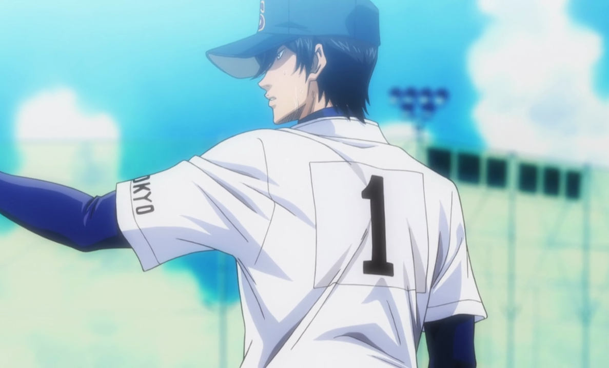
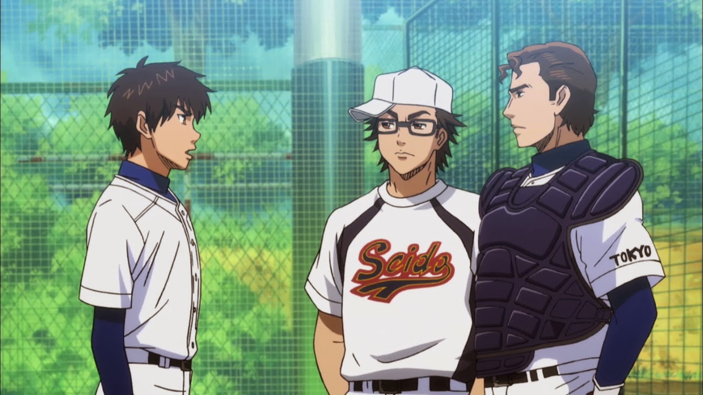
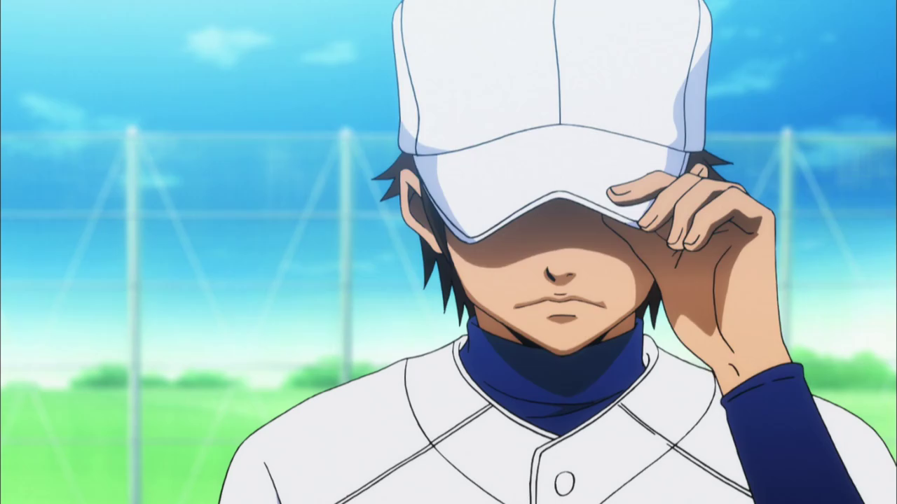
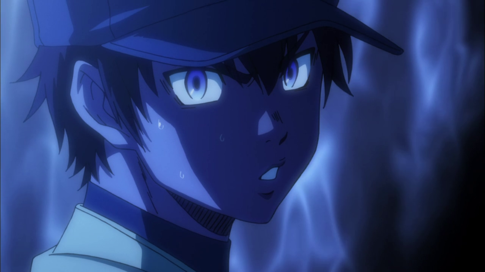
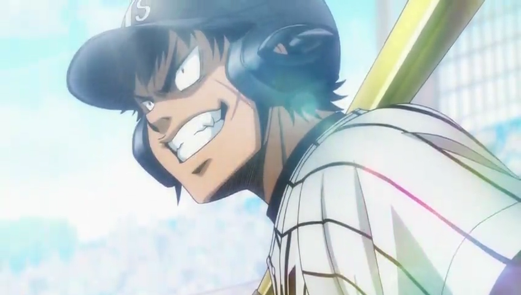
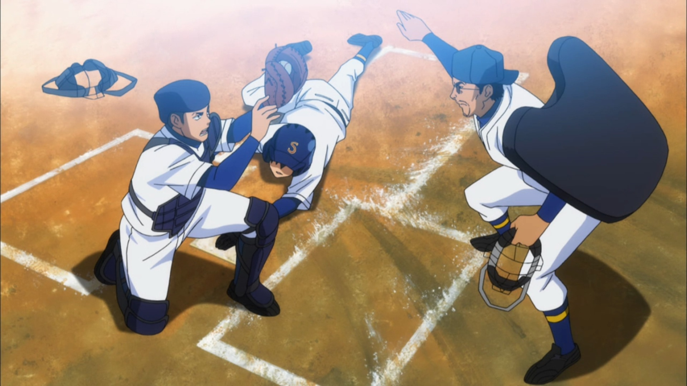
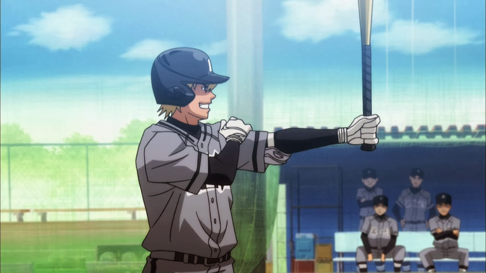
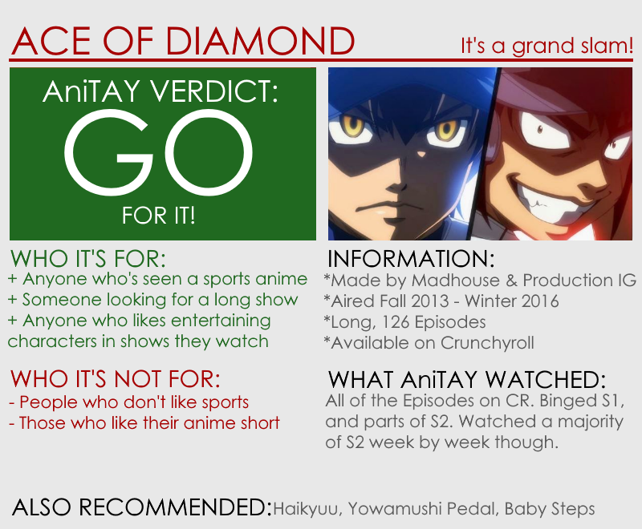

---
{
	title: "Ace Of Diamond Seasons 1 & 2 : The AniTAY Review",
	published: "2016-03-28T09:00:00-04:00",
	tags: ["The AniTAY Review", "Rockmandash Reviews", "AniTAY", "Winter 2016", "Sports Anime", "Ace of Diamond", "Diamond no Ace"],
	kinjaArticle: true
}
---

<video src="./potjf4cj8hq211tic733.mp4"></video>

Eijun Sawamura is a baseball fan who’s a lefty pitcher, but he’s a bit of an oddball even when talking about lefties: he has a very bizarre moving pitch that’s impossible to catch. Scouted by the powerhouse of a school Seido to play baseball, *Ace of Diamond *follows Eijun and the members of the Seido baseball team as they attempt to go to the nationals, or Koshien. Does *Ace of Diamond* hit it out of the park in it’s attempts to make a fantastic sports anime, or does it strike out?

# It’s a Sports Anime, and it has Everything That Makes Them Great.

If you’ve seen a sports anime, you’ve kinda seen them all, but that’s not necessarily a bad thing. While everyone seems to have the perception that [sports anime](http://anitay.kinja.com/the-thrill-of-the-game-why-i-love-sports-anime-1690442761) are boring shows that only serve as a replacement for watching the actual sport, that couldn’t be farther from the truth. Many people have a habit of avoiding these shows because of this misconception, but they are definitely missing out as it is a genre with a very consistent level of quality and I can’t really point to any I’ve seen and say that any of them are bad. As for *Ace of Diamond*, it doesn’t buck this trend at all, but that’s not a bad thing, keeping up with the quality that you’d expect if you’ve seen shows like *Yowapedal *or *Haikyuu*. It has everything that makes this genre great, and that’s a great thing.

***

# A Solid Character Driven Story

One of the strengths of sports anime is not how it portrays the sport itself, but how they tell a solid story that’s focused on the characters first and foremost. Sports anime are primarily stories all about the team and the people that make it up, character driven stories that make for some of the best experiences to the point that this genre has quickly became one of my favorite shows out there. In this aspect, *Ace of Diamonds* doesn’t do anything differently: it just just takes the same formula and structure of other sports anime and adapts it to one of Japan’s favorite sports and America’s pastime, but this adaptation is done exceedingly well, and one aspect of this that is particularly great is the cast of the show. Due to the nature of baseball, there’s a lot of people here, but the show doesn’t just leave them hanging: the characters have great and unique personalities, are developed exceedingly well, and the interactions between them are consistently engaging and dynamic. They’re a group of people that are a blast to watch, all culminating to make a character driven story that puts a smile on your face week by week.

***

# Our Cast is not Infallible

Sports anime are structured like shounen, and because of this, one thing you would expect out of them is that they have a near invincible MC that can beat everyone. While this does happen in other sports anime, in *Ace of Diamonds*, this is not the case. From the beginning, the show makes this obvious. Instead of being championship schools or elites that always win, Seido is strong school, but one that has been on the decline in the recent years, and that can be seen in the earlier episodes. Our cast, while generally playing well, is not infallible and doesn’t always win, losing in dramatic ways. For an example, our lefty pitcher Eijun screws up a game at some point in the show and becomes devastated by his mistake to the point where it significantly impacts his performance and he falls behind his rival Furuya. While you can have shows that only show a spiral upwards and are perfectly fine that way, *Ace of Diamonds *is a show that has the spine to show the side of defeat, and it’s much better because of that.

***

# Builds Up Hype and Tension Better Than Any Other

*Ace of Diamond* is a baseball anime, and of course, they run into tense situations fairly often. If a sports anime couldn’t pull this off, they would have a lot of trouble.. But *Ace of Diamond *is completely removed from that situation. This is one of *Ace of Diamond*’s strong points, as it’s absolutely fantastic at building hype and executing tension, and if you asked me, I’d say it’s the best in the genre in that aspect. Everything this show does, from the art style it executes during specific scenes to highlight the tension, to the music playing that gets you excited and invested in what’s going on, shows it’s a true master of the craft that it’s trying to produce.

***

# A Consistently Enjoyable Show Week by Week

If you asked me what show I was looking forward to the most week by week for these past few seasons, *Ace of Diamond *would be my answer almost 9 times out of 10. Why? That’s because this show does a miraculous job at getting you invested in what it has to offer, and because it’s a show that is so consistently enjoyable to the point that I knew that I was going to have a good time with regardless of what’s happening. It’s a show that can keep you completely on the edge of your seat for it’s 30 minute runtime or it could be a show that constantly put a smile on your face because of the silly interactions of the crew. Regardless of what it was though, it’s a show that kept you interested and engaged, which is a mark of a great show in my eyes.

***

# Wonderful Presentation by Madhouse & Production IG

The anime industry is a more closely related industry than one may think, and *Ace of Diamond *is an example of this made by both Studio Madhouse (known for Satoshi Kon’s films,* Death Note*, and the more recent *One Punch Man*), and Production I.G (known for Ghost in the Shell and Psycho-Pass). If you’ve seen a review of a work from either of these studios, you would know know what’s going to come here: they are studios that have the utmost in quality with animation, and they really know how to make a good show in regards to directing, choreography, music, etc. When you come into shows made by Production IG and Madhouse, the least of your concern is how the show is going to look and sound as they almost always produce quality, and both of them have experience in well known sports anime (*Hajime no Ippo, Chihiyafuru, Kuroko’s Basketball, The Prince of Tennis, Haikyuu!!*, etc). While *Ace of Diamond *isn’t going to knock your socks off with animation like a big budget action show, it’s never going to let you down and it’s always going to be consistently great in this aspect. Particular aspects that should be mentioned are the stylized aesthetic the show has when it wants to point something out, and the music from the OPs & EDs as those are pretty great.

# **It Has the Traditional Downfalls of the Sports Genre**

As great as sports anime are, they aren’t perfect, and like any genre they have their fair amount of downfalls. While I’d argue that these are minor given the amount of positives that they have, they are still worth mentioning regardless.

1. Sports Anime are Shounen-esque in length - Sports anime tend to be long running, and short is not a word you can use to describe *Ace of Diamonds*, being 75 episodes for Season 1 and 51 for Season 2. While the length can be intimidating, it doesn’t have filler at all and it is consistently great.
2. Cliffhangers. Cliffhangers everywhere - In a sport, you don’t really have a lot of flexibility in where you’re going to stop. Because in sports any moment can change the game around, *Ace of Diamond* is filled with cliffhangers. Not much you can do other than blaze through them or wait the week.
3. Tornamentitis - Because sports anime is focused on a specific sport and in real life the most important games are bundled in a tournament, they are in anime too. This has a nasty effect of spending a large amount of time (nearly whole seasons) in the span of a week during these tournaments, consistently fighting for supremacy. In real life this can be exciting, but due to the serialized nature of anime, this isn’t so exciting. This used to be a common trope in Shounen anime, but it’s not really super common nowadays and this may annoy you, but it’s the nature of how things work.

Other than that though, not many complaints I can lodge at the show, the only reason you wouldn’t like it is that you don’t like sports anime, and those are the real big downfalls. I mean, you could say that it’s a bit generic, but it’s a sports anime. Not much you can do to be original here.

Over the past few years, sports anime has been one of the most consistent, most entertaining genres in Anime, and *Ace of Diamonds* is an example of this. It’s a great show that has defined my experiences of the genre, hitting it up into the skies and landing a home run. If any of this interests you, you have 126 episodes of Ace of Diamonds to watch, all of them great. Go ahead and watch it! You won’t regret it.

***

*You’re reading Ani-TAY, the anime-focused portion of Kotaku’s community-run blog, Talk Amongst Yourselves. Ani-TAY is a non-professional blog whose writers love everything anime related. Click *[*here*](http://anitay.kinja.com/)* to check us out. If you want to read more of my writing, check out *[*RockmanDash Reviews*](/posts/)* and *[*KMTech*](http://kmtech.kinja.com/)*.*
