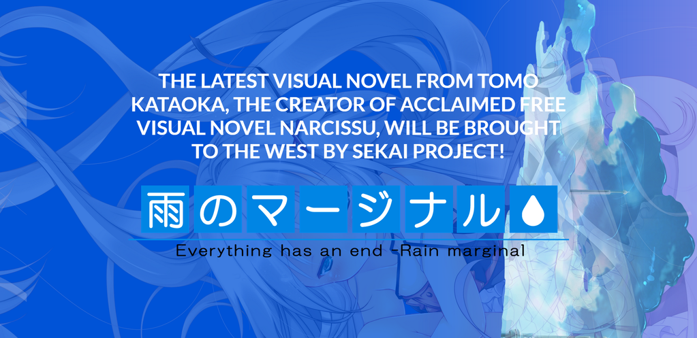

---
{
title: "Ame no Marginal Announced by Sekai Project",
tags: ["Sekai Project", "Visual Novel", "Visual Novels", "Translation", "Narcissu", "Stage-Nana", "Ame no Marginal"],
authors: ['reikaze'],
published: '2015-01-29T22:00:00-05:00',
attached: [],
license: 'cc-by-4',
oldArticle: true
}
---

 Regardless of what you think about Sekai Project and the way they handle things,
  they are an increasingly important part of the Visual Novel scene and have been rattling off tons of announcements as
  of late. Today, Sekai Project announced that they would be localizing <em>Ame no Marginal,</em> a game made by
  Stage-Nana (the same people who did <a class="sc-1out364-0 hMndXN sc-145m8ut-0 gIacKn js_link" data-ga='[["Embedded Url","External link","https://rockmandash12.kinja.com/rockmandash-reviews-narcissu-1st-2nd-visual-novel-1676683203",{"metric25":1}]]' href="https://rockmandash12.kinja.com/rockmandash-reviews-narcissu-1st-2nd-visual-novel-1676683203" rel="noopener noreferrer" target="_blank"><em>Narcissu</em></a><em>,</em> a game I
  liked quite a bit when I reviewed it).

<aside class="sc-1rh3ayr-6 jfFNjl inset--story branded-item branded-item--kinja" data-commerce-source="inset">

<a class="sc-1out364-0 hMndXN js_link" data-ga='[["Permalink page click","Permalink page click - inset headline"]]' href="https://rockmandash12.kinja.com/rockmandash-reviews-narcissu-1st-2nd-visual-novel-1676683203" rel="noopener noreferrer" target="_blank"><h6 class="sc-1rh3ayr-3 jRIPES">
    Rockmandash Reviews: <i>Narcissu 1st &amp; 2nd </i>[Visual Novel]</h6></a>

I spend a lot of time talking about being attached to a story and why it’s important.
      Today on…
<a class="sc-1out364-0 hMndXN sc-1rh3ayr-0 kOvmIi js_readmore inset--story__readmore js_link" data-ga='[["Permalink page click","Permalink page click - inset read more link"]]' href="https://rockmandash12.kinja.com/rockmandash-reviews-narcissu-1st-2nd-visual-novel-1676683203" rel="noopener noreferrer" target="_blank">Read more</a>

</aside>
 Not much details are available yet, but through an <a class="sc-1out364-0 hMndXN sc-145m8ut-0 gIacKn js_link" data-ga='[["Embedded Url","External link","http://www.reddit.com/r/visualnovels/comments/2u42g7/im_agilis_tler_for_narcissu_12_and_other_vns/",{"metric25":1}]]' href="http://www.reddit.com/r/visualnovels/comments/2u42g7/im_agilis_tler_for_narcissu_12_and_other_vns/" rel="noopener noreferrer" target="_blank">AMA with one of the translators from Sekai Project</a>, we've learned
  that Ame no Marginal is in the same vain as Narcissu: an utsuge with a similar tone, which is all good news to me.
  It'll be available on steam for $9.99 in mid-late 2015, with preorders starting now. You can expect a review coming
  from me in the future.

<iframe allowfullscreen="" autoresize="true" class="core-inset" data-recommended="false" data-src="https://anitay.kinja.com/ajax/inset/iframe?id=twitter-560882994202689536&amp;autosize=1" frameborder="0" height="217" id="twitter-560882994202689536" mozallowfullscreen="mozallowfullscreen" scrolling="no" src="https://anitay.kinja.com/ajax/inset/iframe?id=twitter-560882994202689536&amp;autosize=1" webkitallowfullscreen="webkitAllowFullScreen" width="500"></iframe>

