---
{
	title: "Ani-TAY Summer 2014 Seasonal Overview",
	published: "2014-10-13T12:00:00-04:00",
	tags: ["Ani-TAY", "Summer 2014", "Seasonal Overview", "Good", "Bad", "Collaberation", "Thoughts", "TAY-Classic"],
	kinjaArticle: true
}
---

Every season, we here on Ani-TAY do a list of [Anime that You Should be Watching](https://anitay.kinja.com/the-twelve-anime-of-summer-2014-to-watch-1620574151) around the middle of the season, an article type that we blatantly stole from [Richard Eisenbeis](http://kotaku.com/the-five-anime-of-summer-2014-you-should-be-watching-1619958660). While this article is an awesome collaboration and it's a great help for those people interested in the currently airing anime, it's not perfect. There are a few gripes with the typical seasonal anime coverage that I (Rockmandash12) want to address with this article.

[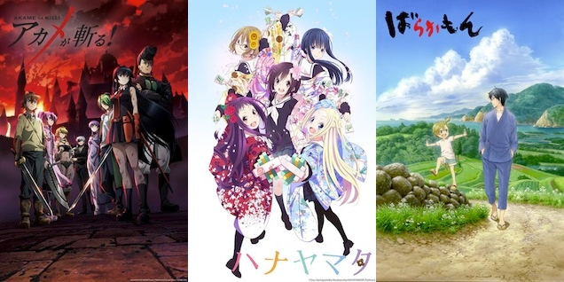](https://anitay.kinja.com/the-twelve-anime-of-summer-2014-to-watch-1620574151)

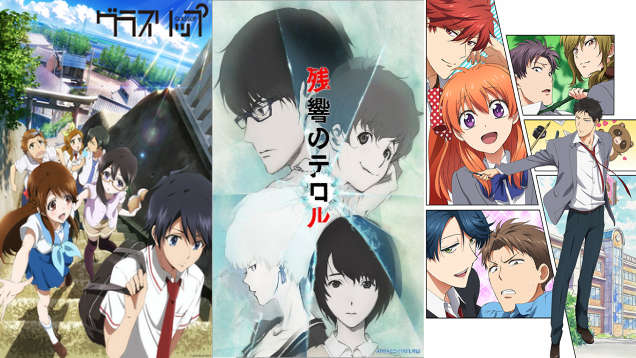

First of all, all of these articles are written in the beginning/middle of the season, thus they are usually speculative about the quality of the show overall. Many shows at the time of writing those articles that are great, but then they take a nosedive later on, or vice-versa. Because of this, articles like Anime Worth Watching rarely portray the season as is at the end, so an end-of-season overview like this would be a bit more helpful.

Second, most of the anime articles only talk about positives. One misconception is that anyone who watches anime enjoys every show… and that couldn't be farther from the truth. However, considering that people generally only talk about positives may shape that viewpoint. Anime *can* suck, and I don't think we should shy away from the negatives when we talk about it. By talking about the negatives of a season, you get a better image of what the season is like overall.

Last but not least, while these collaboration articles are good at suggesting shows to seasonal anime viewers, I don't think they are that helpful for those who don't watch anime on a seasonal basis. By getting a grasp of everything in the season, I think viewers can make a more informed decision on what they would like to watch, not just what we would recommend.

Well, now the explanation is done, this is the Ani-TAY Summer 2014 Seasonal Overview, and I hope you find it helpful :)

***

### Shows You Should Avoid Watching

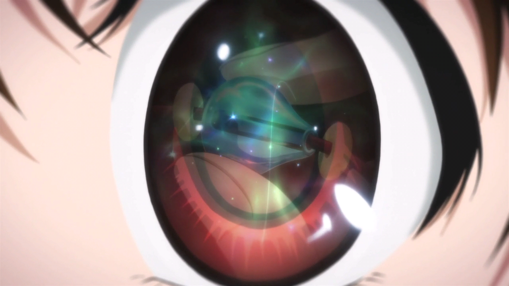

**Shows:** [*Glasslip*](https://anitay.kinja.com/glasslip-ani-tay-review-and-discussion-1641880502), *Argevollen*, *Persona 4 Golden*

<video src="./capk2urs0lu3gs0sidk9.mp4"></video>

**Description:** The shows in this category are shows that have very little redeeming factors. They may do some things right, but the overall experience is just such a pain that you should stay away from them. Usually, shows in this category were either were a pain to watch, were extremely boring, or just were a waste of time. NOTE: There are quite a bit more shows that should be here, but these at least are worth mentioning while those excluded aren't.

**Justification & Thoughts:** [*Glasslip*](https://anitay.kinja.com/glasslip-ani-tay-review-and-discussion-1641880502) is a show that originally showed promise; it was a beautiful show with a great soundtrack that looked like it was going to be an entertaining slice of life. However, what we got was a show that did nothing and was a mess when it came to the story it wanted to do. Viewers came away largely wondering whether they had actually watched anything happen at all.

*Argevollen* is a mecha that decided it didn't want to do anything unique; it's a dull mecha that doesn't even try to make the viewer interested in it, and *Persona 4 Golden* is just *Persona 4: The Animation* squished into 12 episodes instead of 24, so there's no real reason to watch it unless you really want to see the new animation and/or the added Marie scenes and such.

***

### Obligatory Fanservice Shows of the Season

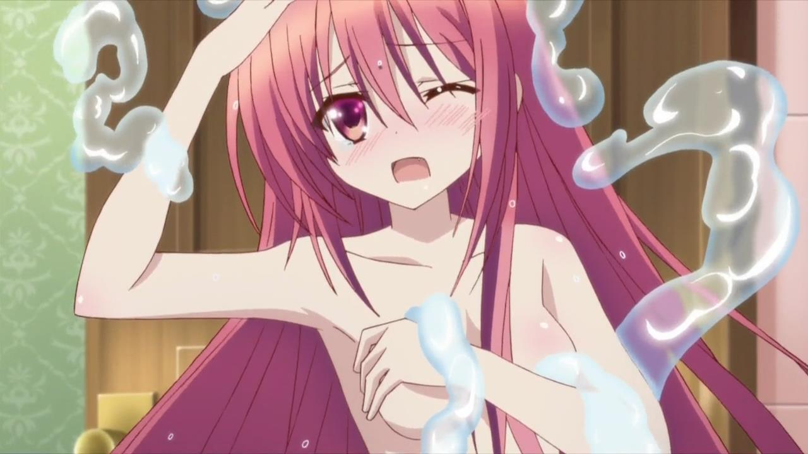

**Shows:** *Bladedance of the Elementalers*, *Rail Wars!, Momo Kyun Sword*

**Description:** Anybody who's watched anime for an extended period of time should know these shows; the shows that the most notable parts of these shows are how much much skin they show. Sometimes, they can be decent shows that are ruined by this, other times, they are just shows that are made for it.

**Justification & Thoughts:** *Bladedance of the Tsunderementlers* could have been a good show… Unfortunately it's coated in a layer of fanservice (naked lolis are dumb) which takes away from what it's trying to do. Underneath the fanservice is a pretty solid fantasy story with an interesting backstory for our main character, but there's another issue: the rest of the cast cast is annoying and is an overload of tsundere.

If you do not like Boobs and Trains, don't watch *Rail Wars!*, as that's all it has to offer; that said, if you're a straight male who grew up on Thomas the Tank Engine, it won't do much for you either. *Momo Kyun Sword* is supposed to be a gender swapped version of a Japanese folk tale, but all it has is boobs… and it ruins the show.

***

### Average Shows of the Season

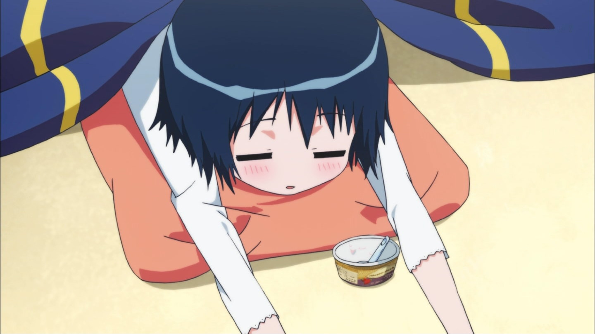

**Shows:** *[*Invaders of the Rokujyouma*](https://anitay.kinja.com/invaders-of-the-rokujyouma-rockmandashs-ani-tay-revi-1639945045)*, Locodol, Magimoji Rurumo, Tokyo ESP

**Description:** These are shows that while enjoyable, have flaws that keep it from being good. Sometimes they have great moments and really bad moments making the whole thing just average, and other times they're just average overall.

**Justification & Thoughts:** [*Invaders*](https://anitay.kinja.com/invaders-of-the-rokujyouma-rockmandashs-ani-tay-revi-1639945045) was a show that started off strong with great comedy and a decent premise, but turned into your typical harem show and had a bit too much drama.

Any show with a Muv-Luv reference is worth watching in my eyes, so I (Rockmandash12) watched Locodol… for a reference. What I got was a cute, wannabe idol show that was entertaining, but it didn't do anything great.

*Magimoji Rurumo* is an average magical girl show with some really enjoyable moments (Case in episode 6 ;-;) but was held back by a perverted lead and a lack of focus (dropping earlier plot lines, and a lack of consistency between episodes).

*Tokyo ESP* is *Copyright Infringement: The Animation*… the whole concept seems like it was ripped out of X-men. I thought it was entertaining enough with decent characters, but it didn't really do anything special. On the other hand, manga readers might be disappointed with changes to characterizations, designs and thematic arcs, such that a fairly unusual and entertaining manga has become a rather bland anime devoid of any of the quirkiness and humor that made the series stand out.

***

### Controversial Shows of the Season

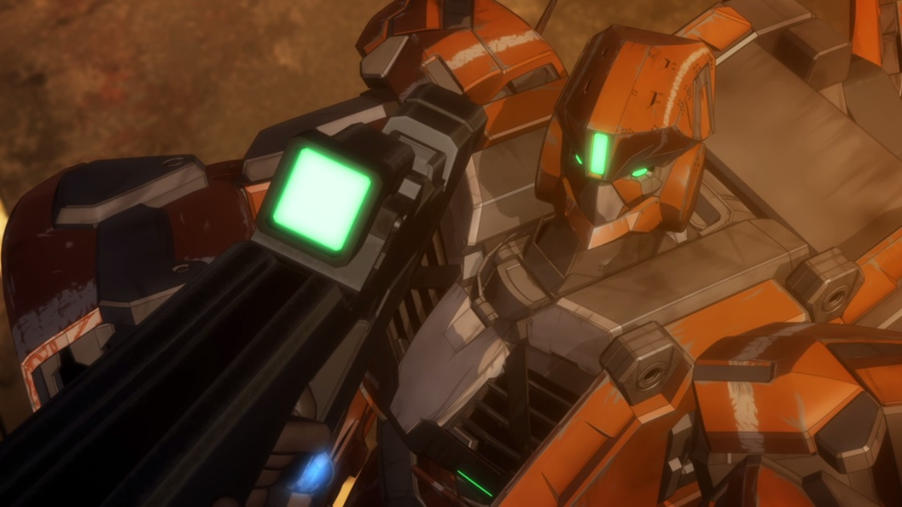

**Shows:** [*Akame Ga Kill*](https://kotaku.com/why-i-can-t-bring-myself-to-enjoy-akame-ga-kill-1641986983), [*Aldnoah.Zero*](https://anitay.kinja.com/aldnoah-zero-the-ani-tay-review-1637330529), [*Zankyou no Terror*](http://anitay.kinja.com/terror-in-resonance-the-ani-tay-review-1640199423)

<video src="./q37zcoxtcwrpdk9xgttp.mp4"></video>

**Description:** When half of the community says it's shit, then the other half singing praise, we know we have a controversial show on the plate. These are shows that the opinion varies widely, and these are the shows we tend to spend our times discussing.

**Justification & Thoughts:** [*Akame ga Kill*](https://kotaku.com/why-i-can-t-bring-myself-to-enjoy-akame-ga-kill-1641986983) is a faithfully-adapted show that can be interesting, but it kinda shoots its foot by failing to transition from drama to comedy. However, if one is looking for a slightly edgier shounen series in which no character is safe and the villains are given ample screen time, then view at leisure.

[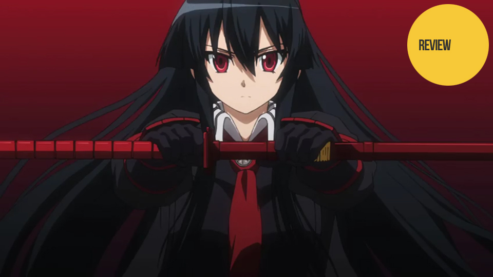 ](https://kotaku.com/why-i-can-t-bring-myself-to-enjoy-akame-ga-kill-1641986983)

[*Aldnoah.Zero*'s](https://anitay.kinja.com/aldnoah-zero-the-ani-tay-review-1637330529) been the main topic of debate with a wide gamut of viewpoints [(It's been so prominent that Koda's review got translated into chinese!](http://bangumi.tv/subject/topic/5042)), as it's a well-animated Gen Urobuchi show that many praised for a "unique and fresh take on the Mecha genre", but it unfortunately took many bad turns as it progressed. Personally, I (Rockmandash12) thought it was horrible since the start, but that's just my thoughts. It does have a lovely score though, so listen to that instead.

While [*Zankyou no Terror*'s](http://anitay.kinja.com/terror-in-resonance-the-ani-tay-review-1640199423) one of the best looking and sounding shows of the season, some parts of the story just aren't up to par sadly. It's still worth a watch, but the more critical you are, or more times you watch it, flaws will begin to show through.

***

### Holdouts from the Spring Season

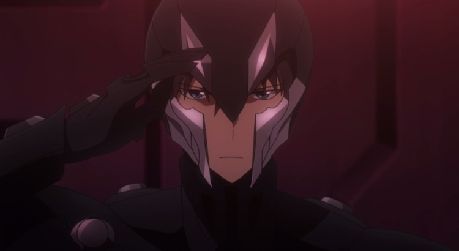

**Shows:** *Captain Earth*, [*Haikyuu!!*](https://anitay.kinja.com/haikyuu-the-ani-tay-review-1637543181), *The Irregular at Magic High School*

<video src="./zhytwu1s2gxz0oufifxo.mp4"></video>

**Description:** Typically, Anime coverage usually doesn't cover the shows from last season, so it leads these holdout shows in a bit of predicament. These are the shows in the awkward position without reviews yet but are not really covered because they aren't in the season.

**Justification & Thoughts:** *Captain Earth* is a Bones mecha, which means the plot makes absolutely no sense. It's a beautiful show with entertaining slice of life though, so depending on the person you are, you may like it.

[*Haikyuu!!*](https://anitay.kinja.com/haikyuu-the-ani-tay-review-1637543181) is a well done volleyball anime with entertaining comedy, great cinematography and emotional manipulation. If you are into sports anime, this is a must watch.

If you ever found Kirito of *Sword Art Online*'s infallibility irritating, prepare to have said irritation quadruple while watching *The Irregular at Magic High School*. Due to the fact that the Irregular has an insane amount of exposition, it can leave the viewer bored. Additionally, the show spends a lot of time praising the stoic Tatsuya (Atomic Japanese Magical Batman!), which gets tiring. Furthermore, the series does nothing to compensate in terms of plot, with only lackluster events taking place.

***

### Popular Shows of the Season

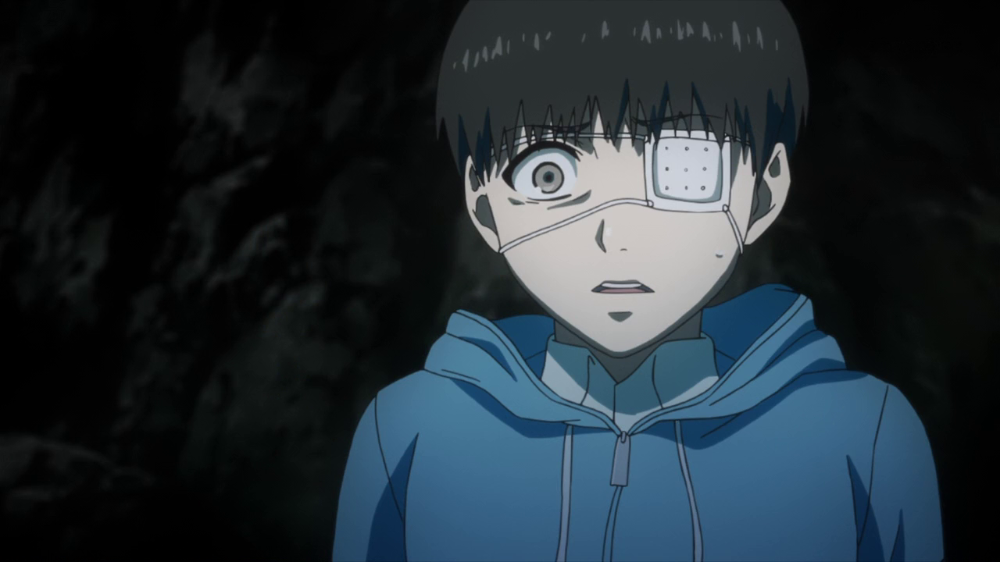

**Shows:** *Free! Eternal Summer*, [*Sword Art Online 2*](https://kotaku.com/sword-art-online-returns-strong-as-a-cyberpunk-murder-m-1644688244)**,** [*Tokyo Ghoul*](http://anitay.kinja.com/tokyo-ghoul-the-ani-tay-review-1636678069)

<video src="./g2mdvduxbwr1gxwptlig.mp4"></video>

**Description:** Typically, there are very few shows that are actually popular. Based on the activity of a community like Ani-TAY, you'd guess that some shows would be well known, but because something is discussed about doesn't mean it's popular. Most anime fans don't watch seasonally, and only a few shows in a season actually get watched by these anime fans. These are the shows that you could go up to a random stranger in an anime con and talk about.

**Justification & Thoughts:** Free! Eternal Summer appears to be exactly like season 1 at the beginning; nothing but a silly sports show about guys who like to swim that doesn't take itself seriously, but it starts to actually develop it's characters (from what I've heard. Haven't seen it yet - Rockmandash12).

[*Sword Art Online 2*](https://kotaku.com/sword-art-online-returns-strong-as-a-cyberpunk-murder-m-1644688244) will probably have as many supporters and detractors as the first season did, but there is a marked improvement in all areas, particularly characterizations and pacing, though the latter does sometimes drag. With the addition of Sinon—an ace sniper in the Gun Gale Online MMO—the first arc of this new season depicts the repercussions of past traumas on the psyche in a surprisingly deep manner. If you are, however, looking to cure an Asuna-deficiency induced by Alfheim Online, you will have to wait until the second major arc that begins in November.

While fans of the manga might complain about the streamlining and excision of certain plotlines, taken alone [*Tokyo Ghoul*](http://anitay.kinja.com/tokyo-ghoul-the-ani-tay-review-1636678069) is a well-wrought series with some superb voice-acting and animation. It details the dilemmas of Ken Kaneki as he adapts to his life as a flesh-eating ghoul following a dubious transplant. Using this conceit to explore the everyday struggle for survival in a harsh world, as well as the implications for ghouls trying to retain their humanity as they descend further into the abyss, *Tokyo Ghoul* makes for a disquieting yet worthwhile watch.

***

### Sequels of the season

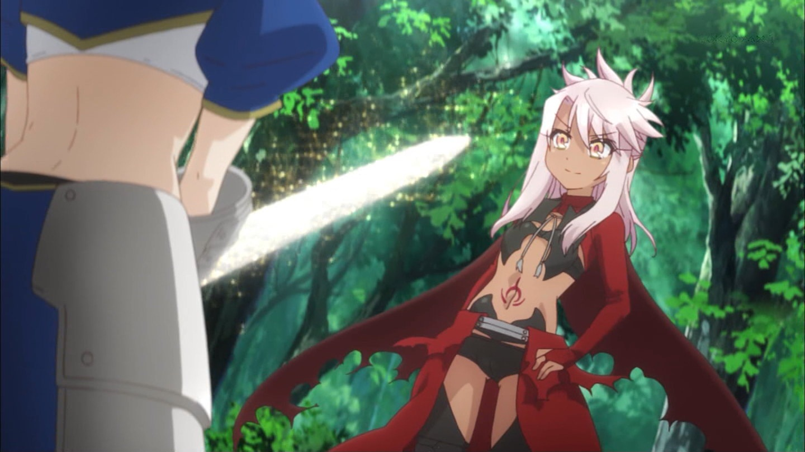

**Shows:** [*Fate/illya*](https://anitay.kinja.com/rockmandash-reviews-fate-kaleid-liner-prisma-illya-m-1630868385), Free! Eternal Summer, [*Hanamonogatari*](https://kotaku.com/hanamonogatari-is-little-more-than-two-hours-of-philoso-1625437663), *Re:Hamatora, Sword Art Online 2, Yamishibai 2*

<video src="./zy7ec4huhklyhwmpicqi.mp4"></video>

**Description:** Every now and then, we get shows that are popular enough that they get sequels. This category is just that… shows that got a second season or are sequels to existing shows.

**Justification & Thoughts:** [*Fate/illya*](https://anitay.kinja.com/rockmandash-reviews-fate-kaleid-liner-prisma-illya-m-1630868385) is an oddity. It's a magical girl spinoff show in the Fate universe that's much more lighthearted than many shows in the Fate series, but it slowly starts to drift in the direction of Type-Moon writing the further the show goes along.

[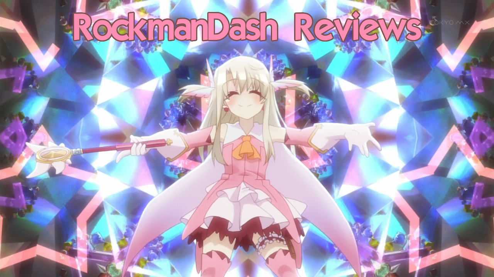](https://anitay.kinja.com/rockmandash-reviews-fate-kaleid-liner-prisma-illya-m-1630868385)

[*Hanamonogatari*](https://kotaku.com/hanamonogatari-is-little-more-than-two-hours-of-philoso-1625437663) is a 5 episode show crammed into one 2 hour marathon, and it's more Monogatari. It's enjoyable as always, but it's a lot of dialogue to slog through that's hard to pay attention to, and it's missing some of the humor Monogatari is known for.

*Re:Hamatora* faces the difficulty of being the much-improved sequel to a relatively unpopular and mediocre anime. With emphasis shifting somewhat to the supporting cast of the first season, a few neat character twists, and a more focussed plot, this continuation of the superpowered detectives' story justifies watching the first season, but do not expect greatness.

Yamishibai 2 is a series of shorts, each no longer than an average song, based off of various Japanese horror stories and urban legends, animated in a style that mimics the kamishibai method of storytelling (think of puppet theater, but with paper characters instead). However, overall I (The Messiah) felt that this season was quite a bit weaker than the first. It just felt like the shows were less interesting and scary overall, with some of them being nothing more than an modern Aesop's Fable. (One of the messages that's put across is very obviously, "Don't plagiarize or say work that isn't your is kids!")

***

### Shows that Were Solid Overall

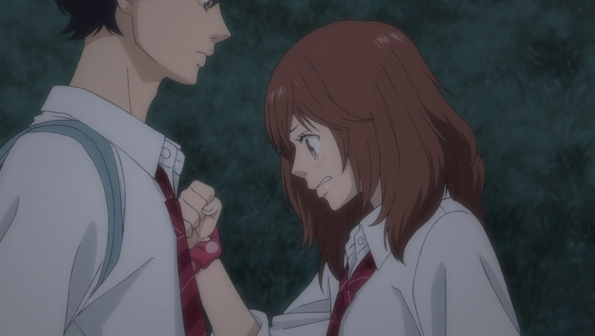

**Shows:** [*Ao Haru Ride*](https://anitay.kinja.com/ao-haru-ride-rockmandashs-ani-tay-review-1631496186), [*HaNaYaMaTa*](https://anitay.kinja.com/hanayamata-the-ani-tay-review-1639781820), [*Sabagebu!*](http://anitay.kinja.com/sabagebu-the-ani-tay-review-1638485806)

<video src="./dicfytey8cm98ql8fktc.mp4"></video>

**Description:** These are enjoyable shows that stay enjoyable the whole way through, but they may have one or two issues that keep it from being truly amazing or recommendable to everyone.

**Justification & Thoughts:** [*Ao Haru Ride*](https://anitay.kinja.com/ao-haru-ride-rockmandashs-ani-tay-review-1631496186) is a shoujo. A really good one, but a by the books shoujo, with all the shoujo tropes in place. Production I.G. did a great job with handling the story and the presentation to make the show enjoyable, but the show isn't really original in any way.

[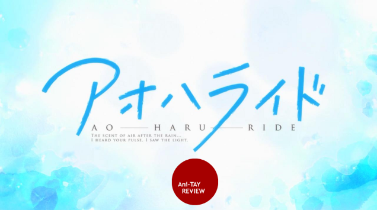](https://anitay.kinja.com/ao-haru-ride-rockmandashs-ani-tay-review-1631496186)

[*HaNaYaMaTa*](https://anitay.kinja.com/hanayamata-the-ani-tay-review-1639781820) is unabashedly sweet with beautifully animated characters and dancing, spates of amusing dialogue, and a message of friendship. Yet beyond that, the series provides a compelling tale of overcoming and accepting one's deficiencies, as well as an array of deeper human emotions, such that a simple story about five young girls' desire to dance yosakoi can be appreciated and enjoyed by all.

[*Sabagebu!*](http://anitay.kinja.com/sabagebu-the-ani-tay-review-1638485806) provides one of anime's most petty, narcissistic and totally hilarious protagonists in recent memory. Conned into joining the all-female Survival Game Club, Momoka joins a host of equally amusing characters in their antics, all of which provide over-the-top sight gags, pratfalls and every comedic variation of schadenfreude available. Aided by the single greatest narrator in all of anime, whose commentary is just as hysterically funny as the events he is describing, Sabagebu! is on a singular mission to provide as much entertainment as possible. Mission complete.

***

### The Must Watch Shows of the Season

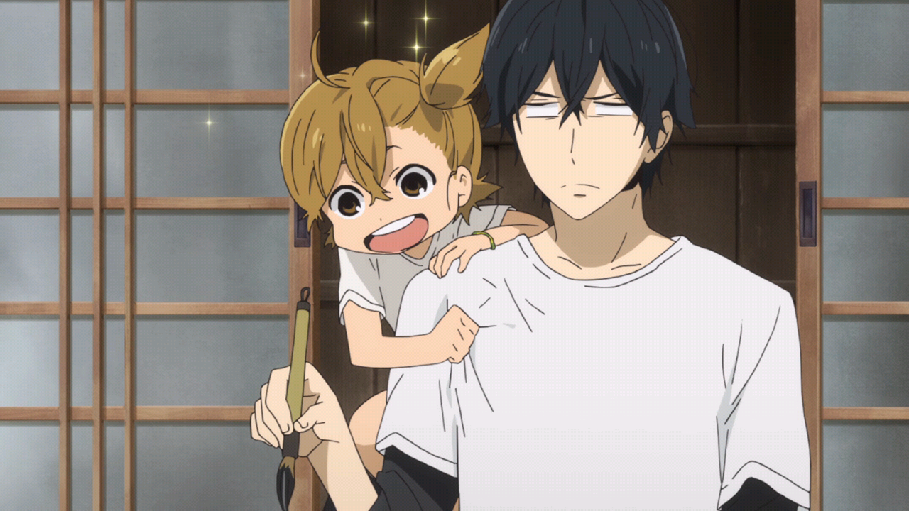

**Shows:** [*Barakamon*](https://anitay.kinja.com/barakamon-the-ani-tay-review-1642020651), [*Gekkan Shoujo Nozaki-Kun*](http://anitay.kinja.com/gekkan-shoujo-nozaki-kun-rockmandashs-ani-tay-review-1634657276)

<video src="./gqkz1jld16pp3pvrxfiu.mp4"></video>

**Description:** Sometimes, there are shows that just blow you away. They are always entertaining, have great writing, and they execute their goals extremely well. These are must watches of the season, and these are the shows that will be remembered by fans long after the season passes.

**Justification & Thoughts:** [*Barakamon*](https://anitay.kinja.com/barakamon-the-ani-tay-review-1642020651) is a show that's well written, hilarious, and memorable. It has great character development, interesting interactions, a well written story, great pacing, and amazing comedy… and it's hard to beat this combination. Personally, I (The Messiah) loved Barakamon due to how similar it felt to the more light-hearted portions of Persona 4, one of my top 10 games of all time, and I (Rockmandash12) loved it because the character development reminded me of one of my favorite animes of all time, Welcome to the NHK. So if you liked Persona 4 and are looking for more humorous romps in a small-village setting, this is THE show to see.

Long after you have finished [*Nozaki-kun*](http://anitay.kinja.com/gekkan-shoujo-nozaki-kun-rockmandashs-ani-tay-review-1634657276), you will find yourself still recalling and chuckling at its jokes and characters. If that isn't mark of a great comedy, then I (NomadicDec) clearly have no idea what humour is. There is a cathartic element to Nozaki-kun as well, for if you have ever been frustrated at the prevalence of shoujo tropes, prepare to laugh to a hilarious sendup of them all.There are innumerable moments that made Nozaki-kun a joy to watch each week and I could extol the virtues of this series all day, but I'm just about to rewatch episode one. For the third time.

***

### Overall Thoughts on the Season

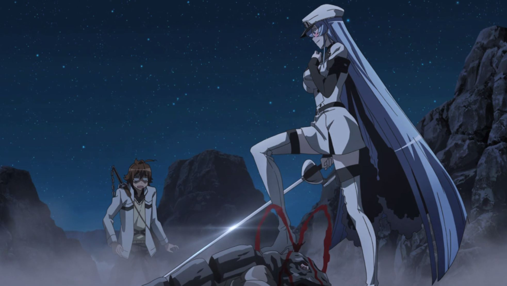

**Rockmandash12:** Overall, I thought this season was pretty meh in general. While the comedies of the season were great, and stayed strong the whole way through, there were many shows that just fell into mediocrity that could have been better, like Zankyou no Terror. Most of the shows I watched were average, but there were some shows that just got on my nerves. Here's hoping next season will be better.

**The Messiah:** While I didn't see too many shows this season as this was the first one I actually jumped into, overall I have to agree with Rock about the mehness (word of the day) of this season. Especially due to how many shows I'll be watching Fall season from the get-go compared to this one. However, Tokyo Ghoul and Baraka(Obama)mon more than redeems this season for me personally. I really can't wait for Tokyo Ghoul part 2, and will most likely be one of the first to get Barakamon on Blu-ray. They're just that good.

**NomadicDec:** It was a mediocre season overall, with many seemingly promising anime series quickly degenerating into a bland state or else becoming outright awful. Honestly, even just a few short weeks after the end of the summer season, most of the series that I watched have blurred or faded from memory aside from the gems of comedy that we were lucky to see this season. Thus, I was able to laugh and not despair. However, if evidence for the importance of independent initiatives such as Under the Dog were ever needed, this season is it.

***

*This article was written by Rockmandash12, NomadicDec & The Messiah. If you are interested in some of these shows, most of these shows are availble for streaming on *[*Crunchyroll*](http://www.crunchyroll.com/)* and *[*Funimation*](http://www.funimation.com/)*. If there's a show that we missed that you think should be here, it's probably missing because nobody working on the article saw it. Sorry about that, will try to do better next season.*
