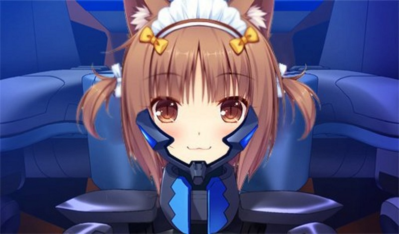
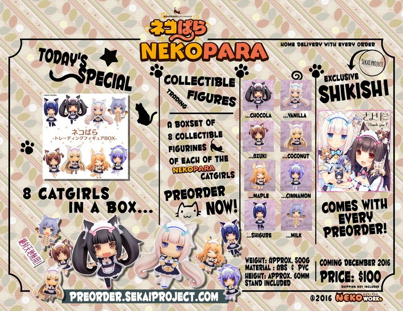
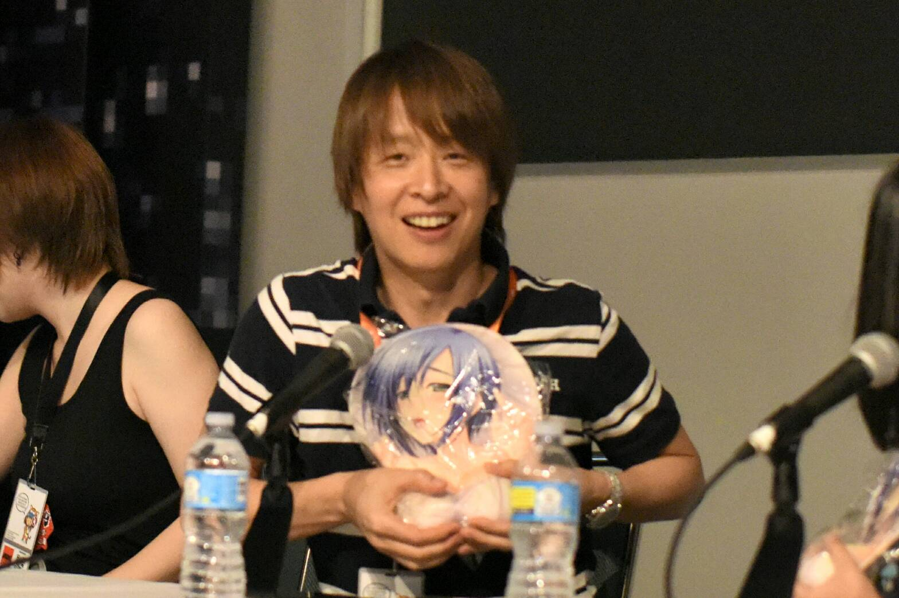

---
{
  title: "AniTAY At AX - The Nekopara /Sayori Panel AKA Fun Times w/ Yoshimune-san's Trolling",
  tags: ["AniTAY", "AX 2016", "Muv-Luv", "Nekopara", "Sekai Project", "Deciga"],
  published: "2016-07-06T20:08:00-04:00",
  attached: [],
  license: "cc-by-4",
  oldArticle: true,
}
---

This certainly was a Sayori panel, but not so much a <em>Nekopara</em> panel.
  Days in advance Deciga announced they’d be crashing this panel, and they did it in a glorious fashion. We got some
  interesting facts, some cool announcements, and lots of trolling. 

<strong>FYI: </strong>During
  this panel there was no photo or video available, so I’ll just be using stock footage or footage the Sekai Project
  people took. Thanks for understanding.

It was weird to see, but they got their Q &amp; A up really quick, with the
  translator giving us an interesting introduction by saying it doesn’t matter (he apparently works for licensing),
  something we all think but would never say. The Q &amp; A started pretty quick as well, going straight to bait
  questions but it was fun nonetheless. Here’s the transcription for your amusement (everything’s paraphrased, I can
  type fast but not as fast as speech).

<strong> Q:</strong> What’s your favorite cat
  girl? <strong>A:</strong> Cinnamon. (<em>AKA YOUR WAIFU WARS ARE POINTLESS :P</em>)  <strong>Q: </strong>Are
  you going to make a volume 3? Are there going to be scale figures?  <strong>A:</strong> Yes there is a volume 3 in
  production. (The Crowd goes wild) In terms of scale figures, it determines how mini figures do.... (the
  mini-figures haven’t been announced)  <strong>Q:</strong> Considering you started doujin, why did you get into
  industry? You announced Nekopara Live, is it going to be a real game?  A The only real reason is because she
  wanted to participate in Comiket (lol). As for Nekopara live, it was an april fools joke, but they are working on a
  nekopara VR game.

 <strong>Q:</strong> will there be game on Shigure? (The translator facepalms)

<strong>A:</strong> Sayori-san is interested as long as she can get it “involving”
  Shigure.

 From what I can tell, Sayori-san seems like a great person, and the crowd as
  awesome as before (most of the SP people got kicked out so it was an insane rush in) but what can be taken most from
  it is that the Q &amp; A was full of information (even leaking some announcements before they happened) which is
  always nice to see. They moved to actual announcements where they announced the mini figures and a Nekopara anime
  Kickstarter, which was exciting, but then it was time for crashing.  Yoshimune-san (The creator of Muv-Luv)
  crashed the panel with grace and the panel switched from a Nekopara to Muv-Luv. Yoshimune-san started off talking
  about the fact that he came to AX before thanks to Bamboo over at Mangagamer, and every time comes he’s impressed by
  the passion of fans. He then went into history on Muv-Luv, mentioning it originally came out in 2004, with alternative
  in 2006, and SM in 2010 (Game 2015 &amp; anime 2016). Yoshimune-san then explained the reason why he’s talking about
  Muv-Luv at a Sayuri/Nekopara panel was because Sayori has a history with Muv-Luv, doing art and doujin to the point
  that she eventually got hired by Age, the company that makes the series. (we got to see some of the art, and
  Yoshimune-san was pointing at the “assets” in a hilarious manner) 

Then on out was
  a back and forth discussion between Sayori-san and Yoshimune-san, with trolling all over the place. First was teasing
  about a Kiminozo Kickstarter (but little did the people in the room know that Deciga announced the rights to localize
  the game), then teasing a Kiminozo remake with Sayori art, saying that we should all spam Sayori-san’s twitter for it
  to happen. Yoshimune-san then mentioned that one reason Sayori-san was here was because of VR, and that a
  collaboration would be interesting, like having Nekopara girls beating up BETA. The translator facepalmed, and we all
  laughed.

From BETA in maid outfits to “research purposes”, “the proper way to hold a boob
mousepad” and Nekopara Alternative, the rest of the panel was lots of fun and lots of laughing, a whole hour of
Yoshimune-san poking fun at the material and Sayori-san herself. The panel wasn’t really a source of news, but many
people there were engrossed and entertained by Sayori-san’s past and Yoshimune-san’s humor. It was a fun time to
behold and I’m glad I was able to experience it.

<em>You’re reading Ani-TAY, the anime-focused portion of
  Kotaku’s community-run blog, Talk Amongst Yourselves. Ani-TAY is a non-professional blog whose writers love everything
  anime related. Click </em><a class="sc-1out364-0 hMndXN sc-145m8ut-0 gIacKn js_link" data-ga='[["Embedded Url","External link","http://anitay.kinja.com/",{"metric25":1}]]' href="http://anitay.kinja.com/" rel="noopener noreferrer" target="_blank"><em>here</em></a><em> to check us out. If you want
  to read more of my writing, check out </em><a class="sc-1out364-0 hMndXN sc-145m8ut-0 gIacKn js_link" data-ga='[["Embedded Url","External link","http://rockmandash12.kinja.com/",{"metric25":1}]]' href="http://rockmandash12.kinja.com/" rel="noopener noreferrer" target="_blank"><em>RockmanDash Reviews</em></a><em>
  and </em><a class="sc-1out364-0 hMndXN sc-145m8ut-0 gIacKn js_link" data-ga='[["Embedded Url","External link","http://kmtech.kinja.com/",{"metric25":1}]]' href="http://kmtech.kinja.com/" rel="noopener noreferrer" target="_blank"><em>KMTech</em></a><em>.</em>

