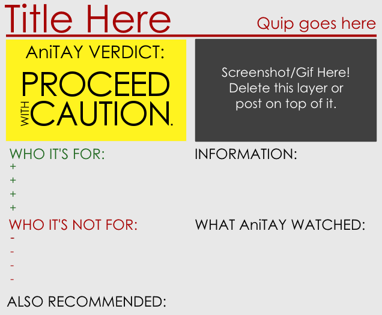
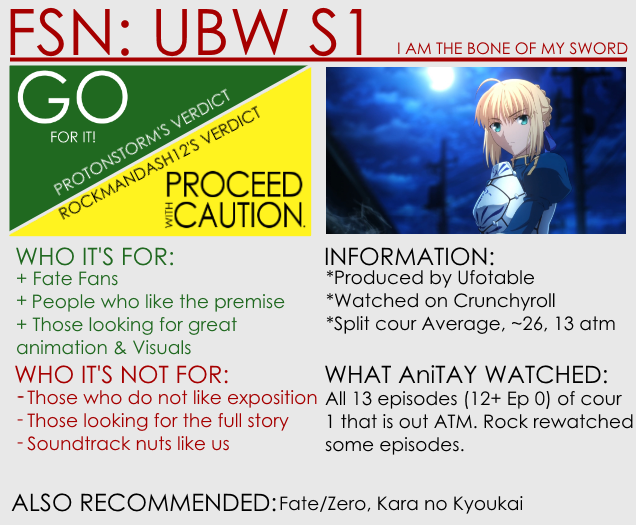
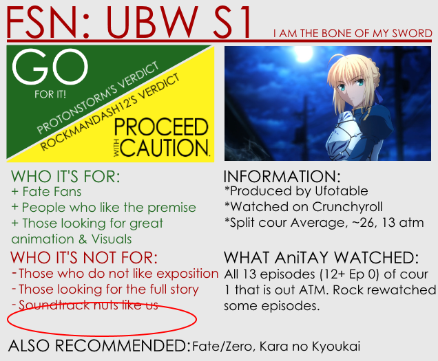
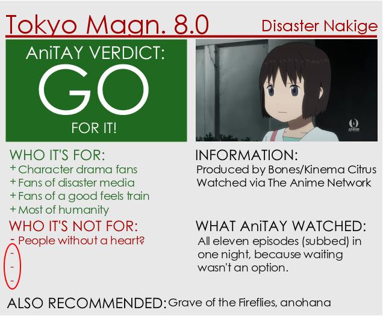
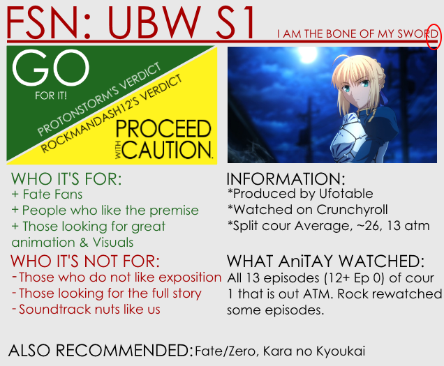
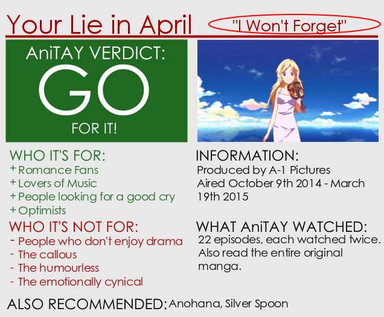
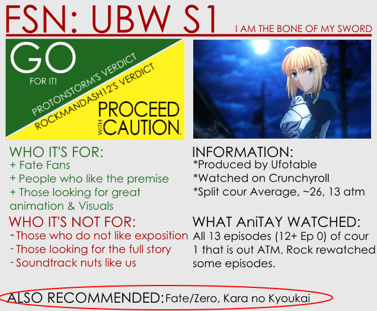
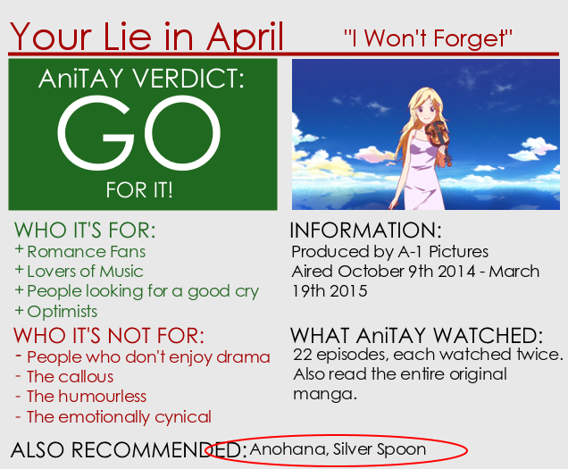
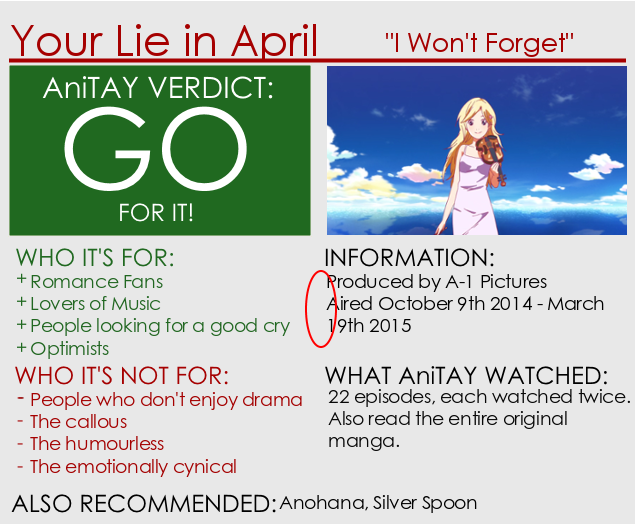

---
{
  title: "​AniTAY PSA: Review Card Etiquette",
  tags: ["PSA", "AniTAY", "Assets"],
  published: "2015-03-21T01:18:00-04:00",
  attached: [],
  license: "cc-by-4",
  oldArticle: true,
}
---

As of late, I've noticed that some have been making some mistakes with the <a class="sc-1out364-0 hMndXN sc-145m8ut-0 gIacKn js_link" data-ga='[["Embedded Url","External link","http://anitay.kinja.com/the-updated-anitay-review-system-1676140651",{"metric25":1}]]' href="http://anitay.kinja.com/the-updated-anitay-review-system-1676140651" rel="noopener noreferrer" target="_blank">Review Card </a>(or
  at least really deviating from how I originally intended it to be), so I thought I'd clarify some points. Probably my
  fault because I never really specified it, but might as well now.

I'll be doing this by
  comparing two different review cards: One of them is the review card from the <a class="sc-1out364-0 hMndXN sc-145m8ut-0 gIacKn js_link" data-ga='[["Embedded Url","External link","http://anitay.kinja.com/fate-stay-night-unlimited-blade-works-s1-ani-tay-revie-1677058631",{"metric25":1}]]' href="http://anitay.kinja.com/fate-stay-night-unlimited-blade-works-s1-ani-tay-revie-1677058631" rel="noopener noreferrer" target="_blank"><em>Fate/stay night Unlimited Blade Works Season 1 Review</em></a>, and one of them
  is a pre-release card I snagged from Mdubs' review of <a class="sc-1out364-0 hMndXN sc-145m8ut-0 gIacKn js_link" data-ga='[["Embedded Url","External link","http://anitay.kinja.com/your-lie-in-april-the-ani-tay-review-1691904314",{"metric25":1}]]' href="http://anitay.kinja.com/your-lie-in-april-the-ani-tay-review-1691904314" rel="noopener noreferrer" target="_blank"><em>Your Lie in April</em></a>
  when I was helping him edit it, but the final version is different than this one, so keep that in mind.

See any differences? Well, there are a few points I would like to point out: 

<ul class="sc-1lmbno3-0 dpuHif" data-style="Bullet" data-type="List">
<li><strong>1. If you don't use all the signs, delete them. </strong> </li>
</ul>
This one isn't exactly an issue on the YLIA card, but this is probably the most
  obvious deviation and one of the more common issues on the review cards. I put all of them there for ease of use, but
  didn't expect people to include them when they didn't need them... so yeah! If you aren't using them, wipe them out.
  Here's a comparison with <a class="sc-1out364-0 hMndXN sc-145m8ut-0 gIacKn js_link" data-ga='[["Embedded Url","External link","http://anitay.kinja.com/tokyo-magnitude-8-0-the-ani-tay-review-1677232000",{"metric25":1}]]' href="http://anitay.kinja.com/tokyo-magnitude-8-0-the-ani-tay-review-1677232000" rel="noopener noreferrer" target="_blank">Tokyo Magnitude 8.0</a>.

<ul class="sc-1lmbno3-0 dpuHif" data-style="Bullet" data-type="List">
<li><strong>2. Make sure the Title is all the way to the left on the bar and right above it. Make sure the quip is all
    the way to the right of the bar and above it. The Title should be larger in font than the quip. </strong></li>
</ul>

In my example, both of them get the title right, being all the way to the left, but
  the quip is way off on the YLIA proto card, being nowhere near the right. Also, a few things I'd like to see but
  aren't really required: Originally when I made these assets, I made it with the title being all caps, because it looks
  sharper, as seen in <a class="sc-1out364-0 hMndXN sc-145m8ut-0 gIacKn js_link" data-ga='[["Embedded Url","External link","http://i.kinja-img.com/gawker-media/image/upload/s--jOmvD5g2--/ftcjxz526du0r8cdrrvm.png",{"metric25":1}]]' href="http://i.kinja-img.com/gawker-media/image/upload/s--jOmvD5g2--/ftcjxz526du0r8cdrrvm.png" rel="noopener noreferrer" target="_blank">Durarara</a> card, but it's fine with
  lower case ones as well. Also, I imagined it so the text would be large like in the FSN card, but that can run into
  issues with longer names... notice how YLIA's text is smaller? That's fine too, but make sure it's bigger than the
  quip. 

<ul class="sc-1lmbno3-0 dpuHif" data-style="Bullet" data-type="List">
<li><strong>3. Make sure the recommendations at the bottom is aligned with the <em>Also Recommended </em>bit</strong>
</li>
</ul>

It just looks sharper that way. having it a little up like some may accidentally
  have just throws it off. 

<ul class="sc-1lmbno3-0 dpuHif" data-style="Bullet" data-type="List">
<li><strong>4. Put asterisks before the text under the <em>Information </em>header</strong></li>
</ul>
This one's pretty minor so it's totally optional (actually, pretty much all of this
  is optional, but it helps with consistency), but I think it makes it look a lot nicer. 

Well, that's about it! If any other deviation comes up, I will
  update this post to clarify the issues that will be stated. FYI, I have no way to enforce this, so this is all
  voluntary, but I would love to see everyone take these steps to help make the card a bit more professional and more
  cohesive. Thanks in advance!

<strong>If anyone wants to talk about this PSA, or anything about this, just shoot
  me a message via Skype or my email Kevinmai813@gmail.com. I'm always willing to clarify any issues you are having, or
  anything involving the assets. Thanks for reading!</strong>

