---
{
	title: "AniTAY Reviews: Fate/stay night: Unlimited Blade Works",
	published: "2015-07-07T11:00:00-04:00",
	tags: ["The Ani-TAY Review", "AniTAY", "Fate/stay night", "Rockmandash Reviews", "Type Moon Marathon", "Tayclassic"],
	kinjaArticle: true
}
---

<video src="./1330439161839783717.mp4"></video>

**RockmanDash12:** Welcome to the *Fate/stay night: Unlimited Blade Works* AniTAY review, this time covering the whole show instead of just the first cour like we did with the other [AniTAY review of *Fate/stay night: Unlimited Blade Works*](http://anitay.kinja.com/fate-stay-night-unlimited-blade-works-s1-ani-tay-revie-1677058631). While I already wrote my personal thoughts on my own [review](http://rockmandash12.kinja.com/fate-stay-night-unlimited-blade-works-tv-is-beautifu-1642722982#_ga=1.260370888.473183827.1418699279) of the series, I thought it would be best if we had a discussion review for the entire show due to the complexity that is the Nasuverse, and how many people deal with it.

**RockmanDash12:** With me today are two people with a completely different perspective than I have with the Nasuverse. Along with me, your VN obsessive Type-Moon nut, we have Grex, who started with the [Deen](http://rockmandash12.kinja.com/rockmandash-reviews-fate-stay-night-2006-anime-1497715875#_ga=1.4962422.473183827.1418699279) [adaptations](https://rockmandash12.kinja.com/rockmandash-reviews-fate-stay-night-unlimited-blade-w-1710413335#_ga=1.4962422.473183827.1418699279) then fell in love with [*Fate/Zero*](http://anitay.kinja.com/grexs-fate-zero-review-1703148815#_ga=1.206147926.473183827.1418699279).

**Grex:** Salutations.

**RockmanDash12:** And joining us like last time is Protonstorm, who saw only [*Fate/Zero* ](http://rockmandash12.kinja.com/rockmandash-reviews-fate-zero-ani-tay-1538163593#_ga=1.230807642.473183827.1418699279)before jumping into *Fate/stay night: Unlimited Blade Works*.

**Protonstorm:** Hey guys.

**RockmanDash12:** So, that’s everyone here, let’s jump into this! I think the best place to start off would probably be the reason most people are watching this, the visuals.

***\*Note: There are spoilers for both Fate/stay night and Fate/Zero, You have been warned.\****

<video src="./1330439162149343269.mp4"></video>

**Grex:** What is there even to say? They’re fabulous.

**Protonstorm:** The folks at ufotable are amazing, their attention to detail is fantastic.

**RockmanDash12:** The production values in this show are seriously insane. While some people may not think it’s the best looking because they aren’t a big fan of the aesthetic design overall, you can’t deny that they did a great job with the production of it.

**Grex:** The use of lighting and effects, even beyond the stellar animation itself, never failed to leave me stunned.

**Protonstorm:** I would say that the aesthetic design choices are obviously a very subjective area of discussion, it can hardly be argued that the production using those design choices is top-notch though.

**RockmanDash12:** yeah, I really just adored the way this show looked, from the scenery to the way that the magic looks in general.

**Grex:** Oh man, I had forgotten about the gorgeous backgrounds and environments.

**Protonstorm:** Definitely, it’s also worth mentioning that I personally enjoyed the direction ufotable took the aesthetic design, and thus also loved the way the magic was animated.

**RockmanDash12:** So, I take that as we’re all in agreement that this show looks great, in the aesthetics, animation, etc. I just have to ask though, what were your guys thoughts on the most striking aspects of visuals to most people, the fight scenes?

<video src="./1330439162258629669.mp4"></video>

**Grex:** Of course, they were visually awesome, but I loved how fast the fights could get, in comparison to *Fate/Zero*. It really hammered home how superhuman the Servants are, for me.

**Protonstorm:** The fight scenes were glorious. I know that there was a complaint floating around about perceived brevity in the scenes, but I greatly enjoyed what was there, the details put into the magic and other abilities of the opponents made them quite the spectacle to watch.

**RockmanDash12:** I personally think they could have been longer, but that’s just me. Visually though, they’re pretty much everything I dreamed of after seeing the VN. So good.

**RockmanDash12:** Anything else to add about the visuals?

**Protonstorm:** Nothing much on my part. Calling them quite excellent about sums it all up, in my mind.

**Grex:** Hah, same here. I don’t have much else to say on the animation front. It’s ufotable. That really speaks for itself.

**RockmanDash12:** I guess we should be moving on then. Before we jump into the story, let’s round up the presentation with the sound of this show. Thoughts?

**Protonstorm:** I actually thought that the soundtrack was quite well done and mostly just lacked in proper execution within the show. I have listened through the entire album multiple times, and although some of the tracks sounded quite memorable, I couldn’t place near any of them in the series.

**Protonstorm:** For what it’s worth, I felt that the last couple of episodes executed the soundtrack significantly better than earlier portions of the show.

**RockmanDash12:** huh. When we did the first cour review, I stated that it was the disappointment of the year for me. While it has improved, i’m still pretty disappointed.

**RockmanDash12:** The last few episodes really nailed it, and all the insert songs were just great, but I couldn’t really care less about the soundtrack itself, even if i’ve listened to it by myself.

**RockmanDash12:** It’s too subdued.

**Protonstorm:** I agreed with you at the time, but that was before the official release of the soundtrack, and hearing it on its own made me realize that there were a treasure trove of missed opportunities in its tracks that could have been used during the show to greater effect.

**Grex:** I agree with Proton. Listening to the soundtrack online, there were several tracks that I really liked on their own, but I couldn’t remember them being used to any real effect in the show.

**Grex:** It wasn’t a matter of soundtrack quality, it was a matter of use.

**Protonstorm**: Definitely.

**RockmanDash12:** The usage was a joke. There were long stretches of time without music where they really should have had music, and they never really used it to it’s full potential.

**RockmanDash12:** But I still think that the music, especially if you compare it to the rest of the Nasuverse is meh.

**Protonstorm:** I pretty much agree that the usage in general was terrible, although I do think that the final couple of episodes managed to pull of decent moments with the soundtrack. Soundtrack aside though, the opening theme for this cour as well as the insert song in episode 20, both sung by Aimer, were absolutely amazing both for their raw quality as well as their cinematic execution in the series.

**Grex:** Totally agreed.

**RockmanDash12:** yup.

<iframe src="https://www.youtube.com/embed/byPofX1IEZY"></iframe>

**Grex:** I was so worried when I found out they wouldn’t be using Lisa’s version of This Illusion (from the first season’s finale) for the new opening, but I ended up liking Brave Shine a lot.

**RockmanDash12:** If they used This Illusion as the new opening, I would have been the happiest person out there.

**RockmanDash12:** While I think This Illusion fits the overall work better, Brave Shine is a bit more fitting for the image of modern Type-Moon, and this adaptation so I don’t really mind.

**Protonstorm:** As a matter of principle I don’t mind the usage of Brave Shine as opposed to This Illusion, because this is ufotable’s take on the series and while This Illusion would have been a wonderful choice as well, the fact that they went with a new and, in my opinion, excellent song as the opening theme instead is a choice that I would hardly begrudge them for.

**Grex:** On the opposite end from the opening, I thought Kalafina dropped the ball on both credits themes.

**Grex:** They weren’t bad per se, but they felt lacking.

**Protonstorm:** Absolutely, coudn’t agree more. I felt like the second one in particular was lacking.

**RockmanDash12:** Agreed here as well. They didn’t stand out like Kalafina tracks typically do and I didn’t really feel compelled to listen to them. I’m one of the biggest Kalafina fans, but I really did not care for them at all.

**Protonstorm:** I think it was a matter, in part, of the tonal dissonance in the second track to the actual mood of the show it was supposed to be the ending theme for. It felt more like a church choir performance than an ending to a battle for the world. There was also significantly less interesting usage of the vocalists at Kalafina’s disposal than previous tracks. While I do think that ufotable managed to partially salvage it with the animation incorporated during the song’s inclusion, I do really think that they were poor and that Kalafina was the party primarily at fault for it.

**RockmanDash12:** yeah.

**RockmanDash12:** so, overall, mixed on soundtrack: it’s an improvement from S1 with some nice surprises but it’s still pretty wonky at times, especially with execution.

**Protonstorm:** Pretty much.

**Grex:** One more thing to say about the soundtrack.

**Grex:** It was great that they used the Emiya theme, not once, not twice, but thrice.

**RockmanDash12:** It was nice to see the VN tracks in there, unlike S1 where **THEY WERE COMPLETELY ABSENT**.

**RockmanDash12:** The usage of the music at the end, especially Emiya (what insane person would do UBW without it???) was pretty much my difference between average and good in regards to the show itself, and it tipped the needle to the right side.

**RockmanDash12:** Any other thoughts?

**Grex:** Uh, the voice acting was solid, which is to be expected considering how long these actors have been voicing these characters. Otherwise, nothing else from me.

**RockmanDash12:** Yeah, it was pretty good, but like you’ve said, they’ve been doing these characters for a long time now, about 10 years. I guess we should be moving into the meat of this review, the story.... oh the story....

**Grex:** Do you want to start us off?

<video src="./1330439162673575717.mp4"></video>

**RockmanDash12:** Sure. I think they did a pretty bad job with the adaptation, as the story had pacing issues, writing issues, and the way that they presented the story in general.

**RockmanDash12:** While the events were pretty much the same and it was accurate, it didn’t have the feel that this route has in general, all the importance was lost, in my opinion.

**Protonstorm:** When you say that there were writing issues, what specifically are you referring to?

**RockmanDash12:** About the writing, it’s all about the details and little things about the work that were completely omitted.

**RockmanDash12:** They took down the monologuing that was so prevalent in the VN, the aspect that attached you to the characters and actually made you care about many of the aspects.

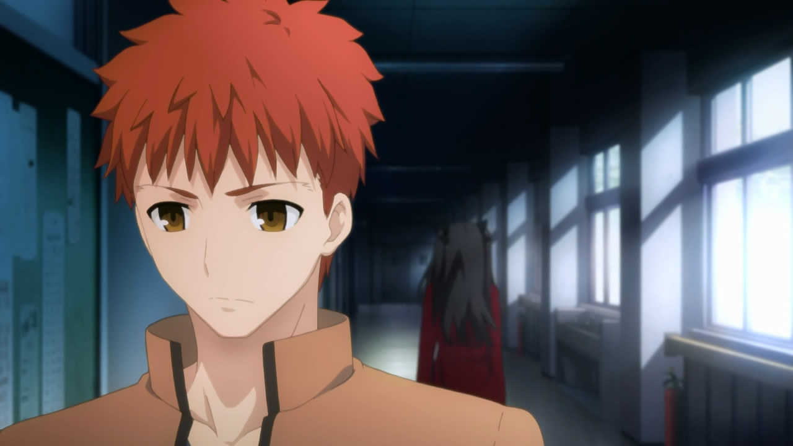

**Protonstorm:** So your primary concern in that respect are elements of the visual novel that were not included that you believe should have been?

**RockmanDash12:** I think it’s more about how they tell the story, not about how things are missing. The shift in perspective hurt the show, and I ranted on about it in my personal review quite a bit.

**RockmanDash12:** like, the story is still the same fighting to the death tournament for the holy grail war, but the focus was on Shirou in the VN, with his input on everything. The Anime doesn’t do that and it looses a lot of the “color commentary” to speak. it feels bland in comparison. It doesn’t have the feel of the original work that I fell in love with, and that really bothers me.

**RockmanDash12:** But, this is a [VN fan ](http://rockmandash12.kinja.com/rockmandash-reviews-fate-stay-night-visual-novel-1613176306)rambling, and you may feel completely different about it.

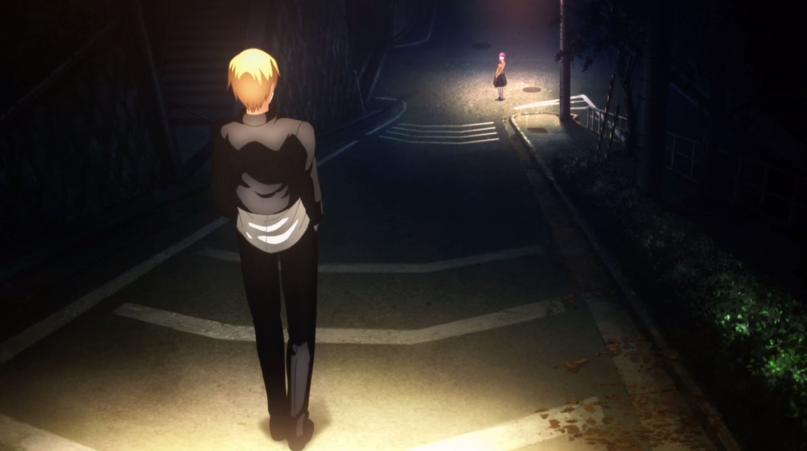

**Protonstorm:** I completely understand that viewpoint, although I honestly disagree. While there are other arguments to be made about the quality of the writing, I think that the shift in perspectives was something that translated to the anime very well, and I honestly think that for television as a medium it was a better choice than the internal monologuing of the visual novel, because although that works in a more text-based medium, in the anime I think it wouldn’t have worked as well and would have been more boring for most viewers as anime is a much more motion-oriented source of entertainment.

**Grex:** Even as someone who’s played the VN, I didn’t feel a lot of the story was missed in the adaptation process. Like Rock said, the basic events were all more or less present, and I guess that was enough for me. If anything, implementing things like more monologues would have adversely affected the already wonky pacing.

**Protonstorm:** Definitely, the pacing was definitely off, and I believe that the monologuing would have exacerbated the issue as well.

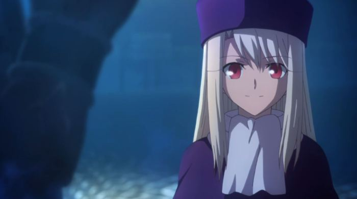

**RockmanDash12:** The pacing was just horrible. I think that it would have slowed it down, but it may have made the work more bearable. One particular example I think about when I talk about the monologuing is when Rin sees Saber for the first time, she comments on how she thought saber took her breath away due to her sheer beauty, but that type of commenting was pretty much gone. That being said though, the pacing is the bigger issue though... it’s so bad.

**Grex:** On that we can agree. Some scenes just bored me to tears, it felt like they were artificially stretching out certain moments just to end an episode a certain way or fit a fight into a specific timeframe of an episode.

**Protonstorm:** I think that the pacing is something that was almost universally agreed upon by all groups of viewers as being a severe issue in the show.

**RockmanDash12:** too slow at times, too fast at times, always ending at a poor spot... it’s a complete mess and it ruined the show for a lot of people.

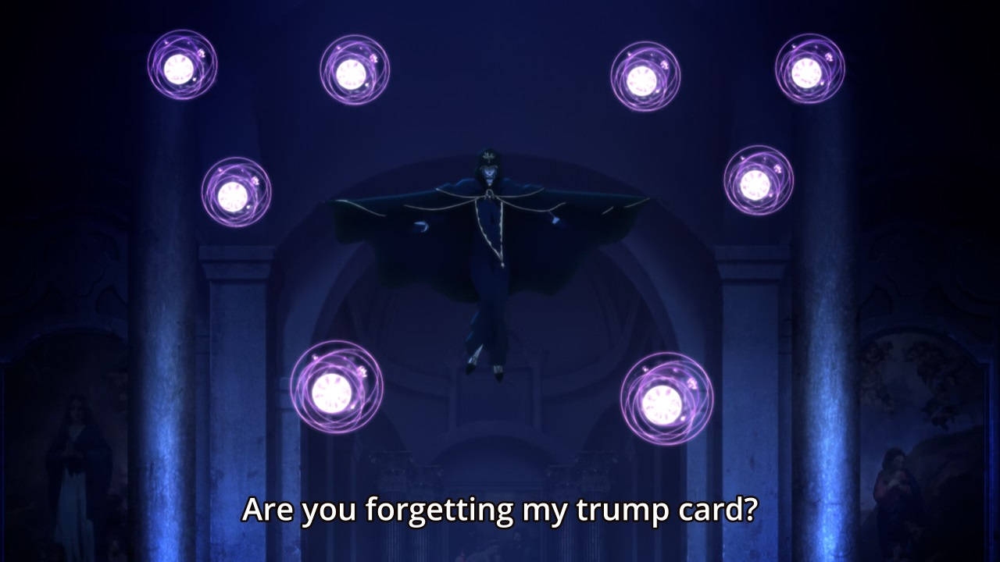

**RockmanDash12:** The VN is long. There’s lots of fluff. They could have cut things here, they could have told it to you with the same pace the VN did, but whatever approach you think is better, the way it was done wasn’t the way it should have been.

**RockmanDash12:** Plus, the serialization didn’t help, as the week wait was just painful...

**Grex:** I definitely plan to marathon the show at some point, because I feel like that could mitigate some of the pacing issues.

**Grex:** Especially because, as I saw it, the plot itself was handled reasonably well.

**Protonstorm:** On that subject, I do have a couple of friends who have done exactly that, marathoned the series after it ended, and neither of them had the same issues with the pacing, so it is likely that the issues would be at least partially resolved for future viewers purely because they will not have to wait a week between each episode.

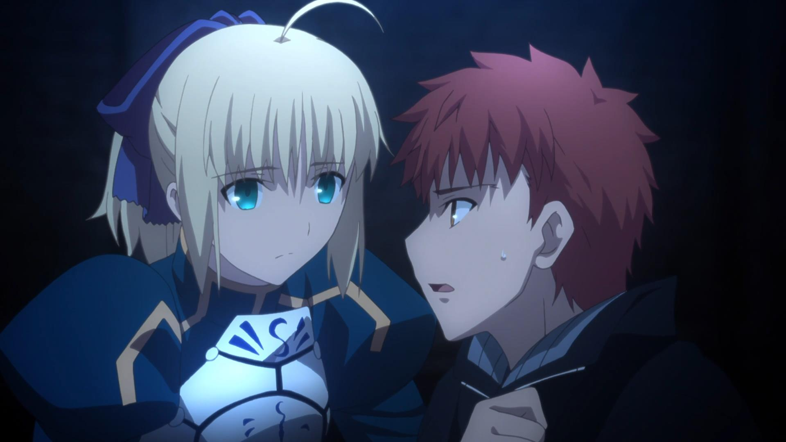

**RockmanDash12:** Other than the pacing, what were your thoughts on the story?

**Protonstorm:** I greatly enjoyed the story, and have, to say the least, had very little in common with the complaints of many of the original visual novel fans with it.

**Protonstorm:** Which of course makes sense, as I have not played the visual novel. I believe that *Fate/stay night: Unlimited Blade Works* is an anime whose story is perfectly acceptable to anime fans who like similarly styled works.

**Grex:** Likewise, I have a handful of friends that saw the series without reading the visual novel (though all had seen *Fate/Zero*) and they thought the story was great.

**Grex:** As for me, my main issues with the story actually stemmed from the source material. There were just some conveniences that happened to allow the story to continue.

**Grex:** Things like Gilgamesh letting the cast live for no good reason in the Einzbern mansion, Archer reappearing out of nowhere (and without much explanation) to save the day at the end, stuff like that irked me in both forms of the story.

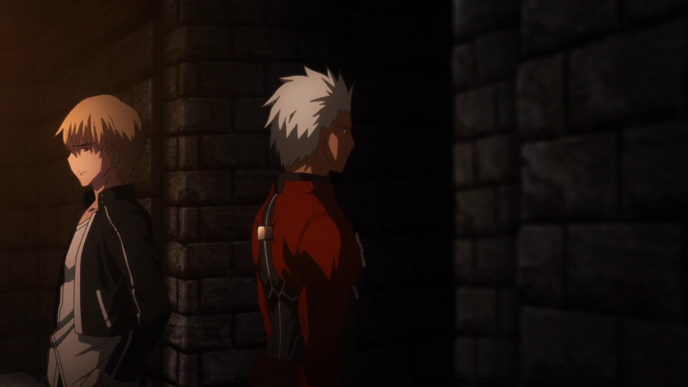

**RockmanDash12:** Yeah, the story does have it’s fair share of deus ex machinas.

**RockmanDash12:** most of my gripes lie with the way the story was told though, not the actual story itself.

**Protonstorm:** Yes, this so much. It was really difficult to maintain my suspension of disbelief, particularly for those two instances you named. In the end the story was still quite intriguing, but those points were both just lazy writing frankly, and I would have appreciated at least some attempt to even pretend there was a logical reason for them.

**Protonstorm:** Deus ex machina is a plot device (or lack thereof) that I find to be generally unacceptable outside of the premise and the occasional unique circumstance in some stories. These in F/SN do not fall under those exceptions.

**Grex:** Completely agreed. It’s a lazy tactic that does nothing but break your immersion in the story. I can easily think of at least four times UBW’s plot didn’t make complete sense just to make room for the story to continue.

**Grex:** So Rock, I guess I’m the opposite of you. I didn’t mind the presentation, but took issue with some aspects of the story itself.

**Protonstorm:** I fall under the same category as Grex here.

**RockmanDash12:** Well, so while I really didn’t like how the anime told its story but didn’t mind the issues with the story, Proton and Grex were the opposite. What were your thoughts on the characters, the developments, interactions etc?

 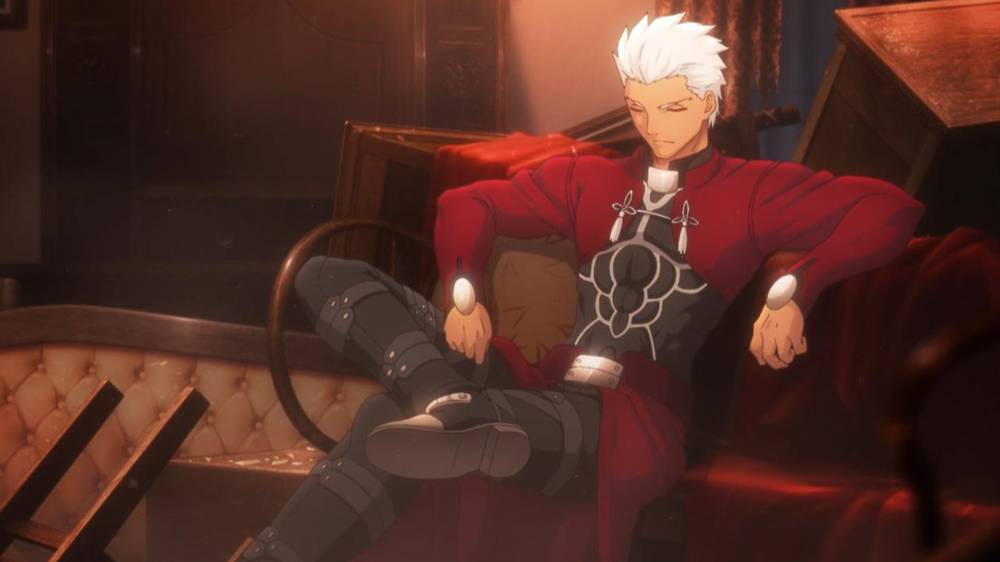

**Grex:** Might as well get one of the biggest points out of the way first, I’ve always liked the Archer twist. It adds a nice dynamic to both his and Shirou’s character, for obvious reasons.

**RockmanDash12:** Though, it wasn’t subtle at all. I felt like it was way more subtle in the VN.

**Grex:** I feel like I have trouble judging that because, knowing Archer’s identity, I took notice of all the hints, from the subtle to the extreme, and I’m not sure the uninformed viewer would have.

**RockmanDash12:** Well, I didn’t notice it until the actual reveal in the VN, and I know people in the AniTAY chat noticed it early on in S1.

**RockmanDash12:** What about you storm?

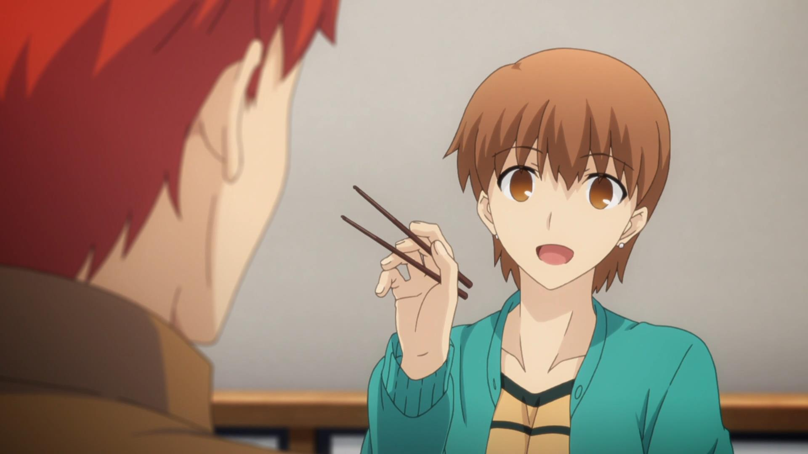

**Protonstorm:** I enjoyed the characters and their interactions, primarily because *Fate/stay night* offers a relatively unique opportunity by combining historical/mythological characters (who already have a certain level of established personality traits) with completely original characters, and this alone allows for a great diversity within the cast. This aside, I liked the characters and how they were written, because even characters such as Rin, who could easily be classified as a classic tsundere, feel intriguing because of the way they are used in the story. Even Shirou, who would normally have been a frustrating character for me personally due to his classic obsession with justice and doing what is right, was made more interesting because of how he was presented and, as Grex said, the Archer twist that augmented him as a character.

**RockmanDash12:** Yeah, I’m a big fan of the characters, but I think that’s kinda a given.

**RockmanDash12:** Rin = best girl.

**RockmanDash12:** ShirouXRin all day :P

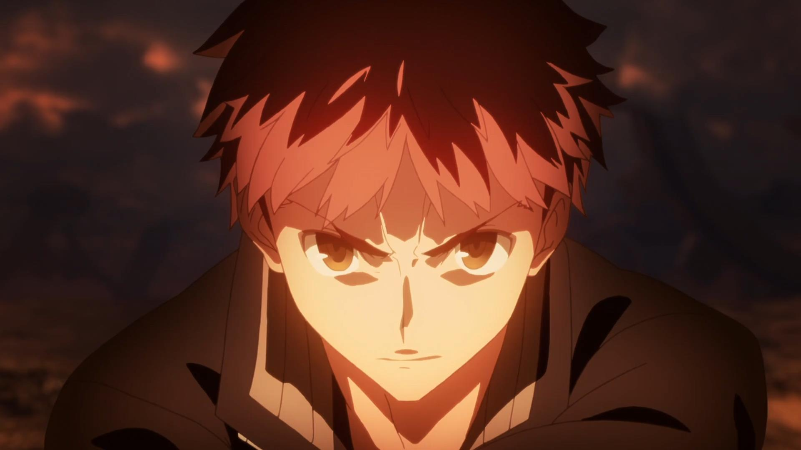

**RockmanDash12:** I think it’s really great to see people actually liking shirou, because this was pretty much his route, and I think the way they dealt with him was pretty briliant. That being said, I know a few people had issues caring about the characters, due to the adaptation. While most of them get development in other routes, (like Kirei, illya and Sakura in Heaven’s Feel) they may have been lacking here. Did you have any issues with that, storm?

**Protonstorm:** Basically, I see where the complaints are coming from. This is partially why I would say that watching Fate/Zero *before* F/SN is not a bad idea for this particular adaptation: most of the potential ‘holes’ in character development that would have otherwise been covered in other routes that were left unadapted were covered for me by *Fate/Zero*.

**Protonstorm:** That said, Sakura’s disappearance in the narrative still did feel slightly strange to me, personally.

**RockmanDash12:** Especially after seeing the shit she went through in F/Z. She’s pretty much a surprise if you’ve only seen F/SN, so look forward to that in HF, when that comes out.

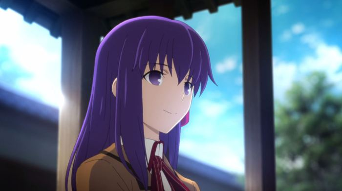

**RockmanDash12:** Overall though, it seems like we think the characters are pretty good?

**Protonstorm:** In general, yes. Definitely.

**Grex:** Yep. Proton covered a lot in his spiel, and I agree with all of it.

**RockmanDash12:** Yeah, and if you wanted more impressions on characters, you can always read the S1 review where we did go into more specifics about the characters.

**RockmanDash12:** Dated impressions, but impressions nonetheless.

<video src="./1330439165306828325.mp4"></video>

**RockmanDash12:** Now, here’s the fun part: we all have different impressions with the nasuverse, so I thought it would be interesting if we did a section where we talk about out overall thoughts about UBW(TV) and our thoughts in comparison to the nasuverse.

**RockmanDash12:** To give you a breakdown if you don’t remember what I said in the beginning of the review or want more specifics, our viewing history goes like this:

* **Grex:** FSN 2006 + UBW (Movie) ->F/Z -> VN -> UBW
* **Proton:** F/Z -> UBW
* **Rock:** VN -> F/Z -> The Entire Nasuverse, including Deen’s adaptations -> UBW (TV)

**RockmanDash12:** So, if anyone wants to start, just tell us overall thoughts on the show and where/why you would rank it in comparison to the rest of the versions/TM works you’ve seen.

**Grex:** I can start, I guess. Overall thoughts on the show, I liked it a lot, flaws and all. I was always looking forward to the next episode, despite any missteps along the way. For the anime-only viewer, I’d definitely recommend it over the film version, because that thing’s really a nigh incomprehensible mess for anyone that’s not already familiar with the story.

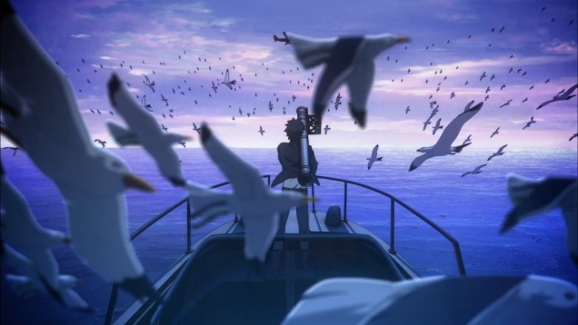

**Grex:** I do think it could disappoint the *Fate/Zero* fan, because it’s not at all “*Fate/Zero 2*”, like some might hope for. It’s still the Holy Grail War, but ultimately it’s a very different beast.

**Grex:** Much less an ensemble cast (with the focus being so heavily on Shirou), and the story isn’t nearly as dark, which are aspects that could have drawn the Zero fans to the franchise in the first place.

**Protonstorm:** Personally, I enjoyed both F/SN and F/Z greatly, but my personal favorite was F/Z. That is not AT ALL because F/SN was bad, but moreso because the style of writing for the story was one that I personally prefer. I also felt like the music was utilized better in F/Z, and there were far fewer plot holes in the writing, both of which contributed to me enjoying it more. That said, I believe that F/SN and F/Z were written in completely different directions, so generally speaking it feels to me more like personal preference is the primary factor in whether or not most people like one over the other, as opposed to either series actually being greater.

**Grex:** That’s a question I’ve asked myself, and I’m really not sure which series I prefer. I think it’ll take time and another couple viewings before I can come to a decision.

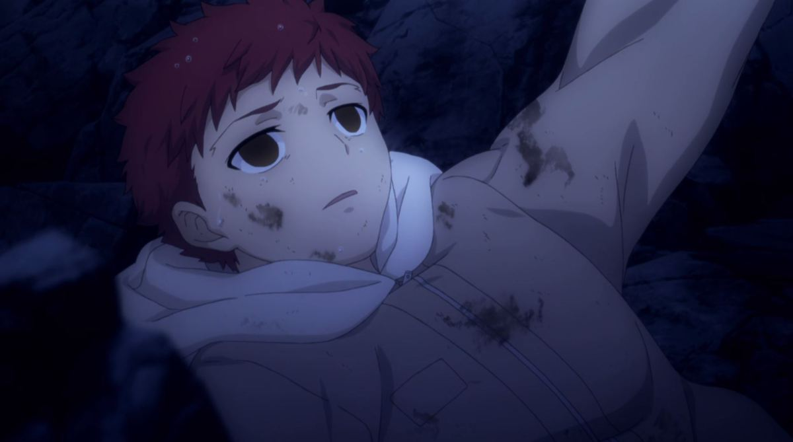

**RockmanDash12:** As for me? Like I’ve said many times in the past, I’m a type moon nut. I’m not super receptive of the anime as a whole, as I think the VN did a much better job with the story, handling the themes better due to the PoV, but the Anime does a decent enough job of adapting the work (much better than the 2010 movie) and if you’re an anime fan, it’s better than nothing at all. I just feel like it loses a lot of the reasons why I loved the story in the first place, and it definitely has issues, which really bum me out.

In comparison to the VN, no contest, but in comparison to F/Z, it’s pretty tricky. Anime wise, F/Z all the way because it was so much better thematically in its execution and the music just kicks F/SN’s ass. *Fate/Zero* was better handled, feeling like a more complete work, and that’s coming from a person who didn’t like *Fate/Zero* nearly as much as If you asked me my thoughts of F/SN vs F/Z overall though, I actually prefer the more personal, not as epic scale approach because it allows the viewer to get a better scope of the ideals, the core of the story.

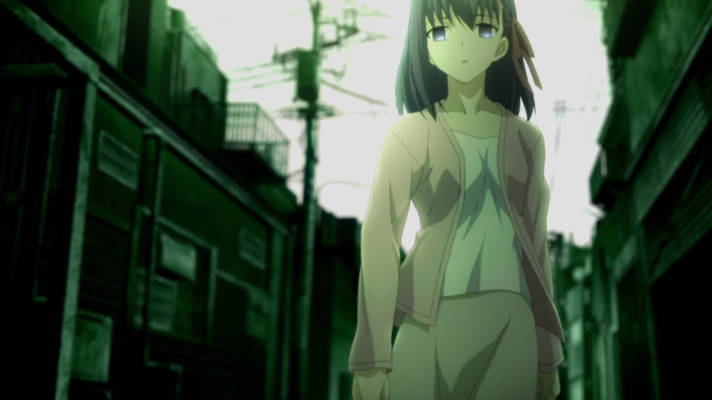

**RockmanDash12:** And for those bitching about the tone, *Heaven’s Feel*. That’s all I have to say.

**RockmanDash12:** It’s hard to answer which one people prefer, because it’s more of a question of which style they like.

**RockmanDash12:** but I think most people can agree that *Fate/Zero* was a better executed anime, right?

**Protonstorm:** I agree with that.

**Protonstorm:** That’s a good way to put it: F/Z works better in anime form than F/SN.

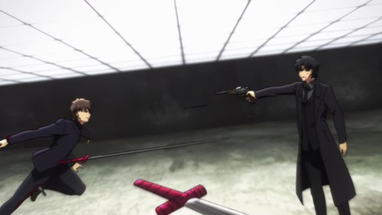

**RockmanDash12:** Just listen to the music back to back and you cannot deny that *Fate/Zero* did a much better job.

**RockmanDash12:** The whole work is kinda like that.

**RockmanDash12:** but Kara no Kyoukai is the best :P

**RockmanDash12:** So... conclusion time?

**Grex:** Sounds good to me.

**Protonstorm:** Yep.

 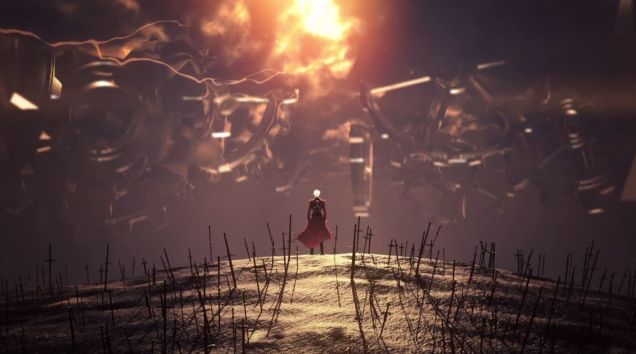

**RockmanDash12:** *Fate/stay night: Unlimited Blade Works* is an interesting anime. It does some things extremely well, but does some things horribly wrong.

**RockmanDash12:** Overall, I liked UBW, but was pretty much disappointed due to the execution.

**RockmanDash12:** At it’s core, it’s a great work, but the issues just get at you and overall, it just can’t stack up. Agreed?

**Grex:** True, it has flaws that perhaps prevent it from being truly great, but on the whole I found myself pretty entertained with UBW, probably thanks in large part to the visuals and characters.

**Protonstorm:** I enjoyed ufotable’s take on *Fate/stay night’s Unlimited Blade Works* route, and while there were definitely problems I would say that it was a very good anime overall and one that I would have no problem recommending to others.

**RockmanDash12:** Sounds like both of you would give the show a Go for It, right?

**Grex:** Indeed I would.

**Protonstorm:** Yeah, I would as well.

**RockmanDash12:** Well, I’m sticking with my proceed with caution, because some F/Z guys and Diehard VN fans like me may have a hard time enjoying the work. For everyone else though, Go For It: you’re getting great characters an interesting story, and just absolutely amazing visuals.

**RockmanDash12:** Anything else to add?

**Grex:** Can’t wait for *Heaven’s Feel*.

**Protonstorm:** ^

**RockmanDash12:** Hype!

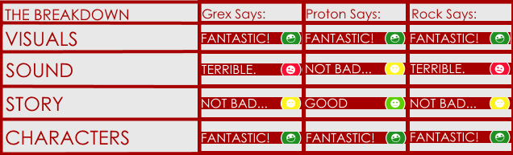 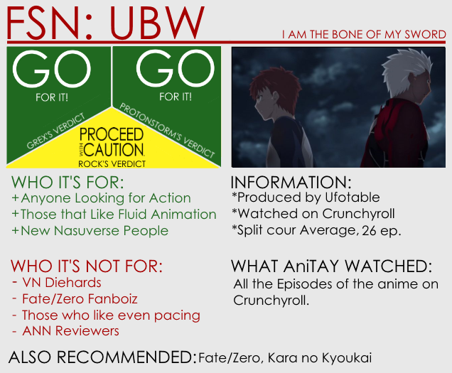
