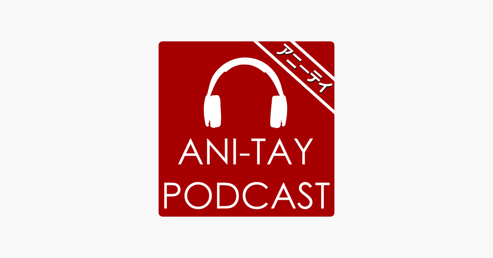

---
{
	title: "AniTAY Spoilercast #1: Your Lie in April",
	published: "2015-04-07T20:41:00-04:00",
	tags: ["Podcast", "AniTAY Podcast", "Your Lie in April", "Spoilercast"],
	kinjaArticle: true
}
---

Are you ready for an hour long lie in April? Well[,](https://ia601505.us.archive.org/8/items/podcast_20150408/podcast.mp3) get ready, because it’s here!

Welcome to the very first AniTAY Spoilercast! This is a new format for the AniTAY Podcast, where we spend a whole podcast talking about one specific show! I think it’s a nice medium between the laid back After Hours and the more serious main episodes, and with the community involvement from After Hours (we pull straight out of the chatroom), and the structure like the main episodes while differentiating itself by being totally about one show/work/etc. If everything goes according to plan, these spoilercasts should happen every month, with new people and new topics every time! Feedback would be very nice this time around as this is the first Spoilercast we’ve ever done :)

As the first sentence was hinting at, this episode was an hour spent talking about *Your Lie in April*! From general thoughts to discussion about the core themes of the show, this episode is a full on chat about a show many on AniTAY hold near and dear to their hearts, and like the name implies, there will be spoilers, so be prepared! Also, I apologize in advance for editing issues, still pretty new to this…

**Podcast**

As always you can either download the file or subscribe to us on iTunes!

Download MP3 [here ](https://ia601505.us.archive.org/8/items/podcast_20150408/podcast.mp3)(Right Click, Save Link as)

iTunes: [Click here](https://itunes.apple.com/gb/podcast/ani-tay-podcast/id852229181?mt=2)

YT and iTunes version will be up soon!
