---
{
	title: "AniTAY Winter 2015 Seasonal Overview",
	published: "2015-04-16T13:00:00-04:00",
	tags: ["AniTAY", "Tayclassic", "Observation Deck", "Winter 2015", "Winter", "Seasonal Overview", "Guide"],
	kinjaArticle: true
}
---

Every season, we here on AniTAY do a list of[ Anime that You Should be Watching](https://anitay.kinja.com/the-seven-anime-of-winter-2015-to-watch-1688346381) around the middle of the season, an article type that we blatantly stole from Richard Eisenbeis. While this article is an awesome collaboration and it's a great help for those people interested in the currently airing anime, it's not perfect. Welcome to the AniTAY Winter 2015 Seasonal Overview, the article series that is here to help those who don't watch seasonally see what's worth your time. If you want to see other Seasonal Overviews we've done, here's the [Fall 2014](http://anitay.kinja.com/anitay-fall-2014-seasonal-overview-1678636165#_ga=1.84156761.1523386611.1417386122) and [Summer 2014](http://anitay.kinja.com/ani-tay-summer-2014-seasonal-overview-1644181408#_ga=1.84156761.1523386611.1417386122) overviews.

***

# The Obligitory Fanservice Shows of the Season

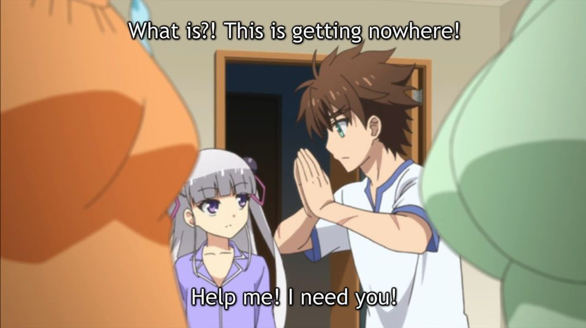

**Shows:** *Absolute Duo, Testament of Sister New Devil, Isuca, [*World Break*](https://anitay.kinja.com/world-break-aria-of-curse-for-a-holy-swordsman-the-a-1692916233), Fafnir*

**Description:** Anybody who's watched anime for an extended period of time should know these shows; the shows that the most notable parts of these shows are how much much skin they show. Sometimes, they can be decent shows that are ruined by this, other times, they are just shows that are made for it.

**Justification & Thoughts:** *Absolute Testament of Isuca Fafnir Break*is a harem, and as with all harems, chances are it brings along copious amounts of obscurely angled cameras, conspicuous wind, violating entanglements, ripped clothes, and most famously, trips into *cupped* positions with fellow cast members. This show is centered around one man and his magic-based trials set in his high school. Although he starts off as seemingly average, the true extent of his powers quickly take form. Our protagonist finds a way to stand out from the crowd from the get-go, as his good intentions have always been in place. However, this show starts its downfall when all the fanservice and cliché harem moments begin. The punchline of most jokes somehow stem from the protagonist being a pervert even though everyone else is mistaken, not everyone can see his good intentions because they are blinded by their own desires and are more concerned with winning the harem, and the most crucial moments in character development only happen when a girl is missing most of her clothes. Not to mention that there's one character that seems way too young to be involved in all of this. There are many things wrong here and in all, a show like this really doesn't stand out because there are many more that are just like it, and frankly, this one is near the bottom of the hierarchy.

***

# **The Gag Shows of the Season**

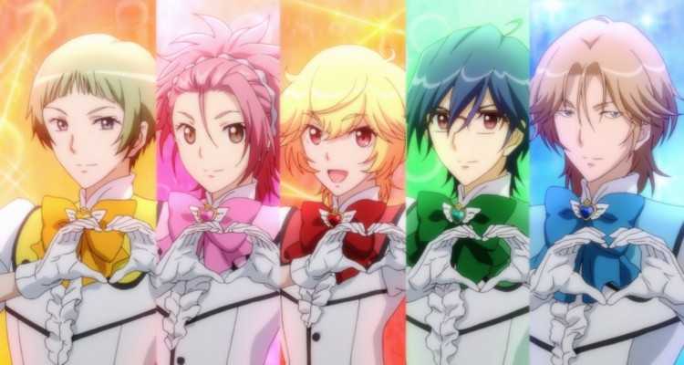

**Shows:** *Cute High Earth Defense Club LOVE!, *[*Koufuku Graffiti*](https://anitay.kinja.com/koufuku-graffiti-the-ani-tay-review-1694417922)*, Military!*

**Description:** Every now and then you'll run into these shows that are so stupid and insane that the only purpose they have to exist is to be absolutely ridiculous. These are they types of shows you show to your friend to get the **WTF JAPAN?!?!** reaction, the shows that you can't help but wonder what they were on when they made it...

**Justification & Thoughts:** You know how there's magical girl shows? Now imagine that role but with males, and you got *Cute High Earth Defense Club LOVE! *or* Sailor Men* as some of us on AniTAY like to call it. It's as stupid and silly as one would expect.

> *Koufuku Graffiti - "Came for food porn. Ended up with food + porn." - TheYeas*

Really though, [*Koufuku Graffiti*](https://anitay.kinja.com/koufuku-graffiti-the-ani-tay-review-1694417922) is really SHAFT's attempt to make food porn and girls orgasm without it actually being sexual content...

Military! Is a short form (approx. 3-4 min episodes) ecchi, moe, comedy series. This is definitely one of those "guilty pleasure" series, as the ecchi is very strong, with the adult gags contrasting sharply with the extremely cutesy and childlike designs of the characters. Visual and animation quality is fairly poor too. In fact there is hardly anything redeeming in the content at all, except the show is HILARIOUS. So if you care to indulge in any sort of perverted humor at all, you should give at least the first episode a try.

***

# The Average Shows of the Season

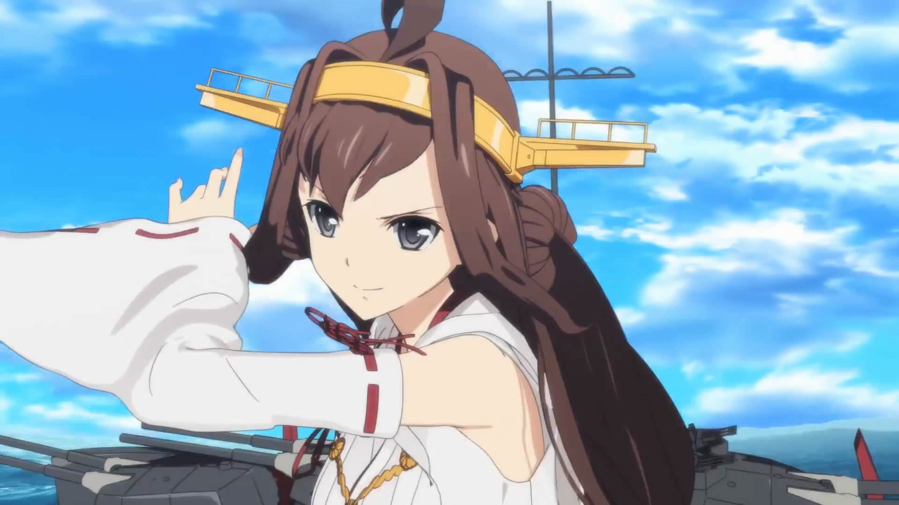

**Shows:** *[*KanColle*](https://anitay.kinja.com/kantai-collection-exiles-ani-tay-review-1693466646)*, [*Samurai Warriors*](http://anitay.kinja.com/samurai-warriors-the-ani-tay-review-1696872344)

**Description:** These are shows that while enjoyable, have flaws that keep it from being good. Sometimes they have great moments and really bad moments making the whole thing just average, and other times they're just average overall.

**Justification & Thoughts:** [*KanColle*](https://anitay.kinja.com/kantai-collection-exiles-ani-tay-review-1693466646) is an adaptation of a pretty interesting game series about shipping (pun intended). Unfortunately, the adaptation does a very poor job at being an adaptation and is a pretty lackluster anime, even if it's CGI and attention to detail is pretty nice at times.

[*Samurai Warriors*](http://anitay.kinja.com/samurai-warriors-the-ani-tay-review-1696872344) is your typical anime adaptation of a game: It's kinda dull and not super amazing, but if you're interested in it, you'll probably get something out of it as it does have it's strengths.

***

# The Controversial Shows of the Season

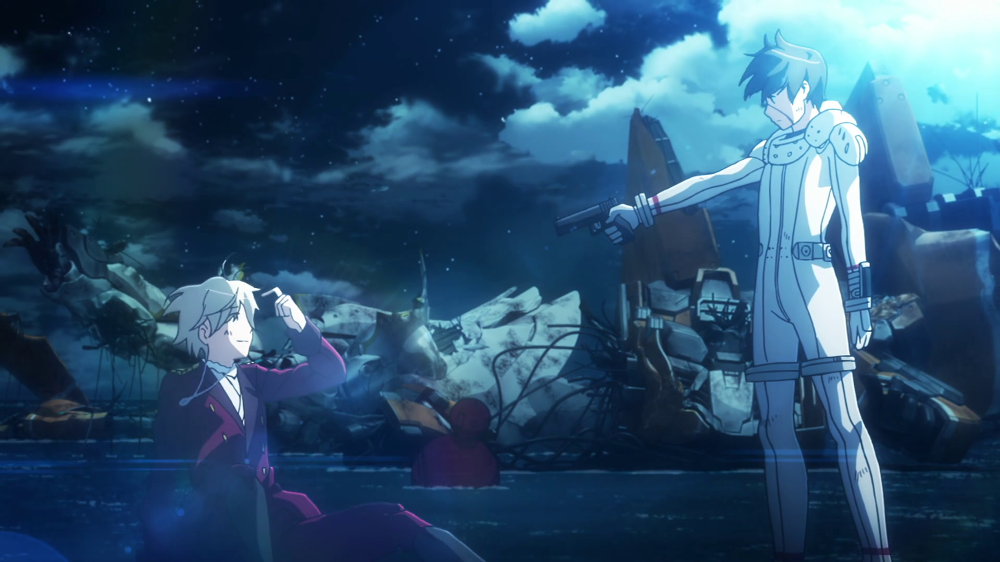

**Shows:** [*Aldnoah.Zero 2*](https://anitay.kinja.com/aldnoah-zero-2-the-ani-tay-review-1697384247), [*Tokyo Ghoul √A*](http://anitay.kinja.com/tokyo-ghoul-a-the-ani-tay-review-1694726518) *, *[*Cross Ange*](http://anitay.kinja.com/cross-ange-rondo-of-angels-and-dragons-the-ani-tay-r-1695638704)*, Log Horizon 2*

**Description:** When half of the community says it's shit, then the other half singing praise, we know we have a controversial show on the plate. These are shows that the opinion varies widely, and these are the shows we tend to spend our times discussing.

**Justification & Thoughts:** [*Aldnoah.Zero 2*](https://anitay.kinja.com/aldnoah-zero-2-the-ani-tay-review-1697384247) is more *Aldnoah.Zero*, which means a mecha that's still stupid, but still entertaining for some reason. As this season continued to pull the same stunt over and over again, many got tired of it, while others started liking it more because of how little the show actually cared, thus retaining it's controversial status. Also, **fuck Slaine**.

While [*Tokyo Ghoul √A*](http://anitay.kinja.com/tokyo-ghoul-a-the-ani-tay-review-1694726518) had many issues during its first half, it managed to pull itself together in the final act by bringing one of the best backstories in anime in a while, and having each and every last episode be tonally perfect in its depressing "nobody is in the wrong, and there are no winners or losers" presentation. It may have not been the Tokyo Ghoul we were expecting or wanting, but it managed to gracefully save itself in the end; even if some things got lost in all the chaos. As long as you don't come in expecting more of the first cour (like most of us did at first), then you should walk away pleased with this one.

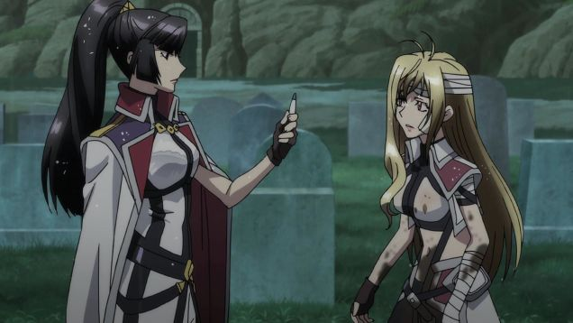

While many were disgusted by the first few episodes, I (RyomaNagare) have defended it as being a shameless grindhouse, and to be enjoyed for what it is. For sure a controversial anime, [*Cross Ange*](http://anitay.kinja.com/cross-ange-rondo-of-angels-and-dragons-the-ani-tay-r-1695638704) became more cohesive, and as characters grew and revenge plots began to gel, the series became addictive. Sure, the setting makes absolutely no sense and every woman is a bisexual mech piloting sexbomb dressed in fetish wear, but in a brilliant twist the antagonist will break 4th wall and give you a reason for it. Your mind and pants will be blown away, if you can stomach Sunrise's inconsistent production values.

If you came into *Log Horizon S2* expecting more of the same, or anything at all, you came into this show with a wrong perspective. While this season is still Log Horizon with it's interesting world and unique way of portraying MMOs, it lacks much of what made the first season great with boring plotlines, little development of the world and significantly worse art by studio Deen. Your mileage may vary with this one.

***

# The Shows that weren't Simulcasted

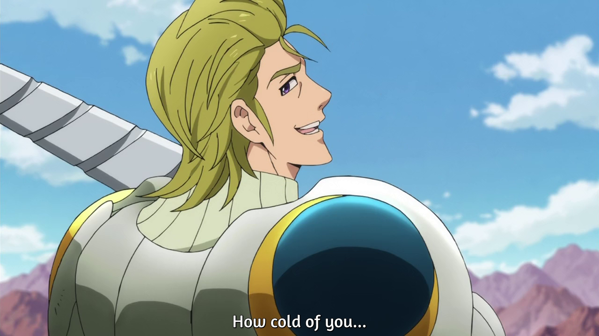

**Shows:** *Nanatsu no Taizai*

**Description:** Anime habits have changed quite a bit in the past years. With the advent of the internet, many people rely on these Simulcast streaming services to watch anime because it's so convenient…. but not every show makes it across the pond, or these sites regardless of quality. Here's some shows you probably overlooked.

**Thoughts:** Imagine your favorite long running shonen series. Now imagine all the filler removed, all the pointless soliloquies abridged, and you have *Nanatsu no Taizai.* In this show, every episode delivers a great fight, every episode raises the stakes, and the ending will leave you craving for more, while at the same time reaching a conclusion to a great climax. If this series was being simulcasted it would have been in must watch, so find the way and enjoy it.

***

# The Holdouts from Fall

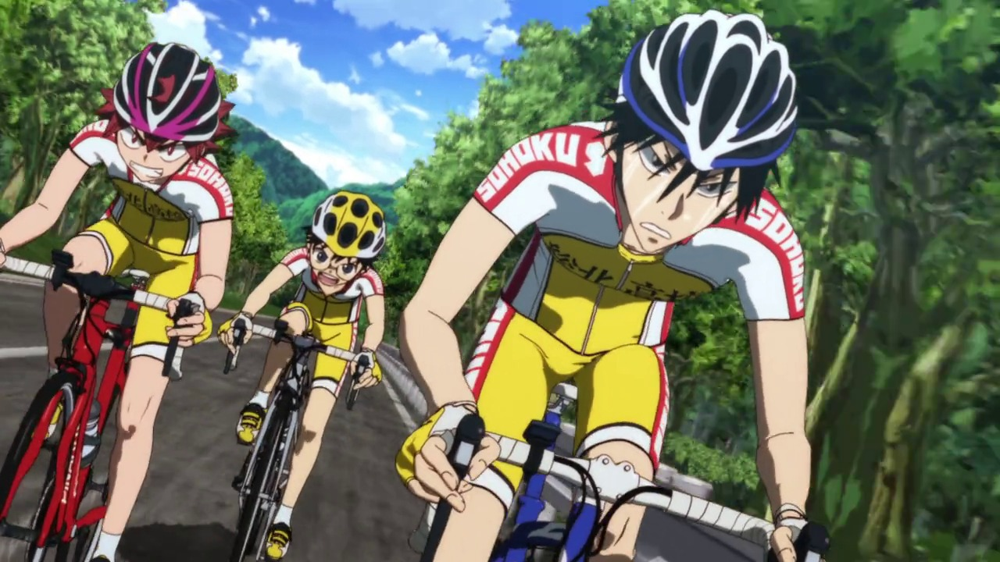

**Shows:** **Cross Ange**, ***GARO***, ***Gundam Build Fighters Try***, ***Log Horizon 2***, *[*Magic Kaito 1412*](https://anitay.kinja.com/magic-kaito-1412-the-ani-tay-review-1683434409)*, *Nanatsu no Taizai*, *Shirobako*, *Parasyte*, *[*Yona of the Dawn*](http://anitay.kinja.com/yona-of-the-dawn-the-ani-tay-review-1693229962)*, *[*Yowamushi Pedal:*](http://anitay.kinja.com/yowamushi-pedal-the-ani-tay-review-1599570106#_ga=1.44746468.1523386611.1417386122) Grande Road*

**Description:** Typically, Anime coverage usually doesn't cover the shows from last season, so it leads these holdout shows in a bit of predicament. These are the shows in the awkward position without reviews yet but are not really covered because they aren't in the season.

**Thoughts:** [*Magic Kaito 1412*](https://anitay.kinja.com/magic-kaito-1412-the-ani-tay-review-1683434409) is a fun, entertaining show. Revolving around Magic Kaito as he steals gems to avenge his father, we get to see fun heists, entertaining characters and engaging acts of "magic", it's a show that will surely put a smile on your face, especially if you are a *Detective Conan* fan, which this show is very similar to because it's made by the same mangaka.

A shounen meets shoujo adventure [*Yona of the Dawn*](http://anitay.kinja.com/yona-of-the-dawn-the-ani-tay-review-1693229962) offers a dose of nostalgia from the classic animes of yore. With solid animation and sound, strong fight scenes, characters you actually care about and a villain that is more than a straw man, *Yona* continued to impress. If you like your action-adventures to have romance and want to see a great depiction of character growth than *Yona of the Dawn* is for you. Also, Princess Yona may have the best set of eyes in anime. Just be warned, it has one of the strongest ...to be continued endings that I have seen in a while.

[*Yowamushi Pedal:*](http://anitay.kinja.com/yowamushi-pedal-the-ani-tay-review-1599570106#_ga=1.44746468.1523386611.1417386122) *Grande Road* had its final push to the finish line this season, as Onoda and the members of the Sohoku Cycling team race to the end of the all important Inter-High road race. It was a very strong ending to a great sports shounen, and a fitting climax to this bicycle based hero's journey. One filled with tension, emotions, surprises, cliffhangers, and enough awesome to give one's soul wings.

***

# The Popular Shows of the Season

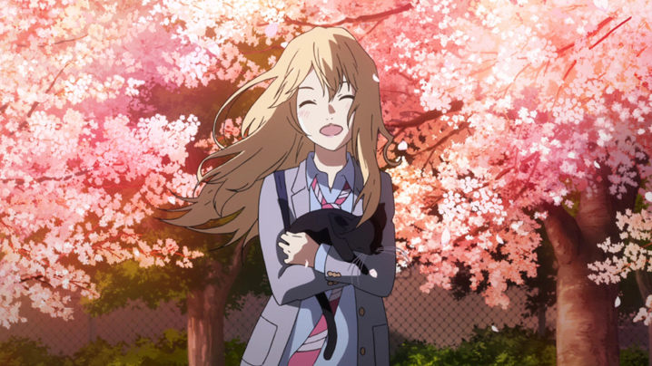

**Shows:** ****Aldnoah.Zero 2***, ***Durarara!!x2,*** ***Parasyte***, Tokyo Ghoul √A*, *Your Lie in April*

**Description:** Typically, there are very few shows that are actually popular. Based on the activity of a community like Ani-TAY, you'd guess that some shows would be well known, but because something is discussed about doesn't mean it's popular. Most anime fans don't watch seasonally, and only a few shows in a season actually get watched by these anime fans. These are the shows that you could go up to a random stranger in an anime convention and talk about.

*( **Note:** All the shows here are in other categories, and I (Rockmandash) felt that it would be more appropriate to talk about them in the respective categories, so yeah…. no Justification and thoughts here.)*

***

# The Spinoffs/Sequels/Second Seasons of the Season

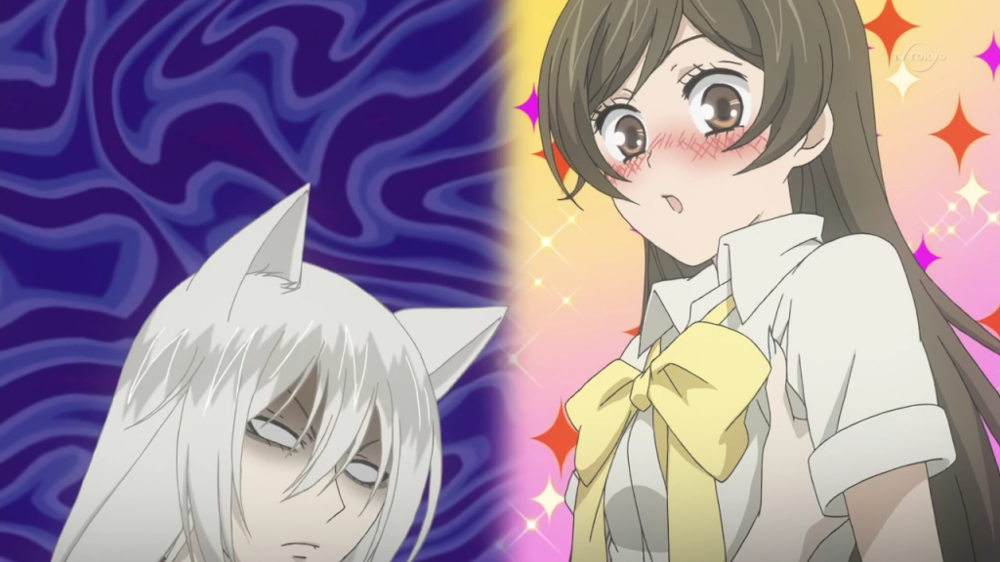

**Shows:** **Aldnoah.Zero 2** ,***Durarara!!x2***, *[*Gundam Build Fighters*](https://tay.kinja.com/ani-tay-gundam-build-fighters-review-1555687333)* Try, Fafner, iDOLM\@STER:Cinderella Girls, JoJo's Bizarre Adventure, [*Kamisama Kiss*](http://anitay.kinja.com/kamisama-kiss-the-ani-tay-review-1695433891)

**Description:** Every now and then, we get shows that are popular enough that they continue on from the original work, whether it's a second season, prequel, spinoff, whatever. This category is just that: shows that continue off from an existing franchise.

**Thoughts:** *Gundam Build Fighters Try* was a surprisingly strong entry in the Gundam series that not only managed to effectively twist [*Gundam Build Fighter*](https://tay.kinja.com/ani-tay-gundam-build-fighters-review-1555687333)'s formula into a new story, it also managed to make it even more fun. Set in an alternate Earth where people around the world build model Gunpla and use them in simulated battles, Build Fighters is a massive crossover where Gunpla from across the franchise finally can meet head-on in battles. Build Fighters, as a subset of the Gundam franchise, has never been a serious entry in the series, but for what it lacked in thought-provoking dialogue, it made up with it in spades with incredible amounts of fun. The story of one team taking the world Gunpla Battle championship couldn't be more cliche, and yet the execution could make even a cynic crack a grin.

*Fafner in the Azure: Exodus* is more glorious dark mecha-ness that I (Rockmandash12) should really see. Keep in mind though that this show [is a show for Fafner fans, and nobody else](http://anitay.kinja.com/dont-watch-fafner-in-the-azure-exodus-unless-you-saw-1679817313).

THE *iDOLM\@STER: Cinderella Girls* is an adaptation of the spinoff mobile game of the same name, and as the name would tell you, it's an idol show. The tone is light and cute overall, with occasional drama as the girls try to overcome the various challenges of becoming successful entertainers. The cast becomes quite large and everyone gets some of the spotlight, though this does limit the extent of deep character development over the course of this 13 episode series. Overall I (jonuiuc) would recommend it to people who are looking for a fun, easy to watch show, but opinions were split on if we should recommend it in the [collab](http://anitay.kinja.com/the-anime-of-winter-2015-honorable-mentions-1688350309) due to the style of the show and the focus on the producer. That being said, if it sounds like it's your cup of tea, you'd probably enjoy it.

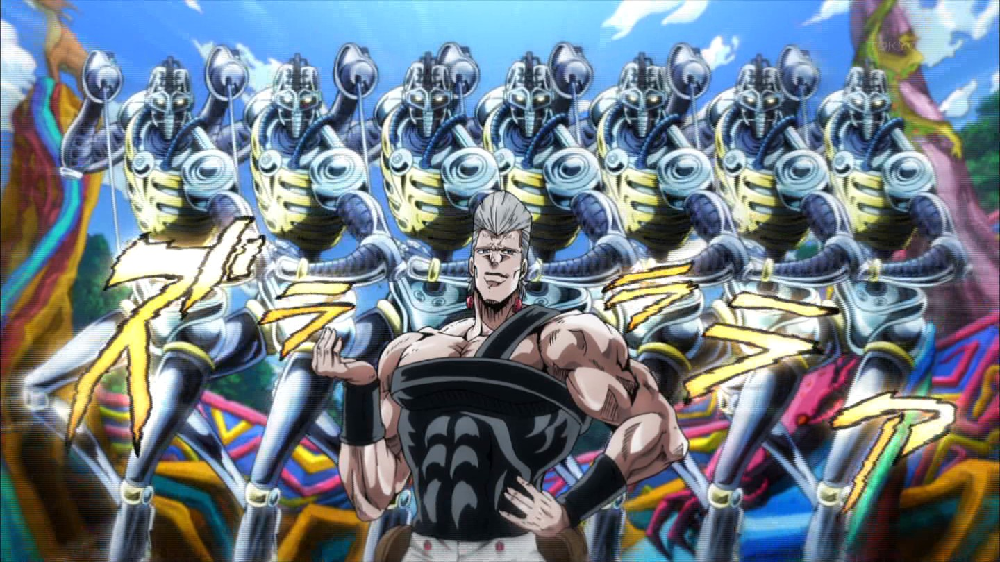

*JoJo's Bizzare Adventure: Stardust Crusaders* is a continuation of everything you love about *JoJo's Bizarre Adventure*. From the dramatic poses, the rapid color palate switches to the over-the-top enemies and powers, JoJo is as bizarre as we have come to expect. And look, Dio is back! Well, kind of….

[*Kamisama Kiss*](http://anitay.kinja.com/kamisama-kiss-the-ani-tay-review-1695433891) is a supernatural shoujo for those that enjoy a slow paced show that still manages good character development in spite of only having twelve episodes to work with. The comedic time is well done, the animation is soft and clean, and the soundtrack is pleasantly soothing; all of which successfully panders to rom-com fans. Picking up where the first season left off, *Kamisama Kiss* improves upon itself and delivers a romance that actually appears to be going somewhere. Thank *Kamisama*! Now we just need to hope it gets a season three.

***

# The Shows that Were Solid Overall

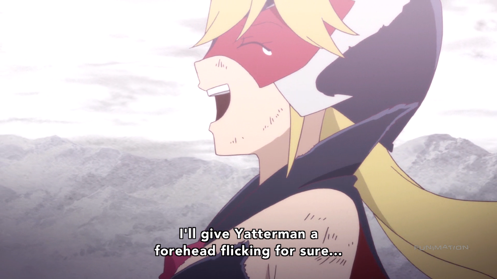

**Shows:** *Assassination Classroom, [*Durarara*](https://anitay.kinja.com/rockmandash-reviews-durarara-anime-1665959528)!!x2, *Gundam Build Fighters Try*, *[*Maria*](http://anitay.kinja.com/maria-the-virgin-witch-the-ani-tay-review-1695437976)*, *[*The Rolling Girls*](http://anitay.kinja.com/the-rolling-girls-the-ani-tay-review-1697621417)*, Yatterman Night*

**Description:** These are enjoyable shows that were pretty solid, and may have had some issues, but were still good all around. There's nothing particularly horrible about these shows, as they generally are good the whole way through, but there's just something that keeps them from being great, something that prevents them from going to the next level.

**Justification & Thoughts:** *Assassination Classroom* is the fun and quirky Shounen action comedy where a yellow tentacle monster takes a year off from destroying the world in order to teach a group of outcast Jr high students, and train them into competent Assassins, capable of killing himself. It's a fun collection of stories that keeps being consistently funny and inspiring week to week. With a fun cast, despicable villains, and the unparalleled Korosensei who is just a blast to see. (And not just when he flies at mach 20)

Seeing [*Durarara!!*](https://anitay.kinja.com/rockmandash-reviews-durarara-anime-1665959528) back again was like seeing an old childhood friend for the first time in a few years: Of course, it's not at the point where it's at it's best and the interactions are still awkward, but it's still really nice to see and it's still just as fun and enjoyable as it always was. Really, *Durarara!! X2* started a bit slow at the beginning, and episode 7 was an absolutely a mess in animation, but that's really OK because it has plenty of time (tri-split cour…) and it still does everything *Durarara!!* did great.

Set in France during the Hundred Years War and presenting a strikingly beautiful art style [*Maria the Virgin Witch*](http://anitay.kinja.com/maria-the-virgin-witch-the-ani-tay-review-1695437976) stands out amongst the crowd. Spending time not just following the titular witch, *Maria* explores the relationship between Church and State and how both exert their power and influence over the People. Maria, who seeks to end the violence that many use to sustain their livelihood quickly finds herself at odds with the same people she desires to protect. Though some questionable decisions are made in regard to character design, fanservice and sexual innuendo, *Maria the Virgin Witch* stands as a fun and exciting tale.

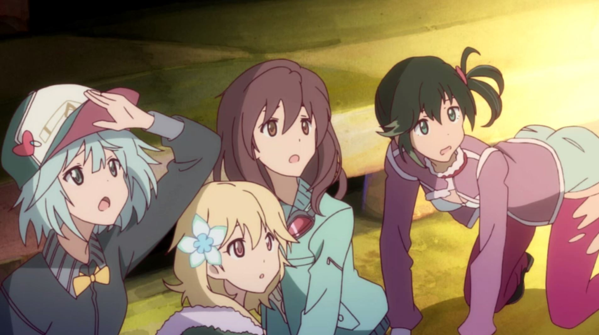

[*The Rolling Girls*](http://anitay.kinja.com/the-rolling-girls-the-ani-tay-review-1697621417) is simply gorgeous, a visual treat from start to finish. Just look at those watercolor backgrounds! I already miss them! With silky smooth animation and an excellent soundtrack your senses will be glad you watched this show. At first *Rolling Girls* looked to be an action heavy over-the-top beat-em-up a la *Kill la Kill,* just with less blood and skin, instead we got a superpower infused slice of life about four friends on the road trip of a lifetime. As these friends struggle to figure out how to make a difference in the world with no superpowers to call their own we get to experience a fun little journey worth taking. This show also contains the cutest octopus ever.

Have you ever wondered what would happen if Team Rocket were the good guys and Ash and the gang was the bad guys? *Yatterman Night* handles the inversion with it's universe's equivalent quite well, By executing juxtaposition in a way that engages the audience with both humor and drama, and it's a blast. That being said, while in the beginning it handles tone masterfully, it loses quite a bit of steam later on and it never gets back to that level. The last half feels like filler in comparison, and it never really makes a full comeback, just feeling average at times. Even with it's flaws though, I (Rockmandash12) really enjoyed this show, and I hope you do too. **BANZAI! BANZAI! BANZAI!**

***

# **The Shows that Were Great**

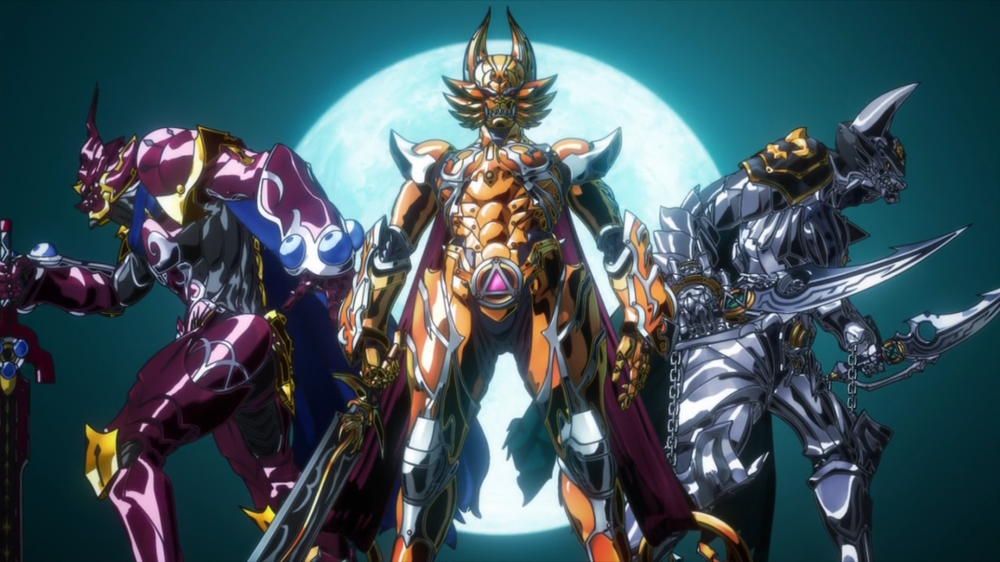

**Shows:** [*GARO*](https://anitay.kinja.com/garo-the-animation-the-ani-tay-review-1695909572), *[*Saekano*](http://anitay.kinja.com/saekano-how-to-raise-a-boring-girlfriend-the-ani-tay-1693443663)*, *[*Shirobako*](http://anitay.kinja.com/shirobako-the-ani-tay-review-1691227634)*, [*Yuri Kuma Arashi*](http://anitay.kinja.com/yurikuma-arashi-the-ani-tay-review-1694675212)

**Description:** These are shows that are great, full stop. These shows are always entertaining, have great writing, and they execute their goals extremely well, leaving fans satisfied with what they've just seen. They may not be appealing to everyone so they aren't must watches, but if you're into these shows, you really can't go wrong.

**Justification & Thoughts:** [*GARO*](https://anitay.kinja.com/garo-the-animation-the-ani-tay-review-1695909572) is a series that finishes in great form, and could be considered one of the best series of the Fall/Winter season. Since it was based on a live action franchise, the story could have been a convoluted mess, but instead we got a streamlined prequel with a beautiful and original art direction, great soundtrack, and a concise story. Just when you may think you know where its going, it will kick you to the curb, and end in a most satisfying manner, making the show that much better.

[*Saekano*](http://anitay.kinja.com/saekano-how-to-raise-a-boring-girlfriend-the-ani-tay-1693443663) is a great meta humor harem comedy show, if you're into that kind of stuff. Every episode has been quite amazing, with absolutely great character interactions, excellent execution of meta elements, and just well written comedy in general. All the characters here are just fantastic and the premise really enables this show to use them to their full potential. Really, it's nothing new, but it does everything extremely well and will entertain you every minute you spend watching it.

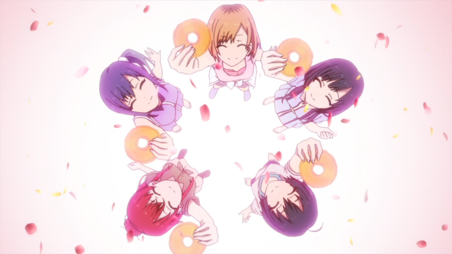

The best anime about anime you will ever see has been just quite amazing this season, being extremely informative, and very entertaining. ~~*Animation: The Animation*~~ [*Shirobako*](http://anitay.kinja.com/shirobako-the-ani-tay-review-1691227634) may not be everyone's cup of tea, but I (Rockmandash12) absolutely adored it, and everything about it. It really made me appreciate all the things that the people making anime have to deal with, and to get this peek into the world of animation is something I really like. It's also an entertaining slice of life show as well, and it's been nothing but good times.

[*Yurikuma Arashi*](http://anitay.kinja.com/yurikuma-arashi-the-ani-tay-review-1694675212) is a sure bet for fans of Kunihiko Ikuhara, director of *Revolutionary Girl Utena* and *Mawaru Penguindrum*. His third show is a modern fairy tale steeped in symbolism and rich visual language. It's a sweet and satisfying story about finding love and acceptance in the face of social pressure to blend in, but it also works as a scathing and incredibly clever commentary on cliches and problems with the yuri genre. Watch it! That's the sexy way, shabadadu.

***

# **The Must Watch Shows of the Season**

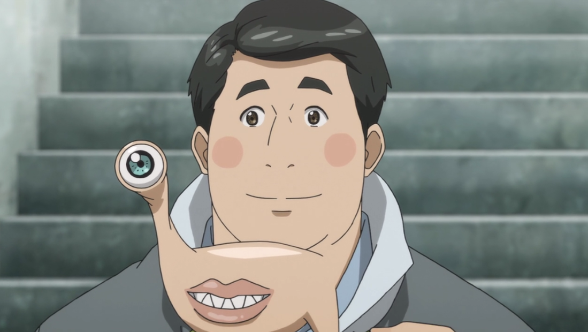

**Shows:** [*Death Parade*](https://anitay.kinja.com/death-parade-the-ani-tay-review-1695470806), *[*Parasyte*](http://anitay.kinja.com/parasyte-the-maxim-the-ani-tay-review-1693768288)*, [*Your Lie in April*](http://anitay.kinja.com/your-lie-in-april-the-ani-tay-review-1691904314)

**Description:** Every season, there are shows that blow you away, the shows that make you go and tell all your friends to watch this immediately because they're that good. These are must watches of the season, the shows that people hype up and really love. These are the shows that will be remembered fondly by fans long after the season passes, and are pretty accessible to most people.

**Justification & Thoughts:** [*Death Parade*](https://anitay.kinja.com/death-parade-the-ani-tay-review-1695470806) made a splash in Ani-TAY with stunning animation and production quality from Madhouse, an interesting premise, and of course 'dat OP. This reflective drama about the nature of life, death, and finding meaning in both as played out in a bar that functions something like purgatory turned out to be a season favorite all around. The weekly looks into the individual lives and struggles of visitors to Decim's bar and the overarching story of the arbiters kept us hooked. Although it was only 12 episodes, *Death Parade*'s touching and ultimately uplifting story is sure to leave a lasting impression for seasons to come. Due to the show's episodic nature and fairly universal themes, this is also one of the easiest shows this season for any type of anime watcher to jump into.

[*Parasyte*](http://anitay.kinja.com/parasyte-the-maxim-the-ani-tay-review-1693768288) is a roller coaster, a fast yet managed pace pretty great show, being well executed, well animated, and engaging throughout. From it's great pacing, to the interesting premise and engaging characters, it's a show that's consistently entertaining, very satisfying, and a show you won't want to miss. Don't dismiss it because it's from an older manga, it's pretty great!

Sound and music are incredible things. Being a person who creates such beauty is also an amazing thing. [*Your Lie in April* ](http://anitay.kinja.com/your-lie-in-april-the-ani-tay-review-1691904314)is a touching story about a musician who's lost his way, and the lie that helps him find it again. Through thick and thin, their melody wavers not; though highs and lows, their symphony sounds. The touching story plays upon the notes of a beautiful lie, and its spell falls upon all who've watched it.

***

# Thoughts on the Season Overall

I was genuinely surprised by how great this season was. Coming into these season with zero expectations, this season managed a high level of quality with almost every show and was enjoyable throughout. Yes, there wasn't a lot of shows this season, but the backlog from fall made up for it and pretty much every show in this season got really good. - Rockmandash12

Honestly, this was a great season. While at first it didn't seem to be so due to the drug which was Fall season, and that many of the new shows were unproven (such as Assassination Classroom, Death Parade, and Yatterman), it quickly proved its worth with great first episodes that got us talking and/or hooked on the series. This was definitely a season of pleasant surprises. *- The Messiah*

Winter 2015 can lay claim to two of my favorite shows ever, *Parasyte* and *Shirobako*. Add to that a cavalcade of other shows that I would count as either good or great and you are left with a very memorable season. - Kristof

***

*This article was written by Members of the Ani-TAY community. Here's a full list of the contributors, and what they've done:*

*Ascendant - Izanagi - Your Lie in April*

*Dexomega - Gundam Build Fighters Try*

*Jonuiuc - Military!, Cinderella Girls*

*Krakken\_Unleashed -* *Yowamushi Pedal: Grande Road, Assassination Classroom*

*Kristof - Yona of the Dawn, Maria the Virgin Witch, The Rolling Girls, Kamisama Kiss*

*MementoMorie - YKA, Death Parade*

*Messiah - Tokyo Ghoul √A,*

*Rockmandash12 - Magic Kaito 1412, Shirobako, Saekano, Cute High, Parasyte, Yatterman Night, Durarara!!, Aldnoah.Zero 2, Samurai Warriors*

*RyomaNagare - GARO, Cross Ange*

*Sean Stanlick - Isuca Testament of Absolute Fafner Break, Header image*

*If you are interested in some of these shows, most of these shows are available for streaming on *[*Crunchyroll*](http://www.crunchyroll.com/)* and *[*Funimation*](http://www.funimation.com/)*.*
