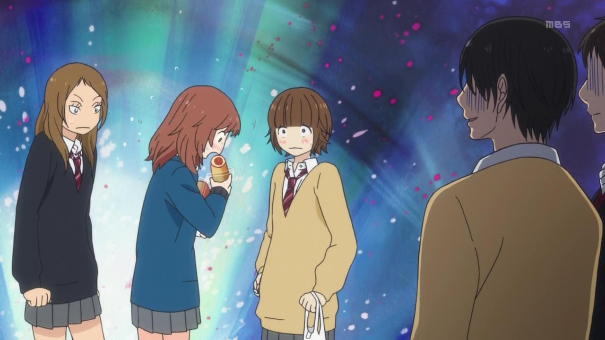
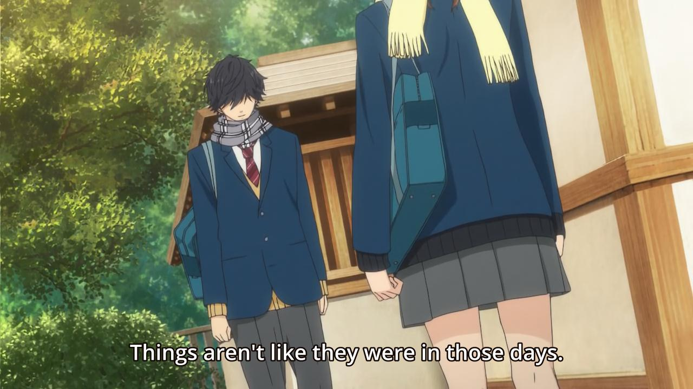
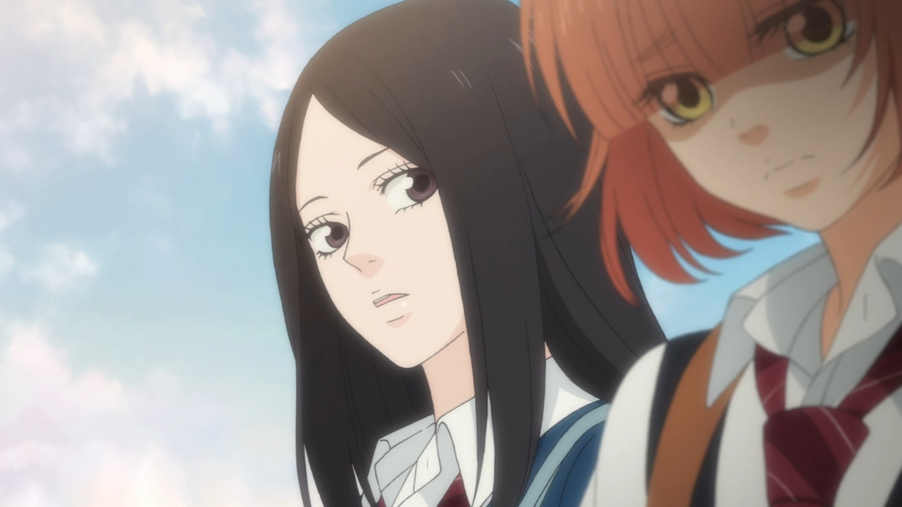
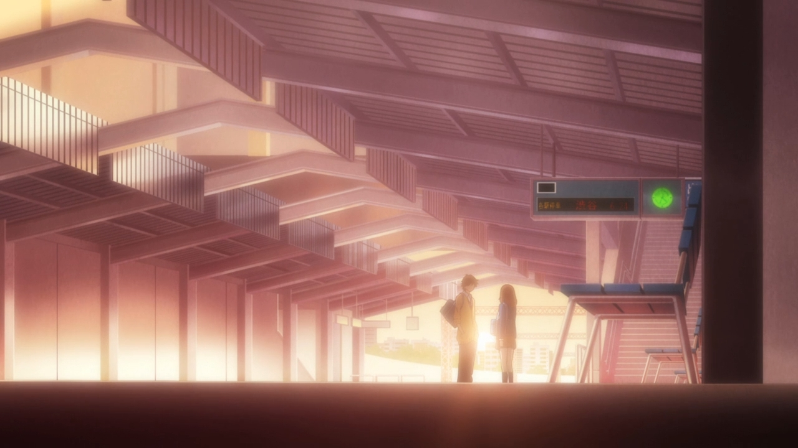
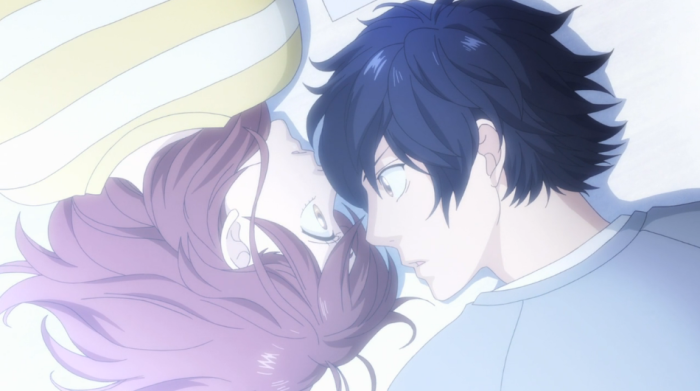
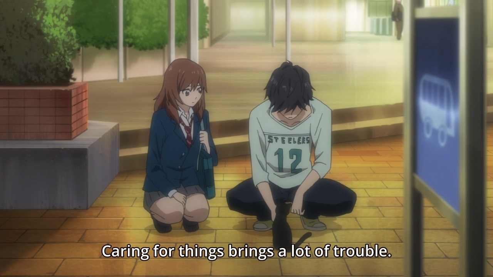
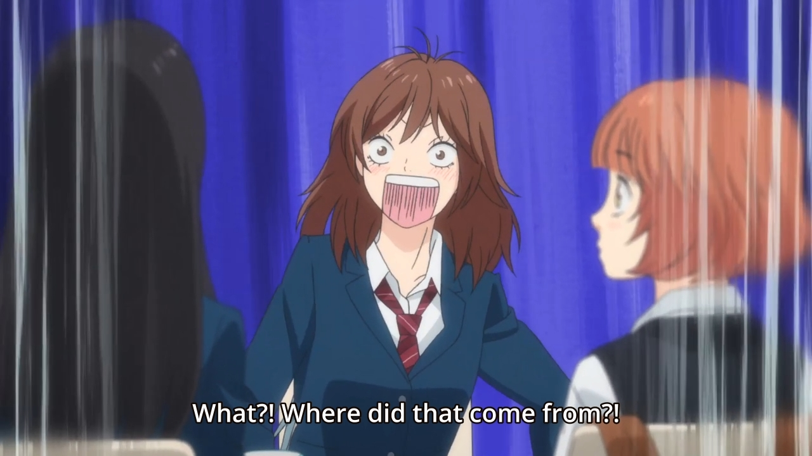
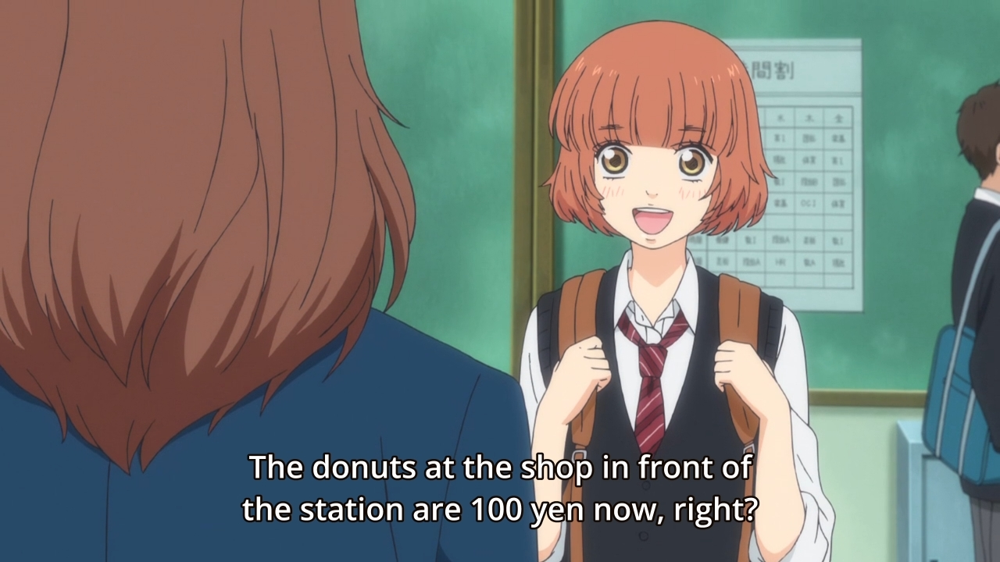
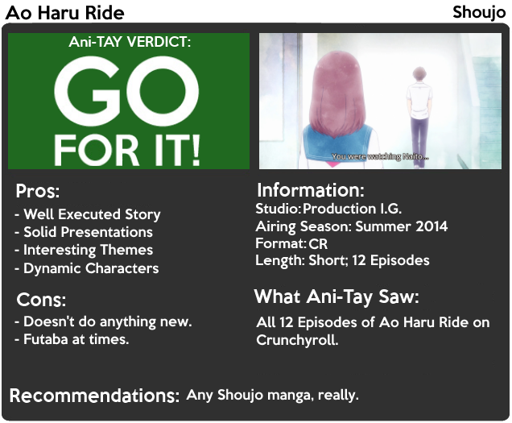

---
{
	title: "Ao Haru Ride : Rockmandash's Ani-TAY Review",
	published: "2014-09-25T16:00:00-04:00",
	tags: ["Ao Haru Ride", "Ani-TAY", "Review", "Rockmandash", "Rockmandash Reviews", "Tay-Classic"],
	kinjaArticle: true
}
---

Have you ever seen a show that runs with a tried and true form of story, yet still manages to amaze? That's a perfect description of *Ao Haru Ride*, a Shoujo that was adapted by Production I.G.

#### Execution of Story

What makes *Ao Haru Ride* great is the solid execution overall. Even though I haven't read the manga at the time of writing to compare it to, I can see all of the effort that Production I.G. put into adapting a story of bonds, relationships, and devastation which is done very well. The story follows Futaba Yoshioka, a girl who had a crush on Kou Tanaka, but he decided to move away at the end of middle school before she had the opportunity to tell him her feelings. Futaba decides that she would have an unlady-like personality in high school due to his move, but as she is living with this personality, she suddenly meets Kou. Like Futaba however, Kou's changed quite a bit. He's much more distant, and he has a new last name: Mabuchi. They go through normal school life, but the interactions between them start to shape who they are, and how they view the world.

From a storytelling aspect, the execution of the story strikes all the right boxes. It has great pacing, an amazing feeling of progression in each episode, solid character development, and great character interactions. What I did not expect out of this shoujo was the great themes this show covered and how well it did them: friendship, social structure, growing pains in relationships, building up shattered relationships, events that change a person forever, etc. This show is deeper than you would expect, taking things that everyone accepts out of relationships like this, pointing it out in a way that was enjoyable, and making changes in said relationship that feels real. The scenes in this show are done very well, and when the "feels" hits, it hits hard. They are themes that aren't expected from a shoujo nowadays, but they really enhance what's there and they fit well in the story.

There was one theme in particular that they had early on that I really enjoyed: the theme of chasing the past. The events already happened, and it was done and over with, but the desire for it to be the way it used to be is one that hit home for me, and it was done so well that I can't help but admire it. It got me attached to the characters, and was just a blast to experience.

#### Side Characters that Actually Matter

While Ao Haru Ride is very much so a traditional shoujo focused on romance, I really appreciated the development of the side characters: something that most shoujo have, but rarely develop. Seeing the focus on friendship and social status being equivalent to the focus of the main relationship makes this show feel that much more believable, and it's a nice fresh breath of air. Seeing side characters with depth, and developing relationships was something that I wish every show has.

#### I.G. does it again, even in a Shoujo

If there's one thing I can count on I.G., it's a consistent standard of quality, especially when it comes to visuals. The art is beautiful, with an awesome water colored look at times that I really enjoyed. It adds a lot of charm to the show, and I appreciate it. The characters look nice and the scenery... it's great. It builds a great atmosphere to compliment the scene, the backgrounds look pleasing to the eyes, and they have good lines and great framing, which is something many shows don't really care about nowadays. It's a nice looking show, as expected from I.G.

#### Oh, The Sound

> Excuse the AMV, I could only find Nightcores, Covers, AMV's and the original Music Video which is unrelated to the show, so I figured that the AMV would be the best way to do this. The AMV used is [Black K25's](https://www.youtube.com/channel/UCyKt1SWVckJ3k0W_u-Qqzkg). If you liked it, check out the channel.

If you know anything about me and my reviews, you would know that I always gripe on the usage of a soundtrack in a show to no end. The sound can add a layer of emotion that's unavailable in forms of media without sound, which I usually describe as "making the mood". Why am I saying this general description of my reviewing of sound? It's because *Ao Haru Ride* uses sound in a way that I wish every show did, and I was seriously impressed by how powerful and impactful the soundtrack was on my experience with the show. The great scenes are solid on its own, but what really pushes them over the edge of greatness is the soundtrack. The soundtrack is well composed, helps the atmosphere and has some amazing piano playing that I loved. They left an impact on me, and I was humming the tunes hours after I finished the episode. They were memorable, well utilized, and very well done; pretty much everything I ask out of a soundtrack.

There's no way I'd be able to wrap up a soundtrack talk without a mention of the OP. This season has been rolling with great OP's, and this is no exception. It captures the essence of the show extremely well, and it's very pleasing to the ear. On a side note, I had no issues with the voice actors, but I'm not really a "Pro Voice Actor Rater".

#### It's a very Shoujo Show

If you are a fan of Shoujo, you got it here. This is a very by the books, simple yet a bit generic Shoujo romance, with all the pros and cons that come with that type of story. For someone who loves this kind of story, they'll love it, but because of how "traditional" it is, this might be a huge deterrent. If you aren't a fan of the genre, or you are looking for something new or different, you guys aren't getting it here. This show doesn't do anything really new in the genre, it's the same tried and true formula, but done very well. *Ao Haru Ride *doesn't try to differentiate itself from the of the genre, it does what it wants to do, even if that's been done tons of times. It hits all the notes, but it doesn't cover new ground.

#### The Characters

Overall, I like most of the characters. Kou Mabuchi is cynical, caring, enjoyable, and has an interesting backstory that makes him more interesting as you go on. Due to some event that I'm not going to talk about due to spoilers, he's closed himself up, afraid of putting any effort or emotion into anything, and this was very enjoyable to watch in my opinion. Like I said before, the side characters quite a bit development in comparison to most shoujo and because of that, they were interesting, dynamic, and enjoyable. The contrast between Yuri and Futaba's friends at the beginning of the story is great, and the interactions between the cast was great. They built bonds, and grew a beautiful friendship that was fun to watch. The cast in Ao Haru Ride is pretty good.

However, Futaba at times really got on my nerves. While Futaba is a solid main character for most of the show, sometimes she's just annoying and grating to me. This may be just be me being a guy and not liking the actions of a girl in love acting impulsively, but her habit of jumping to the wrong conclusions always will rub me the wrong way, and at times it'll just piss me off. It's these impulsive actions that get the cast into into stupid scenarios, one that Kou and others have to fix...hell, the reason she changed her personality and caused half of the whole show's strained relationship is due to her impulsiveness. This impulsiveness helps the show in the end, but in my opinion, it was a negative portion of the story for most of it.

#### Enjoyment

I really loved the show at the beginning. The themes, characters, everything, it drew me into the story, and I was saying it was the best show of the season. When the show settled down however, it was just running through your typical slice of life, day to day shoujo stuff, with these interesting themes. While I wish *Ao Haru Ride* stayed strong and engaging like the early episodes, I enjoyed everything it did, but your enjoyment pretty much hinges on one simple fact: it's a shoujo and it doesn't do much to differentiate. I enjoyed it because I like shoujo, but if you don't like shoujo, you won't like it.

#### The Anime Ending

Due to the fact that the anime is one cour, and this is an ongoing manga, they have to find a place to stop. The place they stopped is a pretty nice stopping point, finishing up a major arc, yet making you anticipate more but not in a frustrated way. It's not a bad place to end, and it's probably the best place it could have had to end, but the ending wasn't amazing.

*Ao Haru Ride* is a well done Shoujo for Shoujo fans. I had a great time with it, and I think you probably will too. If you like Shoujo, then you'll probably like it as much as I do, but if not, [you may want to try something else](http://anitay.kinja.com/gekkan-shoujo-nozaki-kun-rockmandashs-ani-tay-review-1634657276). If you need me, I'll be reading the manga.

***

**Copyright Disclaimer:** Under Title 17, Section 107 of United States Copyright law, reviews are protected under fair use. This is a review, and as such, all media used in this review is used for the sole purpose of review and commentary under the terms of fair use. All footage, music and images belong to the respective companies.

*You can see all my reviews on *[*Rockmandash Reviews*](http://tay.kotaku.com/tag/rockmandash-reviews)*. For an explanation of my review system (which isn't present on this review, but is in most of my reviews), *[*check this out*](https://rockmandash12.kinja.com/rockmandash-rambles-an-explanation-on-my-review-system-1619265485)*.*

###### [Rockmandash Rambles: *An Explanation on my Review System* (Updated 11/15/2015)](https://rockmandash12.kinja.com/rockmandash-rambles-an-explanation-on-my-review-system-1619265485)

If you’ve read any of my reviews and wanted to know why I did them the way I do, here’s an…

[Read more](https://rockmandash12.kinja.com/rockmandash-rambles-an-explanation-on-my-review-system-1619265485)

*This anime is available on *[*Crunchyroll*](http://www.crunchyroll.com/blue-spring-ride)* for free and legal streaming.*\
**

[Read more](http://www.crunchyroll.com/blue-spring-ride)