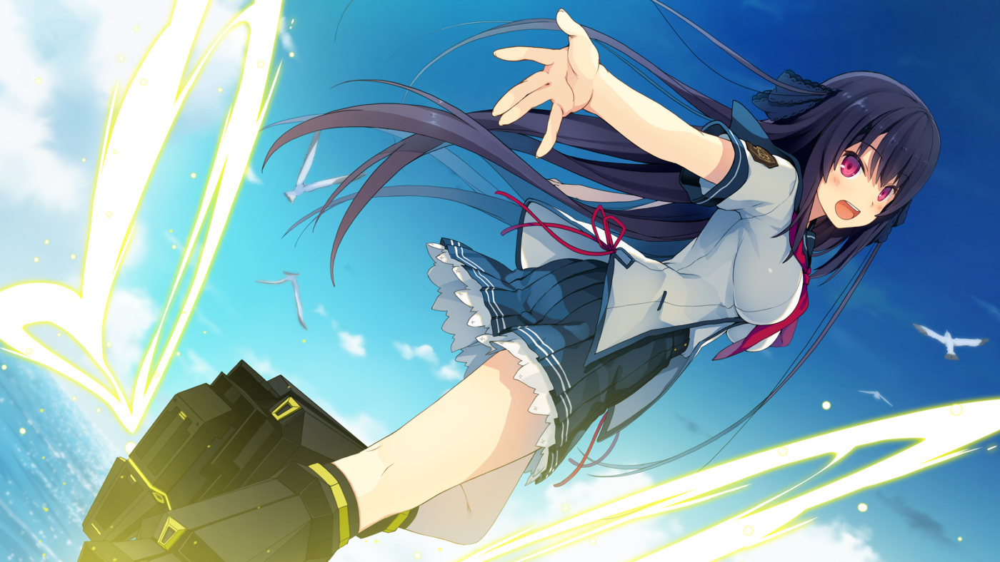
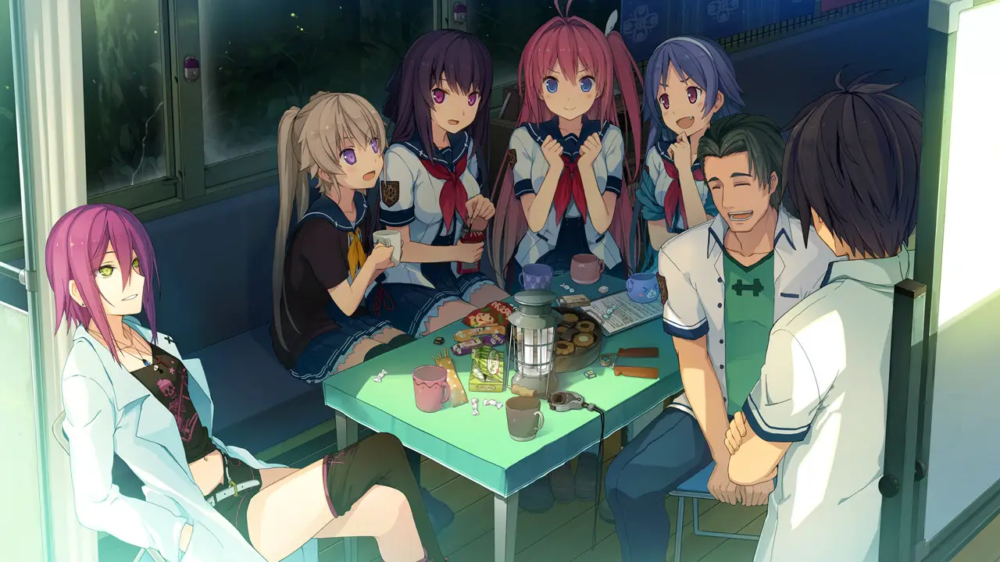
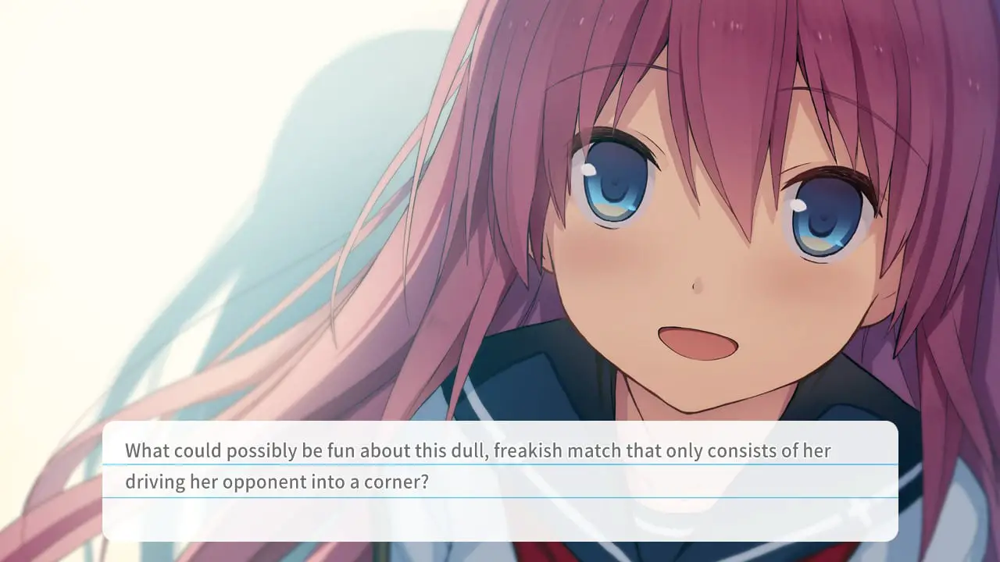
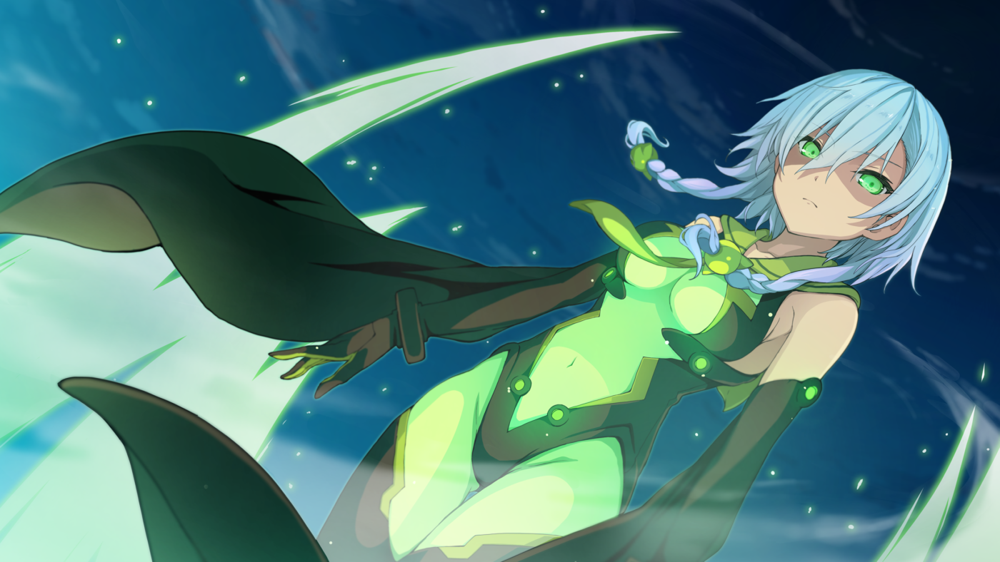
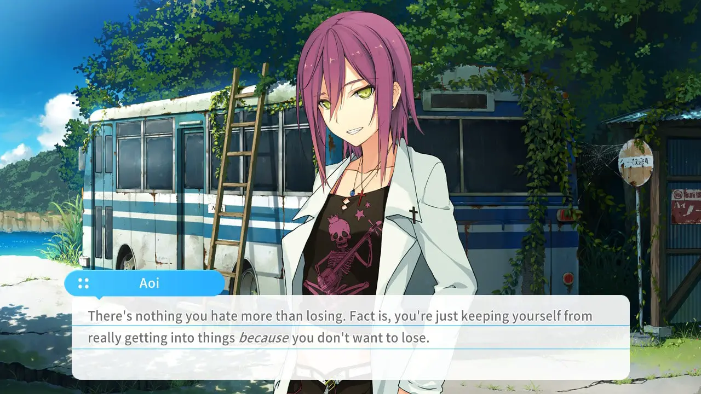
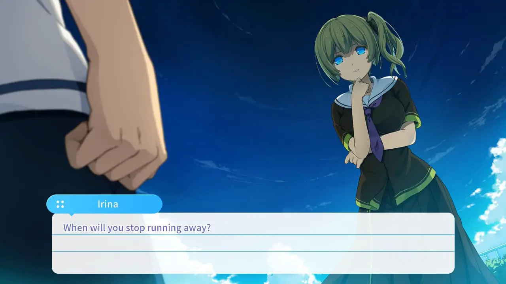
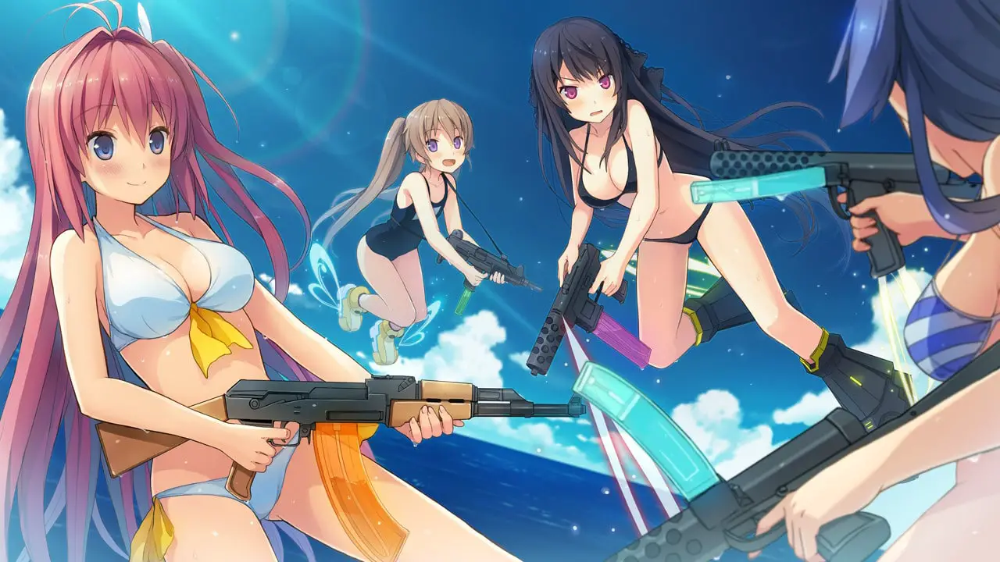

---
{
  title: "Aokana: Four Rhythms Across the Blue Switch Review – A Soaring Switch Visual Novel",
  published: "2020-08-24T07:45:22-07:00",
  originalLink: "https://noisypixel.net/aokana-four-rhythms-across-the-blue-switch-review-switch/",
}
---

In anime, the sports genre is fascinating based on the way the story is presented, typically taking on a more over-the-top shonen approach, but without death. It makes for some unique moments of action with what would otherwise be a boring subject. Still, rarely does it mesh with other genres, most notably, romance. However, _Aokana: Four Rhythm Across the Blue_, finds a way to pull this off through excellent character writing and memorable set pieces. Even though it may have a rocky landing in certain routes, *Aokana* finds the perfect new home on Nintendo Switch.

[Aokana: Four Rhythms Across the Blue Switch Review - Noisy Pixel](https://www.youtube.com/embed/XKOCPgqiIkk?feature=oembed)

*Aokana: Four Rhythm Across the Blue* is the complete package in terms of presentation, with excellent visuals and sound. While the character designs and general aesthetic may be considered generic for what you’d see in an anime, I found that it was done well and the presentation added to the overall quality of the work tremendously.

The standout design finds its way into the game’s UI that takes on the form of a textbook. Furthermore, the audio track title appears onscreen when the song changes, which worked for me because it has a pretty good soundtrack. These elements give off a more modern visual novel experience, which may make it more approachable to newcomers.

The premise of _Aokana_ contains many layers, which are each compelling, even if it might not seem like it at first. The story follows Hinata Masaya, a youth prodigy of a futuristic sport known as “Flying Circus,” where players use anti-gravity boots to fly around and score points. However, he was traumatized by a loss and refused to play.

One day while running late to school, he meets a transfer student Asuka, who is new to the area and doesn’t know anything about its flying customs. Masaya helps Asuka learn how to fly, and in the process, Asuka pulls him back into the world of Flying Circus, much to his chagrin, to become the coach of the Flying Circus club.

The sci-fi themes and emotional storytelling through a fantasy sport makes the story inherently engaging. I felt compelled to learn more about the main character’s motives and backstory as I progressed through each chapter.  Another strong theme of the story is its slice-of-life moments between the main characters, which make for an enjoyable common route. Sure, you have your generic moments of the main character being called a pervert, but each character comes off as likable, and that becomes more true the further you progress through the story.

_Aokana_ makes it clear that Asuka is the main girl, but the rest of the club and other supporting cast members are developed well and have depth in ways you wouldn’t typically expect from this kind of work. The character development flows naturally as they each have a reason for being in the club. Whether that be found in their relationship with another character or the sport itself, you can’t help but want to know everything about them.

Throughout the story, the relationships between club members will improve, but this isn’t just a matter of being on the same team. They slowly adjust to the difference in personality deficiencies which leads them to solve internal problems and improve their chemistry.

While the story is gripping at times, I found it to be reasonably predictable. Most of the character arcs are overly simplistic, which is a huge letdown, given how strong the common route is. This led me to become more attached to the common route than the offerings of the true ending based solely on how formulaic the events became.

For example, Asuka’s route was built around a “sunshine girl saves the main guy” storyline. This type of story can be done well, but the execution of it all in _Aokana_ is the problem. The relationship itself lacks special personal interactions and becomes a cookie-cutter sunshine girl romance, whereas the main sports story feels like a shonen.

I will advise playing through each of the game’s routes as many of the gripes I had with Asuka’s route, primarily that they basically ignored Masaya’s traumas, were addressed in Misaki’s route. This actually made Misaki’s route the highlight of the game for me. Genuinely, the coming-of-age bond between Masaya and Misaki was compelling and engaging and makes the game worth playing solely for this route alone.  Also, Mashiro’s route is a rather pleasant straight romance that is definitely worth your time, but Rika’s comes across as fairly generic.

The sports aspect of _Aokana_ is excellent: Flying Circus had a surprising amount of depth for a fake game, and the discussion about different tactical approaches weaves a narrative about style and the soul of the sport, which is something I’m a real sucker for.

However, while the tournament arc builds up a peak in the middle of the story to motivate the cast, the execution after that lacks originality. In Asuka’s route, I felt like the game spends far too much effort on building up a villain in a way that almost undermines them, making them out to be this superhuman monster. I would have preferred a villain with flaws and depth in comparison. In other routes, the sports aspect either doesn’t play a huge role or is less of an emphasis.

I had some pet peeves with the way the main character Masaya was handled, mainly that I wish that the root of his traumas were explained early on instead of only being handled well into one of the routes. Also, it would have been nice to see him overcome his hardships and play the sport more prominently given his high skills.

What makes these more frustrating is the passion and determination that he has for Flying Circus: they basically define him as a person. Seeing someone so passionate, dedicated and in love with something in particular is engaging, and it makes Masaya all that more likable. You probably can’t relate to him entirely, but his conflicts are engaging to experience, which makes it disappointing that everyone else grows, but we never see that in him.

When it comes to the Switch port of _Aokana_, I believe that you should weigh whether you want convenience over the complete experience. That being higher resolution and 18+ content. The Switch version does not include the 1440p CGs and illustrations found in its PC counterpart, but it still manages to look great at 720p handheld and 1080p docked. Also, even though the adult content has been removed, there’s plenty of ecchi scenes encountered throughout the game.

The portability of _Aokana_ on Switch made it an excellent way for me to experience its narrative. Further, I didn’t feel like I was missing out on anything of substance from the PC version. I should add that I was never personally too attached to clicking away on a computer screen for the traditional visual novel experience.

_Aokana: Four Rhythm Across the Blue_ is an enjoyable sci-fi fantasy visual novel full of compelling characters and exceptional presentation. The Switch offers a pleasant way to experience the game through portability at the cost of downscaled resolution. Although it may miss its landing with the main character’s plot and several forgettable themes, there’s so much here that will keep you soaring through each and every route.
