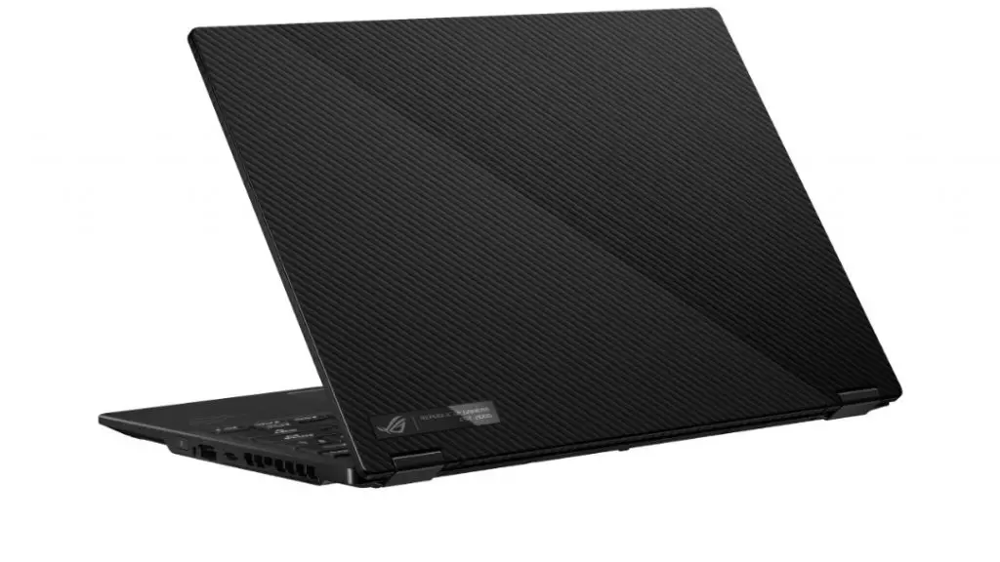
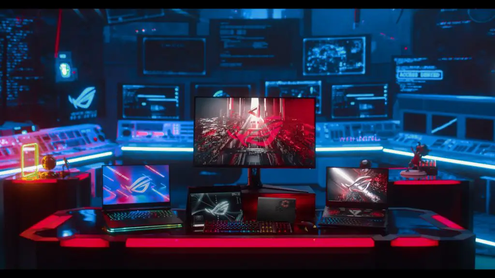

---
{
  title: "ASUS Made the Gaming Ultrabook of my Dreams – ASUS ROG Flow X13",
  published: "2021-01-12T11:41:48-08:00",
  ogLink: "https://noisypixel.net/asus-made-the-gaming-ultrabook-of-my-dreams-asus-rog-flow-x13/",
}
---

Back when I started university 5 years ago, you had a choice between a thin and light laptop that could run source games if you were lucky or a 5 lb laptop that could actually run games at 1080p. All I really wanted though was a 2 in 1 laptop that was light enough to use as a tablet but strong enough so I can put it in stand mode at the student lounge, kick back and play some games with a 360 controller. Today, ASUS made that dream a reality, with the bonus feature of coming with a one cable 63gbps dock that has an RTX 3080.

<!-- ezoic_video_placeholder-under_first_paragraph-640x360-999998-clearholder -->

<!-- ezoic_video_placeholder-under_first_paragraph-640x360-999998-nonexxxclearxxxblock -->

<!-- ezoic_video_placeholder-under_first_paragraph-426x240-999998-clearholder -->

<!-- ezoic_video_placeholder-under_first_paragraph-426x240-999998-nonexxxclearxxxblock -->

<!-- ezoic_video_placeholder-under_first_paragraph-384x216-999998-clearholder -->

<!-- ezoic_video_placeholder-under_first_paragraph-384x216-999998-nonexxxclearxxxblock -->

The ASUS ROG Flow X13 is a 2.9 lb gaming ultrabook 2 in 1 specced with the brand new AMD Ryzen 9 5980HS, an 8 core processor with the latest Zen 3 architecture on the 7nm process. It also has a built-in GTX 1650, a GPU you usually would need to step up in the weight class to get, and should be enough for lighter eSports games. The laptop comes with a 100w Type C charger so you’ll be able to game at full power with the 1650 just using a type C charger instead of needing a barrel connector.

\
If you want to get more gaming grunt, you can buy the XG Mobile, a 2.2 lb eGPU that comes with a top of the line RTX 3080 with a special connector that allows for 63Gbps. A problem with current eGPUs in the market is that the TB3/TB4 40Gbps bottlenecks the GPUs, but with this connector, that shouldn’t be an issue and it’ll allow you to leave this on your desk and hook up to multiple high res displays and connect back to your laptop with one cable, which has been basically the dream since eGPUs have come out but there was always compromises in the past. It’s portable enough to carry around if you happen to be going on a trip for long term, but with enough bandwidth to leave at home and provide the one cable dream that many in the tech community have been wanting for so long.

The X13 comes with either a 120Hz 1080p panel or a 4K screen, both in their 16:10 varients. While 4K displays might seem like overkill for this size and you’ll probably be more than content with the 1080p display, just a reminder that 4K will be sharp for text and desktop use, but you can always use integer scaling with modern GPUs, run the games at 1080p and still have a sharp and clean image. ASUS says that the ideal configuration for cooling is in stand or tent mode because the cooling system has fresh and easy access to air.

<!-- ezoic_video_placeholder-under_second_paragraph-640x360-999997-clearholder -->

<!-- ezoic_video_placeholder-under_second_paragraph-640x360-999997-nonexxxclearxxxblock -->

<!-- ezoic_video_placeholder-under_second_paragraph-426x240-999997-clearholder -->

<!-- ezoic_video_placeholder-under_second_paragraph-426x240-999997-nonexxxclearxxxblock -->

<!-- ezoic_video_placeholder-under_second_paragraph-384x216-999997-clearholder -->

<!-- ezoic_video_placeholder-under_second_paragraph-384x216-999997-nonexxxclearxxxblock -->

\
Pricing isn’t available yet but expect to pay a lot. The laptop should be available in North America in Q1 2021.
