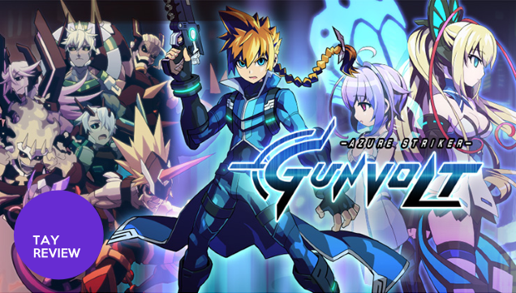
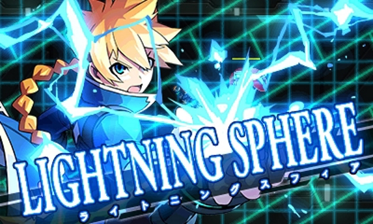
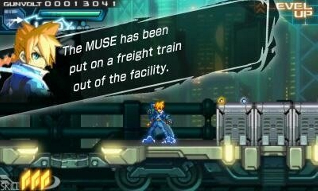
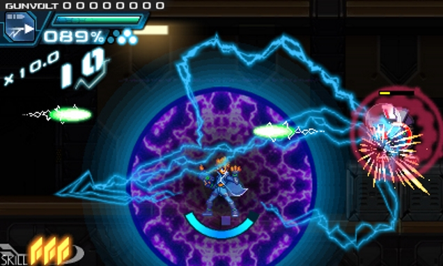
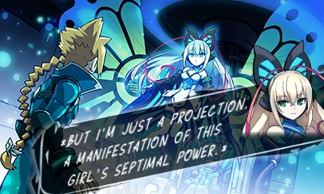
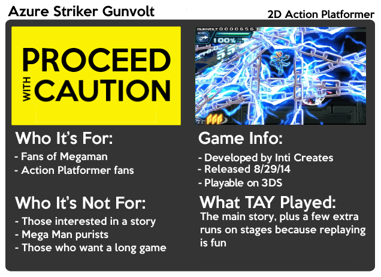

---
{
	title: "Azure Striker Gunvolt : The TAY Review",
	published: "2014-09-18T15:30:00-04:00",
	tags: ["Rockmandash Reviews", "TAY Review", "Azure Striker Gunvolt", "Inti Creates", "Mega Man", "Megaman"],
	kinjaArticle: true
}
---

When I heard about Azure Striker Gunvolt, I was excited. For years now, the guys at Inti Creates have been making great games like Mega Man Zero and ZX, and to hear that they would finally step out of Capcom's shadow and publish their own game was nothing but great news for me. Now that they've put out an eShop game, how good is it? Let's find out.

#### It's Beautiful.

Azure Striker Gunvolt has a very stylistic presentation, just like everything Inti Creates makes. The style they have is one I've appreciated over the years, and I just love to look at it. This style is very prominent (even moreso than the past) in Azure Gunvolt and it is beautiful. Everything about this game is stylized, from the UI to the amazingly detailed and fluid 2D sprite art to the typography. The character designs are great, the world looks amazing, and it all blends together to make a game that stands out from the crowd.

#### It's good to be back.

While I usually spend most of my time on TAY writing about Visual Novels and Anime, I'm a big fan of Mega Man, if my username didn't make that obvious. Azure Striker Gunvolt has the same structure with the boss at the the end of every level like the Mega Man games, and after years of having nothing to fill that void that Mega Man used to occupy, it's good to be back. It's a lot of fun going through this style of game, and I'm looking forward to more.

#### This game wants you to play well.

I don't think I've ever played a game that makes playing well as satisfying as ASG. The game is engineered for you to have fun playing through the levels as best as you can with its stellar hit count system. It's not exactly about finishing the game, but more about how much you are willing to test yourself. Yes, you can get that C Rank and be happy with it, or you can get that S rank to hear that epic music that only kicks in when you are playing really well. This also provides quite a bit of replay value, and it was a pleasant surprise. It also has a NG+ for those interested.

#### Doing its own thing, even if it's stumbling.

While this is heavily influenced by Inti Creates's previous works, this is not a successor to MM ZXA, nor does it play like it. The core of the game is the same, but everything else is radically different. Gunvolt has a different philosophy than Mega Man on how things should be played. This happens because of 2 elements of Gunvolt's gameplay: the game's mechanics and Gunvolt himself.

Most of the tweaks are due to the 2 main mechanics this game has: Flashfield, and Prevasion. In Gunvolt, you don't really have any weapons that dish a lot of damage; the way you deal damage in this game is by tagging enemies with your gun, then using the Flashfield, a strong attack that also doubles as a shield. The Flashfield is really powerful and can be a lot of fun; it blocks attacks while dishing them out, it's extremely satisfying to see your enemies be destroyed with it, and to see things be repelled from the Flashfield is entertaining, but I have quite a few gripes with it. I'm not a big fan of how busy it looks when you are using it, the tagging system can be awkward at times, and in my opinion, it makes the game feel quite easy (I'll get to that later).

Prevasion is a defense mechanism. If you still have space in your flashfield bar and you take a hit, your health doesn't go down, instead your flashfield bar goes down. Both of these mean that worrying about your own health becomes much less of an issue because the game pretty much covers for you, but on the negative side, it also makes staying alive too easy for the exact same reason.

Gunvolt does not handle like Zero and the like. Gunvolt is less mobile, and his sprite feels quite large in comparison. There are also a lot of minor changes that alter how Gunvolt controls in comparison, like how the wall jump has been nerfed, and like how Flashfield in the air you get a hover ability, but these changes add up and make it feel... off. Controlling Gunvolt takes a while to get used to, but eventually you'll adjust to it and it won't feel so awkward.

The fact that dodging is no longer important bugged me a lot; it ruined all the feeling of challenge and fun that I typically associate with the MMZ games and it made the game a breeze. The Flashfield and Pervasion make ASG a cakewalk and nearly impossible to die in, because it spends all of its time protecting you. The control, challenge, and agility were what made MMZ and MMZX exhilarating and amazing for me. Even though I had fun in ASG, it was never at the levels of MMZ and MMZX. The only time it even got close was when I was going against the rival and the final boss, which required actual dodging to play, which was more like MMZX than the rest of ASG. ASG's not bad per se, it's still a fun system, it still controls well, and I had fun playing it... but it's kind of a letdown.

#### Story? What Story?

Azure Striker Gunvolt is a game that is not about the story, and it doesn't try to hide it. It doesn't try to develop characters or build the world, which I find is a shame. The basic premise is pretty similar to MMZX: the Sumersgi Corporation is controlling the world by controlling the Adept, this game's equivalent to reploids. The main character is part of the resistance fighting against this evil corporation, and it's up to you to beat them while protecting this girl they treated poorly. While the plot sounds boring, it's the nuances however that make this so interesting yet a letdown because of a poor execution. The characters each have a personality that is interesting, but the lack of development make it so disappointing. The world is built in a way that makes you curious, but never satisfies the curiosity. The plot is there to move you from one stage to another, and that works for a game like this, but it could have been so much more. In MMZ, the story was fleshed out enough so that it complimented the gameplay. In ASG, the story gets in the way, and it's such a disappointment.

#### Meh-sic

I've come to expect great things from Ippo Yamada, who's made the music for all of the Inti Creates games, and he returns to do the soundtrack for ASG. The soundtrack in this game didn't do anything special, and I didn't really care for it. While it did have some tracks that sounded great (like Reincarnation), and none of the tracks were bad, a good majority of the soundtrack was average and forgettable.

#### That was short.

5 hours. That's it. I was expecting so much more. If they made it longer, I think they could have been able to flesh out the plot a bit more and add more content, but I shouldn't be complaining about the length of an eShop game, and the replay value helps make this up.

I came into Azure Striker Gunvolt looking for another Mega Man. "What I found was a game that had the same essence of the games I love, but not some of the little things that they did right. It's a good game that you'll probably enjoy if you are a fan of the series, but I can't help but feel a bit disappointed.

