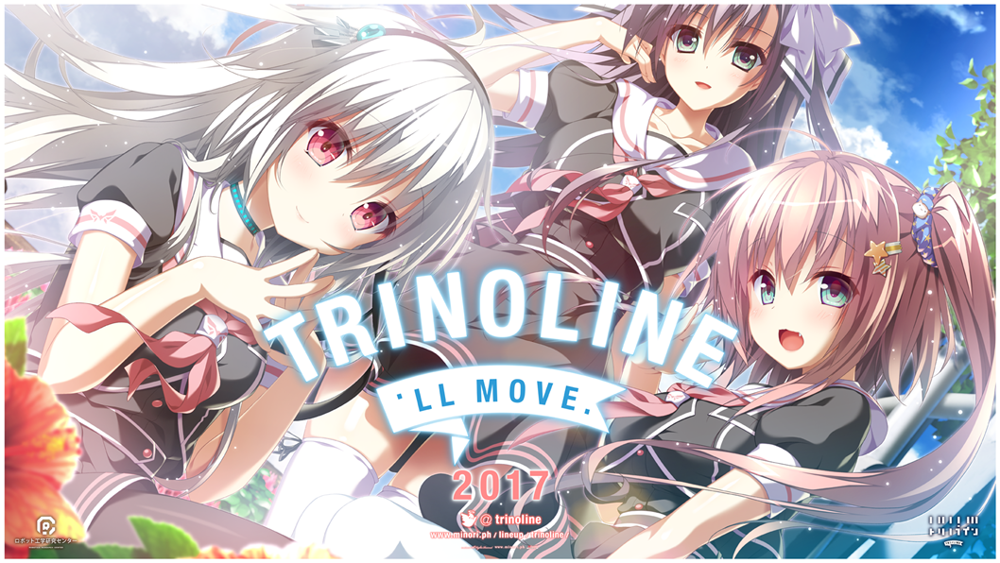
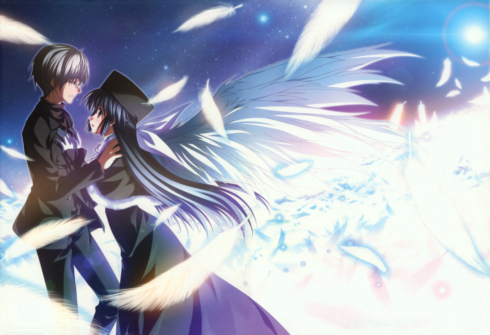
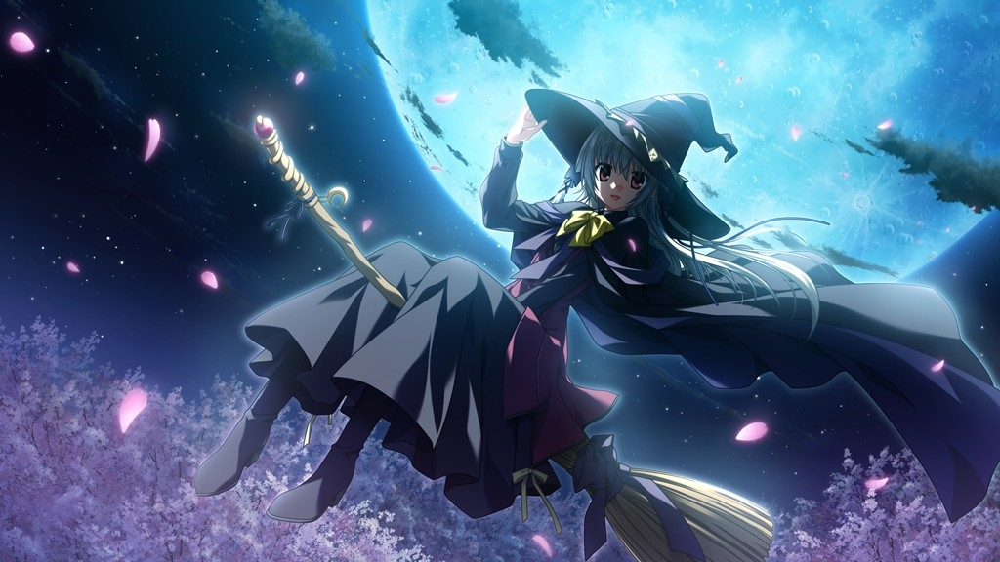

---
{
  title: "Experiencing AX: The nbkz/Minori Panel",
  tags: ["AX 2016", "AniTAY", "Rockmandash Rambles", "nbkz", "minori"],
  published: "2016-07-20T18:01:00-04:00",
  attached: [],
  kinjaArticle: true,
}
---

If you follow my twitter, you’d know that during the nbkz/minori panel they
  announced their next project, but this panel wasn’t just a launch pad for the next game, it was much more than that.
  On paper it was just your typial Q &amp; A, but in reality it was a blunt and honest reminder of the state of the VN
  industry and how well Visual Novels are doing in the west, one that flied against the hype of the industry while being
  quintessentially Minori. 

If you don’t know anything about minori, it’s best to start off knowing that they
  used to be the game division of ComixWave, Makoto Shinkai’s studio. Like one would expect from that, Minori is a
  company that has been quietly aiming for perfection, crafting beautiful and perfectionist yet sad and depressing
  romances that tend to fly under the radar. Really, minori’s works are rather similar to ComixWave’s IMO other than the
  fact that they make VNs instead of anime movies, (with the exception that Minori’s ef did get a rather popular anime).
  The guest of honor who came to AX was the Unlike most in the buisness, this panel followed their perfectionism in a
  realistic light, being bluntly honest about where they were and where they have been while the others would have just
  hyped everything up. The panel was filled with talking about how great their works were, yet talking about how bad
  their works of the past were in comparison to those that were new. It was an embodiment of minori itself, showing both
  the ups and downs on the path of their perfectionist past, as well as showing a light to the future that may or may
  not be bright.

For me at least, this all starts off with the line to the panel: While it was on the
  last day, I didn’t expect the line to be as depressing as it was. I try to make a habit of going to the line an hour
  early (because I like to guarentee a spot and like hell I’m spending 350 on a premium pass when I can get my black
  friday pass for 35), but this resulted in me being the second in line, with the third person coming in 20 minutes
  before the panel, 40 minutes of waiting while the line for the panel after our minori one (a Bandai Namco panel) was
  filling up with more people than ours. When we walked into the panel there was a fair amount of people there so I
  didn’t fell too bad, but it was way less than I expected, with me managing to score a second row seat behind a
  Mangagamer guy. Mangagamer wasn’t so focused on recording as they didn’t do any recording other than a few snippets
  here and there, but I do have a recording if subpar. I didn’t have a tripod so it’s shaky but I have it here for you
  to see. (Currently working on it, the article will be updated when it comes out)

<iframe allow="accelerometer; autoplay; clipboard-write; encrypted-media; gyroscope; picture-in-picture" allowfullscreen="" frameborder="0" height="315" src="https://www.youtube.com/embed/J_rLTcJDj84" width="560"></iframe>

<iframe allow="accelerometer; autoplay; clipboard-write; encrypted-media; gyroscope; picture-in-picture" allowfullscreen="" frameborder="0" height="315" src="https://www.youtube.com/embed/iQtzt_1HpOM" width="560"></iframe>

The panel was a display of history for Minori ordered via games from earliest to newest,
  starting off with an OP of <a class="sc-1out364-0 hMndXN sc-145m8ut-0 gIacKn js_link" data-ga='[["Embedded Url","External link","http://rockmandash12.kinja.com/rockmandash-reviews-ef-a-fairy-tale-of-the-two-visu-1646035015",{"metric25":1}]]' href="http://rockmandash12.kinja.com/rockmandash-reviews-ef-a-fairy-tale-of-the-two-visu-1646035015" rel="noopener noreferrer" target="_blank">ef - a fairy tale of the two</a>,
  the first game by them that got popular in the west. After the trailer was shown, nbkz raddled off some comments about
  it, mentioning that ef is now 10 year old, given that it released in 2006, and because work on ef started in 2003, it
  “feels kind of old” to him. Also, seeing this trailer, reflecting back on the game brings back memories working with
  the director and the project in general. Nbkz mentioned that originally the game only had 3 main chars but as the long
  development cycle stretched on, they added more and more, to the point that Mizuki got incorporated with Yuuko’s story
  to tie them together. To nbkz, this was the best way showcase the story, and according to him it’s the #1 game in
  Japan.  After that we got into the Q &amp; A, which was using questions from online until the very end. We
  started off with the curious question of What does ef mean? Aperently nbkz didn’t give much thought into it, making it
  into an abreviation for many aspects of the game like the OP of the Anime Euphoric Field. Ef’s original title was
  apparently Angel Sunday, a name used for the fandisc of ef. nblz also mentioned that there were lots wordplay in the
  anime in the form of easter eggs, like if line up all the episode titles, they become lyrics.   Then they asked
  a second question, on if making ef was a memorable experience? According to nbkz, he remembers that it was hard,
  having to work hard for a very long time, so long that he couldn’t see end of the game, mentioning that he has
  nightmares about the game development process. To me, this was fascinating and shows how open minori is now: most
  people understand game development has a hard and arduous process, but most people wouldn’t say it. Minori, being the
  company they are faces reality and shows this reality to us, something I really appreciated especially in comparison
  to the hype train that others may bring.

<iframe allow="accelerometer; autoplay; clipboard-write; encrypted-media; gyroscope; picture-in-picture" allowfullscreen="" frameborder="0" height="315" src="https://www.youtube.com/embed/2YcuqMnZrns" width="560"></iframe>

 Next was a discussion on <a class="sc-1out364-0 hMndXN sc-145m8ut-0 gIacKn js_link" data-ga='[["Embedded Url","External link","http://anitay.kinja.com/ani-tay-reviews-eden-they-were-only-two-on-the-pla-1683418341",{"metric25":1}]]' href="http://anitay.kinja.com/ani-tay-reviews-eden-they-were-only-two-on-the-pla-1683418341" rel="noopener noreferrer" target="_blank">Eden*</a>, a SciFi kinetic novel that was pretty successful in the west. Not many
  comments from nbkz this time other than noting it’s been a while since he saw it, then they jumped straight into
  questions. The first question was about the nature of the VN, asking why was eden* a kinetic All Ages VN, and what
  sparked the idea of a post apocalyptic story? The answer was because of ef: due to it’s long length and development,
  they wanted to do something shorter, something different. Then nbkz went on to mention that ef was their best seller
  in japan, eden* is like a global counterpart, as it did very well in the west. They learned a lot about the market
  outside of japan because of it was well.  The next question was the same as last time, about what was memorable
  about making eden. Even though the game is short, it took them nearly the same amount of time because they worked hard
  on adding new technology to make the game look better like the bokeh in the games which helps the player focus on the
  character (yet the story was 1/4th of the size). Watching the OP, specifically the part where sion was walking on
  water reminded him about animating that, because animating a character putting their feet on the ground very hard
  thing to do. He mentioned that if you watch anime, they usually cut out that part because of how hard it can be to do
  so, and he was reminded about how annoyed some of the staff was because of nbkz’s demands. 

<iframe allow="accelerometer; autoplay; clipboard-write; encrypted-media; gyroscope; picture-in-picture" allowfullscreen="" frameborder="0" height="315" src="https://www.youtube.com/embed/SRrTd5_mYJk" width="560"></iframe>

 Then he showed Supipara, a game that we haven’t gotten yet, but apparently it didn’t do
  too well in japan. It’s still an unfinished work due to it’s episodic nature, but depending on sales in the west they
  may release the worldwide versions first (Though most people I talked to in the panel didn’t seem all that interested
  in the game.) Then nbkz mentioned that all of the minori tech that makes the games look so great are in Supipara ,
  like in the OP they had an impressive scene with the witch that they had to create a 3D environment for. It was kinda
  doom and gloom from there with a slight tinge of optimism, talking about how the Japanese PC Gaming industry is on a
  decline (something that goes against international trends), and that Japanese gamers like longer story so more compact
  works like they have been doing aren’t all that great, but they keep on making the games because nobody else does it
  the way they do and they are happy with the effort they put into the game. They want to surprise people, and in my
  opinion they have definitely done that, surprising the western audience with the sheer quality these games have to
  offer.   We then went to a Live Q&amp;A where not many questions were answered, but I got mine in with a
  question of asking What is it like working with tenmon (the composer for most of shinkai’s movies and all of minori’s
  works) and what think of his work. He gave a humorous response saying that he’s less demanding than Shinkai, then
  answered that he’s a good friend so it’s easy to work with him.

 Given all the talk about tech in this Q &amp; A, the question after mine was
about this tech, asking about if Minori was interested in VR, which nbkz awnsered no. According to nbkz, they want to
portray anime via the Visual Novel medium so all the steps they take are based off of that.   The question after
that was about how the previous games lead to ef, and the answer was pretty interesting, with nbkz saying that every
time they release a work they think they make best game out there, but when they reflect back, they are filled with
regret. Nbkz says he’d like to scrap it and start again, but that’s obviously not possible since it’s released to the
world so they use the motivation gained from this regret to make the next game, to make it as possible. In the case of
ef, the game that was developed before came ef (Haru no Ashito) wasn’t that great, and was kinda a testing ground.
nbkz had a vision that the rest of the team didn’t really get, so it didn’t really work too well. With ef, they had a
change in vision, so the failure of Haru no Ashioto directly led to to the game. Nbkz then mentioned that if they’re
ever completely satisfied with a work, that’s game over for minori, a prime example of the perfectionist nature that
embodies the company.

<iframe allow="accelerometer; autoplay; clipboard-write; encrypted-media; gyroscope; picture-in-picture" allowfullscreen="" frameborder="0" height="315" src="https://www.youtube.com/embed/dBBpfejM6P4" width="560"></iframe>

 They then cut the
  Q &amp; A to show off Trinolive, the world premiere (and gets it’s official announcement in Japan today, sorry for
  taking so long to write this up. Good thing I tweeted the news!). Trinolive is a game that is trying to bridge the gap
  between Japan and the west according to nbkz at this panel, the nice optimism in a bleak situation. It’s been 10 years
  since they blocked foreign IPs, and with Mangagamer’s help, they’ve really gone a long way since then but we have lots
  to go. While we’ve gone through depression and minori may not be in the best spot, they will continue in their path to
  perfection with us more and more in mind. This panel was an eye opener for me, one that allowed us to get into the
  viewpoint of those who make the VNs we know and love while allowing us to see how far we’ve gone and how far we need
  to go. It was quintessentially minori, and I wouldn’t have it any other way. 

<em>You’re reading Rockmandash Reviews, a blog focused on
  everything revolving Visual Novels. If you want to read more of my writing, check out </em><a class="sc-1out364-0 hMndXN sc-145m8ut-0 gIacKn js_link" data-ga='[["Embedded Url","External link","http://anitay.kinja.com/",{"metric25":1}]]' href="http://anitay.kinja.com/" rel="noopener noreferrer" target="_blank"><em>AniTAY</em></a><em>
  and </em><a class="sc-1out364-0 hMndXN sc-145m8ut-0 gIacKn js_link" data-ga='[["Embedded Url","External link","http://kmtech.kinja.com/#_ga=1.267439374.1243070986.1463716221",{"metric25":1}]]' href="http://kmtech.kinja.com/#_ga=1.267439374.1243070986.1463716221" rel="noopener noreferrer" target="_blank"><em>KMTech</em></a><em>.</em>

