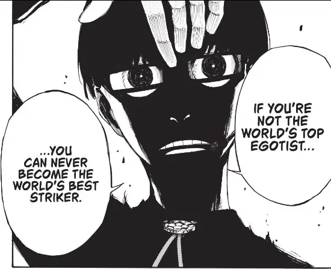
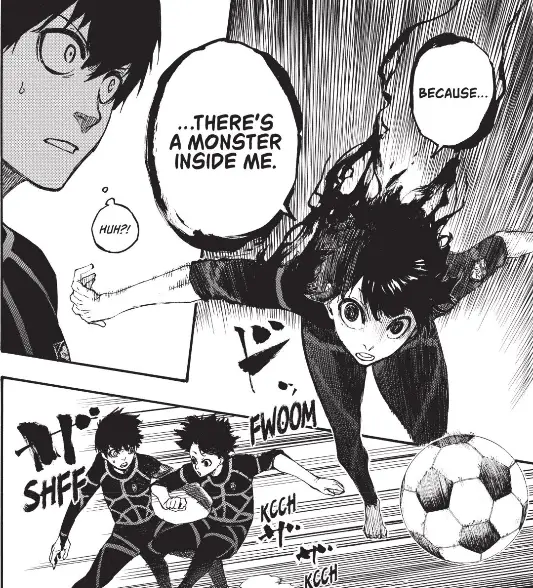

---
{
  title: "Blue Lock Vol. 1 Review – A Compelling Kick Start",
  published: "2021-04-20T16:07:39-07:00",
  originalLink: "https://noisypixel.net/blue-lock-vol-1-manga-review-manga/",
}
---

In my eyes, sports manga are a hidden gem of a genre within the manga community: while most of them don’t get much attention, they are often consistently great series by being effectively better-structured shounen than shounen itself. _Blue Lock Vol. 1_ pairs great sports anime with an interesting premise for an interesting and engaging opening.

In* Blue Lock*, the Japanese National Soccer/football team has been feeling the frustration of hitting a wall – while the team has improved significantly, often making the world cup, they’re nowhere near close to actually contending for it. They have great team players that play complementary roles, but they have a glaring weakness in the star position of striker. Enter the titular Blue Lock, the brainchild of Jinpachi Ego, a program that trains the best 300 up-and-coming strikers in incredibly unorthodox ways.

We follow Yoichi Isagi, a timid 2nd year whose high school team just lost the game that would have gotten them to the national championships. He becomes one of the 300 thrown into the Blue Lock program that’s smashed his preconceived notions of how soccer should be played: putting the desire to win and score ahead of being a team player.\

Volume 1 of _Blue Lock_ is a fascinating opening, and it does an incredible job of setting up the setting of Blue Lock itself, introducing the cast while being incredibly engaging. Already in the first few chapters of *Blue Lock *the series has made Isagi a likable character who has actual challenges and dilemmas, as well as creates bonds with characters Bachira in ways that feel natural. Aside from the cast,_ Blue Lock_ has a Death Game-y style to it which ratchets up tension like nothing else, and it’s absolutely a great fit with sports: the competitive nature of soccer meshes well with the do-or-die nature of a death game.

_Blue Lock_ is unique for sports manga, in the way that it’s focused more on training than the actual sport itself. Hell, outside of the cold open introduction of Isagi, volume 1 doesn’t even have a soccer game in it. This allows you to focus on what really makes the game tick, and the mindset of the cast instead of being thrown into the full game and having to learn all the rules immediately. As someone who’s not huge into soccer, I think this is great and found the structure of _Blue Lock_ is very compelling and has you wanting more and more.

To add to this, _Blue Lock_ is one of the coolest looking, heavily stylized sports manga out there: especially in volume one, its aesthetics leave a mark. The Blue Lock facility and assets like the introduction name tags are stark and striking, the faces and expressions are full of emotion and are very expressive, the character designs are distinct and unique. Blue look is a great-looking manga and uses its visuals to add to the story and engagement of the series itself.

_Blue Lock_ Vol. 1 is a great introduction to a sports anime with a fascinating and unique premise. It’s the start that makes you want to read more and is the exact kind of opening to a manga I like to see. It’s an engaging read throughout, doing a great job of setting up the characters and world while also being full of tension and leaving an impression. Looking forward to more.
