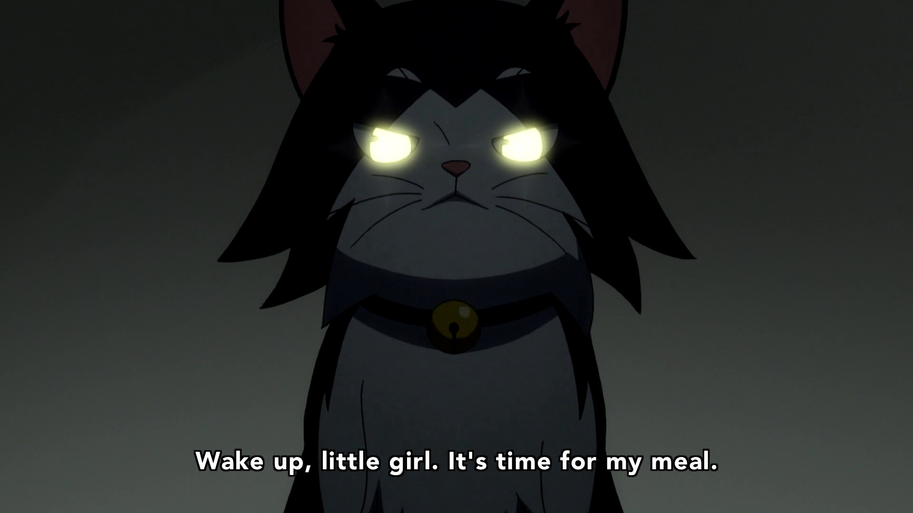
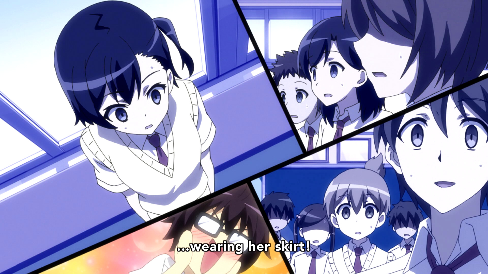
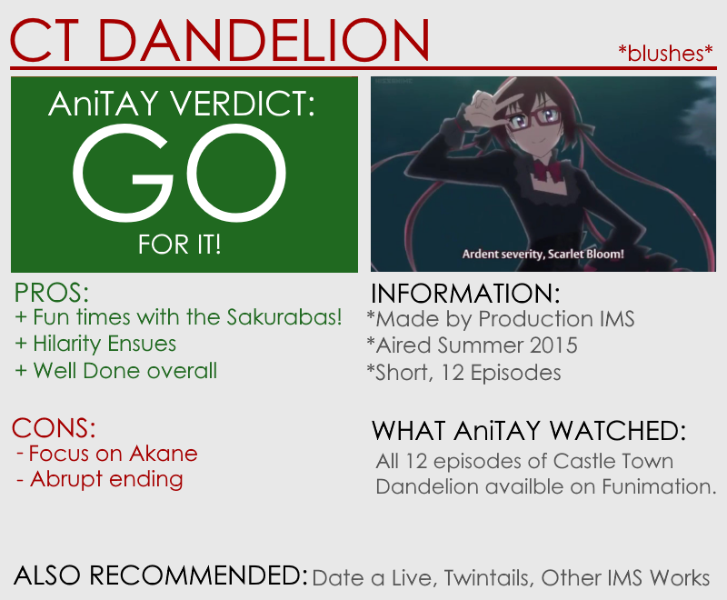

---
{
	title: "Castle Town Dandelion: The AniTAY Review",
	published: "2015-09-19T21:30:02-04:00",
	tags: ["Castle Town Dandelion", "The AniTAY Review", "Summer 2015", "AniTAY", "Rockmandash Reviews", "Production IMS"],
	kinjaArticle: true
}
---

The Sakurada family is a pretty ordinary family of eleven people living in a solitary house. Except for one tiny little fact: their father is the king, and each of the children has special powers. Also, to ensure their safety and to help citizens decide the next king, the town is observed by more than 200 security cameras. As you would expect, Hilarity Ensues.

 

# Interesting Characters With A Fun Premise

If the paragraph above peaked your interest, you’re at the right place, because the premise is handled well. It’s a funny slice of life comedy show with great characters, as the **Sakuraba family is an interesting group of people** and keep the show entertaining throughout. They’re a family and act like it, but because of the royalty factor, superpowers and personalities the show isn’t as generic as one may think and it keeps you interested and engaged. While they may be archetypical and don’t really grow throughout the series, every one of the family members shine by themselves, keeping the show interesting and hilarious, with even the side characters being handled really well. The handling of the election and the premise in general is fun, the characters are great, and it’s all pretty entertaining.

# In Production IMS We Trust

Which leads us into the next bit: the way Production IMS handles the show that makes it so entertaining. From the few shows that Production IMS has made like *Inari, Konkon, Koi Iroha*, *Twintails* and [*Date a Live II*](http://anitay.kinja.com/dexs-review-date-a-live-2-1590778711), IMS built a track record for themselves of well rounded, entertaining and engaging shows that don’t really have a lot of flaws, being some of the best of their respective seasons. You look at the checklist of what makes for a great show like good writing, pacing and tone of the work, characters, sound etc... and you won’t really find any flaws with their works ([except the animation...](https://i.imgur.com/WGtHBFc.jpg)). This trend continues here, as pretty much every aspect of this show is entertaining and done well, from the pacing to the characters. Production IMS is now one of my favorite animation studios for a reason, and they continue their wonderful track record.

# Hilarity Ensues

Did I mention this is a comedy show? Adapted from a four panel manga, this show is rather funny and does a great job getting you to laugh with it’s solid punchlines and focus on it’s gags. I had a smile on my face every time I was watching this show.

 

# **The Focus on Akane**

This one’s a bit ironic, considering her character, but it may be the biggest gripe that one may have on the show. Akane Sakuraba, who is the main character throughout the show, is extremely shy, and manages to get the most attention throughout the show, as most of the gags surround her. While I liked her character and didn’t really mind the focus, this may bother you.

# The Election Results/Ending

While the whole show was leading to the election and hinted at possibilities, the actual result and the ending of the show felt rather sudden, and the results may feel like they came out of nowhere because the show didn’t really lead to that ending, as it focused on other aspects the whole time. When thinking about it logically, it was the result that made the most sense, so it wasn’t too big of a deal for me, but that doesn’t mean it isn’t a flaw and won’t urk some.

*Castle Town Dandelion* is a fun little show that’s been overlooked by a lot of people this season, but that doesn’t keep it from being a joy for those who are actually watching it. While some may complain about the focus on Akane, this show really hits a lot of the boxes that a good slice of life comedy really should, and most people watching it should have a blast.

***

*You’re reading Ani-TAY, the anime-focused portion of Kotaku’s community-run blog, Talk Amongst Yourselves. Ani-TAY is a non-professional blog whose writers love everything anime related. Click *[*here*](http://anitay.kinja.com/)* to check us out. If you want to read more of my writing, check out *[*RockmanDash Reviews*](http://rockmandash12.kinja.com/)* and *[*KMTech*](http://kmtech.kinja.com/)*.*
