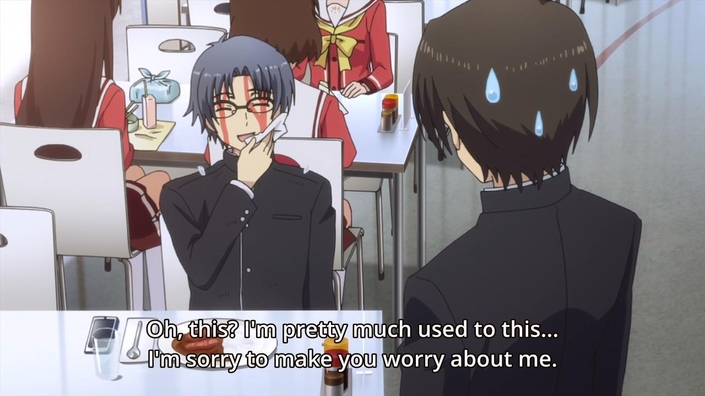
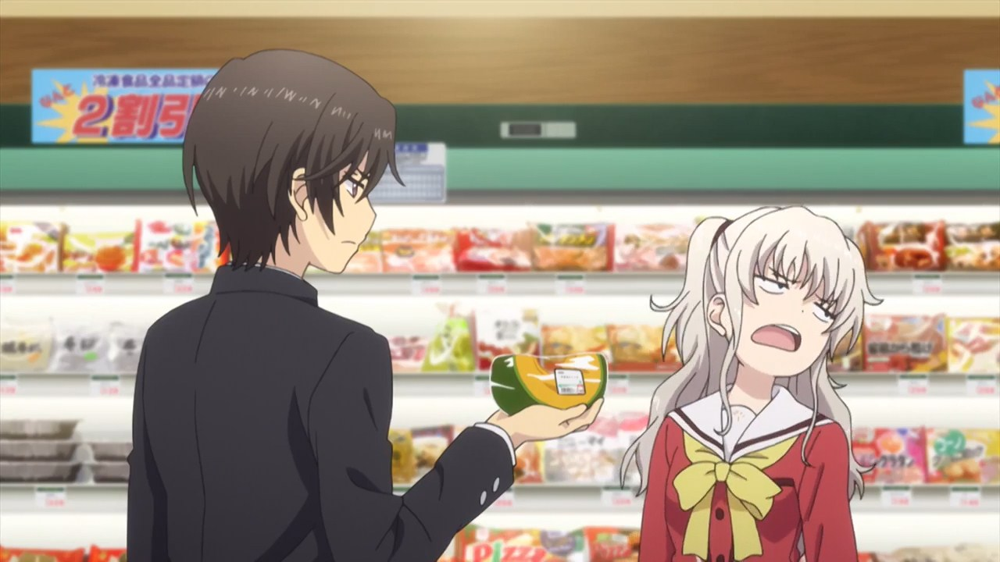
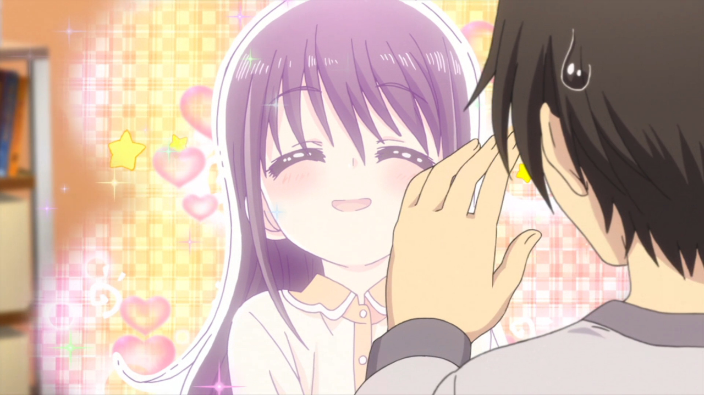
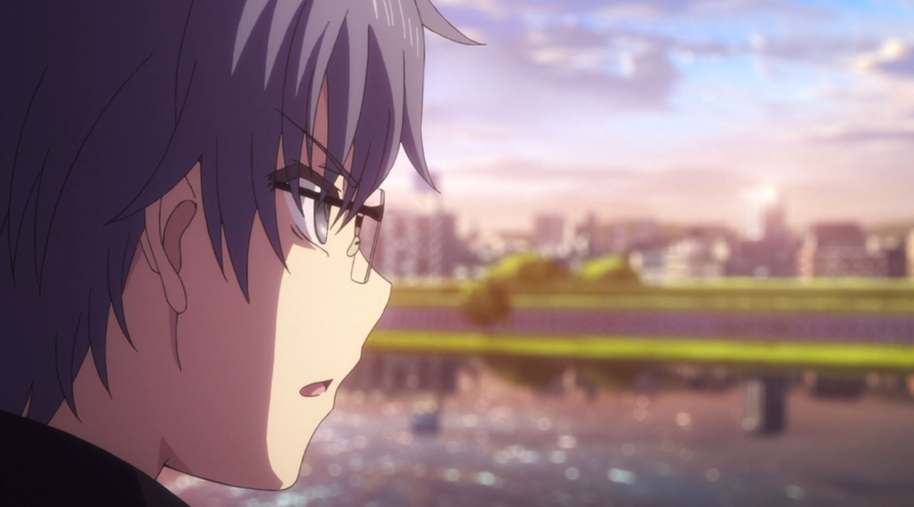
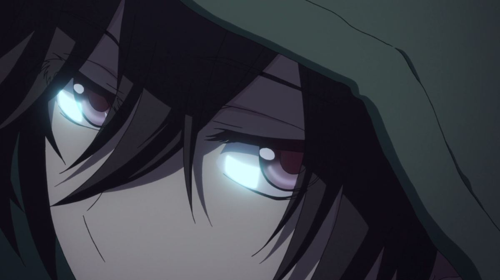
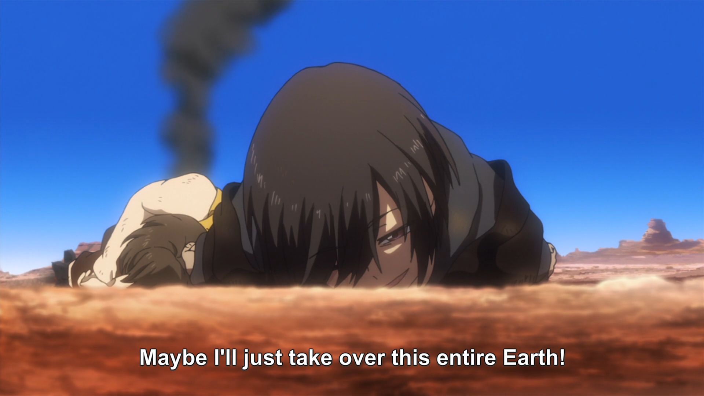
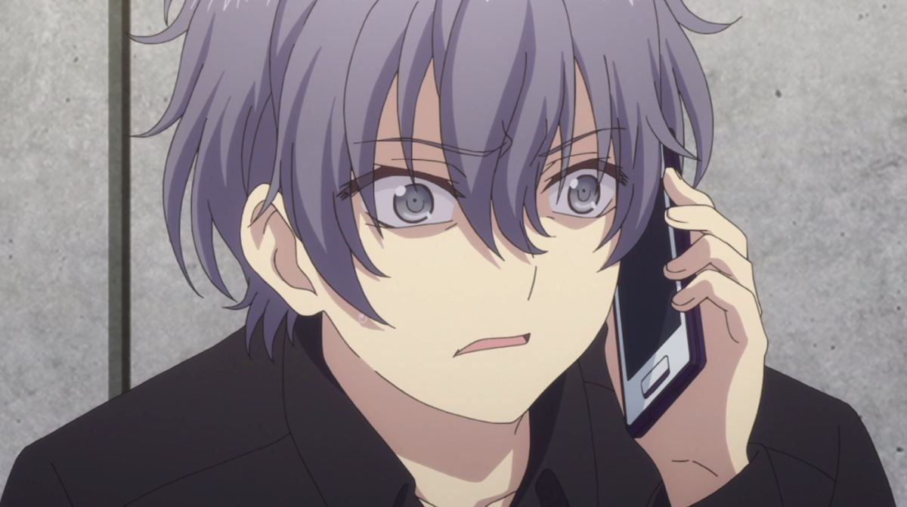
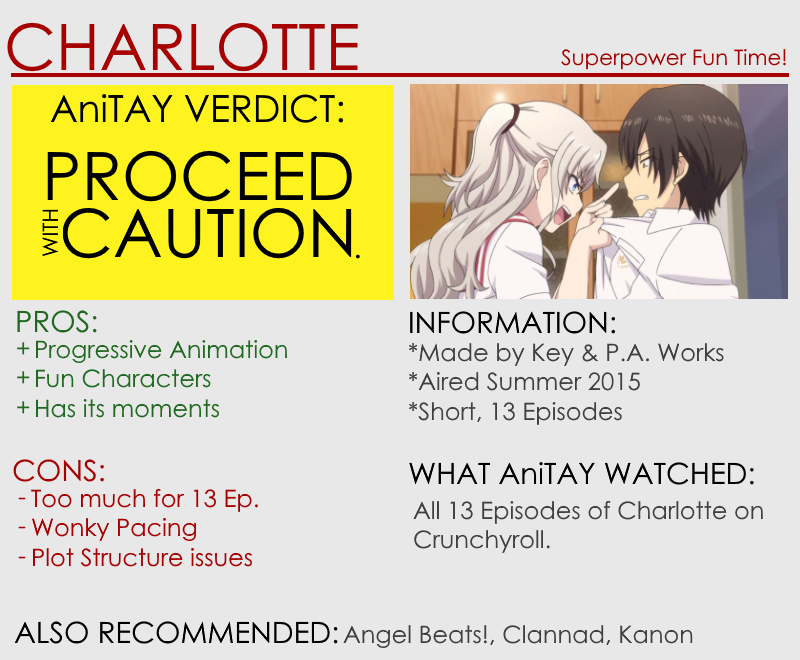

---
{
	title: "Charlotte : The AniTAY Review",
	published: "2015-09-28T12:00:00-04:00",
	tags: ["The AniTAY Review", "Charlotte", "Key Marathon", "Rockmandash Reviews", "Anime", "Key"],
	kinjaArticle: true
}
---

<video src="./1456859305190897809.mp4"></video>

When I first heard about *Charlotte*, I didn’t know what to think. For [Key](http://tay.kinja.com/rockmandash-reviews-key-marathon-wip-1606707641)’s 15th anniversary, They decided to pair up with PA Works, which sounds good on paper, especially because they both make great works that work well together, but the last time they did that, we got [*Angel Beats!*](/posts/rockmandash-reviews-angel-beats-anime-1618928342), a show that had feelz, but was quite flawed. What does that mean for *Charlotte*? Well, it’s more of the same.

# Interesting Execution of a Fun Premise

When I heard of *Charlotte*, I was rather excited, and the premise had a decent bit to do with that excitement. In *Charlotte*, there are children that are able to manifest superpowers upon reaching puberty, and throughout the story we follow those kids with superpowers. Our protagonist is Yuu Otosaka, who has the ability to temporarily possess others with the hopes to use his power to live an easygoing high school life but he is caught red-handed by the mysterious Nao Tomori and is forced to transfer to Hoshinoumi Academy, where he and the other student council members must help students who have trouble controlling their abilities. The show took that premise and handled it well, showing cool and interesting powers, making it so it wasn’t extremely stereotypical and handling the plot points well even when it went in a totally different direction than it showed in the beginning.

# A Great Cast

As a Key work, you can bet that they’ll do a great job with the characters, getting you interested and invested in the show and their fates... and you’d be right, for the most part. All of them are lively, interesting and fun to watch, with great personalities, great interactions, and interesting quirks that really make them shine. The show handled development of the characters well, and if you had to say there was a strong point, I’d say it’s the characters. Some may think they’re stereotypical or over exaggerated, but I didn’t see this as a problem, as I liked all of the characters they have shown and they kept the show interesting. Nao and Ayumi in particular were fantastic, with their interactions with our MC Yuu putting a smile on my face constantly.

# **Entertaining as Always**

It’s not just the characters too: this show is just an interesting and entertaining show in general. Solid slice of life, hilarious gags, super fun time with hilarious powers, you name it: This show was interesting and entertaining throughout, and it kept me engaged as I was watching the show. There’s a lot going on here, and it’s rather fun to watch, with this fun to watch factor being the reason so many people enjoyed this show.

# **Progressive Animation**

Since *Angel Beats!*, a lot has changed in this world, and one of that is the rise of P.A. Works, who have really improved in almost every aspect, now making much better anime then before, with some of the best visuals in the industry. This continues here, as P.A. Works [once aga](/posts/rockmandash-reviews-nagi-no-asukara-anime-1567969970#_ga=1.15697983.888615642.1438970662)[in delivers](/posts/rockmandash-reviews-hanasaku-iroha-anime-1642709329) with well drawn characters, great background art, a high level of polish throughout the show in regards to animation, an attention to detail that is rather appreciated, etc. Nothing but praise for the job P.A. Works did here, it’s beautiful.

**\*Also, Here’s a spoiler warning, as the next section has spoilers (but no direct ones). Skip the next section if you don’t want to be spoiled.\***

# Fall into Despair

Just... *wow*. Around the the middle of the show, *Charlotte* had significant change of tone, into a spiral of despair that changed the entire show while being absolutely amazing and breathtaking, if a bit short. With self loathing, a complete change of what our MC was, the lost of one you care about immensely and character development in ways that wouldn’t be possible otherwise, the fall to dispair in *Charlotte* was up there with stuff like *Welcome to the NHK*’s suicide episode by being moving, well done, engaging to watch, and extremely captivating, a demonstration of the greatness that this show could have been and maybe should have been but wasn’t, the best part of the show in my opinion. If only it was a bit longer...

# **Maeda’s back.**

It’s been a long time since Key did anything large (with the last major project being [*Rewrite*](/posts/rockmandash-reviews-rewrite-visual-novel-1609445042)*)*, and even longer since Jun Maeda actually did anything major writing wise... the last one being... *Angel Beats!*. Yeah..... I’m a rather big fan of Jun Maeda, the man who wrote [a story that’s fundamentally changed who I am](/posts/rockmandash-reviews-clannad-visual-novel-anime-1609437459/all#_ga=1.16287679.888615642.1438970662), and has made [some of my ](http://anitay.kinja.com/rockmandash-reviews-kanon-visual-novel-anime-1605160517)[favorite works](http://tay.kinja.com/rockmandash-reviews-key-marathon-wip-1606707641?rev=1443415689653), but those were VNs or adapted from VNs and this is an anime original. At least the music he made was good? Actually, it was fantastic, and I don’t think he’s ever fucked up a soundtrack he’s worked on, but that doesn’t make up for the story of the show.

**\*Also, here’s another spoiler warning, as the next section has spoilers, talking about the ending of the show. Skip to the conclusion if you don’t want to be spoiled, even if it doesn’t talk about the ending directly.\***

# **A Convoluted Mess of an Ending**

*Charlotte *has a seriously flawed ending. While the ending may have been entertaining throughout and the last few minutes really put a smile on my face (Yuu X Nao everyday!!!), it’s a total fucking mess. Once they threw in time travel, everything went downhill from here as the quality of writing, and the ability to comprehend the reason of plot elements or the elements themselves went down the drain from there. With villains who are super generic and don’t add anything to the plot, deus ex machinas were thrown all over the place, impossible developments that make you want to facepalm, and a convoluted, near impossible scheme in the last episode that could have been it’s own damn season, this has it all, but not in a good way... so even though I enjoyed the ride, I have to say that it’s seriously flawed, an example of things wrong with the story.

# A Horribly Flawed Plot Structure

As amazing as he is, Jun Maeda really does not know how to write an anime, as *Charlotte *runs into many of the same issues *Angel Beats!* has, mainly a horribly flawed plot structure that significantly hampers the story. When seeing what this show could have been with great potential from it’s interesting premise to the great characters, one would expect something great... but that’s not what we got because the structure is really poor, screaming horrible adaptation even though it isn’t one. From extreme filler at the beginning dragging out absolutely too long to the tonal shifting and erratic pacing that made many parts of the show feel rushed and undeveloped, the plot structure in *Charlotte* is all over the place and doesn’t really make too much sense: another work that tried to cram way too much into too little time.

While *Charlotte *isn’t nearly as bad as *Angel Beats!* because it doesn’t have a massive hype train saying it’s the best anime ever, it limits itself to a few characters so they’re interesting and is generally entertaining throughout the show, it has a lot of the same issues as before, and executed similarly. It was done poorly, developments fell flat on their back, atrocious pacing, and the story doesn’t even know what it wants to do: it goes from a slow, slice of life, monster of the week to a rushed, character focused and rather morbid story with a lot of back story, to a last episode that could have been a whole cour itself... it’s sporadic and a mess.

<video src="./1456859307855441809.mp4"></video>

Floating around [/r/anime](https://www.reddit.com/r/anime/comments/3mk09v/visual_representation_of_charlottes_pacing_and/), this gif really demonstrates what it feels like watching *Charlotte*: watching and anticipating the event you’ve been looking forward to come by, only for it to rush by and pull you down while continuing around you, and developments falling flat on their face... it’s not the most pleasant experience. That being said, while it’s ultimately a flawed experience, it’s not frustratingly flawed like angel beats because it knew some of its limits, not to throw more characters than it new how to work with and actually develop those that are important... but it’s another testament to the fact that Jun Maeda and other VN writers should probably be doing VNs along with [*Grisaia*](http://anitay.kinja.com/grisaia-no-kajitsu-the-anime-you-should-not-be-watchin-1651115065)*, *[*Punch Line*](http://anitay.kinja.com/punch-line-the-ani-tay-review-1713427515#_ga=1.16346175.888615642.1438970662), [*Fate/stay night: Unlimited Blade Works*](/posts/fate-stay-night-unlimited-blade-works-tv-is-beautifu-1642722982#_ga=1.83338399.888615642.1438970662), and on and on and on. If adapted right, like ([*Clannad*](/posts/rockmandash-reviews-clannad-visual-novel-anime-1609437459/all#_ga=1.46179374.888615642.1438970662), [*White Album 2*](http://tay.kinja.com/dexs-review-white-album-2-1488422133), [*Steins;Gate*](http://tay.kinja.com/rockmandash-reviews-steins-gate-visual-novel-anime-1557342550), etc.), Visual Novels have the potential to be some of the best in the medium, but if not, which is much more common, they crash and burn: Anime has time limits and is serialized while VNs have a lot of time, along with elements like multiple branching routes. By adapting them or adapting the writing style to anime, you run into the exact same issues all of these face: boring beginning, rushed plot, flawed structure... not the best things for an anime, and pretty much everything i’ve been saying here and throughout my anime reviews of these works. ([*Rewrite ;-;*](http://xjpegx.kinja.com/rewrite-anime-adaption-announced-1733174423#_ga=1.247426189.888615642.1438970662)*)*

# Conclusion

Another original Key anime, another round of disappointment. While it has it’s moments, was a fun experience and does a lot right, there’s too much it does wrong, wasted potential due to a piss poor structure that includes stuff like wonky pacing, and a story that’s all over the place. I wanted to love it, but that isn’t the case, a work that, while it didn’t piss me off to no end like *Angel Beats*, isn’t amazing but merely “good”. What a work this is...

**Overall: 7.5/10, Polarization +1, - 3**

 

***

*You’re reading Ani-TAY, the anime-focused portion of Kotaku’s community-run blog, Talk Amongst Yourselves. Ani-TAY is a non-professional blog whose writers love everything anime related. Click *[*here*](http://anitay.kinja.com/)* to check us out. If you want to read more of my writing, check out *[*RockmanDash Reviews*](/posts/)* and *[*KMTech*](http://kmtech.kinja.com/)*.*
