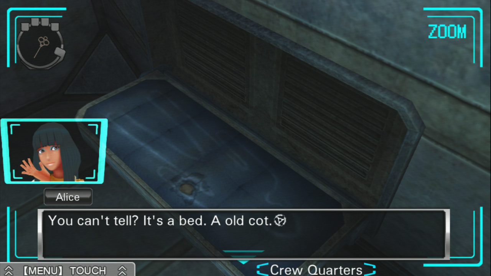
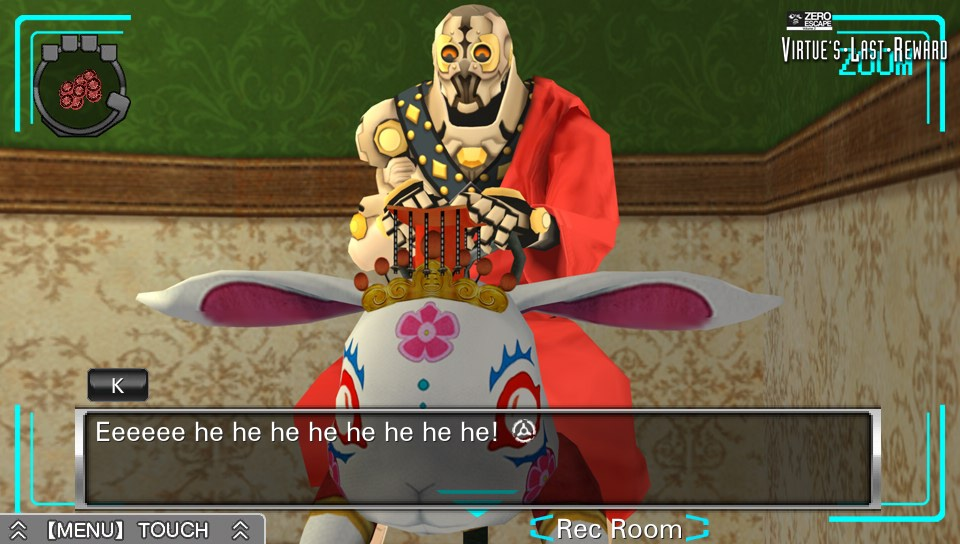
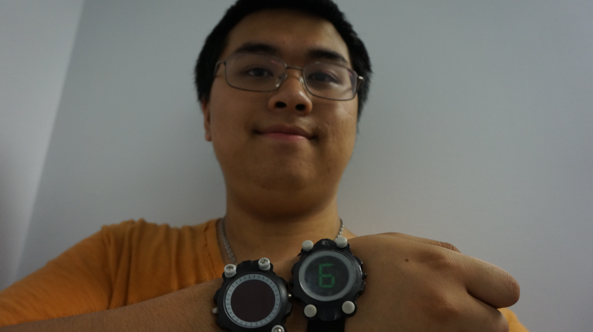

---
{
	title: "Countdown to AX: Experiencing Real Zero Escape",
	published: "2016-06-30T14:45:00-04:00",
	tags: ["Anime Expo 2016", "Real Zero Escape", "Rockmandash Rambles", "Zero Escape", "Scrap Entertainment", "Countdown to AX", "AX 2016"],
	kinjaArticle: true
}
---

A few months ago, Kotaro Uchikoshi announced a project that seemed to be a promise of a dream, but unfortunately this promise would become a reality to a few people. Starting on April 15th, Scrap Entertainment was bringing Uchikoshi’s *Zero Escape* into a reality through what they call a *Real Zero Escape* game, a simulation trap room with the purpose of seeking the way out (in this case, before an hour is up). Today I’m here to tell you what it’s like, as well as my personal experience with it.\
\
Before we continue on with this article, I’m just going to mark a disclaimer: *Real Zero Escape is still going on, so they didn’t allow us to record any footage or take any pictures of the event itself. *This means that have pictures of outside it but nothing of inside the puzzle itself and will be using screenshots of the game, so keep that in mind. Also, because it’s still running, I’ll try to keep it spoiler-light in case anyone wants to go to LA for it, but I will expect *Zero Escape* knowledge and will have to mention specific things about the event to discuss my experience.

***

The first thing that I noticed that while this is very much a *Zero Escape* game, this is licenced so don’t come in expecting everything that one would get from *Zero Escape*. On their website, they describe the event as a “ live, puzzle-oriented entertainment escape game based on the Zero Escape video game series.”, and it’s an apt description, being a theme park version of what we know and love made for entertainment without the tone and tension that has given this series the M rating. This is a Scrap game not a Spike Chunsoft game after all, so they need to cater to their previous audience and casuals as a whole. To me at least, the result is can be described as a *Zero Escape Lite*, being a basic escape game with haunting music but reducing the premise to an incentive without a nonary game, without conflict between the characters or even an antagonist. This is most prominent in relations to how cooperation worked in RZE: while in *Zero Escape* you would have to doubt your opponents because they could potentially (and would) kill you, in RZE you have to put your faith in the other teams and work with them. This was probably for the best for most people though, because while it may detract from complete immersion from some Zero Escape diehard like myself, most people aren’t that, with my group being a shining example: in my group about half of them were *Zero Escape *fans, with even less finishing VLR, let alone starting ZTD.

Even though Scrap decided to handle the game this way, they did their best to make it the best they could and I can’t describe i as anything but a love letter to *Zero Escape*, and this games very much the series I know and love. The rooms and the scenarios are extremely faithful to the source to the point that they would throw in easter eggs like the funyarinpa (though it’s completely based on VLR which caught me on surprise) and when I “awoke from my slumber” (opened my eyes into the set) for the first time, I was blown away by how great it looked, and how faithful it was (Though, it wasn’t dilapidated). In the game, the 9 people (there were only 7 in our game so some had multiple bracelets) were split into 3 rooms via the chromatic doors like in VLR, and as I entered the green room, I could only serve to be impressed. The atmosphere was amazing, props were cool, and the rooms were themed extremely well, color coded to the point that each room had a distinct atmosphere and feel. The puzzles seemed a bit esoteric to me early on, but we started rolling and they were done in away that was very ZE, something that really got me into the game.

The experience as a whole was very much a kind of dream come true for a fan like me, the dream of being fully immersed in *Zero Escape*. Being in a room and interacting a ZE style escape room instead of pointing and clicking like in the game, it was a step that I can’t help but be excited by. We’ve been talking about Virtual Reality for a long time, but nothing can quite beat actual reality itself, and I was completely immersed in the world of *Zero Escape* for an entire hour, my entire peripheral vision being *Zero Escape *with nothing there to distract me from it, no screen to peer into, and it was awesome. The best way to explain the experience is like is to imagine doing what occurs in the game (like finding passwords to unlock a box), and then doing it in real life, completely immersed in the game (with a few aspects that may break your suspension of disbelief though ¯\\\_(ツ)\_/¯). While one’s *Zero Escape* experience can help you with the game, there were things that could surprise you. I was pleasantly surprised by the banter I had with my partner in my room, the time crunch played a bigger role than I thought considering how absent it is from VLR, and there were definitely aspects that scrap enthusiasts would be much better than a *Zero Escape* fan like me (The record holder are scrap people who got out in 33 minutes).

All of this was made even better for me when I take my personal context into account. You may not care, but for me experiencing Real Zero Escape for me was a bunch of coincidences coming together in a perfect combination of luck, allowing me to experience something amazing and in the end I’m greatful for it. After last year’s amazing Anime Expo, I decided to come to LA for AX so I wouldn’t miss all the Visual Novel action, and as I was planning the trip, something popped up on my Facebook that got my very excited, *Real Zero Escape*. Thanks to some unfortunate situations in AniTAY’s AX plans and the costs to go to LA, I decided to come early, which worked out because all the RZE events during AX were booked. So, 2 days before AX day 0 I picked up the dream come true via ZTD, and day before it I came into town early, ready to have a blast with an Uchikoshi work, which I did (check my other countdown to AX post when that goes live), and that combined with this event make my dreams come true.

In the end, we didn’t get out because the people in the other rooms were too slow to figure out that we needed to work together, but even given that it was an experience that I’m glad I was able to do, a real life version of one of my favorite games and a fun and enjoyable experience regardless. I’m extremely grateful that I was able to play this, an immersive experience that enables me to be in the world of *Zero Escape*, something I truly love. If you’re in LA and are a *Zero Escape* fan, you owe it to yourself to give it a shot, it’s an experience that shouldn’t be missed. *If only it was in more cities...*

***

*You’re reading Ani-TAY, the anime-focused portion of Kotaku’s community-run blog, Talk Amongst Yourselves. Ani-TAY is a non-professional blog whose writers love everything anime related. Click *[*here*](http://anitay.kinja.com/)* to check us out. If you want to read more of my writing, check out *[*RockmanDash Reviews*](/people/reikaze)* and *[*KMTech*](http://kmtech.kinja.com/)*.*
