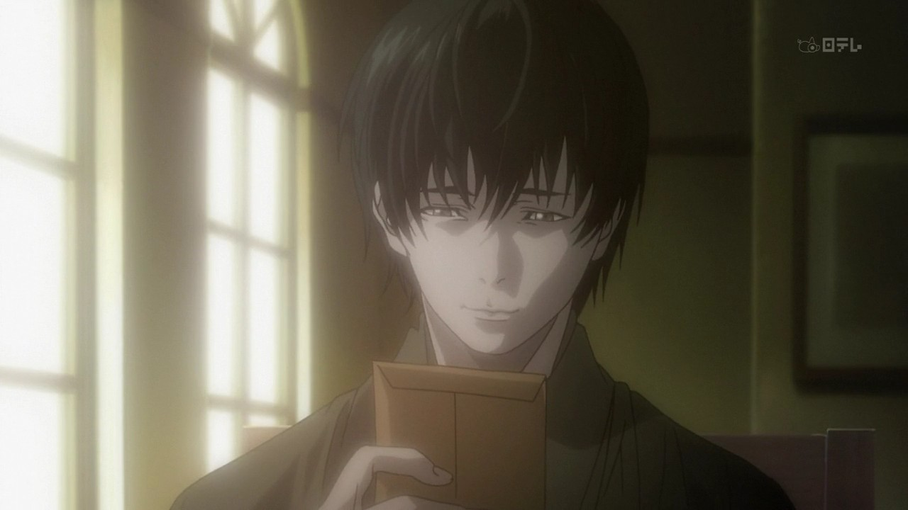

---
{
	title: '"Dark & Serious" Anime - A Paradigm of Disappointment',
	published: "2014-11-05T22:54:00-05:00",
	tags: ["Rockmandash Rambles", "Dark", "Serious", "Anime", "Discussion", "Opinion", "Disapointment"],
	kinjaArticle: true
}
---

If you've seen an anime in the recent years, you've probably ran into some works that many call "Dark". While many praise these shows as a way to get out of the moe type show that has been prevalent in the past few years, I groan. Throughout my experiences, these "dark" shows have been a consistent cycle of failure and disappointment. When you say dark, I typically think of a poor execution, and here's why.

Let me get this straight: I have nothing wrong with a show that tries to run with darker, more serious themes. My gripes are about shows that people call "dark", the typical anime fan's perception on what counts as "dark" and the trends that these "dark and serious" shows have. I will refer to these shows as "edgy" from here on in this article, as that's what I perceive them as. What I perceive as dark is a work with a morbid and grim theme and tone. To me, if you want to call something dark, it has to have grim themes, concepts and ideals. Also, I'm sure this article may apply to other medias, but I'm focusing on anime in this article, because I'm not sure if this ideal fits in with any other form of media. Sorry about that, and I apologize if anybody is offended by my views in this article.

If you are interested about a show that people are praising because others call it "Dark and/or Serious", you should be very wary. As of late, I feel like anime fans have been stretching the definition what a "Dark" show is, and they a are jumping too fast on the bandwagon to call a show "dark" without looking at what makes the shows tick. These "edgy" shows may have some dark ideals or a more depressing idea, but never both. I feel that a lot of times, these shows focus on action or something else instead of telling a gripping narrative about their morbid ideals, or may be called dark when there is no base. [Calling a show "dark" does not necessarily improve a show](https://kotaku.com/aldnoah-zero-is-a-dark-twist-on-gundam-1654366568), and using it as a blanket term like many people have been as of late. My issue with this trend is that it creates a "grey space" in shows, where you get these superficial aspects of darkness, but they never actually approach anything grim in themes. They may have a dark idea, but they rarely execute in a dark way. [To me, Gore and death do not necessarily make a show dark](http://kotaku.com/tokyo-ghoul-builds-an-emotional-world-of-horror-and-vio-1650185398); just because it has dark aspects doesn't mean that they actually want to do dark things.

<video src="./xvhioyazf6yijot8dpff.mp4"></video>

When a show is dark thematically, they don't mind doing things to influence the psyche and viewpoint of the viewer. Take Aoi Bungaku, [Kara no Kyoukai](https://rockmandash12.kinja.com/rockmandash-reviews-kara-no-kyoukai-the-garden-of-si-1524615358) or [G-Senjou no Maou (yeah it's a VN, deal with it)](http://tay.kotaku.com/g-senjou-no-maou-the-tay-review-1524540625) for an example: They don't care what people thought about how horrible the ideals it covered are, so it includes concepts like drugs, hostages, rape, psychopaths, criminal psychology, suicide, depression, etc. To me, a dark show needs to have the willingness to engage the watcher with an experience [that will lead them to despair, and continue through the spiral of despair](http://anitay.kinja.com/rockmandash-reviews-bokurano-ours-anime-1588952538). These shows are willing to make the viewer feel worthless, and they have to be bleak. A dark show is one that embraces everything horrible going on, and creates a state of fascination. I am fascinated and engaged with the shows I would call dark because they show horrible ideals or[ horrible events that would impossible to find in modern day society](http://kotaku.com/knights-of-sidonia-is-a-mecha-anime-with-a-realistic-tw-1603375533) or [hit way too close for comfort](http://anitay.kinja.com/rockmandash-rambles-sakurasou-is-the-first-romantic-co-1603256720). To me, a dark show has to know what it's doing to create a sense of disruption for the viewer, embrace the elements it has, and make it a core aspect of the work. It has to be executed in a way that it is true to itself, and these shows have to make the viewer despair. The themes of a show represent everything they mean, and to have a theme that is in dissonance with the execution of the show makes these "edgy" shows doomed to failure.

I think it's important to create a distinction between the truly dark and the shows stuck in the "grey space". I think people who enjoy this edgy type of show are tired of lightheartedness, but are generally too afraid of truly dark works. This restricts the creators in how far these shows can go, and it creates shows that have a dark ideal or dark execution, but not both. Passion, solid execution and strong ideals are what make a good show great, and by forcing a work into this middle ground and entrapment of themes creates issues, and dilutes the quality of the show. When a show tries to be dark, but has nothing to stand upon, it falls flat, and it doesn't leave impact. An example would be killing off characters in [Akame ga Kill](https://kotaku.com/why-i-can-t-bring-myself-to-enjoy-akame-ga-kill-1641986983); yes, a character died, and you mourn for them for a minute or two but what does that do for the show? Does it improve the show or make it more memorable? Not really. When you see a truly dark show like Bokurano or Madoka Magica which make these deaths impactful, meaningful and memorable so the deaths influence your mental state, and greatly impact the structure of the show, you can't help but wonder why the first type exists. These elements of the show (death in particular) should not be used haphazardly as they lose impact after use.. and they should be fully developed in order to be done well.

I also think the inverse is true: There's nothing wrong with a light-hearted show. Like[ Dex said in his idol show article](http://anitay.kinja.com/in-defense-of-the-idol-show-1644187987), Cynicism is all well and good, but it's suffocating. Experiencing all of these serious shows tends to burn you out. There's a tendency for these "edgy" shows to be overly serious, when they could have been fine as a more lighthearted show. There's nothing wrong with cracking a joke to break up the tension, and the tendency and focus to create a serious plot when you have a poorly executed story typically leads to failure. It's tricky to find the right balance between plot and humor, but when it's done right like Code Geass, it can be great. Code Geass never tries to be dark, and it manages to balance seriousness and silly well, which is something rarely seen in this media.

A totally serious show needs to strive on the ideals it creates and hammers it home; without that, a serious show leaves all of it's flaws open, being able to be seen. When you have a serious show, it makes the suspension of disbelief all that much smaller, and much easier to break. It's very easy to screw up a serious plot, and may of them do. Many of these serious shows have very little redeemable factors, and they just stop being enjoyable. It's a grey zone that's uncomfortable in almost every way. With a show that has comedy or other factors like being completely over the top, they can use that as a crutch, enabling the viewer to get an enjoyment in other means other than the plot itself. Compare something like [Valvrave](https://tay.kinja.com/dexs-review-valvrave-the-liberator-1490219418) to [Aldnoah.Zero](http://anitay.kinja.com/aldnoah-zero-the-ani-tay-review-1637330529), and this will be woefully apparent: Valvrave is memorable and enjoyable because of how over the top it is and how entertaining it can be, even if it's writing is extremely atrocious at times. Aldnoah.Zero… not so much. The more lighthearted shows, and even the "dreaded moe genres" can be some of the most enjoyable because they focus on enjoyment, and they aren't tasked with carrying the baggage that comes with being serious. There's nothing wrong with comedy, or a romantic show, which in my opinion are generally more consistent in quality.

> Attack on Titan falls into the same issues. Luckily, it had tension and an interesting premise to keep it good, but if it didn't...

I've been so used to this cycle of failure with these "edgy" shows that I tend to view them as a paradigm of disappointment. A pattern of failure, because the structure of the show means it can't do what it wants to do. This "Grey Space" of anime will lead to some form of failure, more so than any other style of show. This is a type of show that is fundamentally flawed, and we as anime fans should stop hunting for shows like this.
