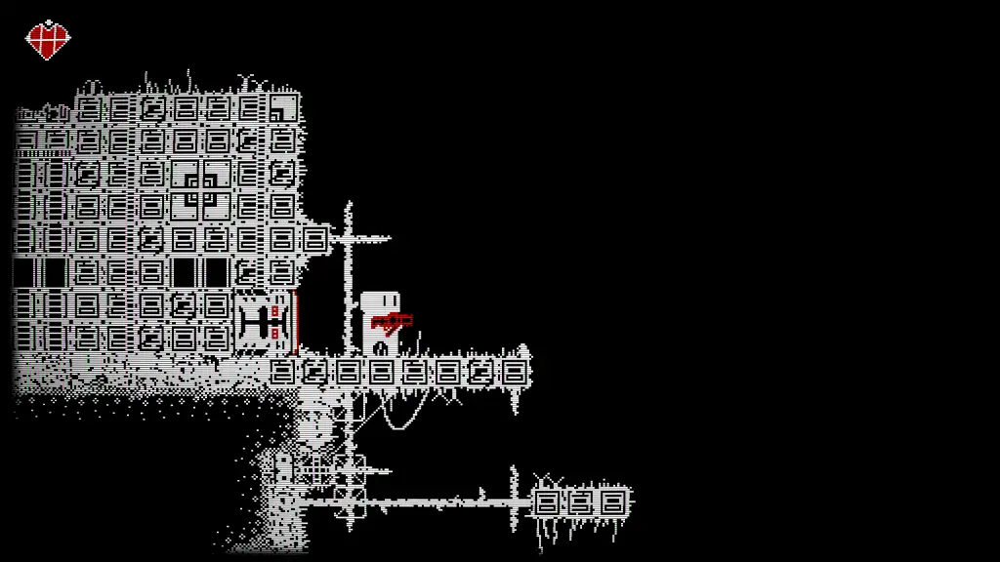
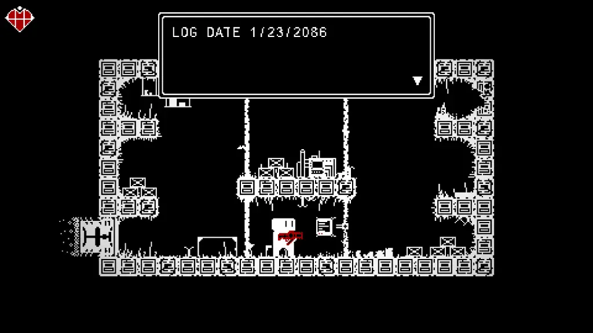
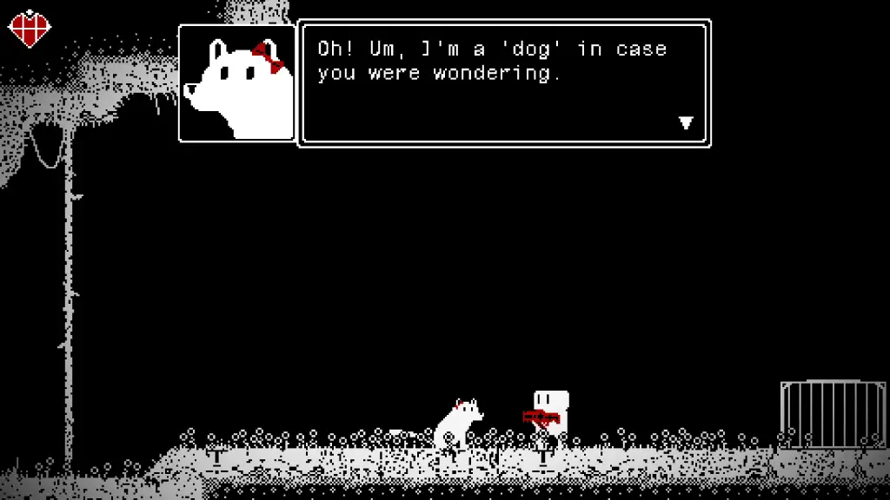
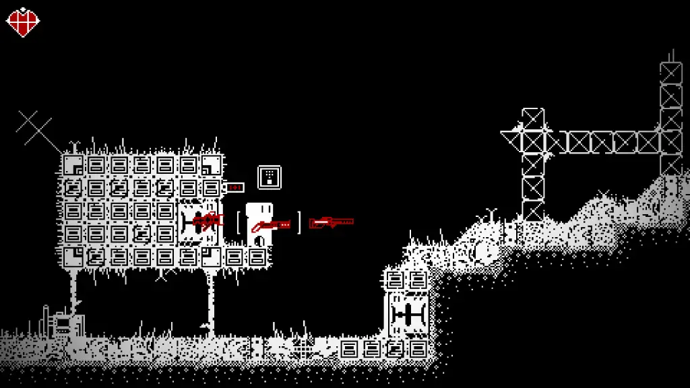
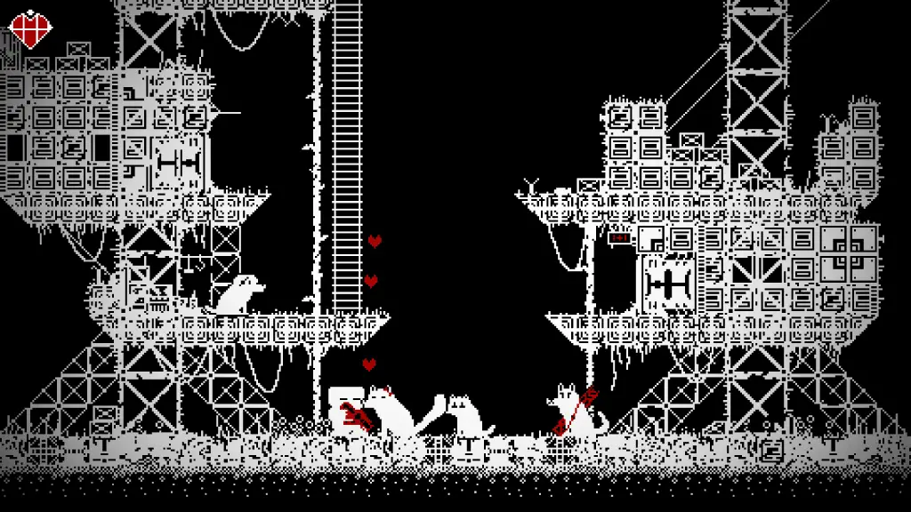

---
{
  title: "Dogworld Review – Old School Fun",
  published: "2021-03-24T08:38:53-07:00",
  originalLink: "https://noisypixel.net/dogworld-review-pc/",
}
---

As a fan of retro video games, it’s always exciting to see new indie games inspired by classics. When I saw _Dogworld_, its stark aesthetic, old school Metroidvania gameplay and dog-filled charm drew me in. While I had my doubts, thankfully _Dogworld_ turned out to be a well-rounded adventure that embraces gaming’s past but stumbles exactly where those classic games do.

<iframe src="https://www.youtube.com/embed/tCYqL_TxtdE"></iframe>

The first thing you’ll likely notice with *Dogworld *is its retro presentation. This stark “1-bit” design has black, white, and red, comprising the entire world. The visuals give me Undertale vibes while also reminding me of the ZX Spectrum aesthetic, which stands out because of how unique it is. While I found this design choice appealing, I have two minor nitpicks: Given there are so few colors, sometimes it’s tough to spot enemies, and I think the character sprites are too large. Locations, bosses, and characters look unique and everything combines to create an appealing atmosphere.

The CRT filter is one of the better implementations of the features that I’ve seen, but it adds flicker, so you might want to turn it off if that bothers you. The doggos are also adorable, and the chiptune music is pretty great throughout, adding to the retro feel, getting you excited to play the game.

While you wouldn’t expect it for this kind of game, Dogworld’s story is surprisingly well-executed. Set in a post-apocalyptic world where humanity lives underground in pods because an AI named Daddy said that the surface was uninhabitable, an accident happens where you are launched to that said surface. When you climb out of the broken pod, you find out that the surface is totally livable, and there are some dogs who can talk.

The game follows these events as you explore this world and work to survive against Daddy. Sure it’s not the most complex or in-depth in the world, and it’s basically set dressing, but the combination of simple, intriguing and compelling is perfect for this kind of game. The dialogue is a delight, and the game’s story does a good enough job of keeping you motivated.

The gameplay is really the star of the show, though. First and foremost, _Dogworld,_ in general, gave me huge _Cave Story_ vibes, almost to an eerie extent. From the level design to gameplay structure, the atmosphere, story vibes, it’s easy to tell that inspiration was drawn from _Cave Story_, but I didn’t mind it since *Dogworld *does enough to add unique gameplay elements.

_Dogworld_ can be boiled down to a run & gun 2D Metroidvania platformer. You explore a large world and occasionally run into bosses. Movement is tight and precise, the jumping is maybe a bit more floaty than most would prefer, but I tend to like that. The levels are fairly straightforward are still fun to explore.

There’s a healthy mix of tight platforming and gunning down enemies _Contra_ style in this adventure. You have a large variety of weapons but often you’ll find that you’ll typically just use the highest DPS weapon, with the rest being more situational. A fundamental mechanic is the slide, which gives you a ton of iframes, so it becomes necessary to traverse and avoid the enemy’s attacks.

*Dogworld *really nails difficulty. It’s hard to keep a consistent difficulty curve, where the game is hard enough to be satisfying but easy enough that you don’t get frustrated, and _Dogworld_ manages to balance these very well. Bosses, for example, are difficult enough that you probably won’t beat them on your first try, but they have fairly simple patterns, so once you learn those, you can usually beat them in a few tries. This way, you get the feeling of accomplishment that you learned how to beat the boss while not hindering your progression.

The best retro-inspired games are the ones that acknowledge the strengths of those titles and, at the same time, add quality-of-life improvements to keep up with modern mechanics. _Dogworld_ lacks in this area as it feels too much like the games that inspired it.

Some might enjoy this, but I found it to be largely annoying. A few of the quirks include only being about to shoot in four directions (no diagonals), you can’t move on a ladder and shoot at the same time, there is basically no weapon that can handle enemies in close range, so you get hit a bunch in quick succession, save spots felt incredibly erratic, with some stretches going incredibly long without any saves, and a lack of direction. Oftentimes I would just be wandering, hoping I was going the right way, and I didn’t know I could upgrade weapons until I got walled by a boss and figured it out on my own.

All that being said, while these issues never went away, it was easy to put  them to the side because _Dogworld_ was incredibly satisfying to play in general. From finishing tricky platforming sections to getting through a gauntlet of enemies to the awesome bosses, I found myself really enjoying the moment-to-moment experience of playing through _Dogworld_. The core gameplay is so engaging, and the atmosphere, the cast were so likable that I was never having a bad time playing the game.

Dogworld is a charming retro-inspired 2D Metroidvania that provides a unique gameplay experience through its aesthetic, story, and mechanics. However, the game suffers from mirroring its retro-inspirations too closely. Still, my general first impressions didn’t fail me, and I found a lot to love about this quirky adventure.
