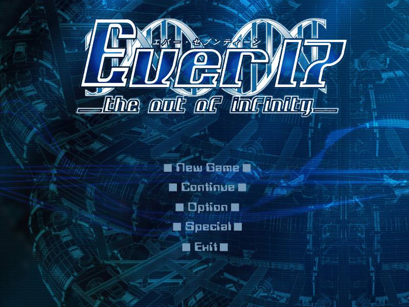
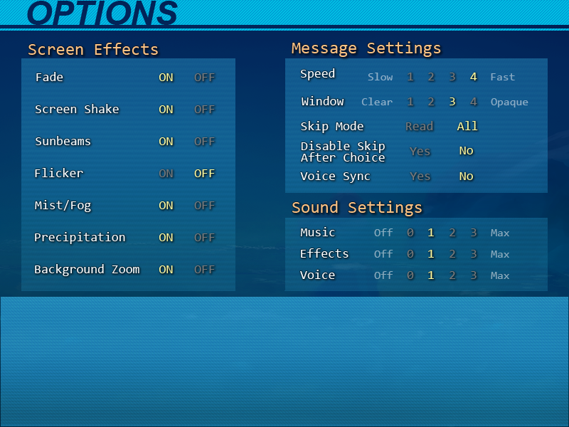
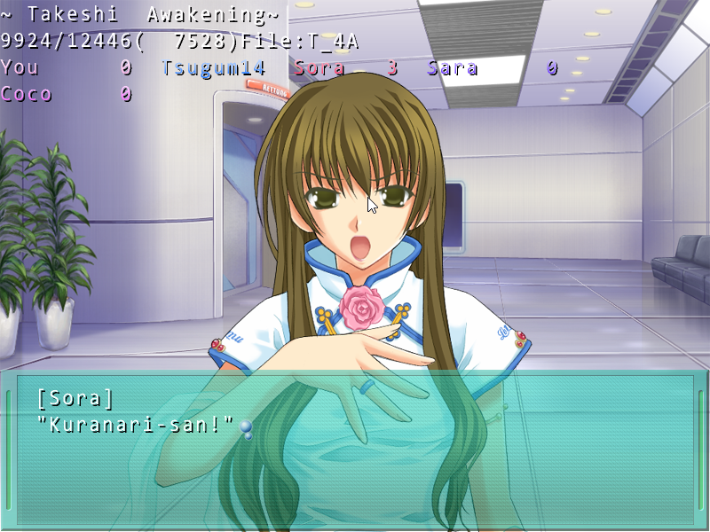
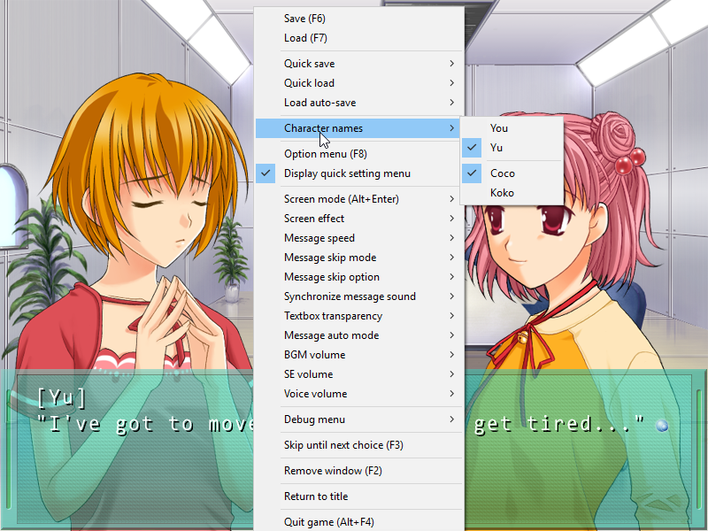
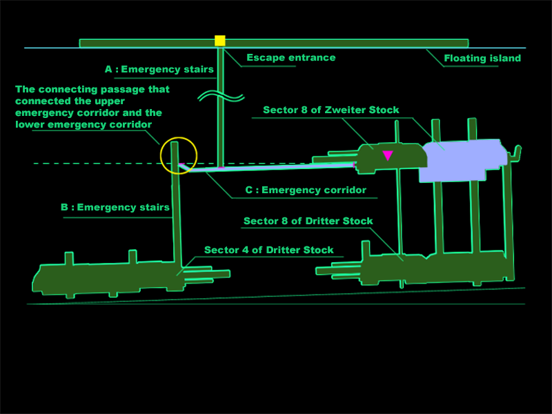
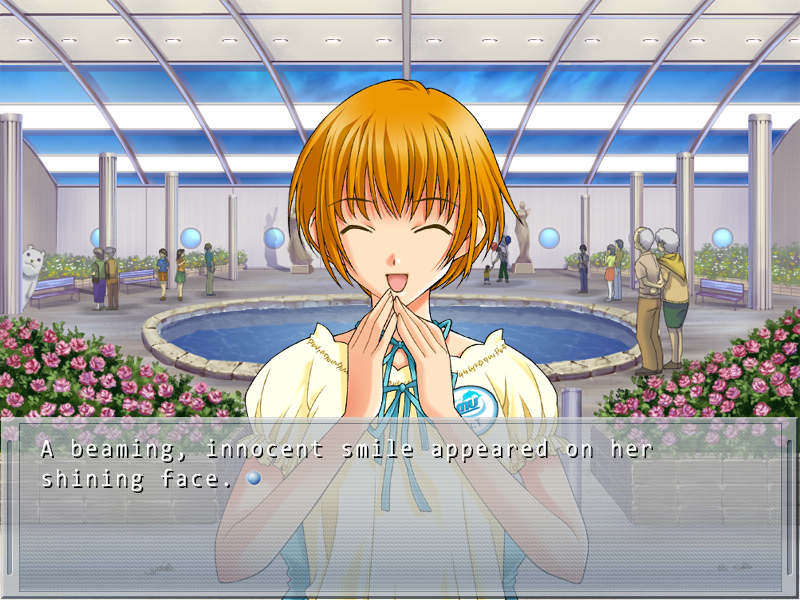
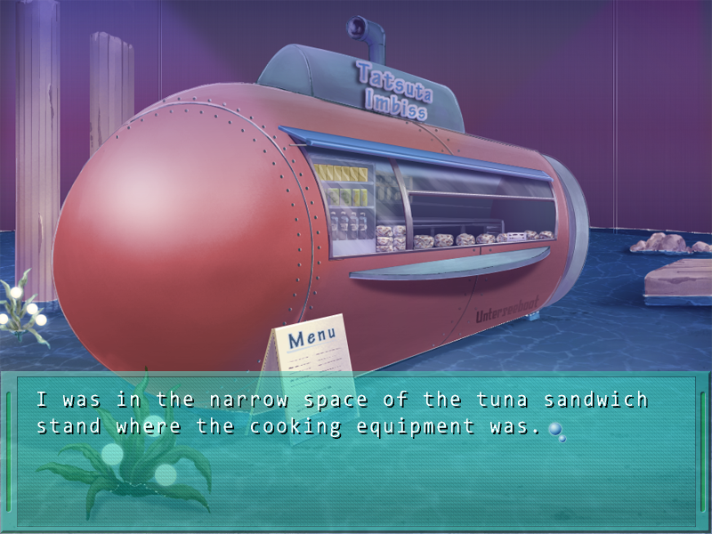

---
{
	title: "Ever 17 - The Out of Infinity - Himmel Edition Patch",
	published: "2018-11-17T15:37:00-05:00",
	tags: ["Visual Novels", "Ever 17", "Ever 17 The out of Infinity", "Rokumei City", "Himmel", "Forever 17", "Patch", "Rockmandash Rambles"],
	kinjaArticle: true
}
---

Are you a fan of *Ever 17 *but have serious problems with how the game has aged? From the nearly glacial skip speed to the questionable translation, the original Hiramaki English release of* Ever 17 *has some issues that are almost painful in the modern era, but you don’t have to live with these issues any more thanks to the work by dedicated fans in the Rokumei City Discord.\
\
Enter *Ever 17 Himmel Edition,* or how I’m used to calling it, *Project Forever 17*. Thanks to some grievances with the original textbox, the fine people at Rokumei City have revamped *Ever 17* in the form of Himmel edition, and there’s a lot of changes here. The big change here is that skip is much, much faster, but there’s a laundry list of quality of life improvements that make this version worth downloading. It’s a clear definitive version of* Ever 17*, and I would recommend that you have it installed if you are interested in playing the game. If you’re a fan of the game these changes may make you interested to replay it, and if you haven’t played it yet, these might push you over the edge to give the game a try. The link to the reddit post where you can download it is in the description, and it’s worth noting that this is compatible with every patch that came before this (including the 360 BGM patch)

<https://www.reddit.com/r/visualnovels/comments/9v76tp/ever17_himmel_edition_released/>

***

## **Engine Changes**

**1.** The skip in the original games was dependent on FPS - the himmel edition patch increases skip speed by unlocking fps. It’s from 2x to 12x based on your pc, but regardless of what of what pc you have, it’s gonna feel like an order of magnitude faster. Remember, Ever 17 came out in early 2000's, so any modern pc is going to be an order of magnitude faster than what Ever 17 was designed for.

**2. **There’s a lot of messages that are common between routes, but before, when you skipped them, it would only skip in the same route. Now, you have the option to skip messages that are common between routes. This is a huge timesaver, allowing you to avoid rereading a bunch of overlapping content.\
\
**3.** When you right click for options, there’s a bunch of changes - Himmel edition allows you to make any changes in the options menu, from the right click, so if you thought the audio was too loud for example, you could change it on the fly instead through right click instead of having to go into the options menu and change it there.

**4.** More interestingly however, is when you right click, Himmel edition has added a debug menu, which allows you to see a bunch of information that you wouldn’t be able to see otherwise. Most of these might be useful, but there’s definitely one that is incredibly useful.\
There’s four options - *Title display, Text read display, Character status display, *and *System Status display.*\
\
Title display allows you to see the title of the section you’re reading, which helps you gauge where you are in the story. Text read display shows you what part of text you’re reading- i’m not sure how useful this’ll be for readers given how it’s shown, but it’s a nice to have. Same with system status display, this shows what file you’re interacting with, probably won’t be useful for most readers. The big quality of life improvement here with this debug menu is the character status display though- it allows you to see your character points. To get to the character route you want and to get the character ending you want, you need to have a specific amount of points. before you’d just have to make a note of how many points you had, but now you have an option to look at it whenever in the game which is a really nice touch that I know I would have appreciated when I originally played through the game.

**5.** A bunch of quality of life changes - There’s some options to change character names - you and coco can be changed to yu and koko respectively. This change is mostly to clear up confusion that the name “you” can cause, the second one is a preference thing. Himmel edition removed the prompt to save system data, as it just automatically saves when you close the game or return to title. And last but not least for engine changes, the Himmel patch fixed an issue when you click out of the window, the music would stop and restart.

***

## Graphical Changes

 

There’s some graphical changes that Himmel made that make the game less dated than it originally did. These are self explanatory so I’m just gonna show them to ya.

* Updated font
* Updated all menus and UI
* Updated title screen and menu images
* Updated textbox (mix between Remember11 and Ever17 XBOX version)
* Transparent textbox is now fully transparent with outlined text.
* Updated German and English text in CG

***

## Text Changes

And last but not least, Text changes! A lot of the time and effort with this project went into the text changes, there’s a fair amount here:

1. There were a lot of script changes to make the game more readable - from fixing typos and grammar, the game flows a lot better now.
2. When letters need to be accented, the Himmel edition includes accents.
3. The game units were originally in metric but were converted to imperial with the English patch - this doesn’t really make sense given that the game’s set in Japan and how the development team loves to play with numbers, so the numbers were moved back to metric.
4. And last but not least- the dreaded chicken sandwiches have been changed to fried tuna sandwiches, which for non fans might be an absolutely trivial change but anyone who’s played Ever 17 knows this is a noteworthy change. According to uchikoshi in the Ever 17 anniversary interview by peeps over at lemnisca translations - the sandwiches were originally supposed to be tatsuta sandwitches, meaning the legendary chicken sandwiches were actually a localization change or mistranslation! This has been changed to Fried Tuna sandwiches in the patch, feel free to join the [Rokumei City discord](https://discord.gg/zAySJjQ) and complain about this change to everyone who worked on development of this patch. o/

***

*Thank you for reading! If you want to check out more of my writing, check out my blog *[*RockmanDash Reviews*](https://rockmandash12.kinja.com/)*, as well as *[*FuwaReviews*](https://fuwanovel.net/reviews-hub/)* and *[*AniTAY*](http://anitay.kinja.com/#_ga=2.29830716.283022684.1516595779-1252363867.1516472140)* where I am a contributor. Also *[*follow me on Twitter*](https://twitter.com/RockmanDash12)* if interested!*