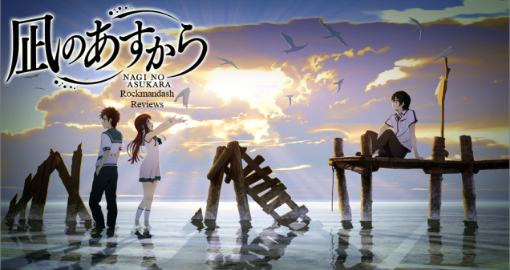

---
{
	title: "Fate/stay night: Unlimited Blade Works First Impressions!",
	published: "2014-10-12T13:00:00-04:00",
	tags: ["Rockmandash Rambles", "Type Moon Marathon", "Fate/stay night", "first impressions"],
	kinjaArticle: true
}
---

[I've been hyping it up all this time](https://rockmandash12.kinja.com/type-moon-marathon-wip-1534726534), and now that the prologue and episode 1 are out... I figure it's about time for a first impressions. What do I think? It's fantastic.

### Visuals

Let's get this off the bat: Ufotable's done a brilliant job with the visuals. It's one of the best out there, and I dare say that it is the best. The insane attention to detail, the atmosphere, the fluid art, the effects, the beautiful lighting (By far the best lighting in anime imo), the brilliant camera movement... it's really beautiful. Only a few animation studios can really nail it this well. It's really complete; you can take a screenshot of any frame and it'll look beautiful. The Scenery is up there with [Nagi no Asukara](https://rockmandash12.kinja.com/rockmandash-reviews-nagi-no-asukara-anime-1567969970), and the character art is up to par with the best [Kara no Kyoukai films](http://tay.kotaku.com/rockmandash-reviews-kara-no-kyoukai-the-garden-of-si-1524615358). The visuals in this anime, nail the atmosphere in a way the original VN couldn't. The way it handles some of the scenes like Rin's summoning of archer is infinitely better than the VN, and I'm really enjoying it.

The fight scenes are so lightning fast that it blows my mind. They have a high standard of quality when it comes to visuals, and the result is stunning shows that that many studios \_cough\_[DEEN](https://rockmandash12.kinja.com/rockmandash-reviews-fate-stay-night-unlimited-blade-wo-1504755437)\_cough\_ could only dream of, and I can only admire. It's kinda surreal to see ufotable art with Fate/stay night, but I love it.

### Soundtrack

The soundtrack is just as amazing as I thought it would be, and I'm a fan. It's beautifully composed, and it's used well in creating an amazing atmosphere and mood. It's pleasing to the ear and it sounds great. It sounds much more fitting to F/SN than the soundtrack did before; the new tracks fit the atmosphere well and the remixes fit much better, giving the show a more accurate tone, but I still really like the 2012 soundtrack. 1 thing I have to say here though is that it's a lot more subtle than I was expecting, especially when you compare it to the really overbearing 2012 soundtrack for FSN and Mahoutsukai no Yoru's soundtrack, and this is probably the part that differs the most from the VN. The tracks so far are amazing, and I'm looking forward to where it's going from here.

Also, about the OP and ED: I think Ideal White is a great OP, but it's not my favorite, especially in comparison to the Realta Nua OP, or even in comparison to disillusion.. but that's my Type-Moon Fanboy screaming at you. As for the ED believe, it's good. It's kalafina so of course it's good, but I don't think it's as good as some of the other stuff they have made.

### Episode 0 - Prologue

Episode 0 was an hour long, beautiful straightforward adaptation of the prologue: It was amazing, and Rin=Best girl. Ufotable did a great job in capturing the tension, showing Rin's thoughts/emotions well, and it showed the relationship between Rin and Archer extremely well. The more light hearted part of the prequel was handled well (Rin's expressions with Shinji were golden), and the more serious parts were extremely good. I loved the amount of camera angles in the episode, as it really helps to the show. It's a big difference between the static VN and I appreciated it. Also, The Lancer and Archer fight was amazing... it's so fluid, fast and pretty... my jaws were on the floor when I saw that. Overall, I was pretty impressed with this episode... really impressed. It was amazing, and every bit of it was done extremely well.

### Episode 1 - Winter Days, A Fateful Night

Episode 1 was also an hour long, and it it was the first bit of the VN, the part that's pretty much consistent with every route, up until the end where there's the shift into the UBW arc. It's the same block of time that the prologue is, but under the viewpoint of Shirou. This episode was pretty good as well, but I don't think it was nearly as good as Ep 0. Most of it was just the slice of life for Shirou, with the expressions of Shirou and Taiga done really well. What really stole the show however, was backstory scene with Kiritsugu, and it makes for a better transition from F/Z to F/SN. Also... the Lancer vs Saber fight was unbelievable, especially when Lancer used his gae bulge... They visualized that incredibly well and I love it. I'm pretty sure I'm going to be blown away with every fight scene in this... Looking forward to the rest :D

### Something's different....

I really enjoyed these.. but there's something that just didn't feel right about it to me. It's hard to put into words, but it doesn't have the same feel as the VN, and there's some bits that just felt... off. Not bad, per se, but it just didn't feel right. I can't really pinpoint what exactly, but it just feels weird to me.

If you've been hearing it's extremely accurate to the VN, the people who are telling you that is wrong. There's a lot of subtle differences that make it different, and it adds up. To give an example, the VN doesn't really explain why Rin's clocks are an hour ahead, they just state it is; the anime does this and I appreciated it. Another example is that Rin's discussion with Archer about command seals took place in her room, not her dad's office. There's A LOT of those little scene changes like that, so it totally changes the show.

Another thing is that the anime doesn't have a lot of the the inner monologue from the who's the protagonist. So far, the show's handling it pretty well, so it isn't really a big deal, but this kinda changes the the feeling of the story completely; I don't feel like I'm with the protagonist, I feel like an observer. I feel like it'll have more monologue as we go on, but as is, it's different.

It may be the music. Like I said before, the soundtrack is totally different, and it creates a different mood. The mood was essential to F/SN and this change may be throwing me off.

I feel like it's missing something so far.. Maybe it's the inner monologue, maybe it's the music, but it feels off. I mean, It's still great, but it's definitely different and it feels kinda off to me. I hope that i'm not the only one who feels this way.

### Overall

What do I think about F/SN so far? It's been amazing, and you guys should definitely check it out. There's a few things that are done differently than I expected, but it's done very well and it's really a must watch. If you want to see some of the best visuals, with some of the best action scenes out there, and great music, or just a solid show overall without a ton of fanservice... here ya go. It's going to be amazing.

***

