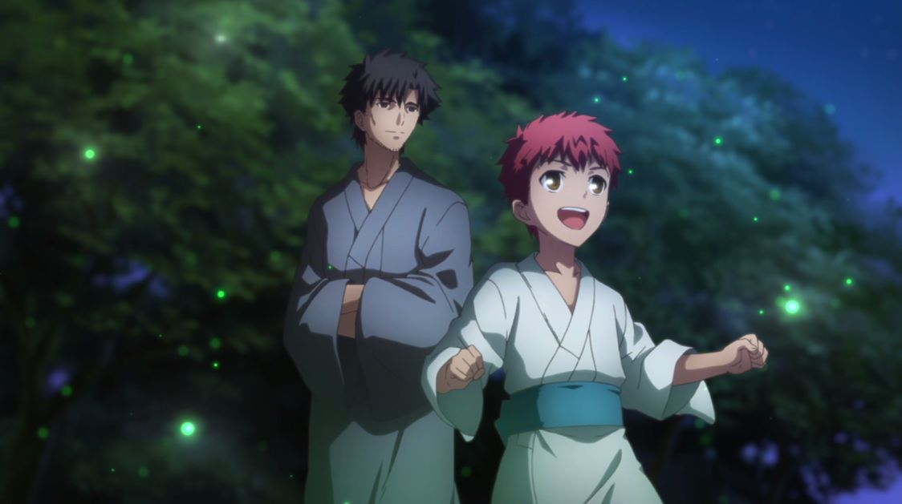

---
{
  title: "Fate/stay night: Unlimited Blade Works S1 Ani-TAY Review and Discussion",
  tags:
    [
      "Fate/stay night",
      "Unlimited Blade Works",
      "Fate/stay night Unlimited Blade Works",
      "Season 1",
      "Rockmandash Reviews",
      "The Ani-TAY Review",
      "Ani-TAY",
      "Nasuverse",
      "Ufotable",
      "Anime",
      "Cour 1",
      "Type-Moon Marathon",
    ],
  published: "2015-01-02T15:30:00-05:00",
  attached: [],
  license: "cc-by-4",
  oldArticle: true,
}
---

<strong>Rockmandash12:</strong> Haven't seen one of these in a while! Due to the
  split cour nature of <em>Fate/stay night</em>, and my extreme fanboisms/indecisiveness, I thought it would be neat if
  the UBW reviews per season would be discussion reviews similar to <a class="sc-1out364-0 hMndXN sc-145m8ut-0 gIacKn js_link" data-ga='[["Embedded Url","External link","http://anitay.kinja.com/glasslip-ani-tay-review-and-discussion-1641880502",{"metric25":1}]]' href="http://anitay.kinja.com/glasslip-ani-tay-review-and-discussion-1641880502" rel="noopener noreferrer" target="_blank"><em>Glasslip</em></a> and <a class="sc-1out364-0 hMndXN sc-145m8ut-0 gIacKn js_link" data-ga='[["Embedded Url","Internal link","http://tay.kotaku.com/ani-tay-golden-time-review-and-discussion-1556588276",{"metric25":1}]]' href="http://tay.kotaku.com/ani-tay-golden-time-review-and-discussion-1556588276"><em>Golden Time</em></a>.
  I'm planning on doing a full review when it's all done, but that's a matter for the future.

<strong>Rockmandash12:</strong> <em>Fate/stay night: Unlimited Blade Works</em> is an anime by Ufotable which in
  adaptation of the route with the same name from the <a class="sc-1out364-0 hMndXN sc-145m8ut-0 gIacKn js_link" data-ga='[["Embedded Url","External link","http://rockmandash12.kinja.com/rockmandash-reviews-fate-stay-night-visual-novel-1613176306?rev=1407787126382",{"metric25":1}]]' href="http://rockmandash12.kinja.com/rockmandash-reviews-fate-stay-night-visual-novel-1613176306?rev=1407787126382" rel="noopener noreferrer" target="_blank">visual novel</a>, about
  the 5th Holy Grail war, where masters summon servants to fight to the death for a chance to win the Holy Grail war.

<strong>Rockmandash12:</strong> Because this is such a popular series, and the way
  they've been releasing them is so screwed up, there's many perspectives on this series.

<strong>Rockmandash12: </strong>I'm a <a class="sc-1out364-0 hMndXN sc-145m8ut-0 gIacKn js_link" data-ga='[["Embedded Url","Internal link","http://tay.kotaku.com/type-moon-marathon-wip-1534726534?rev=1406682520485",{"metric25":1}]]' href="http://tay.kotaku.com/type-moon-marathon-wip-1534726534?rev=1406682520485">Type-Moon</a> nut, and with me
  today is a person who's only seen<em>Fate/Zero</em>, representing that point of view... <a class="sc-1out364-0 hMndXN sc-145m8ut-0 gIacKn js_link" data-ga='[["Embedded Url","External link","http://protonstorm.kinja.com/",{"metric25":1}]]' href="http://protonstorm.kinja.com/" rel="noopener noreferrer" target="_blank">Protonstorm </a>:)

<strong>Protonstorm:</strong> I'm on TV!

<strong>Rockmandash12</strong>:
  Haha. So, let's get started with this.

<strong>Protonstorm:</strong> Sounds good.

<em><strong>*Note: There may be slight spoilers for Fate/stay night and Fate/Zero. We
  tried our best to avoid them, but things don't always go according to plan.*</strong></em>

<strong>Rockmandash12:</strong> I guess the best place to start off would be the
  story. Thoughts?

<strong>Protonstorm: </strong>Well, it is definitely is slower
  during this first half.

<strong>Protonstorm: </strong>That's been the biggest
  complaint I've heard thus far, although I also know things will pick up in the near future.

<strong>Rockmandash12: </strong>It definitely will.

<strong>Rockmandash12:</strong> I think because we are watching it week by week, it feels a
  lot slower than it otherwise would.

<strong>Rockmandash12: </strong>Normally, with a VN, you marathon through.

<strong>Protonstorm:</strong> Haha, yeah. I remember you were reluctant to watch it weekly,
  and honestly when it was first announced I originally planned to marathon it at the end as well.

<strong>Protonstorm: </strong>But everyone boards the hype train.

<strong>Rockmandash12: </strong>I'm guilty of that. I'm planning to marathon it through
  when it's all done though.

<strong>Rockmandash12:</strong> Another complaint I've heard is that there's a lot
  of exposition. Honestly, I think there could be more, and I'd like more, but that's because I'm a jaded VN nut who
  loves the exposition of the world... I know that wouldn't really translate well into an anime though.

<strong>Protonstorm:</strong> Well, for me as a filthy<em> Fate/Zero</em> alumnus, I have
  been more than okay with the amount of exposition this first half.

<strong>Protonstorm: </strong>I feel like if they gave less we would have a problem,
  but it also hasn't hit a point where I'm zoning out.

<strong>Rockmandash12:</strong>
  So, I'm not a weirdo... good to hear! Speaking of zoning out, I'm kinda doing that, because they took out one of my
  favorite parts of the VN, the internal monologuing.

<strong>Rockmandash12:</strong> Are you feeling that at all?

<strong>Protonstorm: </strong>Hmmm, well since I don't have experience with the VN, I
really don't know what I'm losing here, but it doesn't feel too much to me like there's a part of the story lost in
the translation. Obviously not everything can be but into the show that the VN had, but I feel like I'm still getting
a full story, even if it apparently isn't the complete one.

<strong>Rockmandash12: </strong>It's good to hear that anime only people don't have
  that issue, but it loses out on a bit of the charm and emotional attachment in my opinion.

<strong>Rockmandash12</strong>: In the Visual Novel, it felt like you were experiencing the
  story of Shirou, getting his perspective on everything, learning about him and developing him as a character. I really
  enjoyed that, it created an emotional bond with the character. Maybe because I've experienced that, the anime feels a
  bit shallow in in comparison, but not that much so. Like, I feel like we're watching the story instead of being a part
  of it and it feels a bit more detached to me.

<strong>Protonstorm:</strong> Frankly, I think that putting in all of the monologue
  just wouldn't work for an anime. Not everything that works in visual novels translates well into their adaptations.
  Different media, different rules.

<strong>Protonstorm:</strong> Some of it, maybe,
  but it would be tougher to pull off without boring the audience.

<strong>Rockmandash12:</strong> yeah. I think it's been done well before, but it's
  definitely a tough thing to do.

<strong>Rockmandash12: </strong>Other than that, do
  you have any other thoughts on the story?

<strong>Protonstorm:</strong> Well, in
  terms of comparison to other shows, the premise for the Fate series is pretty interesting.

<strong>Rockmandash12:</strong> definitely.

<strong>Rockmandash12:</strong> it's an intriguing story with tons of depth and
  lore. The fact that it's such a strong setting means that they've been able to expand it as much as they have without
  making it feel like a cash grab.

<strong>Protonstorm:</strong> Mage wars for an
  ultimate power is one thing. Add in the summoning of servants from human history/mythology, each with their own
  personalities and abilities, and you have something pretty intriguing.

<strong>Rockmandash12: </strong>Definitely. One of the biggest draws to me for the
  fate series is that the characters first, action second and that's not really something you can say about many shows
  in this genre.

<strong>Rockmandash12: </strong>even if you like the characters or
  not.

<strong>Protonstorm:</strong> Yeah. And not just the masters, the servants get
just as much if not more development.

<strong>Protonstorm: </strong>They aren't just tools.

<strong>Rockmandash12: </strong>Definitely. As someone who's seen <em>Fate/Zero</em>, what
  are your thoughts on how they handled returning characters, and characters in general?

<strong>Protonstorm:</strong> Well, that's a challenging thing to answer.
  Technically, <em>Fate/stay night</em> is <strong>SUPPOSED</strong> to be watched first, but <em>Fate/Zero</em>
  chronologically takes place earlier. I liked how some of the scenes held more significance to the audience that had
  seen <em>Fate/Zero</em> though, and they weren't too big of a deal for new viewers, just a slight nod to the Fate/Zero
  veterans.

<strong>Rockmandash12:</strong> I'm not sure how newcomers to the series
  will respond, but there's quite a bit of foreshadowing to the story ahead, and nods to Fate/Zero.

<strong>Rockmandash12:</strong> Makes me look forward to how they're going to handle
  the characters in the future.

<strong>Protonstorm:</strong> Definitely.

<strong>RockmanDash12</strong>: Except.. I already know the fates of them :P

<strong>Protonstorm:</strong> Cheater.

<strong>Rockmandash12:</strong>
  So, let's talk about specific characters.

<strong>Rockmandash12:</strong> Shirou is probably one of the most controversial
  character in anime at this time, along with characters like Tatsuya (<a class="sc-1out364-0 hMndXN sc-145m8ut-0 gIacKn js_link" data-ga='[["Embedded Url","External link","http://www.reddit.com/r/OneTrueTatsuya",{"metric25":1}]]' href="http://www.reddit.com/r/OneTrueTatsuya" rel="noopener noreferrer" target="_blank">Onetruetatsuya </a>is
  a hilarious subreddit btw), and Kirito.

<strong>Protonstorm: </strong>Praise
  Onii-sama.

<strong>Rockmandash12:</strong> I'm personally a big fan of Shirou due to
  the developments I've seen him have, but not everyone is and not everyone's seen those developments. Thoughts?

<strong>Rockmandash12: </strong>And Rin = best girl. Best girl of all time. No
  debates.

<strong>Rockmandash12:</strong> /jk, but seriously. I love Rin.

<strong>Protonstorm:</strong> I'm not sure what to think of Shirou at this point. I know
  one of the big complaints is his whole 'hero of justice' obsession. It makes him very pig-headed at times, and it
  definitely can get on my nerves. Really, my final judgment will depend on how he develops in the second half, and how
  far he is willing to take his 'hero of justice' goal to when we all know that in the battle he is fighting there is no
  such thing.

<strong>Protonstorm:</strong> I also like Rin, just putting that out there.

<strong>Rockmandash12:</strong> One of the interesting things that the VN does with that
  they push how far Shirou's willing to go with his ideal.

<strong>Rockmandash12:</strong> So far, he's been recklessly forcing it through, but
  there's some interesting twists that may impact your view on the character. 

<strong>Protonstorm:</strong>
  I think the biggest irony in the entire matter is the fact that Shirou's father Kiritsugu, the man Shirou wants to be
  a "hero of justice" for, was in fact just the opposite. Kiritsugu operated on one motto: the end justifies the means.
  I can see that coming up in the future.

<strong>Rockmandash12:</strong> Keep in mind that Kiritsugu did what he did for the
  sake of being a hero of justice.... so yeah. Speaking of which, you can see a bit of Kiritsugu in a character in
  Archer.

<strong>Rockmandash12:</strong> <em>*nudge nudge, wink wink.... not subtle
  foreshadowing here*</em>

<strong>Rockmandash12:</strong> It was way more subtle in
  the VN, btw.

<strong>Protonstorm: </strong>Yes, but Shirou interprets the meaning as
  not harming anyone, unlike Kiritsugu.

<strong>Rockmandash12: </strong>Any other characters you want to talk about?

<strong>Protonstorm: </strong>Well, we tossed up Rin earlier, but didn't ACTUALLY talk
  about her.

<strong>Rockmandash12:</strong> Yeah....

<strong>Rockmandash12: </strong>A shining example of a Tsundere done right.

<strong>Rockmandash12: </strong>Enough
  depth so she doesn't seem like a cookie cutter character while maintaining the core aspects of the character.

<strong>Rockmandash12:</strong> I'm just going to stop myself there. If I continue,
  i'll be going on for hours.

<strong>Rockmandash12:</strong> I really love Rin as a
  character.

<strong>Protonstorm: </strong>I don't doubt it.

<strong>Protonstorm: </strong>Rin is definitely interesting. She's been brought up with
  such a huge focus on magic, but she really was not prepared for the reality of the Grail War, and so she has to modify
  her expectations. I also think it's kind of amusing how she and Shirou kind of have a back and forth tsundere pairing.

<strong>Rockmandash12: </strong>Normally, a tsundere gets "conquered" by the hero.
  This time, it's a bit the other way around, and it's great.

<strong>Protonstorm:</strong> Shirou doesn't stand a chance. 

<strong>Rockmandash12:</strong> no chance at all.

<strong>Protonstorm:</strong>
  Plus, at least at this point, Shirou is totally the weak one. Rin has the Tousaka family inheritance when it comes to
  magic, and has the training to capitalize on it. Shirou... can sometimes make pieces of wood stronger.

<strong>Rockmandash12:</strong> XD

<strong>Protonstorm:</strong>
  Not that I would mind being able to make weapons out of magazines or anything, but I'd rather shoot magic missiles or
  something.

<strong>Protonstorm: </strong>Just saying.

<strong>Rockmandash12:</strong>:
  Like archer.

<strong>Rockmandash12:</strong> Both Archers.

<strong>Rockmandash12:</strong> <em>*nudge nudge, wink wink.... more not subtle
  foreshadowing here*</em>

<strong>Rockmandash12:</strong>OK, so now that we're done
  with that, what's your thoughts on the characters as a whole?

<strong>Rockmandash12:</strong> I'm a jaded VN fan so I already love them all.

<strong>Protonstorm:</strong> My overall impression is pleased. As I mentioned earlier,
  there are a lot of them, and Fate/stay night does a better job than most at delving into each of them.

<strong>Rockmandash12:</strong> And, your thoughts on the writing overall?

<strong>Rockmandash12: </strong>Honestly, I was mixed on it. There are a few things
  it did that bothered me, and I can see how some people can really not like it, but I still like the core story as a
  whole. It's still the FSN I know and love.

<strong>Protonstorm:</strong> Which parts
  bothered you?

<strong>Rockmandash12: </strong>Mostly the pacing and internal
  monologuing being removed. It just doesn't feel right to me. It's not fast and engaging yet, most of it has been
  buildup.

<strong>Rockmandash12:</strong> I'm betting that it'll pull a Steins;Gate and get
  really, really good after this, but for now, writing = meh to me.

<strong>Rockmandash12:</strong>
  how about you?

<strong>Protonstorm:</strong> Honestly, I agree with you, although the
  constant buildup hasn't bothered me to the same degree.

<strong>Protonstorm:</strong> I like how although things have been moving slowly, it
  doesn't FEEL like nothing is happening. There are a few strange loose ends (berserker and his master kinda just
  showing up for about 10 minutes then never being heard from again) but other than that I think it maintains a decent
  amount of interesting elements.

<strong>Rockmandash12:</strong> Yeah. That's an issue
  with split cour, and why I HATE this trend with it.

<strong>Rockmandash12:</strong> i'm sure this won't be an issue when you marathon it
  though at the end, so keep that in mind... but for cour 1... it's annoying.

<strong>Rockmandash12:</strong>
  Also, there have been other changes, but i'll delve into that more in my main review after cour 2. Let's move on to
  the best part of FSN in my opinion... Visuals.

<strong>Rockmandash12: IT'S SO PRETTY.</strong>

<strong>Protonstorm: UFOTABLE = LOVE, UFOTABLE = LIFE</strong>

<strong>Rockmandash12:</strong> :D

<strong>Protonstorm:</strong> But seriously, how
  do they pull it off? They even had three hour-long episodes.

<strong>Rockmandash12: </strong>Magic.

<strong>Rockmandash12:</strong>
  Seriously though, Ufotable is my favorite animators out there, and F/SN is the best looking anime out there.

<strong>Protonstorm: </strong>MAPPA tries, but it ain't got nothing on Ufotable.
  Come at me, Koda.

<strong>Rockmandash12:</strong> Even PA Works's beauty can't even
  come close.

<strong>Rockmandash12:</strong> The atmosphere is just AMAZING, matching
  the feel of the story extremely well and making the world feel real.

<strong>Rockmandash12:</strong> the show is detailed, masterfully animated, and
  everything is extremely pleasing to the eyes. 

<strong>Rockmandash12:</strong> And we
  haven't even touched on the fight scenes.

<strong>Protonstorm:</strong> They pretty.

<video autoplay="" loop="" muted=""><source src="upgw1putvxy73ke4ze5t.mp4" type="video/mp4"/></video>

<strong>Rockmandash12:</strong> it's everything I've imagined out of them.

<strong>Rockmandash12:</strong> it's fast, furious, and seeing them beautifully animated
  like this just makes me so happy.

<strong>Rockmandash12:</strong> seeing random sword swings from the VN sprung into
  life like this.. it's just beyond amazing... and the cinematography.. it's really unlike anything I've seen in anime.

<strong>Rockmandash12: </strong>Most shows don't care how they frame the shot... but
  in FSN UBW, every frame shows tons of content, and it's framed so you feel the emotion and action.

<strong>Protonstorm:</strong> Honestly it scares me a bit. I hope they feed their
  animators.

<strong>Rockmandash12:</strong> haha

<strong>Rockmandash12:</strong> Everything about the visuals is just mindblowing. the lighting is supurb, the scenery
  and atmosphere is just amazing, the fight scenes are out of this world, the way that the represented the magic is spot
  on to the VN and it's amazing how well they do it.

<strong>Rockmandash12:</strong> It's called Unlimited Budget Works for a reason.

<strong>Protonstorm:</strong> I bet they were given blank checks.

<strong>Rockmandash12: </strong>XD

<strong>Rockmandash12: </strong>Also, I'm going to call Koda out here....

<strong>Rockmandash12: </strong>In
  his<a class="sc-1out364-0 hMndXN sc-145m8ut-0 gIacKn js_link" data-ga='[["Embedded Url","External link","http://anitay.kinja.com/rage-of-bahamut-genesis-the-ani-tay-review-1676327262",{"metric25":1}]]' href="http://anitay.kinja.com/rage-of-bahamut-genesis-the-ani-tay-review-1676327262" rel="noopener noreferrer" target="_blank"> Rage of Bahamut</a> review, he says that he says the faces in most anime
  are static in general, and because of the expressions in Bahamut, it's a better show, visually.

<strong>Rockmandash12:</strong> I just can't agree. While most anime may be that
  case, FSN definitely isn't.

<strong>Rockmandash12: </strong>The expressions, reactions and faces in general feel
  alive, real and they get me every time.it has the fluidity like bahamut and western animation, and it shows the
  emotion extremely well.

<strong>Protonstorm: </strong>Koda Shots Fired: 2

<strong>Rockmandash12:</strong> It's one of the things that really stood out for me, and I
  hope we see this trend continue in the future.

<strong>Protonstorm: </strong>Agreed.

<strong>Rockmandash12:</strong>
  2015: The year of facial expressions?

<strong>Protonstorm: </strong>:D

<strong>Rockmandash12:</strong> Yeah. Looking forward to more.

<strong>Rockmandash12:</strong> So, I guess I should stop gushing about the visuals here.

<strong>Rockmandash12:</strong> Anything to add?

<strong>Protonstorm:</strong> You pretty much covered it, I almost was swept away in that river.

<strong>Rockmandash12:</strong> haha

<strong>Rockmandash12:</strong>
  sorry .-.

<strong>Protonstorm:</strong> No, it's good. Someone had to say it.

<strong>Rockmandash12:</strong> OK, so Let's move over to... my biggest disapointment of
  the year.

<strong>Rockmandash12: THE DAMN SOUNDTRACK.</strong>

<iframe allow="accelerometer; autoplay; clipboard-write; encrypted-media; gyroscope; picture-in-picture" allowfullscreen="" frameborder="0" height="315" src="https://www.youtube.com/embed/Yu2xdZfN304" width="560"></iframe>

<blockquote class="sc-8hxd3p-0 nvIqO" data-type="BlockQuote">
<strong>This is a cover of
  Ideal White, so it doesn't exactly match up with the original, but it's one of the best ones out there. (Better than
  sped up and night cours ^.^) Check out DarkAngelWJ's channel for more covers like this one.</strong>
</blockquote>

<strong>Protonstorm: </strong>What soundtrack?

<strong>Rockmandash12:</strong> Exactly.

<strong>Protonstorm: </strong>Hey, for the
  record, the opening theme (Ideal White) was awesome. I would say that someone should pay Ayano Mashiro some big money,
  but I think that's already been done.

<strong>Rockmandash12:</strong>I gotta disagree.

<strong>Rockmandash12:</strong> Not a big fan of Ideal White, <a class="sc-1out364-0 hMndXN sc-145m8ut-0 gIacKn js_link" data-ga='[["Embedded Url","External link","https://www.youtube.com/watch?v=Cem-Kz9iioU",{"metric25":1}]]' href="https://www.youtube.com/watch?v=Cem-Kz9iioU" rel="noopener noreferrer" target="_blank">the other fate openings were better</a>.

<strong>Rockmandash12:</strong> Like, even the tease of The Illusion in episode 12
  would have made for a better opening.

<strong>Rockmandash12: </strong>Ideal White
  doesn't represent the show nearly as well as the others have.

<strong>Protonstorm: </strong> Ohhh, LiSA singing The Illusion was awesome.

<strong>Rockmandash12:</strong>: I've been listening to it on repeat since the episode
  aired.

<strong>Rockmandash12:</strong>: I was hoping to do that with the whole
  soundtrack, but no dice.

<strong>Rockmandash12:</strong> It's really a big
  disappointment in general. As a soundtrack, there's barely any music playing, and what's there is extremely subdued.
  In comparison to Yuki Kajiura's work in<em> Fate/Zero </em>and even the original soundtrack (which wasn't remarkably
  good but still better than this), it's really disappointing.

<iframe allow="accelerometer; autoplay; clipboard-write; encrypted-media; gyroscope; picture-in-picture" allowfullscreen="" frameborder="0" height="315" src="https://www.youtube.com/embed/3L1DEvzsftw" width="560"></iframe>

<blockquote class="sc-8hxd3p-0 nvIqO" data-type="BlockQuote">
No Ever-present Feeling for
  you ;-;
</blockquote>
<strong>Rockmandash12:</strong> the memorable pieces in F/SN UBW
  weren't played, and the soundtrack doesn't get me in the mood.

<strong>Protonstorm: </strong>Yeah, and I'm the kind of guy who places HUGE emphasis
  on the soundtrack. The music is what will maintain emotions long after a show is over, and it's sooo important for
  establishing the mood. A real shame.

<strong>Rockmandash12:</strong> I write a lot
  about soundtracks, and this one is just extremely disapointing. It's bad. really bad.

<strong>Rockmandash12:</strong> It may be the biggest reason why i'm not invested in
  the UBW anime.

<strong>Rockmandash12:</strong> And the thing is? I really liked the
  other stuff this composer did!

<strong>Rockmandash12:</strong> I had high hopes!

<strong>Rockmandash12:</strong> He fixed the <a class="sc-1out364-0 hMndXN sc-145m8ut-0 gIacKn js_link" data-ga='[["Embedded Url","External link","https://www.youtube.com/watch?v=euQbNBn5yCU",{"metric25":1}]]' href="https://www.youtube.com/watch?v=euQbNBn5yCU" rel="noopener noreferrer" target="_blank">FSN soundtrack with the vita release</a>,
  and <strong>BLEW MY MIND</strong> with <a class="sc-1out364-0 hMndXN sc-145m8ut-0 gIacKn js_link" data-ga='[["Embedded Url","External link","https://www.youtube.com/watch?v=LD3R-OhbLTE",{"metric25":1}]]' href="https://www.youtube.com/watch?v=LD3R-OhbLTE" rel="noopener noreferrer" target="_blank">Mahoutsukai no Yoru's soundtrack</a>,
  but that's just a fanboi rambling.

<strong>Rockmandash12: </strong>So yeah, really disappointed. Anything you want to
  add?

<strong>Protonstorm: </strong> Nothing that hasn't already been said. Just
  hoping on the off chance that things will be better for the second cour.

<strong>Rockmandash12:</strong> I guess we're about done here.

<strong>Rockmandash12:</strong> Anything you want to add before we wrap this up?

<strong>Protonstorm: </strong>One final complaint on my part.

<iframe allow="accelerometer; autoplay; clipboard-write; encrypted-media; gyroscope; picture-in-picture" allowfullscreen="" frameborder="0" height="315" src="https://www.youtube.com/embed/Whwa3H5kZc4" width="560"></iframe>

<blockquote class="sc-8hxd3p-0 nvIqO" data-type="BlockQuote">
<strong>*Keep in mind this is
  the ending section, The video includes spoilers.*</strong>
</blockquote>
<strong>Protonstorm: </strong>
  I didn't like how this cour ended. All is lost! Shirou is useless, and Rin has abandoned him! However will he fix
  this? Find out next time... in three months!

<strong>Protonstorm: </strong>Thanks guys

<strong>Rockmandash12:</strong>
  it was really a troll move, as expected though.

<strong>Rockmandash12:</strong>
  People call Type Moon Troll Moon for a reason.

<strong>Protonstorm:</strong> Yeah. I
  also don't like the whole abandonment thing itself to be honest, even if there wasn't going to be a wait in between
  episodes.

<strong>Rockmandash12:</strong> Episode 12 though... completely different than I
  expected, there's a lot of changes from the VN there.

<strong>Rockmandash12:</strong>
  I kinda really liked it, but i'm weird like that. I know it's not amazing though.

<strong>Rockmandash12:</strong> I guess it's time to move into the conclusion.

<strong>Rockmandash12:</strong> Overall, I liked UBW, but couldn't help but be
  disapointed by it. It's really good in some aspects (<strong>DEM VISUALS</strong>), but the parts where it fell let me
  down. I'd say it's pretty good in general, but not one of the bests of the year. It's really up to Season 2 to turn
  this around.

<strong>Protonstorm:</strong> I enjoyed UBW this season. It doesn't make my top list
  yet though because this first cour was totally a build up for the spring, and I felt that as I was watching it. Still
  pretty awesome though, it deserves more credit than some people have been giving it.

<strong>Rockmandash12: </strong>Yeah. Your overall rating of the show? I'm going to have to say <em>Proceed with
  Caution</em>, because even though I love FSN, and UBW, this anime isn't ready. It needs cour 2, and there are issues
  with it that may detract from the experience.

<strong>Protonstorm: </strong>I would say<em> Go for It</em>, because although there
  are some issues, I think that the bulk of newcomers to the series will at least be interested enough to keep going.

<strong>Rockmandash12:</strong> I can see that, but I'd personally say to wait until
  it's all done. I'm sure everyone will have their own opinion on this though, so I guess this is where we end this off.

<blockquote class="sc-8hxd3p-0 nvIqO" data-type="BlockQuote">
<strong>I am the Keyboard of
  my Review</strong>

<strong>Reviewing is my Body and writing is my blood.</strong>

<strong>I have read over a Thousand Words</strong>

<strong>Unknown to Action Nor known to Tsundere</strong>

<strong>Have withstood pain to create many reviews</strong>

<strong>Yet this Keyboard will never type anything</strong>

<strong>So as I Review,</strong>

<strong>UNLIMITED REVIEW WORKS</strong>
</blockquote>

<em>Edit: On 2/23/15, I fixed the ending video (the other one was taken down) and swapped the first gif for a still
    because of loading issues.</em>

