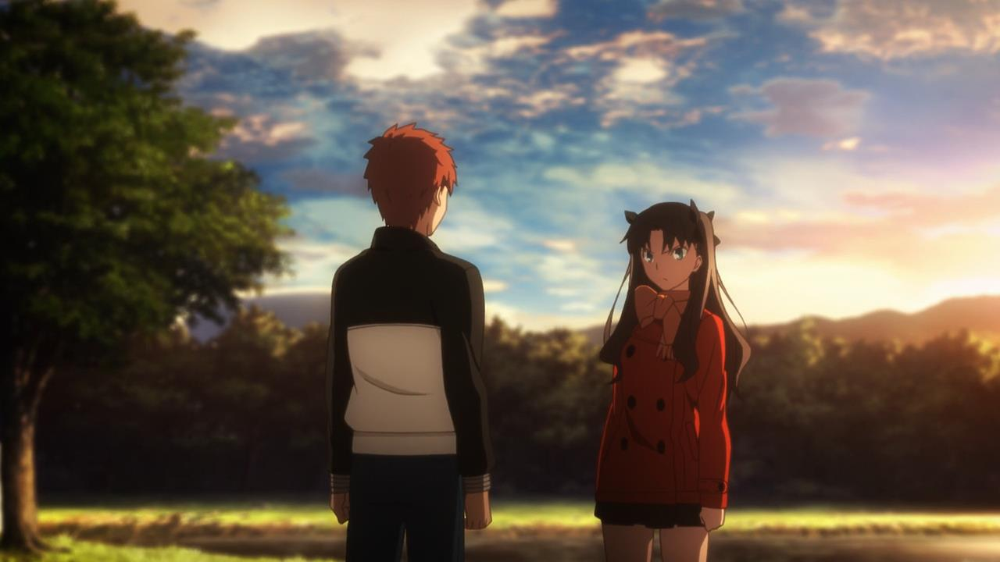
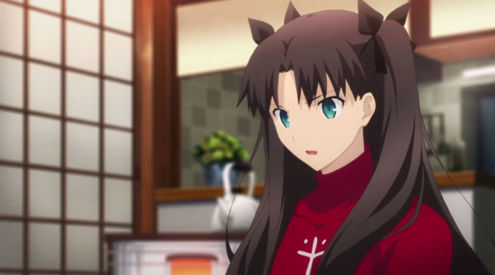
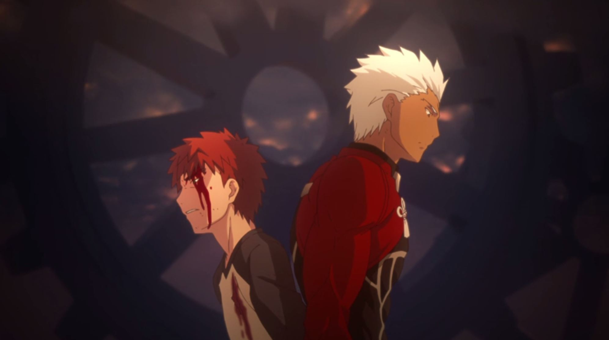
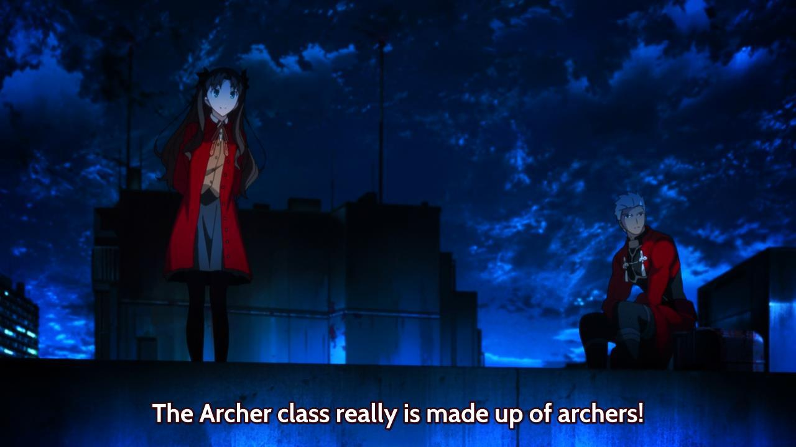
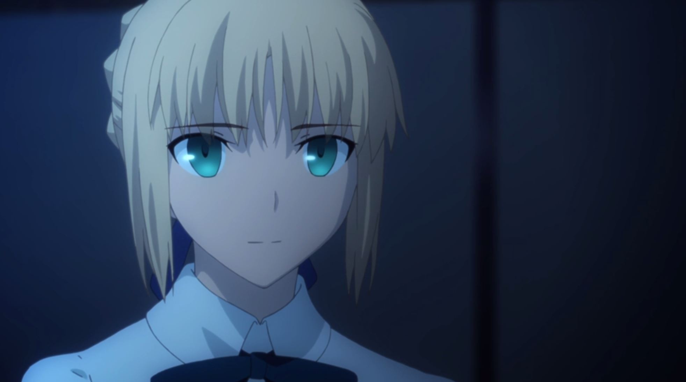
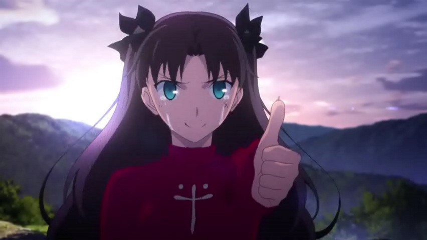
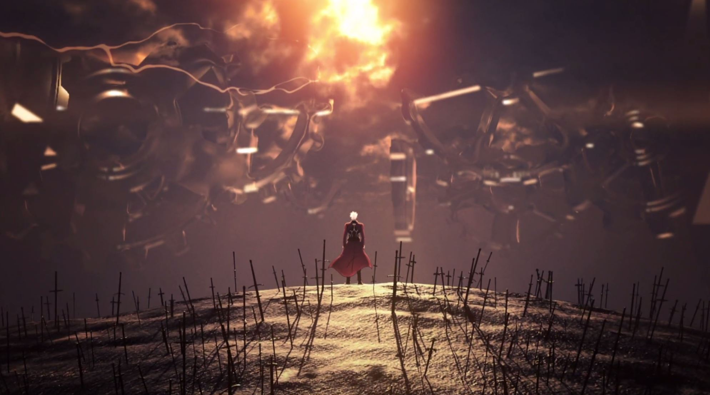
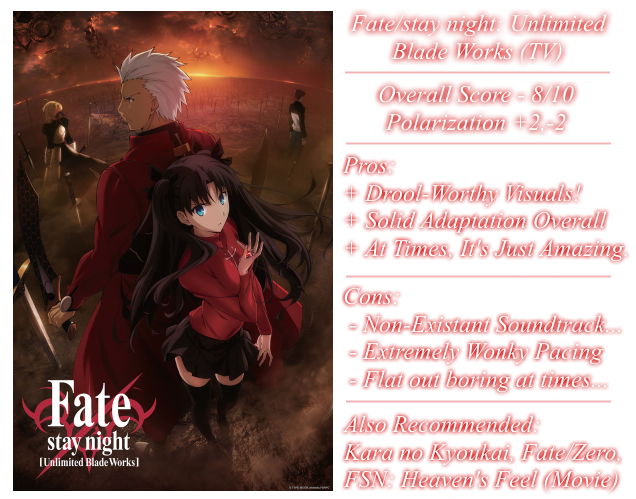

---
{
	title: "Fate/stay night: Unlimited Blade Works (TV) is beautiful yet flawed",
	published: "2015-06-27T16:00:00-04:00",
	tags: ["Rockmandash Reviews", "Fate/stay night", "Unlimited Blade Works", "AniTAY", "Review", "Tayclassic"],
	kinjaArticle: true
}
---

<video src="./1316014531186339906.mp4"></video>

As I was watching through this show, I was confused. Confused by the fact it feels so alien to me, yet so familiar. Confused by the fact that it show can be unbelievably amazing, yet so mediocre at the same time. Confused by the fact that it can be so similar, yet so different. Animated by Ufotable, *Fate/stay night: Unlimited Blade Works (TV)* is a completely different beast than the [Visual Novel](/posts/rockmandash-reviews-fate-stay-night-visual-novel-1613176306) route with the same name, and is both beautiful and flawed at the same time.

***

 

Let’s start out with what you are all expecting me to say: *Fate/stay night:Unlimited Blade Works* is one of the most visually stunning anime out there, and quite possibly the most visually impressive TV anime with production values that you would expect from feature films. The art is so refined that one can’t help but admire the amount of detail and work that they put into it, and the show definitely earns the moniker *Unlimited Budget Works* that everyone has been calling it. To me, it has one of the best aesthetic designs in anime, the amount of visual effects like bokeh that this show has is simply outstanding, the way they use things like lighting and different angles to enhance the mood is great, the characters expressions are more vivid and full of life than almost all anime, and the way they rendered everything… just beautiful. Ufotable really nailed it with the Visuals in this anime, and I can’t help but love it. Honestly though, this shouldn’t be surprising as Ufotable is the same company that did the *[*Kara no Kyoukai*](http://tay.kinja.com/rockmandash-reviews-kara-no-kyoukai-the-garden-of-si-1524615358)* adaptation, which I claimed was *“The pinnacle of Japanese animation, the best that Japanese animation has to offer.”*

<video src="./1316014531627805250.mp4"></video>

Really, everything about the Visuals of Ufotable’s *Unlimited Blade Works* is just amazing: The scenery in this show is done extremely well, the the way that they executed the magic in this show is drool worthy while being extremely accurate and more impressive than the source at the same time, and the fights scenes… oh, the fight scenes. In my [original *Fate/stay night* ](/posts/rockmandash-reviews-fate-stay-night-visual-novel-1493594993)[Visual Novel review](/posts/rockmandash-reviews-fate-stay-night-visual-novel-1613176306), I stated

> “I wish I was either watching all of that in a fluid animated fight, or playing a game where I can influence the fight itself”

and this dream is finally coming true. To put it frankly, it’s everything I ever dreamed of from *Fate/stay night* when it comes to the fight scenes, and they are everything I could have ever imagined or even better. When Studio Deen did their adaptations, the fight scenes were frankly, absolutely nothing special, and in the Visual Novel, the fights weren’t that visually impressive: they were still images with effects. Fast and furious, the fights are visually impressive, extremely engaging, do a great job at representing the movement and feel of the fight. Also, it’s an anime that really cares about cinematography, and the cinematography is just one of the best that anime has to offer, along with shows like *GARO*, *Bahamut*, etc. It’s a sight to behold, and it’s very impressive. My only real issue with them is that I wish they were longer or slower for the sake of the story, but you can’t really count that as an issue when it’s just wishing for more good stuff, right?

<video src="./1316014531671470914.mp4"></video>

***

 

What’s not nearly as impressive however, is the way the how the story in general was executed, with major flaws in the writing, the pacing, and the way that they presented this plot negatively affecting the experience. One may chock this up to me being a VN fan, but if my loyalty to the original source was wrong with Ufotable’s *Unlimited Blade Works*, this would be a much better show.

If you told me that a story was nothing more than words on paper, nothing more than the events happening, the anime would be near identical to the [Visual Novel](/posts/rockmandash-reviews-fate-stay-night-visual-novel-1613176306): while there are minor changes to the story that pretty much only add to the story instead of hindering it, the overall events, characters, interactions, are exactly the same. The story still follows Emiya Shirou as he is dragged into a fight-to-the-death tournament called The Fifth Holy Grail War, where people known as masters fight with heroes from throughout history, known as servants, for a chance to get their wishes granted by the Holy Grail. The *Unlimited Blade Works* Anime/VN route in particular just uses the Holy Grail War as a backdrop to tell Shirou’s story, struggling with himself about himself and his ideal, having to confront them head on.

The removal of monologuing completely changes this: while Anime fans may mock VN fans for caring so much about this little change and say it’s necessary to adapt the work, I’d say that this change is detrimental to the story, ruining it and everything it stands for. Due to the first person, monologue filled perspective, The VN made you feel like you were with Shirou, going through the challenges of The Holy Grail War, experiencing everything with him, connected. It made you care about the character, feeling his idealistic beliefs, engaging you whenever he head to deal with them in the route. This is the core of *Fate/stay night,* and nowhere is this more prevalent than in my favorite route, *Unlimited Blade Works,* where they specifically focused on Shirou and his ideals.

Without this element that only the crazy VN fanbois complain about, *Unlimited Blade Works* loses the essence of what makes it what it is, becoming a dull, lifeless show without it’s own flare. The Visual Novel let you get to know the scenes, get you to feel the ideas and thoughts of the characters, the anime just shows you the events that occur. This show makes you feel like an observer, and because of that, the amount of engagement the viewer has in comparison to the reader of the VN is completely different. With this one change, the story moves the focus away from Shirou and his ideals to solely the events, preventing you from engaging with the story and falling in love with it as much as you could in the past. This one change is the difference between a work that makes people fall in love with a series, and one that makes people feel lukewarm about the work, the change that changes your entire experience. The story relies on your caring of Shirou and the characters to do what it does, making the scenes important and meaningful but without that, the scenes are just scenes, lacking in substance and lacking in emotion. It takes engagement to evoke empathy after all, and this change prevents them from evoking that empathy when they need it. This story really uses it’s thematic, emotional elements, like with betrayal and the Shirou/Archer fight, but if you don’t care about them, then what can you do?

<video src="./1316014531851397698.mp4"></video>

There’s also the issue of the structure: The story is ment to be played in a specific order, all at once and the piecemeal style adaptation screws with this. There’s a lot of character development is done in the Fate route, and the Fate route gets your mind in the perspective that you need to be in when playing UBW *(Order: Fate -> UBW -> HF)*. The Fate route is about Shirou’s ideal, a relatively simple shounen story that gets you to care about Shirou and Saber It develops two of the main characters to the point that you actually care about them, helps the story along. That being said, it eerily resembles what archer went through, getting you to care about archer once he gives his major exposition. There are issues that many (ie, [*Fate/Zero*](/posts/rockmandash-reviews-fate-zero-ani-tay-1538163593) fans) may have with the story that are covered in HF, and the story is just a better experience as a whole.

Also, due to the nature of Visual Novels, there are a few major things that are impacted in a huge way that have made this show a much less enjoyable experience, things that even non-VN fans complain about: a presentation that lead to poor pacing and horrible stopping points. Visual Novels are not serialized works and there is no stopping point, as the reader stops where they want. A VN is based on natural stopping points, and when adapting a VN, they need to make stopping points. These are pretty rough with UBW, and made watching it brutal, expecially in the first half, exacerbating the issues one may have with the series.

***

Music is essential part of any Audio-visual medium like Anime, as it effects nearly everything in the work: it effects the mood of the show which effects how you the viewer, it creates an atmosphere of the show which helps develop the characters and the world, and it makes things memorable. Now, imagine having seen a story with music, then without and you kinda get a grasp of how I feel seeing Ufotable’s *Fate/stay night: Unlimited Blade Works.*.. The soundtrack is almost nonexistent and what’s there is extremely subdued due to the execution of it. While some may chop this up to me being a VN fan, this isn’t a Yuki Kajura soundtrack, and it’s execution is bad by pretty much any standards. The soundtrack doesn’t engage the viewer when it needs to, it doesn’t support the story much at all and doesn’t even play half of the time. Yes, there are moments where it really shines with it’s execution like the fight scenes, but fight scenes aren’t everything.

Frankly, the execution is a big part of why the show at times can feel more dull than it really should be. The slow pace is exasperated, making the wonky pacing of the show even more apparent, the memorable scenes are made completely irrelevant because of the score and the viewer is left relatively unengaged, to the detriment of the entire work. Other works manage to make a slow pace engaging so it rarely becomes an issue, but *Unlimited Blade Works* fails to do this, with a depressing execution that could have been so much more. There is no atmosphere to get you into the work, there is nothing that keeps you attached to the story from the music, and this is just bad execution.

The sad part is that the issue doesn’t lie with the songs, or the talent of the people behind it, it lies solely on the stylistic choice they made with the execution, something that just makes me depressed everytime I watch this show. I loved composer’s (Hideyuki Fukasawa) work with [*Mahoutsukai no Yoru*](https://www.youtube.com/watch?v=z5FjiEhPS8k\&index=5\&list=PL6B3745A9F9F6C2DF) as it’s score added tons to the work with a rich sound that made it stand out, and it did a great job at creating an atmosphere, but with *Fate/stay night: Unlimited Blade Works*, they decided to squander this potential by making it more Hollywood-esque: the music was quiet, the bass was overemphasized, and they made it so the soundtrack never overpowers the other aspects of the work by filling it with ambiance. I don’t really think that it works in this situation, and it definitely doesn’t work in the way that they executed it, not supporting anything on the screen a majority of the time.

That being said, it does have it’s strong points. The soundtrack itself is really solid... yes, I would prefer it to be not so subdued, but it sounds rather impressive with it’s use of instruments shown in standouts like the Archer track, and Rin’s Melody. Listening to the soundtrack outside of the show is quite nice, but it just makes you think of the missed potential, how everything went wrong when actually making the show. The insert songs that this show has, [This Illusion](https://www.youtube.com/watch?v=sB0nlGG-iVg) and [Last Stardust](http://anitay.kinja.com/op-ed-a-day-last-stardust-fate-stay-night-unlimited-1706597248) were just amazing and used absolutely brilliantly, making scenes extremely memorable and moving the viewer to no end. The moments that these insert songs created were brilliant, but this is something that many shows can execute throughout the show without the need for fancy lyrical songs, and this show should have been able to do that too. Also, last but not least, the Voice actors are the same as they always use for the fate characters and they did a great job once again, no problems there.

***

 

I don’t think I’ve been as exited for an anime as much as I have been for *Unlimited Blade Works*. On paper, and from prior experiences (they did a great job with [*Kara no Kyoukai*](/posts/rockmandash-reviews-kara-no-kyoukai-the-garden-of-si-1524615358?rev=1435277772503), [*Fate/Zero*](/posts/rockmandash-reviews-fate-zero-ani-tay-1538163593?rev=1435277186878), and the FSN OPs for the vita), I expected an amazing, engaging and accurate portrayal of one of my favorite stories, and my favorite route in *Fate/stay night*. What we got was good overall, but just had a ton of issues that really kept me from falling in love with it, tons of things that kept it from being a great experience in my eyes.

It’s the difference in experience and the general dullness in comparison to the VN that makes me think Ufotable did a poor job. And to give Deen credit, even though 2012 was pretty sketch in animation and actually telling the story, they replicated the feel of the route much better than 2014, and I’d personally go back to 2012 before 2014 because of it. This is not to say you’ve done something wrong by starting off from a place that wasn’t the VN, but looking objectively, UBW simply isn’t as good as the source, even though it looks so much better. To those who haven’t seen the source and are enjoying it, that’s because UBW is doing a decent job at adapting the story, and supplementing it storywise but even those should be able to see the issues with UBW (TV), mainly the pathetic soundtrack that fails to enhance the mood of the scenes. It’s the experience that matters, and it’s the experience that makes all the difference. If a show captures the message, feel and experience of a work, it’s a great adaptation, and if not, it’s not great, and UBW (TV) isn’t a great adaptation.

That being said, pretty much all of my complaints were swept away episode 20 onwards, where they finally nailed pretty much everything with great music, great pacing, great action, etc. I was crying in joy when watching episode 20, it was just so good..... I just wish the whole show could have been like this....

***

 

Faker. Imitation. Close enough. These are words used to describe important elements of the story in this anime, but I can’t help but use these to describe the series itself. In ufotable’s efforts to make this this anime the best they possibly can, they striped this story of everything that made what it was, making this show feel like a poorly done imitation of instead of the real deal. For some, they won’t notice the difference, and others may say that it’s close enough... but words cannot describe how disappointed I am with *Unlimited Blade Works*, this adaptation that poses for the real thing. What we got was good, but I was hoping for something amazing, so I’ll have to keep praying.... *Unlimited Blade Works*.

 

***Copyright Disclaimer:*** *Under Title 17, Section 107 of United States Copyright law, reviews are protected under fair use. This is a review, and as such, all media used in this review is used for the sole purpose of review and commentary under the terms of fair use. All footage, music and images belong to the respective companies.*

*You can see all my reviews on *[*Rockmandash Reviews*](http://tay.kotaku.com/tag/rockmandash-reviews)* and the rest of my *[*Type-Moon Marathon here*](http://tay.kotaku.com/type-moon-marathon-wip-1534726534)*. For An explanation of my review system, *[*check this out*](http://tay.kotaku.com/rockmandash-rambles-an-explanation-on-my-review-system-1619265485)*.*
