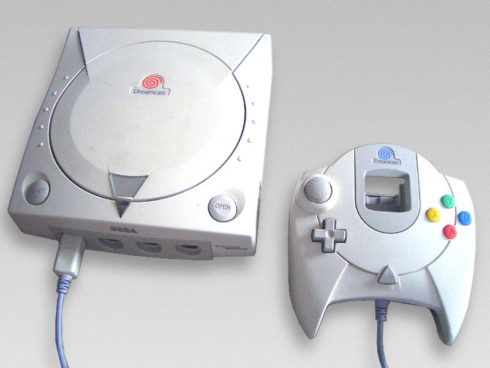

---
{
  title: "Favorite System, Aesthetically Speaking [Opinion]",
  tags:
    [
      "Rockmandash12",
      "Tay",
      "Tayclassic",
      "Favorite",
      "System",
      "Aesthetically",
      "Speaking",
      "Console",
      "Handheld",
      "Top 5",
      "Opinion",
      "Nintendo",
      "Sega",
      "Sony",
      "NEC",
      "consoles",
      "Handhelds",
      "Dreamcast",
      "Genesis Model 1",
      "Super Famicom",
      "Jr",
      "Ps3 Slim",
      "Vita",
      "TV",
      "Slim",
      "Gameboy",
      "Gameboy Micro",
      "Gameboy Pocket",
      "Pocket",
      "PSP Go",
    ],
  published: "2014-02-12T01:40:00-05:00",
  attached: [],
  license: "cc-by-4",
  oldArticle: true,
}
---

I was talking to my friend about the design of the new consoles, and so I was thinking,
  what's my favorite design on consoles? Later, I was also thinking of my favorite designs of handhelds, so I thought,
  why not ask the TAY community? I'm going to have it in a Top 5 layout, but you guys just list a console with a picture
  and why you like it.

In no particular order, let's start off this list!
<h2 class="sc-1bwb26k-1 fvCjqJ" id="h119106">TOP 5 CONSOLES</h2><h2 class="sc-1bwb26k-1 fvCjqJ" id="h119107">1. Sega Dreamcast</h2>

I love everything about
  the Dreamcast, aesthetically speaking. The nice curves, the controller ports, the swirl, the colors of the game pad,
  etc. The Dreamcast has great lines, and great curves. The console itself was quite kick-ass too, with great games, but
  the controller sucked ergonomically, and the system flopped :(
<h2 class="sc-1bwb26k-1 fvCjqJ" id="h119108">2. Sega Genesis/Mega Drive Model 1</h2>

I'm a big fan of the design of the Model 1 Sega Genesis/ Mega Drive. The top is the NA
version, while the 2nd one is the Japanese one. I like both, as each have their own charm. The console still looks
sleek and cool, 25 years after the launch.

<h2 class="sc-1bwb26k-1 fvCjqJ" id="h119109">3. Super Famicom - Japan &amp;
  European Versions, regular and Famicom Jr.</h2>

RGBY&gt; Purple. The Super Famicom had amazing lines, an awesome skittles-like color scheme
on the controller and looked sleek and modern. 90's The Super Famicom Jr just makes it even better.

<h2 class="sc-1bwb26k-1 fvCjqJ" id="h119110">4. Ps3 Slim (Not Super Slim...)
</h2>

Arguably the worst kept secret in gaming history, the PS3 Slim hits pretty much all
  the checkpoints for a good console design. Matte? Check. Elegent? Check. Clean? Check. Iconic? Check. It manages to be
  smaller and cheaper, yet still keep the premium look that sony consoles have started to have lately.
<h2 class="sc-1bwb26k-1 fvCjqJ" id="h119111">5. Vita TV</h2>

Small. Sleek. Modern. These are all words that describe Sony's new handheld in a
  box, and man, that box is a looker. I'm a fan. Continue the good work Sony :D
<h2 class="sc-1bwb26k-1 fvCjqJ" id="h119112">TOP 5 HANDHELDS</h2><h2 class="sc-1bwb26k-1 fvCjqJ" id="h119113">1. Gameboy Micro (Specifically, the Famicom Version)</h2>

I've always been a fan of the Famicom Gameboy Micro. If there was a handheld I'd buy
  just for the aesthetics, it would be this one. Great lines, great looking everything. It's a looker.
<h2 class="sc-1bwb26k-1 fvCjqJ" id="h119114">2. Gameboy Pocket</h2>

I hope you aren't yelling blasphemy because I picked the Gameboy pocket over the
  original, but I think it looks better, and one of the OG Gameboys had to make this list. It's a beautiful system, plus
  Grey &gt; Green.
<h2 class="sc-1bwb26k-1 fvCjqJ" id="h119115">3. PSP Go</h2>

Sony's digital only attempt at making a handheld when UMD games were far cheaper,
  they made a beautiful looking system. I love the symetrical-ness, and the color scheme in general. One of the best
  looking systems, There's a bit in me that wishes Sony went this way with the Vita.
<h2 class="sc-1bwb26k-1 fvCjqJ" id="h119116">4. PS Vita Slim</h2>

Slimmer. Cleaner. More Colorful. I might sound like a PR rep for the Vita now, but I love
the redesign of the Vita. Took an already modern system, cleaned it up a bit, and made it look beautiful. The New Vita
does so much right aesthetically speaking. Too bad about that screen though. When they hit the states, I want to see
for myself, and maybe i'll upgrade to one of these beautiful systems (I want it in blue :) ). 

<h2 class="sc-1bwb26k-1 fvCjqJ" id="h119117">5. Sega Nomad/TurboExpress</h2>

These are here beause they look like the respective console they shrunk, and I didn't want
to see it all Nintendo/Sony. They both have great lines, great aesthetics, great girth, and not so great battery
life.

