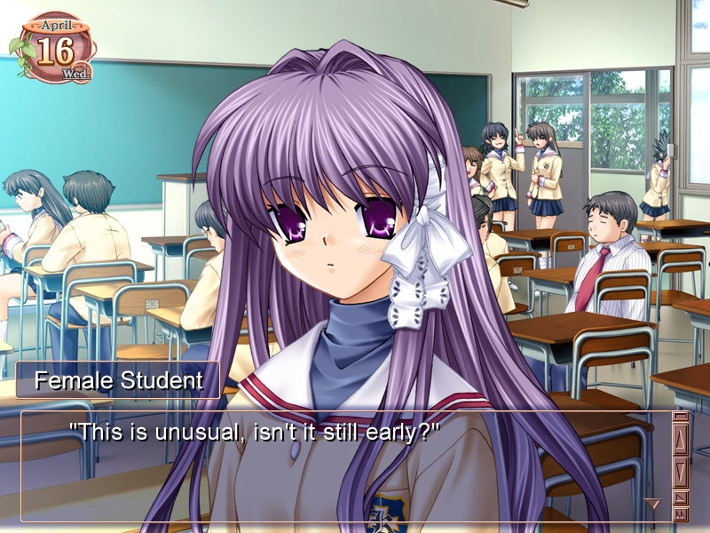
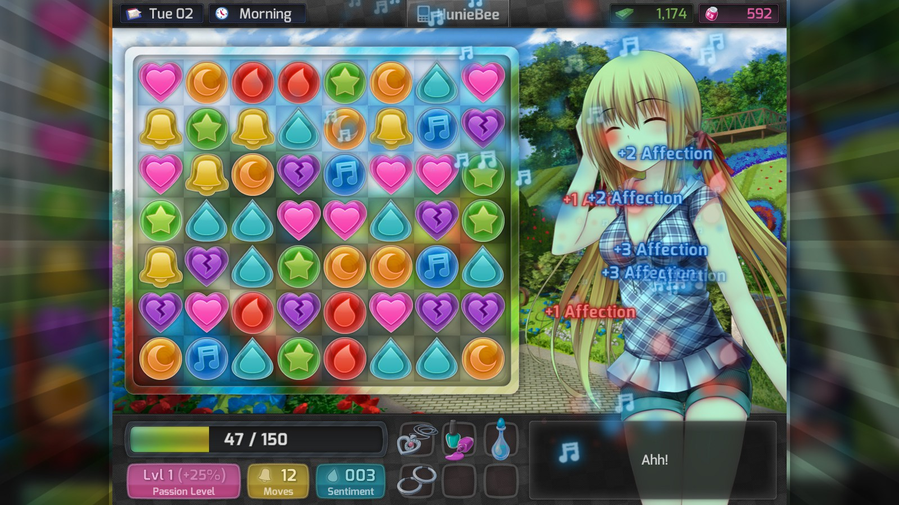
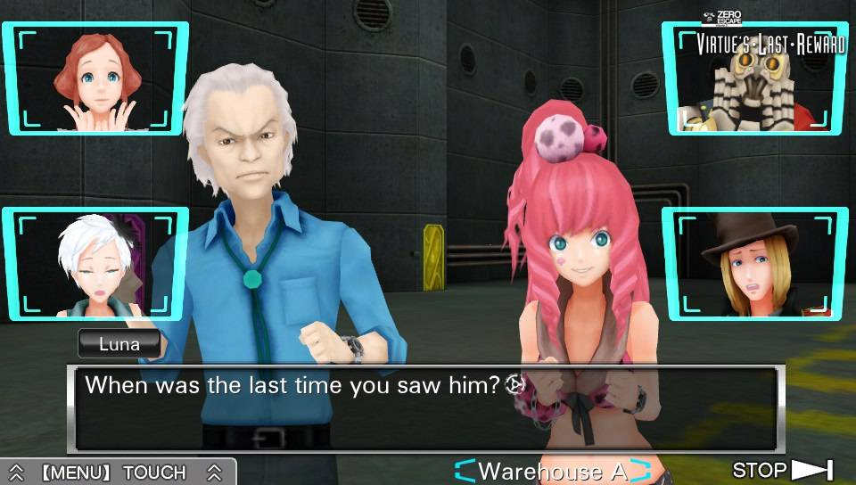
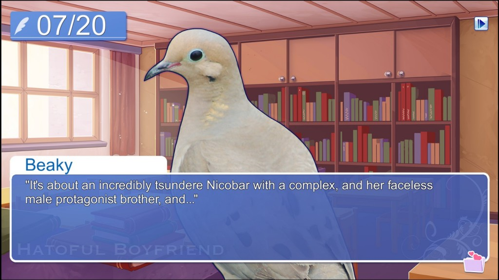

---
{
	title: "FYI: Dating Sims ≠ Visual Novels",
	published: "2016-03-25T20:50:01-04:00",
	tags: ["Rockmandash Rambles", "Dating Sim", "Visual Novels"],
	kinjaArticle: true
}
---

**Just an FYI** - Lots of people get them [mixed up](http://kotaku.com/how-visual-novels-and-romance-apps-are-changing-dating-1767129931), but Dating Sims and Visual Novels are technically different genres and are not interchangeable terms. For more information, read on.

***

According to [Fuwanovel’s Document of Lexicon](https://docs.google.com/document/d/1yfMIKXtfCFnZgcgRN_-34B8CdSTRE2FwDrvT4gCPP-s/edit) (well, loosely copied, I edited it a bit for flow in this article):

***Visual Novels*** (**VN** for Short) is a subgenre of adventure games and are interactive storytelling games, usually structured around choose your own adventure books where the player is presented with choices that may or may not alter the course of the story. They are commonly illustrated in an anime/manga art style and are primarily text focused. Character sprites, original soundtracks, voice acting are common occurrences in more modern games.

**Dating Sims** are technically different genres, being a sub-genre of sim (simulation) games based on romantic relationships. Dating sims include a gameplay element and often a skill set which allows you to raise specific stats to win over the different heroines.

While there may be cases that there are games that have both, but for the most part they are separate genres, and there is no such thing as *Dating Sim Visual Novel*. There are *Romance Visual Novels*, and visual novels with dating, but look up any article talking about VN terminology, and they are usually noted as separate entities because they have completely different mechanics and different goals. For an example, Wikipedia’s [Visual Novel page specifically says not to be confused with Dating sims](https://en.wikipedia.org/wiki/Visual_novel), Their dating sim page states [“For the adventure subgenre that is also often referred to as dating sim, see visual novel”](https://en.wikipedia.org/wiki/Dating_sim), and [this examiner article also explicitly states a difference in the genres](http://www.examiner.com/article/lexicon-part-three-visual-novels-and-dating-sims) for an example. Yes, I know these aren’t the best sources and you’re going to discredit what i’m saying because of my sources, that’s fair, but I’d appreciate if you could link some more “Legit” sources as there isn’t really any definitive source to talk about terminology regarding VNs.

There may be times when a game is both like *Hatoful Girlfriend *(Idk about that one, personally haven’t played it but from what I’ve seen it’s mostly just a traditional VN), but I’d argue that even if it was thoroughly intertwined in the game, it doesn’t mean that the genres are one in the same. Genres aren’t in total isolation, and other genres do interact,people don’t typically say that one is a part of another and your example doesn’t doesn’t mean that Dating Sims **ARE** Visual Novels or vice-versa. [*Super Paper Mario*](https://www.youtube.com/watch?v=iT9RMGFUyMY) is a platformer and an RPG for an example, but those two genres have different mechanics and nobody would say that they are the same because there are games with both. Yet, people always do this with VNs and dating sims, and that doesn’t really make sense when you look into it. If you disagree after this article, that’s fine, but please take a moment to try to consider the thought that they aren’t one and the same.
