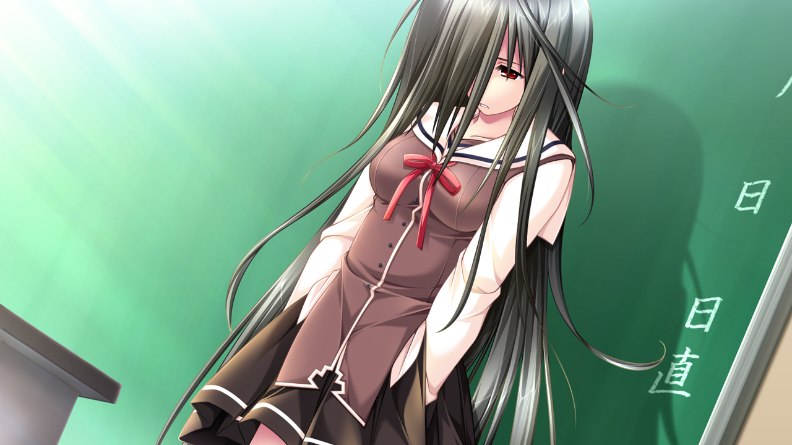

---
{
	title: "RockmanDash Reviews: G-Senjou no Maou [Visual Novel]",
	published: "2015-11-21T14:30:00-05:00",
	tags: ["rockmandash reviews", "rockmandash", "tayclassic", "g-senjou no maou", "visual novel", "tay", "fuwareviews"],
	kinjaArticle: true
}
---

While Visual Novels usually slow affairs with either meticulous writing or Slice of life, There’s always an exception to the rule, and now this exception to the rule has made it’s way to the west. With great pacing, a beautiful story and a tense tone that really makes it feel like a thriller, *G-Senjou no Maou *by Akabeisoft2 is one of the best VNs in the west, and [one of my personal favorites](http://rockmandash12.kinja.com/rockmandashs-top-10-favorite-visual-novels-1677663938).

***

Also, for those who would rather not read, here’s a video review! That being said, it’s based on an older version of this review and game (instead of the official release in the west by Sekai Project), so please keep that in mind as you watch through it. If you want to hear my current thoughts however, continue on :)

***

 

Like the medium itself, the strength of* G-Senjou no Maou* has to be the story it has to tell, since it provides and portrays its messages extremely well. If you asked me how to explain* G-Senjou no Maou* however, I’d tell you that it’s the *Death Note *of Visual Novels, as they share quite a bit of similarities: they cover similar topics and have similar themes, they have a similar tone (of tenseness but not explicit morbidness), and are focused on a cat and dog game in which masterminds battle with their wits to achieve their goals.

In *G-Senjou no Maou*, we follow Azai Kyousuke, the stepson of a Yakuza boss. During the day, he acts as a typical high school student, but at night, he helps run the “family business”, covertly working for his stepfather as ruthless financial heavyweight. This idyllic existence is broken when two individuals appear in the city - an awkward yet absolutely brilliant girl named Usami Haru who happens to have way too much hair, and a powerful terrorist known only as “Maou”. Almost without delay, Usami Haru & Maou begin a deadly game of cat and mouse, bringing Azai and his friends into the crossfire. Plotting, political intrigue, mystery and bleak topics like kidnapping, terrorism, murder, hostages, the Stockholm syndrome, and massacre are the just some of the topics that are covered in this epic battle of wits, and it makes the work a great experience.

The most important aspect of the experience and the biggest thing that* G-Senjou no Maou *shares with *Death Note *is not the content, but how the story is told: it’s a very high energy, high tension work with the thriller trait that made *Death Note *stand out from the crowd, and what makes *G-Senjou no Maou *stand out from the crowd as well. In a genre full of exposition and meticulousness, seeing something paced remotely fast is a nice change, and keeps the game engaging. The story never felt too fast or too slow, but because of its tense tone, the story feels fast in comparison, an emotional roller coaster that was a blast.

To add to this, the characters in this work are amazing and engaging, with the two that are in focus (Usami Haru and Maou), really taking the cake. From the “Hero” Usami Haru with her unique and quirky personality that truly makes her feel like a real (if albeit weird) person to the “Devil” Maou who is mysterious and charismatic, *G-Senjou no Maou *focuses on a duo that is engaging, with engaging attention grabbing interactions which that create a real dynamic that is spectacular and absolutely some of the best parts of the game. The way they subvert the themes of heroism and the stereotypical relationship with the villain, the interlocking fates that leave everyone morally grey, the way that it influences everyone else while being engaging by itself, all about this relationship is absolutely fantastic. A lot of this trickles down to the rest of the cast too, but maybe not to the same extent: while those two are by far the best characters in the game, *G-Senjou no Maou’*s cast in general is pretty great, as they are entertaining to see with interesting interactions, and are pretty fleshed out, making for a great experience.

To top this package off, *G-Senjou no Maou* outdoes itself with an absolutely amazing ending. As you go through the game, the narrative slowly progresses and gets better, peaking at the end: the last chapter is fantastic and that epilogue… that epilogue. The epilogue is one of the best endings I’ve ever seen - it’s extremely moving and memorable as it hits you hard with touching scenes while feeling like everything fits perfectly, providing closure in a way that’s rarely seen in a work (while being open ended enough to feed curiosity). Personally, I’d be the happiest person in the world if they made a sequel, but I’m completely satisfied with how it ended. This is how you end a game, this is one of the best endings I’ve ever seen.

If I had a complaint with the writing of the game, it would have to be that the game has issues with consistency at times. Flow between scenes isn’t perfect, tonal shifts can be wonky, and the writing in general has some issues as some things conflict with each other. To make matters worse, everything I’ve been saying about the story is referring to the main route, but the second you step out of it, the writing gets significantly worse. The alternate routes don’t make sense in the context of the story: the only reason they happen are deus ex machina happening to satisfy the requirements to branch off to these routes, and they derail insanely in tone, story, etc, with major continuity issues that totally took me out of the game every time I tried to play them. Also, the writing quality of those routes in general aren’t as good as the main, so I’d just ignore them entirely. That being said, with fantastic stories and great characters, the overall writing in this game is pretty good, and it’s worth your time if you’re into it.

***

 

*G-Senjou no Maou* is a VN from 2008 made by a well known dev Akabeisoft2, so there’s a level of quality expected from the visuals, and those are reached, for the most part. There’s not much really to say here, the character art is pretty good, detailed and consistent, some of the background art is rather nice, the CG in the game looks pretty good and the overall aesthetic is nice, but there’s nothing that jumps at you and nothing about the visuals of this game is really mind blowing. It’s nice, but it does its job, nothing more, nothing less.

***

Once again, we have another Visual Novel with a musical related name, (even to the point that music plays a pretty big role in the plot) and once again, we deal with a stellar soundtrack to go along with it. If you asked around the community to see what they think of the soundtrack, you’d probably hear that many think it’s some of the best in the genre, but it didn’t quite do that for me. I personally thought it was good, but not the best in the genre, but this depends on your taste in music: A good chunk of the music in the game is remixed classical music, and while good at times, the music didn’t really do anything special to me. It’s used extremely well, to amp up tension and make the mood of the work (with some of the tracks like “*Close Your Eyes”* being absolutely fantastic), but the music itself isn’t the best in the genre, and definitely not the most amazing to listen go outside of the game. That being said, in now way am I trying to say that this soundtrack is bad, that’s doing it a disservice. It’s pretty good and does its job well, sounding great and being very effective. The voice acting is also great too, with everyone doing a good job (and the re-release not really changing any major thing). The most notable voice was Maou’s, as they casted Jun Fukuyama, which was an amazing choice as he fits the character so well. Overall though, good sound for a game with music in the title with tons of music references throughout.

***

 

If there was a Visual Novel that really surmounted the idea that VNs are an experience, it’s this one, as it is an absolute blast to go through, with a tone that makes the game extremely engaging throughout. During my first run of the game, I came into *G-Senjou no Maou* right after re-watching *Kara no Kyoukai* and I couldn’t think of a better way of getting into something like this, as the thematic similarities really made those flow together and get me in the right mindset for the game. I love thrillers, so *G-Senjou no Maou* made me smile like I’m some kind of idiot, with the experience playing through the game being an absolute blast. Everything blended to make a roller coaster of a VN, with the battle of wits being some of the most fun to go through, the characters amazing to see and the mystery something that was extremely compelling, making this VN is a stellar experience.

Also, I loved the main ending, with the epilogue… it was mind blowing. The void left after that ending... was just amazing… it was to the point that I wanted to start up the other routes, but the void wouldn’t let me.... I couldn’t get my mind off of that ending, and thus this review exists. I wanted (and still want) an after story-like conclusion, just because of how awesome the characters are, and how awesome the ending was. This game has an amazing plot that will drive most people to love it, and I’ve had a great experience with *G-Senjou no Maou*, so much so that I was hooked on it and didn’t do anything else for a day and a half and played all of the main route in one full run.

I’d like to mention my second run for this update of the review, as it was a bit different and may give you insight on the replayability of this game: I knew the twist and knew the mysteries because making it less of a blast, more of an enjoyment of times gone past. I forgot how entertaining this VN is at times with writing that put a smile on your face at all times (especially Usami Haru’s one liners), and the Slice of life that it has at the beginning is fun too, even if not best part of it. It doesn’t have much SoL, but what we get is really effective, not not too long or too short. Even though I knew everything, it was enjoyable all the time, and led to nights with a lack of sleep. It was just as fun as before, and really, the experience playing though this game is fantastic. (Also, the epilogue was just as effective the second time around. I was in tears throughout.)

***

 

We live in a changing world, one where the genre of Visual Novels is slowly expanding out of the west, with the fact that I can even have a section about the changes that publishers makes is bringing me to joy. In Fall 2015, Sekai Project released *G-Senjou no Maou *in the west, but 2015 is a far cry from the 2008 that this game was originally released in, and things have changed. It’s mostly small things, but its worth mentioning regardless.

The first change that you’ll notice happens before you even buy the game: Sekai Project split the game into two versions you can buy, a version with voice acting, and a version without because licensing fees are rather expensive. I’ve played it both times with voices, so I may not be the best to say this, but the voices are nice, but not necessary, so I’d recommend trying to get the voiced version, but if you can’t, you’re not losing anything dramatic by going without voice acting.

The biggest change is the aspect ratio, as while Akabeisoft2 decided they would upscale the visuals into the world of HD, they also thought it would be be a splendid idea to crop the game. I’ve thrown in screenshots from both the Sekai Project release and the original release so you can see the difference, but really, this is a minor change and you won’t really notice it as you play through the game, and it certainly doesn’t hinder the experience. While some may complain about this, I applaud the change, as this was one of my biggest complaints with the visuals of the game (if you check out the archives, that’s pretty much my only complaint), and it’s ridiculous how we deal with 800x600 so much considering we live in 2015, a world dominated by high resolution, widescreen displays. Along with this, there’s been an overhaul in the UI, a change that’s rather nice. I was originally bothered by the fact that the buttons made the game look much more cluttered but if you are like me and want to hide it, you can do that, and it looks good.

The only other changes that’ll probably really change your experience are the fact they got rid of h-scenes (good riddance if you ask me), and they got rid of the explicit warning that you were going to change routes. Yes, it’s still pretty obvious when you deviate, but it’s not explicit, which changes your experience. Neither will completely ruin or dramatically change how you perceive the game, but both are noteworthy regardless.

One last thing that is worth mentioning, one I thought was cool but personally turned off is the display of the music titles, something I wish every VN had because it’s rather awesome. If you want to know you can, and if you want to just be immersed, you can turn it off, no harm no foul. This is how additional functions should be added to games, and I really appreciate it.

***

*G-Senjou no Maou* is a thriller of a VN and great example of how varied this genre can really be, and it really deserves its place of regard as one of the best VNs (at least according to the west). It’s a great experience, written well with a great premise and great characters, to the point that it’s a game that should not be missed.

 

***

**Copyright Disclaimer:** Under Title 17, Section 107 of United States Copyright law, reviews are protected under fair use. This is a review, and as such, all media used in this review is used for the sole purpose of review and commentary under the terms of fair use. All footage, music and images belong to the respective companies.

*You can see all my reviews on *[*Rockmandash Reviews*](http://tay.kotaku.com/tag/rockmandash-reviews)*. For An explanation of my review system, *[*check this out*](http://tay.kotaku.com/rockmandash-rambles-an-explanation-on-my-review-system-1619265485)*.*

*Note: This review was originally posted on 2/11/14 has been updated on 11/21/15 to update the assets/formatting for the review, the gameplay section was removed as it is essentially useless, revise writing issues, etc. To see the original version, check out *[*this link*](http://s1.zetaboards.com/PetesGameRoom/topic/5387465/1/#new)*, and for the TAYified Version (as this was one of the first with the TAY assets), check out *[*this Archived version*](https://docs.google.com/document/d/13mlhyK_d5ucFJtcG7H6vrBkryKvG6Bf9nVCq1ddLUlU/edit?usp=sharing)*.*