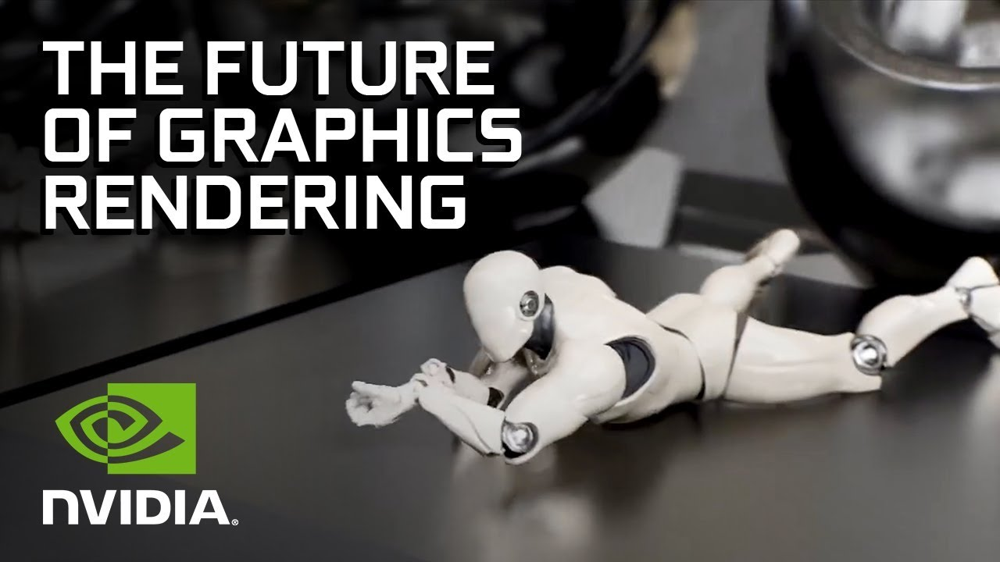
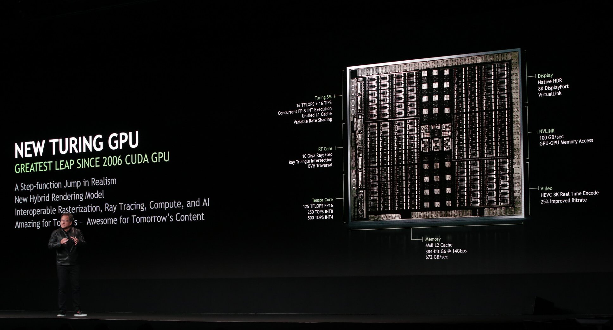
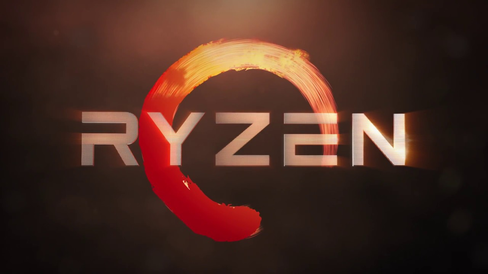
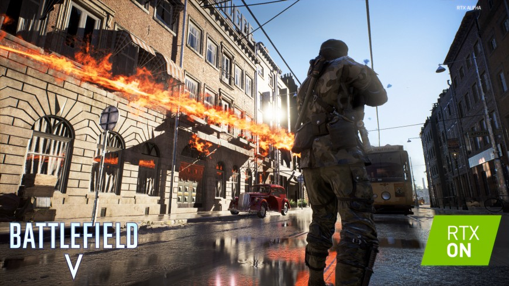

---
{
  title: "GeForce RTX and the Fight for the Future of Gaming",
  tags:
    [
      "Nvidia",
      "Next Gen",
      "PS5",
      "Ray Tracing",
      "RTX",
      "Rockmandash Rambles",
      "gaming",
    ],
  published: "2018-08-22T13:00:00-04:00",
  attached: [],
  license: "cc-by-4",
  oldArticle: true,
}
---

The future of gaming is here. Throughout the history of Nvidia, we’ve seen them
  constantly push the boundaries of graphics technology, but ultimately in anti-competitive, proprietary methods.
  Nvidia’s latest attempt to revolutionize gaming technology might actually change everything, but it has the
  possibility to fragment the market in a way that can set back gaming for years.

<iframe allow="accelerometer; autoplay; clipboard-write; encrypted-media; gyroscope; picture-in-picture" allowfullscreen="" frameborder="0" height="315" src="https://www.youtube.com/embed/mLIgfT04wsY" width="560"></iframe>

 Nvidia at Gamescom
  announced their new graphics cards like normal, but this time with a twist - instead of the latest GTX, they unvailed
  RTX, which emphasizes their newfound capabilities of real time ray-tracing. I’d recommend checking out the Digital
  Foundry video above, <a class="sc-1out364-0 hMndXN sc-145m8ut-0 gIacKn js_link" data-ga='[["Embedded Url","External link","https://youtu.be/ms7HQ7rckpA",{"metric25":1}]]' href="https://youtu.be/ms7HQ7rckpA" rel="noopener noreferrer" target="_blank">AdoredTV’s video</a>
  or check out <a class="sc-1out364-0 hMndXN sc-145m8ut-0 gIacKn js_link" data-ga='[["Embedded Url","External link","https://www.youtube.com/watch?v=Mrixi27G9yM",{"metric25":1}]]' href="https://www.youtube.com/watch?v=Mrixi27G9yM" rel="noopener noreferrer" target="_blank">Nvidia’s RTX reveal event</a>
  for an understanding of the technology, but <strong>TL;DR</strong>: ray tracing physically simulates how light
  actually works in game space instead of having to manually create lighting effects, and in practice, the results are
  much more realistic lighting and graphics. We get full, realistic reflections, we have accurate shadows, we have
  accurate lighting. This can change the way that games are developed and dictate how our games look in the future, and
  it’s really cool tech that absolutely blew me way: This could easily be the next big jump in 3D graphics.

Nvidia is betting on this tech to connect their gaming and AI markets, with these
RTX cards using their AI Tensor Cores and RT Cores in their new architecture as Ray Tracing accelerators. It’s a
significant bet because betting on these tensor cores is betting away from the traditional rasterization/raw compute
in favor of specific bespoke hardware. This generation most likely doesn’t move the needle much in the traditional
sense, so Nvidia is really betting that RTX is going to be the future of gaming, betting against conventional wisdom.
If the future of gaming moves to Ray Tracing, it will be a move away from their rival AMD’s vision of more general
purpose raw compute graphics cards, and a move away from the traditional performance we see in the current graphics
cards.  

There’s a major problem with this however - because Nvidia is the one driving this
  tech, there is a major possibility this tech may never catch on. 

Consoles tend to dictate the techniques that we see used in gaming - this generation
  was the age of dynamic resolution, for an example. If you’ve been following the tech that powers game consoles for a
  bit, you would know that the chips that currently power the current consoles are made by Nvidia’s rival, AMD. If you
  believe in rumors, the upcoming generation will most likely be powered by AMD as well because rumors that the PS5 will
  have a Ryzen CPU + a Navi GPU and to be honest, they’re the only one who is able to create a semi-custom chip with
  both the CPU and GPU that can run games up to the standards the consoles need. Compared to the current consoles, these
  AMD chips will be a significant upgrade, but we won’t see ray tracing in these new consoles because this tech is very
  demanding on hardware and without the bespoke hardware that the RTX GPUs have, it’s not possible to run this
  technology in real time. This leaves this technology outside of the next generation of gaming, away from the hands of
  millions of people.

<iframe allow="accelerometer; autoplay; clipboard-write; encrypted-media; gyroscope; picture-in-picture" allowfullscreen="" frameborder="0" height="315" src="https://www.youtube.com/embed/H0L3OTZ13Os" width="560"></iframe>

It also doesn’t help that Nvidia has a track record of anti-competitiveness and massive
  market fragmentation. With the RTX cards starting at $499 and going up to thousands of dollars, that doesn’t seem to
  change any time soon. If the technology does catch on with developers, what we will see is a fragmented market where
  only the people with the latest and greatest Nvidia graphics cards will be able to utilize them, but far more likely
  is the technology won’t catch on for at least half a decade at the least because of the limited amount of people with
  the capability to do so. It won’t work on this generation of consoles, it won’t work on next gen consoles, it won’t
  work on your current graphics card, and it won’t work on future AMD cards anytime soon. There’s a real danger here
  that we may never actually see Ray Tracing in a mainstream fashion because of the fractured nature devs wouldn’t want
  to make two art assets for a limited amount of people. It may die out, being the next PhysX or HairWorks, which is an
  absolute travesty because this tech is amazing.

While these technical aspects might not be interesting or appealing to you, this
launch has the capability to dictate the future of gaming. Ray tracing is an absolutely fascinating technology that
could make our virtual worlds look all that more impressive, but thanks to the history of Nvidia and the nature of
this launch, it may or may not happen. This is the fight for the future of gaming, and it’s definitely something to
keep your eyes out on. 

<em>Thank you for reading! If you want to check out more of my
  writing, check out my blog </em><a class="sc-1out364-0 hMndXN sc-145m8ut-0 gIacKn js_link" data-ga='[["Embedded Url","External link","https://rockmandash12.kinja.com/",{"metric25":1}]]' href="https://rockmandash12.kinja.com/" rel="noopener noreferrer" target="_blank"><em>RockmanDash Reviews</em></a><em>, as
  well as </em><a class="sc-1out364-0 hMndXN sc-145m8ut-0 gIacKn js_link" data-ga='[["Embedded Url","External link","https://fuwanovel.net/reviews-hub/",{"metric25":1}]]' href="https://fuwanovel.net/reviews-hub/" rel="noopener noreferrer" target="_blank"><em>FuwaReviews</em></a><em>
  and </em><a class="sc-1out364-0 hMndXN sc-145m8ut-0 gIacKn js_link" data-ga='[["Embedded Url","External link","http://anitay.kinja.com/#_ga=2.29830716.283022684.1516595779-1252363867.1516472140",{"metric25":1}]]' href="http://anitay.kinja.com/#_ga=2.29830716.283022684.1516595779-1252363867.1516472140" rel="noopener noreferrer" target="_blank"><em>AniTAY</em></a><em> where I am a contributor.
  Also </em><a class="sc-1out364-0 hMndXN sc-145m8ut-0 gIacKn js_link" data-ga='[["Embedded Url","External link","https://twitter.com/RockmanDash12",{"metric25":1}]]' href="https://twitter.com/RockmanDash12" rel="noopener noreferrer" target="_blank"><em>follow me on Twitter</em></a><em>
  if interested!</em>

