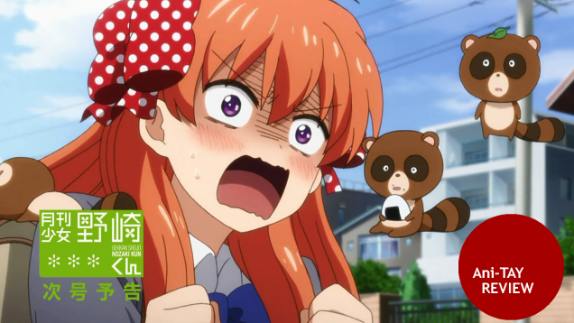
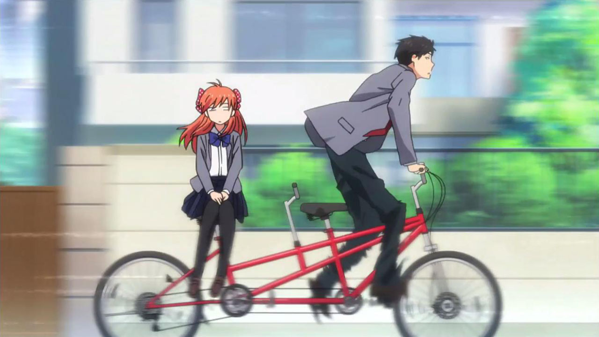
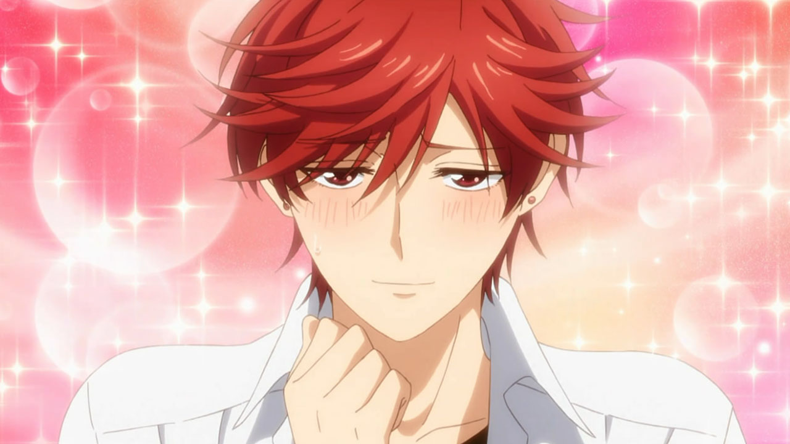
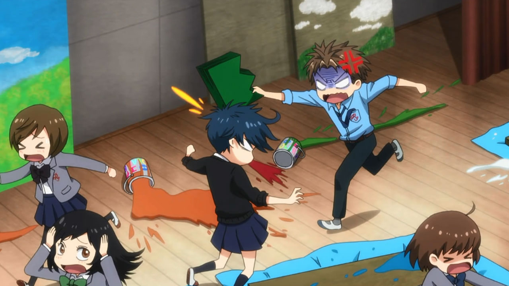
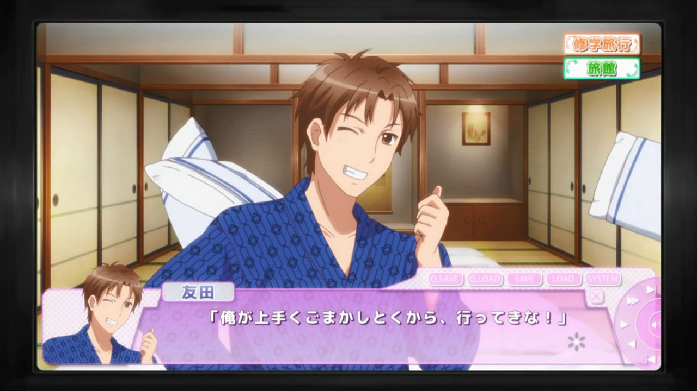
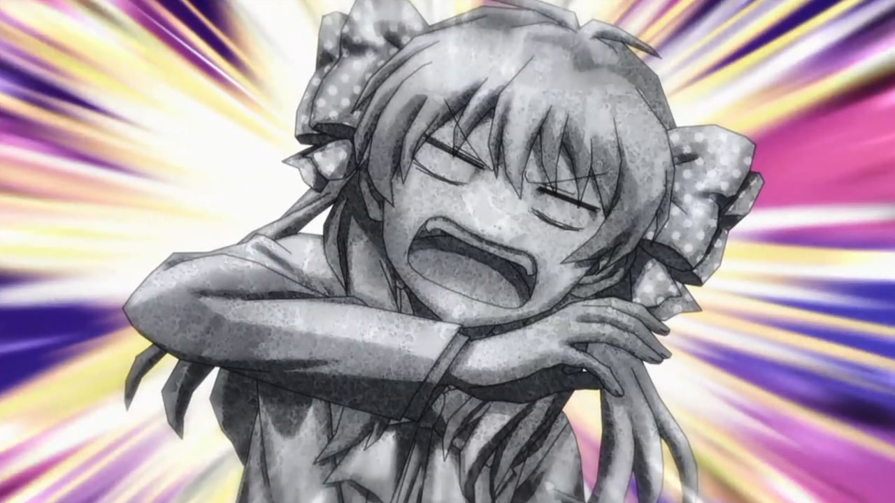
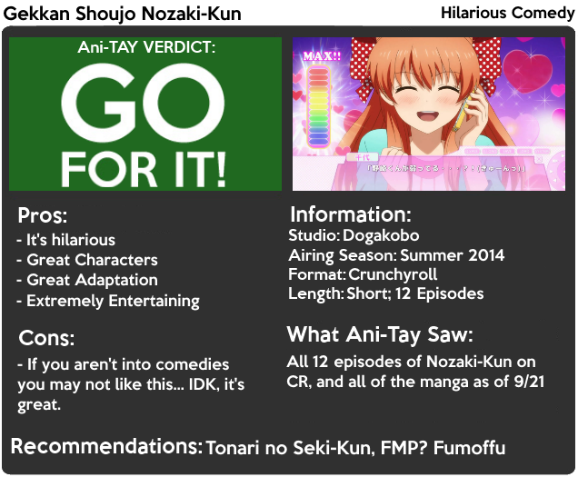

---
{
	title: "Gekkan Shoujo Nozaki-Kun : Rockmandash's Ani-TAY Review",
	published: "2014-09-21T18:00:00-04:00",
	tags: ["Gekkan Shoujo Nozaki-Kun", "Ani-TAY", "Rockmandash Reviews", "Nozaki-Kun", "Summer 2014", "Comedy"],
	kinjaArticle: true
}
---

I love a good Shoujo from time to time, and I'm sure you've probably enjoyed some too. They are entertaining, comedic and touch your heart. But what exactly goes into making such a work? Welcome to this review of *Gekkan Shoujo Nozaki-Kun*, a comedy series about the production of a Shoujo manga.

 

#### It's focused and hilarious

*Nozaki-Kun* is one of the better comedies from anime that I've seen in years, primarily because it's a well executed [subversion](http://tvtropes.org/pmwiki/pmwiki.php/Main/SubvertedTrope) and [lampshading](http://tvtropes.org/pmwiki/pmwiki.php/Main/LampshadeHanging) of the Shoujo manga genre. It's focused on being an entertaining comedy, which does it to a level that many would find absurd, but that's the charm of it. Nozaki-kun takes what would normally be a regular scene in a shoujo manga, and make it into an hilarious and entertaining gag. A great example would be the scene in the picture above: it started off with discussion about how Nozaki should put a scene about walking home, but Suzuki, the hero in the manga of the show, typically rides a bike home. Due to the fact that riding on the back of a bike they typically show in shoujo is illegal, we get this: A two seated bike that nobody can take seriously, and it creates a gag so absurd that it's amazing.

[Hilarities will ensue](http://tvtropes.org/pmwiki/pmwiki.php/Main/HilarityEnsues).. They execute it so well that you can't help but laugh! It's focused on putting a smile on your face, and due to the fact that this is a 4coma adaptation, it has a lot of focus. They take a joke, and then focus on doing that joke. Everything that they show is for a purpose, and this focus makes the show great. Every aspect of the show contributes to the hilarity of the show, which includes the amazing cast.

#### A Cast of Awesomeness

> **Caption:** Mikorin = Best Girl

A comedy needs a great cast, and *Nozaki-kun* definitely has one. Continuing with the trend of subverting everything, we have a cast that is so subverted that you can't help but enjoy every time they are on screen. First, there's Nozaki-kun himself, who is a Shoujo manga artist. You would expect him to be the most caring person ever, with a keen eye on relationships, right? Instead, you got this tall guy, who just happens to be really **dense**. Next on this line of awesome is Mikoshiba, Nozaki's friend who looks like a pretty cool guy. He happens to be the inspiration for the **heroine**, and he behaves exactly like a heroine would. Adding on to the list is Kashima, a girl who acts like a **protagonist** and has a legion of fangirls following her. These are just some of the amazing characters in *Nozaki-kun* (Tomoda... ;-; ) with great personalities, reactions, interactions, and actions of these characters just make the show pop and make the characters memorable. When you have these amazing personalities clash in these amazing gags, you have a great formula for a comedy series, and I love it.

Another great touch is how well they managed to pull off an [ensemble cast](http://tvtropes.org/pmwiki/pmwiki.php/Main/EnsembleCast). The fact that all the characters get their own time to shine instead of just focusing on Chiyo and Nozaki is great because so many [other shows just focus on a few characters even when they have a cast done as well as they have here](http://rockmandash12.kinja.com/rockmandash-reviews-angel-beats-anime-1618928342/all), and to see them develop all the characters equally as well and keep the humor going is something to be appreciated.

#### Amazing Adaptation

When I learned that *Nozaki-Kun* was adapted from a 4 panel comedy manga, I was blown away. I was surprised on how seamless it felt, and how well they managed to put it together. Dogakobo did a great job with the adaptation of the manga. They kept the light tone intact, improved the writing, great pacing, and amazing execution. While they made some changes, all the decisions they made positively influenced the work, and make it more enjoyable. Even if you already experienced the manga, the anime spins it in such a way that it's still hilarious. I would even say that every scene done in the anime is done better than the manga counterpart, and the manga's pretty great. One thing that may bother manga readers however is that it skips around with its adaptation, but I find that this is not an issue at all.

#### Pleasing Presentation

You know, critiquing the production values of a show that's about making manga is kinda lampshading in a way... but let's roll with it! It's a comedy show, so it's not going to blow you away, but the show in general looks simple and nice. The visuals always are supportive of what's happening, helping to make the comedy even better. Its always truthful to the source while having it's own spice, and the way that the show expresses the reactions on the characters is golden. *Nozaki-Kun* is a nice looking show, and I appreciate it.

As for the music, while many people enjoy the OP, it's not my cup of tea, but I did enjoy the ED and the rest of the OST. Pretty much everything that can be described by the visuals can describe the sound. It'll never blow you away, but it's simple, nice, and it's always supportive of what's happening. Also, I love the choices for the voice actors, as they do their respective roles really well and make the show feel more alive.

Gekkan Shoujo Nozaki-Kun is a comedy that does pretty much everything right by focusing on what it does best, and using everything else to support that. This is a great comedy anime (now one of my favorites!), and you should check it out.

***

**Copyright Disclaimer:** Under Title 17, Section 107 of United States Copyright law, reviews are protected under fair use. This is a review, and as such, all media used in this review is used for the sole purpose of review and commentary under the terms of fair use. All footage, music and images belong to the respective companies.

*You can see all my reviews on *[*Rockmandash Reviews*](http://tay.kotaku.com/tag/rockmandash-reviews)*. For an explanation of my review system (which isn't present on this review, but is in most of my reviews), *[*check this out*](https://rockmandash12.kinja.com/rockmandash-rambles-an-explanation-on-my-review-system-1619265485)*.*

###### [Rockmandash Rambles: *An Explanation on my Review System* (Updated 11/15/2015)](https://rockmandash12.kinja.com/rockmandash-rambles-an-explanation-on-my-review-system-1619265485)

If you’ve read any of my reviews and wanted to know why I did them the way I do, here’s an…

[Read more](https://rockmandash12.kinja.com/rockmandash-rambles-an-explanation-on-my-review-system-1619265485)

*This anime is available on *[*Crunchyroll*](http://www.crunchyroll.com/monthly-girls-nozaki-kun)* for free and legal streaming.*\
**

[Read more](http://www.crunchyroll.com/monthly-girls-nozaki-kun)
