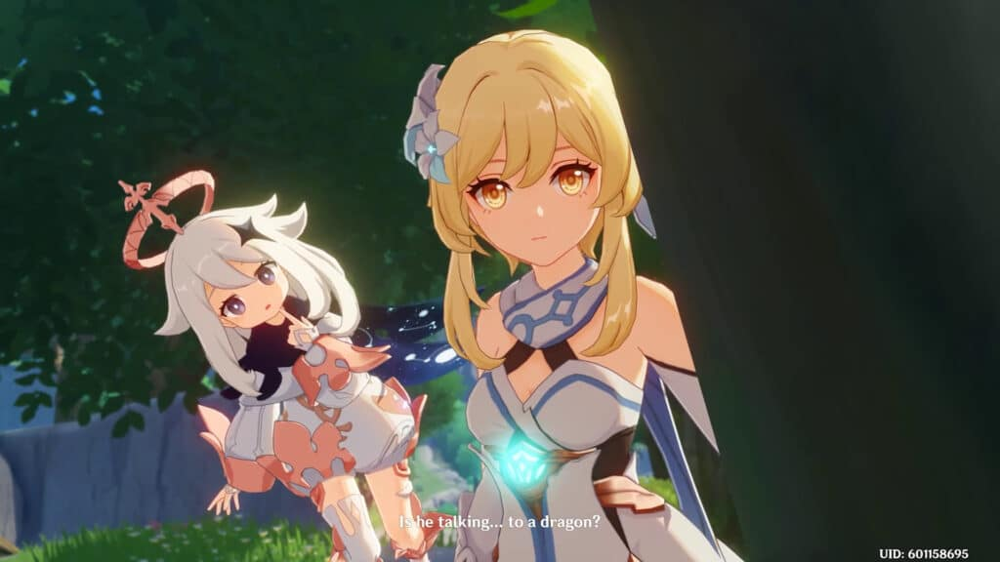
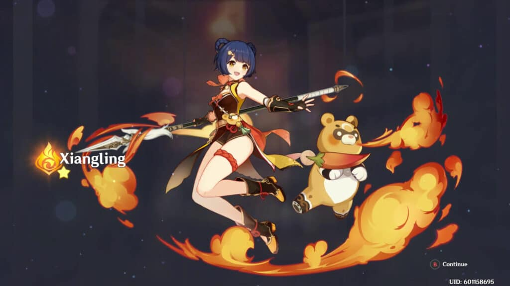
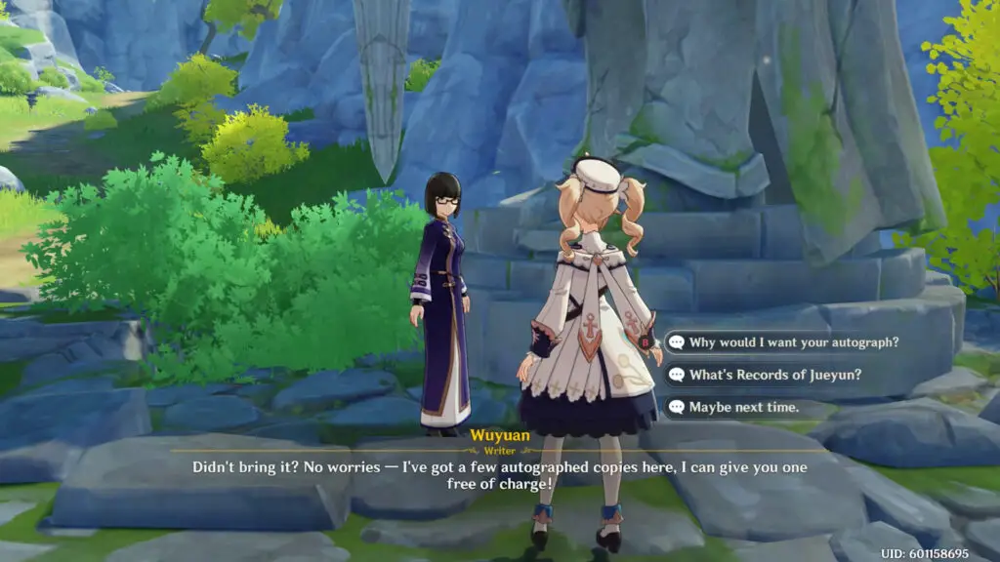
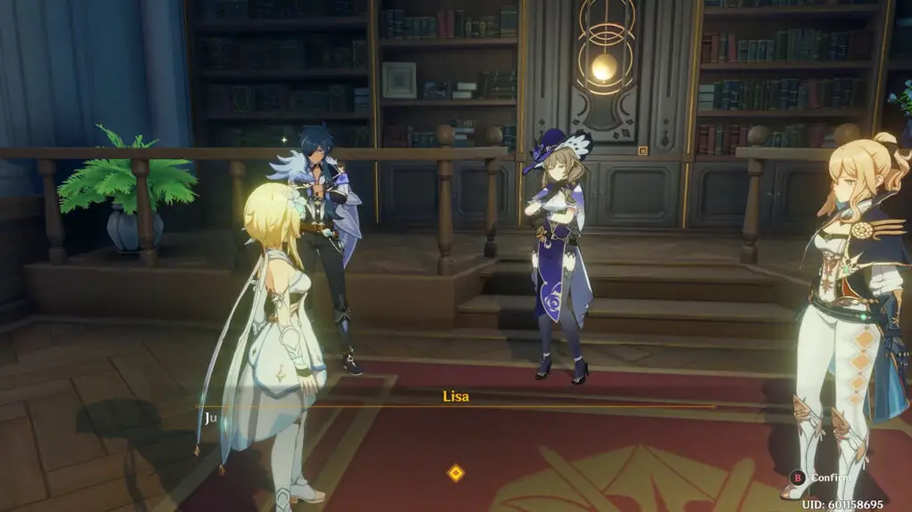
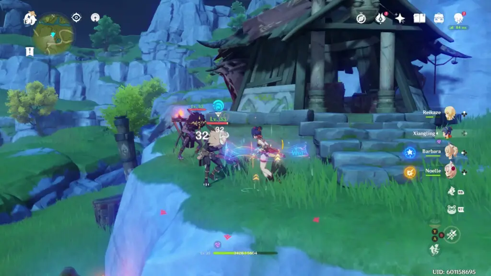
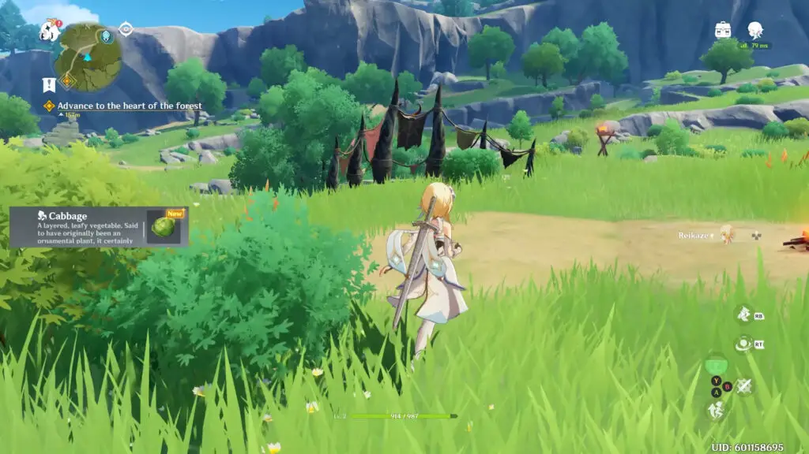
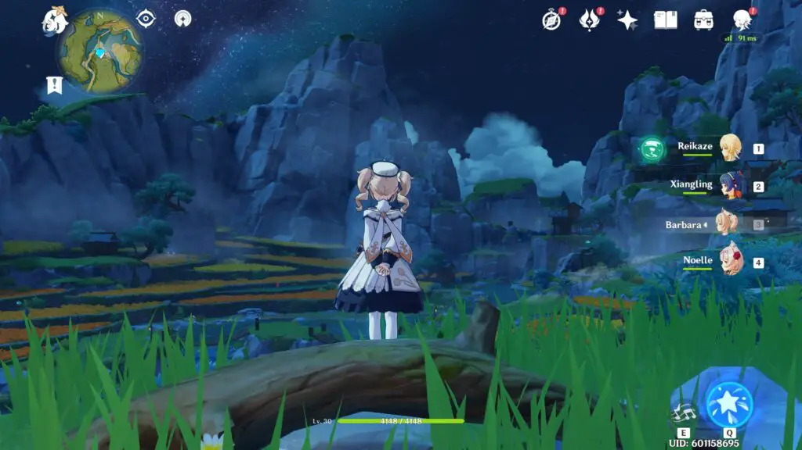

---
{
  title: "Genshin Impact Review – Much More Than Just a Gacha BoTW",
  published: "2020-10-09T15:22:45-07:00",
  originalLink: "https://noisypixel.net/genshin-impact-review-pc-ps4-ios-android/",
}
---

It’s so easy to let our preconceived notions and generalizations shape the decisions we make. As a result, though: we can dismiss excellence these labels might deter us from. On paper, _Genshin Impact_ seems like a free-to-play, Gacha _Breath of the Wild_ clone. Many people might overlook it for that, but to think of _Genshin Impact_ like this is doing both it and ourselves a great disservice. _Genshin Impact_ is too good to ignore. In fact, I’ll come out say that it’s a fun and frenetic action-adventure RPG that’s become one of my favorite games this year.

<iframe src="https://www.youtube.com/embed/zRyWr-SclJs?feature=oembed"></iframe>

To begin this review, let’s attack those labels: Gacha game and _Breath of the Wild_ clone. _Genshin Impact_ bucks many of the negative gacha trends that would deter people from playing the game. I’ve never really been a huge fan of the gacha mechanics found in mobile titles solely based on their design. In some instances, you’ll feel like missed out on events and characters if you don’t put money in, but even if you do, you might not pull what you’re looking for.

Where _Genshin Impact_ differs is by having gameplay be the primary appeal. The griminess of the genre isn’t here, and it feels like a AAA adventure. It’s not hard to see the depth that has gone into this gameplay loop, which encourages you to keep playing. Like the better gacha games available, you don’t hit a wall that limits your experience.

That being said, the gacha systems are there, and even though they aren’t necessary to experience the entire game, they don’t often play fair.  The gacha system is composed of characters and weapons. The weapons are the fodder that you don’t care about and will be the primarily the bulk of your pulls – out of a 10 pull; you’re lucky to get one character.

To acquire a rare character, your odds are pretty low. The 5-star rates are 0.6%, which is even lower than the industry average. Regardless of the odds, the free-to-play characters make it easy to not even think about it.

When _Genshin Impact_ is brought up, one of the first things you will hear is that it is a _Breath of the Wild_ clone. For me, a clone of what is legitimately one of my favorite games is entirely welcome, but I feel like boiling the game down to “BoTW Clone” really doesn’t explain what _Genshin Impact_ is. There are absolutely components inspired by _Breath of the Wild_, but it makes enough changes that make it feel unique.

The primary difference to me is in philosophy – _Breath of the Wild_ was all about creativity, about enabling you to do whatever you want. If you see a mountain, you can go there. If you want to take down enemies in a wacky way, the game allows you to do that with its physics system. The shrines involved puzzle-solving skills first-and-foremost, which have you accessing new abilities to solve them any way you can.  Inherently, _BoTW_ is about crafting your own adventure, exploring, and cultivating your own experience.

_Genshin Impact_, on the other hand, feels a lot more like a traditional Action RPG and less of a logical adventure extreme. While it tries for the same liberating freedom of exploring a large open-world, the focus tends to be on combat.

During gameplay, your team is comprised of 4 party members, each with an elemental attribute and weapon. Element mixes have different effects, and combining them is the primary way to be effective during exploration and encounter. For example, one of my favorite things to do was use whirlwind when there was a fire in the way: the result would be your whirlwind would become a fire tornado, which hurt enemy Mooks.

Surprisingly, I preferred the combat of _Genshin Impact_ to _BoTW_ as it’s more compelling, but _BoTW_ does have higher peaks. Also, as elements are the focus, so long as you know what you are doing, you don’t need to be super precise with your control inputs, for the most part, which enables the mobile versions to be playable.

Another area where _Genshin Impact_ sets itself apart from _BoTW_ is the nature of how you interact with the game’s content.  There’s a lot to discover as you make your way through this adventure, and it seems like more is on the way. However, there’s little to no pressure to explore everything and grind levels immediately because there’s always more to do. After I got through the honeymoon period and played hours of opening, Genshin Impact has become a chill-out game that I invest an hour or two into each day, with new adventures found each time I play.

_Genshin Impact_ is designed to be a time sink, and it can drag. In the beginning, the exposition drop is a bit overwhelming as the game takes the controls away for the opening hours. Personally, I feel like grinding the adventure level was when I had the least fun. If I could have talked to my past self, I would have said to do that later and do whatever you wanted first – you’ll get the experience by doing things and exploring.

For me, exploring the map, getting to know the unique world of Teybat was the highlight of the game. Teybat has lots of things to see and to do, plenty of iconic landmarks and random things to stumble across. For the exploration itself, this is where it’s closest to _BOTW_. You’ll notice systems like the stamina bar, climbing, and the way the map grows over time. Having the ability to look at your map, set a random destination, and explore is incredibly liberating. When it’s combined with the thrilling moment-to-moment combat, you’re experiencing the best the adventure has to offer.

The last place I think where _Genshin Impact_ significantly differs from _BoTW_ is with the story. _BoTW_ is incredibly minimalistic in its storytelling because it wants the atmosphere and world to tell that story. Still, *Genshin Impact* isn’t set in a post-apocalypse and has its story front in center as a result. The cast is prominent, and they keep the game enjoyable and make the world feel lived in.

While they aren’t super deep characters, they are all fairly entertaining with fun personalities. The narrative revolves around themes within a world, about people and their relation with the places they live, and some political story beats. It doesn’t stand out and is rather predictable, but it’s handled quite well, and it was enough to keep me interested.

Genshin Impact nails presentation through visuals and sound. The soundtrack is subdued but offers enough notable tracks for the adventure. The Japanese and English voiced audio tracks are both steller making it though to choose which one I wanted to use.

The world itself featured many great design implementations, with an accessible UI. To put it in simpler terms, this game is beautiful. One look at the quality anime character designs may turn some players away, but there’s no doubt that this world begs to be explored. On a technical level, the game is incredibly scalable graphically, with the low settings on mobile looking fairly muddy. Still, the high settings on PC looking quite nice, but regardless of the device, it always looks like _Genshin Impact_ and always looks good, a real testament to its design and the visuals.

Speaking of mobile, I was also incredibly impressed by how optimized this game is. It’s a noticeable downgrade with low render resolution, more pop in, and lower resolution assets when playing the handheld device. However, outside of those aspects, the game looks comparable, and depending on your device, it can run fairly well.

On my iPad Pro 11 2018, it looks great, though the square aspect ratio is far less cinematic than the ultrawide screen I used on PC. On my 2-year-old OnePlus 6, I ran into issues thanks to thermal throttling, but it looked decent when it wasn’t burning up. Still, I’m glad this mobile version exists. I’ll definitely keep it installed to play in a pinch.

None of the problems with the mobile version were inherent problems with the PC version. The controls work well, and you’re able to do everything you can do in the other versions almost as easily.  It should also run on weaker PC’s fine because it’s made for mobile: Right now, I have a Radeon RX 570, and it was able to drive 3440×1440 60hz with no problems, even though this card really isn’t made for that kind of resolution.

One of my favorite aspects of the game is how it handles your saves. The system works on a cloud-server that allows you to pick up wherever you were on whatever device you want. I found myself playing on my iPad way more than I expected; for this reason, I’d highly recommend you avoid playing it on PlayStation since that version is locked to your PSN account, and you can’t play it on a different platform, even if you wanted to.

During my time with Genshin Impact, I fell in love with it. After only a few hours, my thoughts about what this adventure was faded away as it truly evolves into a unique experience. There’s a fine level of detail that went into crafting this beautiful world, and you can’t help but want to see every inch of it. Although the grind and the gachas systems are present, this is a game that I will gladly return to again and again. Regardless, all of this is available for free, so nothing stops you from finding out for yourself.
