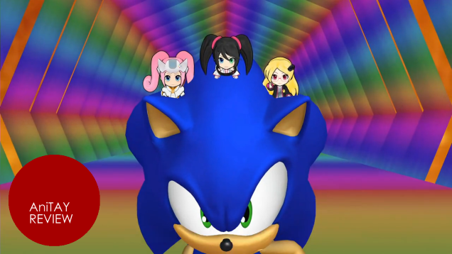
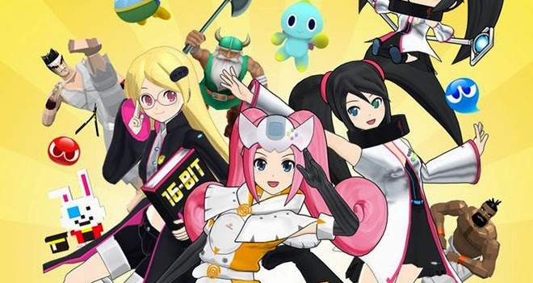
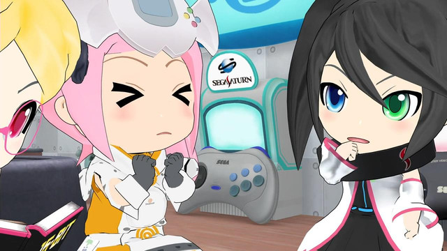
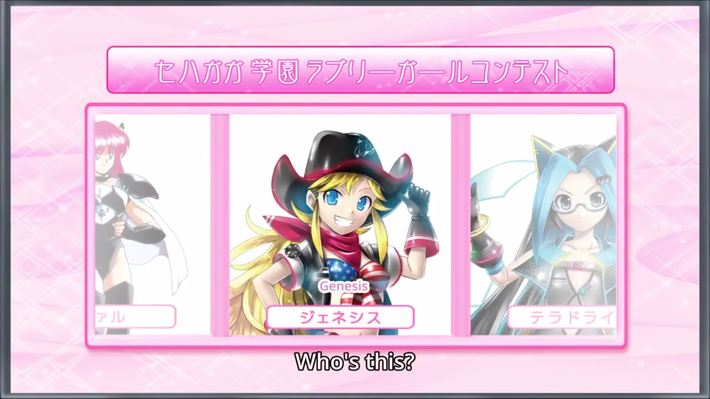
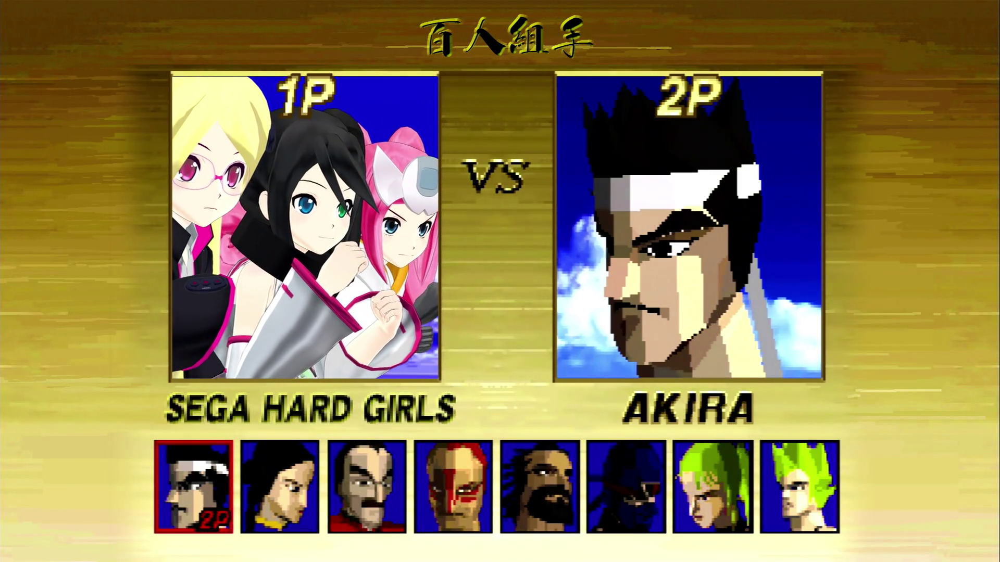
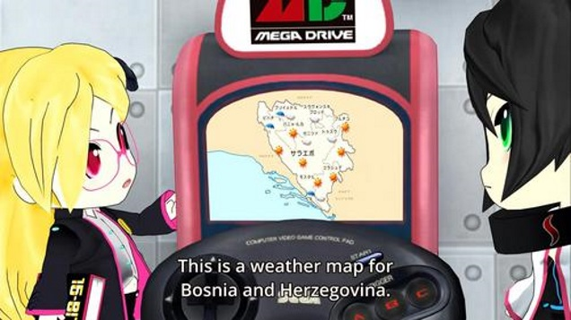
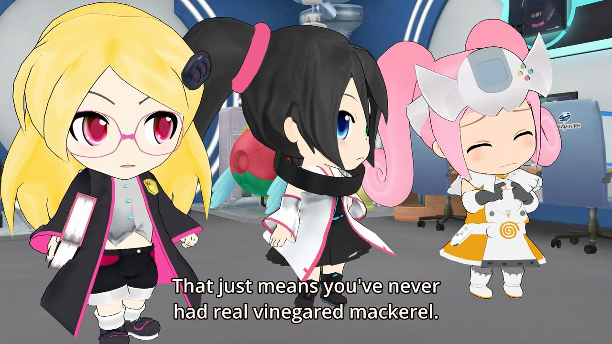
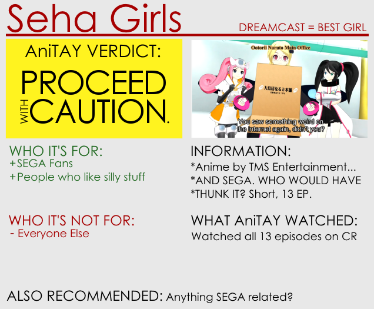

---
{
	title: "Hi☆sCoool! SeHa Girls: The Ani-TAY Review",
	published: "2015-01-01T12:00:00-05:00",
	tags: ["The Ani-TAY Review", "Rockmandash Reviews", "SeHa", "SEGA", "AniTAY", "TAYClassic"],
	kinjaArticle: true
}
---

Have you ever imagined SEGA consoles turned into cute girls doing silly things in a SEGA high school? No? How odd. Oh well. Even if you didn't, they've made a short anime of it, called *Hi☆sCoool! SeHa Girls* for your enjoyment... or not.

#### The Concept

Regardless of the quality of the show, I'm just so amused by the concept that I have to give it some credit. I mean, someone has to be either really bored, or really creative to make an anime about 3 Sega Game Consoles (Mega Drive, Saturn & Dreamcast) turning into high school girls, attending a SEGA High school where they have to go through SEGA related games/events to get medals to graduate. Seriously... who comes up with this stuff? It's great.

#### The Consoles/Girls

The consoles/girls/things/whatever... make for surprisingly great characters. From the bookworm Mega Drive, to the Tsundere Saturn, to the OMG SO AWESOME Kawaii Dreamcast, they are all entertaining and work well with the original console in mind. The dynamics the characters have together, and the way they react to situations are reminiscent to the original consoles, and is quite enjoyable. The way that they mesh with the SEGA worlds is entertaining, and mildly surprising. Really, I wasn't expecting anything out of them, or out of anything original this show has to offer, but I was pleasantly surprised.

#### A love letter to SEGA Fans

As a show that talks about SEGA stuff, there's a ton of neat SEGA references all over the place... and the references are pretty well done! From the well known characters like Sonic, to the more obscure like Fantasy Zone, there's a ton of SEGA references and they are all pretty enjoyable, and well thought out. If you've spent a decent amount of time playing older SEGA consoles and SEGA games, the references that this show will make will put a smile on your face, like it did mine, while learning a thing or two about it in the process.

Personally, I loved this bit here where they show the genesis and she's dressed up in a way that screams MURRICA' (except the Canadians had the Genesis as well, so yeah :/), and the episodes with Jet Set Radio and Puyo Puyo really made me smile. The show is totally self aware with what it's doing as well, which makes it that much more enjoyable.

#### The Presentation

Were you really expecting anything here? The show uses cheap CG throughout most of the show, which helps cut costs and blend the characters more seamlessly into the games. but it's really nothing special. The games are produced faithfully, and the models of the main characters are pretty nice at times, but it all has that cheapy look to it. Shouldn't really hinder your enjoyment of the show though. As for the music and voice acting, average job overall.. but that OP Music... it's so catchy....

#### It's Exactly What It Says on the Tin

You're getting exactly what the description says: A short anime about SEGA Consoles going to a SEGA high school. It's for SEGA fans and nobody else, so keep that in mind, and don't expect greatness: there's nothing great about this show, i t's just this kind of silly comedy show with no real depth to it. It doesn't have a real plot or any amazing writing, it's an episodic show where every episode or two goes over an aspect of SEGA. Other than the references, if you've seen one episode, you've seen them all, and there's nothing that will suprise you about it. I mean it kinda has to, considering it's that it's trying to do a lot with only 10 minutes, and a pretty small budget, but I wish it was a bit better.

#### Humor

As a short show with a quirky concept, this show relies on the humor to carry the show, and it's pretty hit or miss. The referential stuff like I mentioned earlier is pretty solid, but the rest of the stuff is just average, or pretty bad. The writing for the comedy isn't really anything special, and a lot of the times the execution can just fall on it's face. Sometimes, they seriously try to be funny, but it's not really funny at all.

#### Cringe-Worthy

Sometimes it's really, really cringe-worthy, which made me want to drop the show because of how bad the writing was. Most of the humor works fine, but at times, it misses... and when it does, it really misses. Most of this stems from the show bagging on Saturn, which is fine, but it's done so poorly at times that it makes me want to just rage quit. Here's an example: one of the running gags in the show is the Elf from Golden Axe apparently fell in love with Saturn, so whenever he appears, all the characters treat saturn like she's into that kind of thing... and it fails. **REALLY BADLY**.

What more is there to be said about this? It's a short anime for SEGA fans that really knows it's audience, but with hit and miss comedy. It's interesting, but it's a short anime that can't really do much.

***

**Copyright Disclaimer:** Under Title 17, Section 107 of United States Copyright law, reviews are protected under fair use. This is a review, and as such, all media used in this review is used for the sole purpose of review and commentary under the terms of fair use. All footage, music and images belong to the respective companies.

*You can see all my reviews on *[*Rockmandash Reviews*](http://tay.kotaku.com/tag/rockmandash-reviews)*. For An explanation of my review system, *[*check this out*](https://rockmandash12.kinja.com/rockmandash-rambles-an-explanation-on-my-review-system-1619265485)*.*

###### [Rockmandash Rambles: *An Explanation on my Review System* (Updated 11/15/2015)](https://rockmandash12.kinja.com/rockmandash-rambles-an-explanation-on-my-review-system-1619265485)

If you’ve read any of my reviews and wanted to know why I did them the way I do, here’s an…

[Read more](https://rockmandash12.kinja.com/rockmandash-rambles-an-explanation-on-my-review-system-1619265485)

*This show is available on *[*Crunchyroll*](http://www.crunchyroll.com/hi-scool-seha-girls)* for Free & Legal streaming.*

[Read more](http://www.crunchyroll.com/hi-scool-seha-girls)
