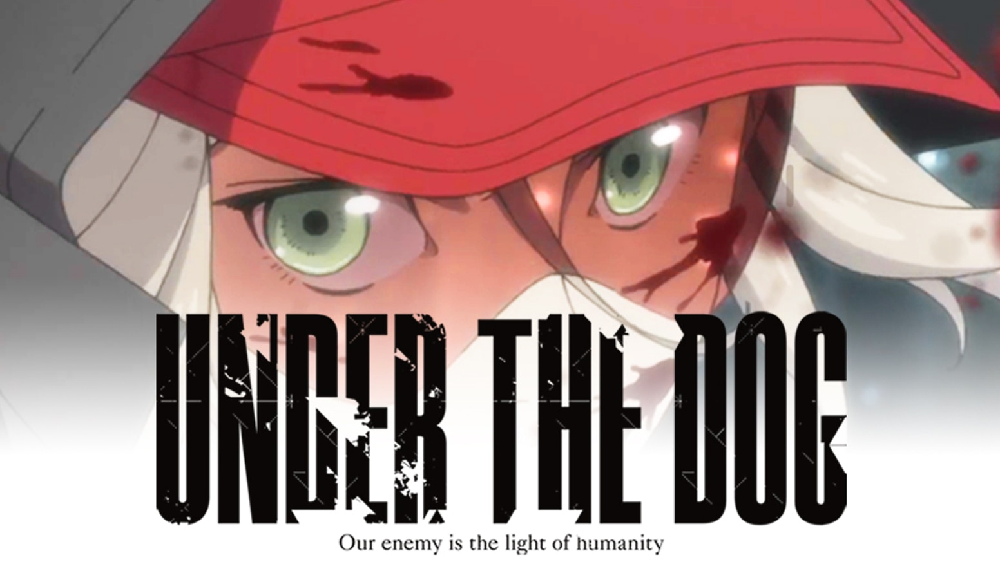

---
{
  title: "If You Still Need Convincing to Help Fund Under The Dog....",
  tags: ["Under The Dog", "Kickstarter", "Ani-TAY", "Fund", "Hideo Kojima"],
  published: "2014-09-02T18:21:00-04:00",
  attached: [],
  kinjaArticle: true,
}
---

<a class="sc-1out364-0 hMndXN sc-145m8ut-0 gIacKn js_link" data-ga='[["Embedded Url","External link","https://anitay.kinja.com/rockmandash-rambles-why-you-should-fund-under-the-dog-1626833454",{"metric25":1}]]' href="https://anitay.kinja.com/rockmandash-rambles-why-you-should-fund-under-the-dog-1626833454" rel="noopener noreferrer" target="_blank">If my words were not enough to convince you to fund Under The Dog</a>,
  There have been a few updates that may convince you to do so, and one of them involves Hideo Kojima.

<aside class="sc-1rh3ayr-6 jfFNjl inset--story branded-item branded-item--kinja" data-commerce-source="inset">

<a class="sc-1out364-0 hMndXN js_link" data-ga='[["Permalink page click","Permalink page click - inset headline"]]' href="https://anitay.kinja.com/rockmandash-rambles-why-you-should-fund-under-the-dog-1626833454" rel="noopener noreferrer" target="_blank"><h6 class="sc-1rh3ayr-3 jRIPES">Why You
    Should Fund <i>Under The Dog</i>, and What this Kickstarter Represents</h6></a>

When I first saw Under the Dog, I wasn't exactly sure what to think about it. I
      thought that it…
<a class="sc-1out364-0 hMndXN sc-1rh3ayr-0 kOvmIi js_readmore inset--story__readmore js_link" data-ga='[["Permalink page click","Permalink page click - inset read more link"]]' href="https://anitay.kinja.com/rockmandash-rambles-why-you-should-fund-under-the-dog-1626833454" rel="noopener noreferrer" target="_blank">Read more</a>

</aside>

There was a recent update in which Kojima promoted UTD, and you don't need my
  word to know that Kojima has a good taste. Just watch the excelent Knights of Sidonia, which Kojima also have some
  praise. <a class="sc-1out364-0 hMndXN sc-145m8ut-0 gIacKn js_link" data-ga='[["Embedded Url","External link","https://www.kickstarter.com/projects/1300298569/under-the-dog",{"metric25":1}]]' href="https://www.kickstarter.com/projects/1300298569/under-the-dog" rel="noopener noreferrer" target="_blank">Check the update tab of the kickstarter for the quote</a>, but if
  you are too lazy to do so, I'll post the quote here.

<aside class="sc-1rh3ayr-6 jfFNjl inset--story branded-item branded-item--kinja" data-commerce-source="inset">

<a class="sc-1out364-0 hMndXN js_link" data-ga='[["Permalink page click","Permalink page click - inset headline"]]' href="https://www.kickstarter.com/projects/1300298569/under-the-dog" rel="noopener noreferrer" target="_blank"><h6 class="sc-1rh3ayr-3 jRIPES">Under the
    Dog</h6></a>

An anime science fiction action thriller that will explore what it means to live and
      die well,…
<a class="sc-1out364-0 hMndXN sc-1rh3ayr-0 kOvmIi js_readmore inset--story__readmore js_link" data-ga='[["Permalink page click","Permalink page click - inset read more link"]]' href="https://www.kickstarter.com/projects/1300298569/under-the-dog" rel="noopener noreferrer" target="_blank">Read more</a>

</aside>
<blockquote class="sc-8hxd3p-0 nvIqO" data-type="BlockQuote">
"Coming with the permeation
  of the internet [in our daily lives], "creating" and a production's "financing" structure have changed
  significantly.

Now, new methods of "creating" are being put to the test, where direct communication
    between the creator and the global user has become the norm and the creator is not bound by the former traditional
    investor or clientele. In such circumstances right now, a writer with remarkable talent, Jiro Ishii, who brought to
    the world numerous renowned adventure games during his "salary man" days, has now taken up the torch in order to
    challenge the traditions and establish this new future of "creating." This is "Under the Dog," the crowdfunding
    effort for an indie anime based on Jiro Ishii's original story.

One cannot help but pay close attention to this project. One cannot help but cheer on
    this project. In particular, how can this creator who garners cult-like popularity catalyze a new chemical reaction
    [in the industry] by putting an emphasis on "creating," which stands apart from the typical commercial oriented
    projects? One cannot help but look forward to this succeeding.

Jiro Ishii's indie challenge will not only change the path for "creating," but at the
    same time declare the answer for the question: Can game designers be accepted by the world as storytellers in [other
    mediums] as well?"
</blockquote>

Also, there were some few updates of the kickstarter itself that makes this
  kickstarter more appealing. Update 12 mentioned that if you fund the $20 tier or higher, you'll get a digital copy of
  ANY UTD work in the future. Not just this episode, but if they make a movie or something else, you'll get that too.
  Definitely more for your money.

The latest update dropped the BD/DVD price to 60
  bucks to make it affordable for a physical. If you were interested with a physical, give it a shot!  We have 4
  days left, 180,00 left to go. If you haven't funded it, I hope you have some incentive to do so now. I really hope it
  hits the goal, and I really want to see this kickstarter makes it.

