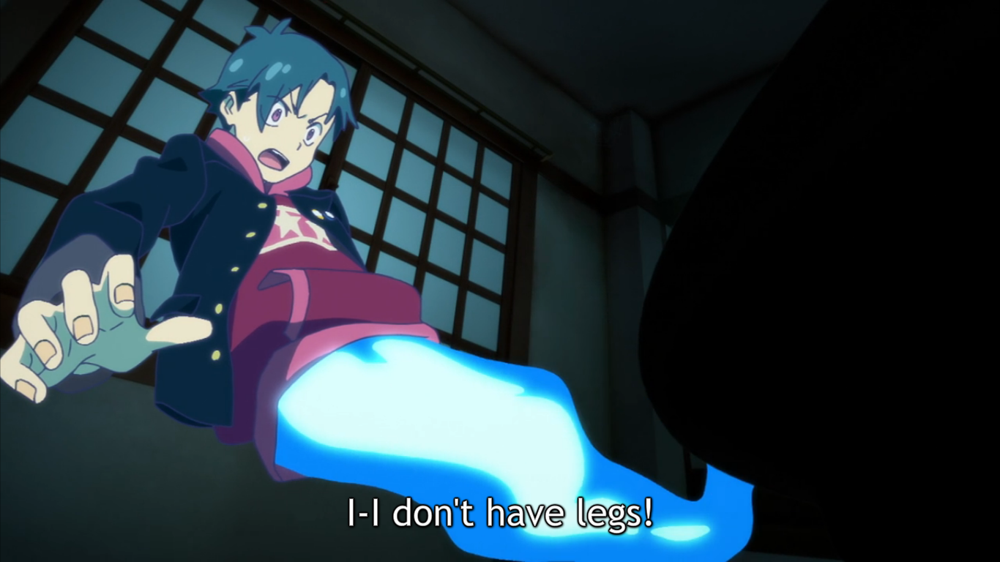
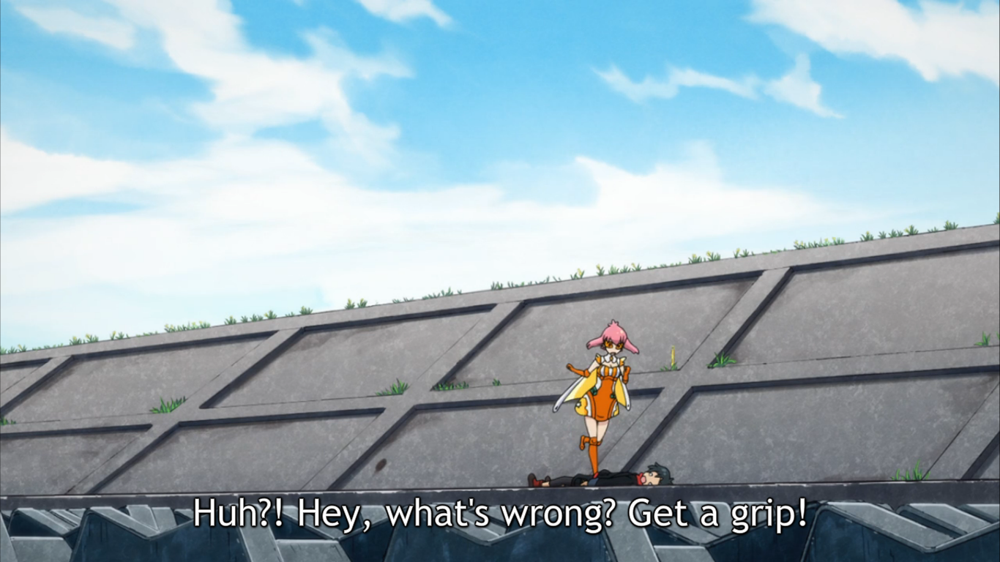
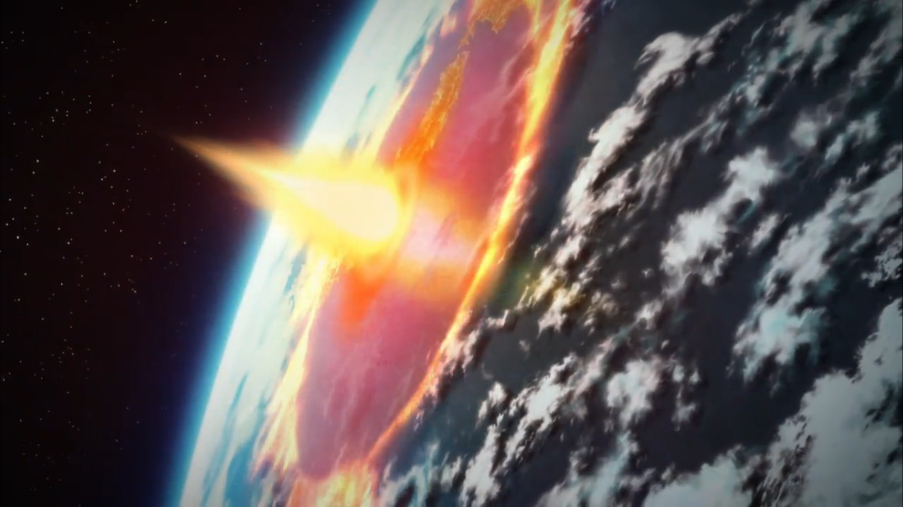
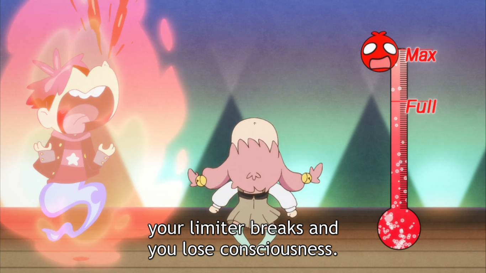
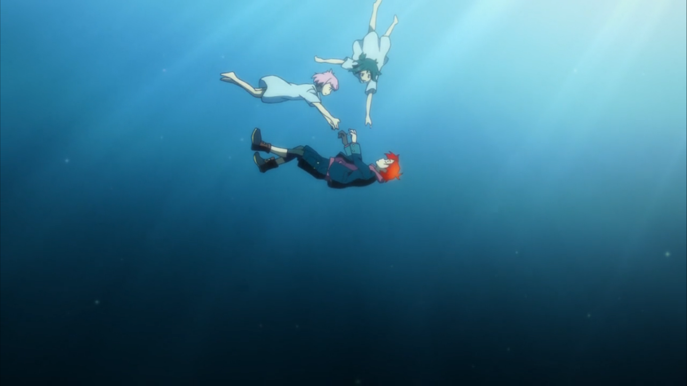
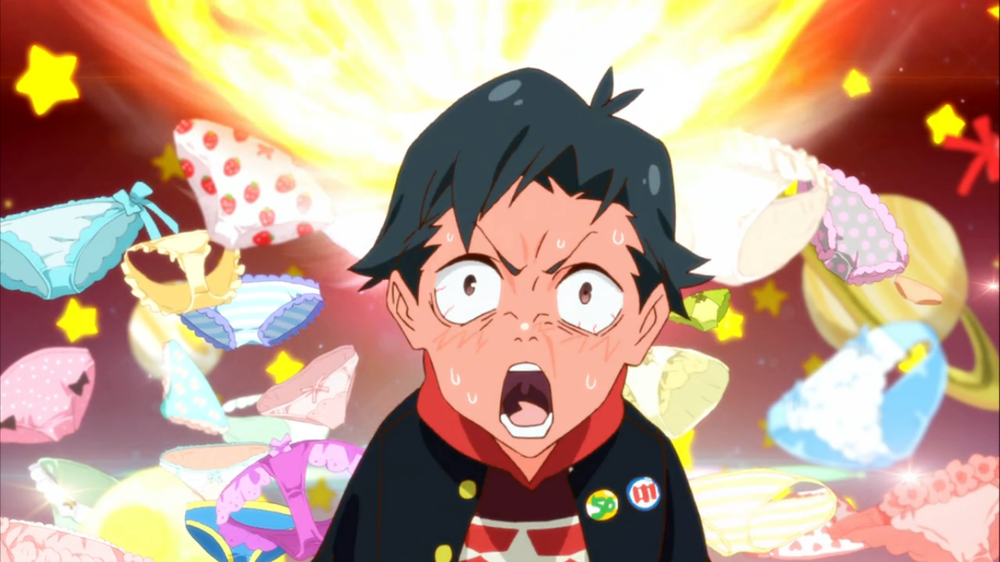
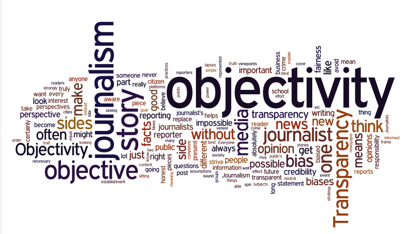

---
{
  title: "I'm Being Blown Away By Punch Line!",
  tags: ["Anime Impressions", "Spring 2015", "Uchikoshi", "Punch Line"],
  published: "2015-04-09T19:55:00-04:00",
  attached: [],
  kinjaArticle: true,
}
---

With a tagline of <em>“If he sees underwear, humanity will be destroyed!?”</em>,
  what would you expect? I came into this show with a lot of mixed thoughts, but what I didn’t expect it to start with a
  bang, as a well executed (and crazy) show with amazing humor, one I would love. Kotarou Uchikoshi, You’ve done it
  again.

I’ve been hyping up<em> Punchline!</em> for a while, ever since I learned that my
  favorite writer, Koutarou Uchikoshi (of <a class="sc-1out364-0 hMndXN sc-145m8ut-0 gIacKn js_link" data-ga='[["Embedded Url","External link","http://rockmandash12.kinja.com/rockmandash-reviews-infinity-zero-escape-marathon-w-1664979798#_ga=1.53174632.1523386611.1417386122",{"metric25":1}]]' href="http://rockmandash12.kinja.com/rockmandash-reviews-infinity-zero-escape-marathon-w-1664979798#_ga=1.53174632.1523386611.1417386122" rel="noopener noreferrer" target="_blank"><em>Zero Escape</em></a><em> </em>fame
  ) was involved. I wasn’t sure what to expect out of this show, given it’s premise... really, how could I? After
  reading about the plot, what would you expect, especially given how vastly different it really is to everything he’s
  done, or anything in general? From the source itself,

<blockquote class="sc-8hxd3p-0 nvIqO" data-type="BlockQuote">
If he sees underwear,
  humanity will be destroyed!? An original anime series from the noitaminA block, PUNCH LINE centers on Yuta Iridatsu, a
  high school student, with a peculiar habit. When he sees a girl’s panties, he gets so excited he faints! After a
  certain incident with a ghost cat, his soul gets separated from his body. Using his special powers, Yuta watches the
  daily lives of the inhabitants of an apartment and sometimes plays tricks on them. Eventually, Yuta decides to unlock
  the secrets to why Earth will be destroyed and tries to save it!
</blockquote>

Mind = Blown, right? I came in expecting a stupid, WTF show that has just a
ridiculous amount of fanservice, and I got that... but what I didn’t expect was how just well executed it was, and how
they would manage to infuse humor extremely well into such a premise. In hindsight, I probably should have put more
faith into MAPPA and Uchikoshi as they’ve<a class="sc-1out364-0 hMndXN sc-145m8ut-0 gIacKn js_link" data-ga='[["Embedded Url","External link","https://anitay.kinja.com/garo-the-animation-the-ani-tay-review-1695909572",{"metric25":1}]]' href="https://anitay.kinja.com/garo-the-animation-the-ani-tay-review-1695909572" rel="noopener noreferrer" target="_blank"> done</a> <a class="sc-1out364-0 hMndXN sc-145m8ut-0 gIacKn js_link" data-ga='[["Embedded Url","External link","https://anitay.kinja.com/rage-of-bahamut-genesis-the-ani-tay-review-1676327262",{"metric25":1}]]' href="https://anitay.kinja.com/rage-of-bahamut-genesis-the-ani-tay-review-1676327262" rel="noopener noreferrer" target="_blank">great</a> <a class="sc-1out364-0 hMndXN sc-145m8ut-0 gIacKn js_link" data-ga='[["Embedded Url","External link","https://rockmandash12.kinja.com/rockmandash-reviews-ever-17-the-out-of-infinity-vis-1626111485",{"metric25":1}]]' href="https://rockmandash12.kinja.com/rockmandash-reviews-ever-17-the-out-of-infinity-vis-1626111485" rel="noopener noreferrer" target="_blank">stuff</a>, but
with a premise like that, I had to be a little bit skeptical. 

<aside class="sc-1rh3ayr-6 jfFNjl inset--story branded-item branded-item--kinja" data-commerce-source="inset"><a class="sc-1out364-0 hMndXN sc-1rh3ayr-2 lcMGRt inset--story__thumb js_link" data-ga='[["Permalink page click","Permalink page click - inset photo"]]' href="https://anitay.kinja.com/garo-the-animation-the-ani-tay-review-1695909572" rel="noopener noreferrer" target="_blank">
<video autoplay="" loop="" muted=""><source src="./uohdbgi4rxsjt3uasad3.mp4" type="video/mp4"/></video>
</a>

<a class="sc-1out364-0 hMndXN js_link" data-ga='[["Permalink page click","Permalink page click - inset headline"]]' href="https://anitay.kinja.com/garo-the-animation-the-ani-tay-review-1695909572" rel="noopener noreferrer" target="_blank"><h6 class="sc-1rh3ayr-3 jRIPES"><i>GARO:
    The Animation</i>: The <i>Ani-TAY</i> Review</h6></a>

      The king of the Valiante Kingdom launches a witch hunt under the advice of his advisor Mendoza.…
<a class="sc-1out364-0 hMndXN sc-1rh3ayr-0 kOvmIi js_readmore inset--story__readmore js_link" data-ga='[["Permalink page click","Permalink page click - inset read more link"]]' href="https://anitay.kinja.com/garo-the-animation-the-ani-tay-review-1695909572" rel="noopener noreferrer" target="_blank">Read more</a>

</aside>
<aside class="sc-1rh3ayr-6 jfFNjl inset--story branded-item branded-item--kinja" data-commerce-source="inset"><a class="sc-1out364-0 hMndXN sc-1rh3ayr-2 lcMGRt inset--story__thumb js_link" data-ga='[["Permalink page click","Permalink page click - inset photo"]]' href="https://anitay.kinja.com/rage-of-bahamut-genesis-the-ani-tay-review-1676327262" rel="noopener noreferrer" target="_blank">
<video autoplay="" loop="" muted=""><source src="./flcr80vaunb6soyhigsy.mp4" type="video/mp4"/></video>
</a>

<a class="sc-1out364-0 hMndXN js_link" data-ga='[["Permalink page click","Permalink page click - inset headline"]]' href="https://anitay.kinja.com/rage-of-bahamut-genesis-the-ani-tay-review-1676327262" rel="noopener noreferrer" target="_blank"><h6 class="sc-1rh3ayr-3 jRIPES"><i>Rage
    of Bahamut: Genesis</i>: The <i>Ani-TAY</i> Review</h6></a>

Long ago in the land of Mistarcia, a magical realm where humans, gods, demons, and
      all sorts of…
<a class="sc-1out364-0 hMndXN sc-1rh3ayr-0 kOvmIi js_readmore inset--story__readmore js_link" data-ga='[["Permalink page click","Permalink page click - inset read more link"]]' href="https://anitay.kinja.com/rage-of-bahamut-genesis-the-ani-tay-review-1676327262" rel="noopener noreferrer" target="_blank">Read more</a>

</aside>

<aside class="sc-1rh3ayr-6 jfFNjl inset--story branded-item branded-item--kinja" data-commerce-source="inset"><a class="sc-1out364-0 hMndXN sc-1rh3ayr-2 lcMGRt inset--story__thumb js_link" data-ga='[["Permalink page click","Permalink page click - inset photo"]]' href="https://rockmandash12.kinja.com/rockmandash-reviews-ever-17-the-out-of-infinity-vis-1626111485" rel="noopener noreferrer" target="_blank">
<video autoplay="" loop="" muted=""><source src="./1306104797334163626.mp4" type="video/mp4"/></video>
</a>

<a class="sc-1out364-0 hMndXN js_link" data-ga='[["Permalink page click","Permalink page click - inset headline"]]' href="https://rockmandash12.kinja.com/rockmandash-reviews-ever-17-the-out-of-infinity-vis-1626111485" rel="noopener noreferrer" target="_blank"><h6 class="sc-1rh3ayr-3 jRIPES">
    Rockmandash Reviews+: <i>Ever 17: The Out of Infinity</i> [Visual Novel]</h6></a>

Have you ever experienced a work that left such a strong impression on you that it
      started to…
<a class="sc-1out364-0 hMndXN sc-1rh3ayr-0 kOvmIi js_readmore inset--story__readmore js_link" data-ga='[["Permalink page click","Permalink page click - inset read more link"]]' href="https://rockmandash12.kinja.com/rockmandash-reviews-ever-17-the-out-of-infinity-vis-1626111485" rel="noopener noreferrer" target="_blank">Read more</a>

</aside>

Really, you guys have to watch this show: I haven’t seen a show that made me laugh
  this hard in a long time, and <em>Punchline!</em> sinks you in like no tomorrow, doing everything extremely well. The
  show manages to get you to be entertained by being so absolutely over the top that it’s really quite ridiculous, but
  they way it pulls it’s punches is tight and focused, following every absurd action with an explanation so it’s not
  stupid all the time. It’s timing and pacing are absolutely perfect, and it keeps you entertained no matter what. The
  way it executes this absurd premise is actually a pretty smart at times, but you should really expect this, because,
  Uchikoshi. The punchlines are great, the writing is entertaining, the art is just amazing (seriously MAPPA is doing a
  great job. It’s really nice to have two Madhouses :P.), and everything about this show is just so well that it makes
  for an an experience that is just insane. It’s a show that gets you laughing, and keeps you laughing. it’s an amazing

I’m really also just super surprised how much of Uchikoshi’s influence is really
  here, and how much it reminds me of his previous works. This show feels like it has homages to them, from that picture
  above that screamed <strong>EVER 17</strong> to how similar the cat Chiranouske is to Zero the 3rd but more enjoyable
  because you’re not supposed to hate his guts, this show is an Uchikoshi work, and it even has the sci -fi elements! am
  loving how much it feels like the other works I’ve seen of him. I fell in love with his works because of how well
  thought out they were, how well they used sci-fi, and even in a show with this stupid premise, they still manage to
  pull that off, which is very impressive. 

Even more impressively, the fanservice was handled really well! Yes, this isn’t a
  show you’ll want to watch in public (<strong>JAPANNNN!!!!!!!</strong>), and if you are a really prude person you still
  will be bothered by this, but if you’re watching this, they just play off the scenes in such a way you can’t help but
  laugh at them, you can’t take these seriously. Hell, I’m probably one of the most prude people on AniTAY but I still
  loved the hell out of it, as they were just handled really well. Sparkly effects, stupid scenarios, this show goes out
  of its way to make these scenes not really about fanservice, similar to <em>Kill la Kill,</em> and the effect works
  well. On that note, this show is very much so like <em>Kill la Kill</em>, with great character art from the great
  Shouta Iwasaki (who also did <em>Kill la Kil</em>l), a plot scenario where most people focus on the fanservice but
  isn’t really the main point, and it’s just so absurd that you can’t help but laugh. If you loved <em>Kill la Kill</em>,
  you’ll probably get something out of this as well. I’m personally enjoying this a lot more, but that’s a personal
  bias, really.

This show has cemented it’s place at the top of my guilty pleasures, even after one
  episode, and that’s saying something. It’s blown me away, in a way I’ve never been blown before... and I can’t help
  but appreciate everything about it. Honestly, go watch it now. It’s absurd, it’s stupid, it’s amazing, and you will
  not regret it.

<em>Rockmandash is a frequent writer of Visual Novels and
  anime on </em><a class="sc-1out364-0 hMndXN sc-145m8ut-0 gIacKn js_link" data-ga='[["Embedded Url","External link","http://rockmandash12.kinja.com/#_ga=1.122760139.1523386611.1417386122",{"metric25":1}]]' href="http://rockmandash12.kinja.com/#_ga=1.122760139.1523386611.1417386122" rel="noopener noreferrer" target="_blank"><em>his blog</em></a><em> and the</em><a class="sc-1out364-0 hMndXN sc-145m8ut-0 gIacKn js_link" data-ga='[["Embedded Url","External link","http://anitay.kinja.com/#_ga=1.196883561.473183827.1418699279",{"metric25":1}]]' href="http://anitay.kinja.com/#_ga=1.196883561.473183827.1418699279" rel="noopener noreferrer" target="_blank"><em>AniTAY Blog</em></a><em>
  as well. Come and check them out if you are interested in reviews and opinion pieces on these topics! For an
  explanation of my review system, </em><a class="sc-1out364-0 hMndXN sc-145m8ut-0 gIacKn js_link" data-ga='[["Embedded Url","External link","https://rockmandash12.kinja.com/rockmandash-rambles-an-explanation-on-my-review-system-1619265485",{"metric25":1}]]' href="https://rockmandash12.kinja.com/rockmandash-rambles-an-explanation-on-my-review-system-1619265485" rel="noopener noreferrer" target="_blank"><em>check this out</em></a><em>, and
  here’s </em><a class="sc-1out364-0 hMndXN sc-145m8ut-0 gIacKn js_link" data-ga='[["Embedded Url","External link","https://rockmandash12.kinja.com/rockmandash-rambles-my-personal-biases-in-reviewing-1688152053",{"metric25":1}]]' href="https://rockmandash12.kinja.com/rockmandash-rambles-my-personal-biases-in-reviewing-1688152053" rel="noopener noreferrer" target="_blank"><em>my biases in reviewing</em></a><em>.</em>

<aside class="sc-1rh3ayr-6 jfFNjl inset--story branded-item branded-item--kinja" data-commerce-source="inset">

<a class="sc-1out364-0 hMndXN js_link" data-ga='[["Permalink page click","Permalink page click - inset headline"]]' href="http://rockmandash12.kinja.com/#_ga=1.122760139.1523386611.1417386122" rel="noopener noreferrer" target="_blank"><h6 class="sc-1rh3ayr-3 jRIPES">
    RockmanDash Reviews</h6></a>

rockmandash12
<a class="sc-1out364-0 hMndXN sc-1rh3ayr-0 kOvmIi js_readmore inset--story__readmore js_link" data-ga='[["Permalink page click","Permalink page click - inset read more link"]]' href="http://rockmandash12.kinja.com/#_ga=1.122760139.1523386611.1417386122" rel="noopener noreferrer" target="_blank">Read more</a>

</aside>
<aside class="sc-1rh3ayr-6 jfFNjl inset--story branded-item branded-item--kinja" data-commerce-source="inset">

<a class="sc-1out364-0 hMndXN js_link" data-ga='[["Permalink page click","Permalink page click - inset headline"]]' href="http://anitay.kinja.com/#_ga=1.196883561.473183827.1418699279" rel="noopener noreferrer" target="_blank"><h6 class="sc-1rh3ayr-3 jRIPES">AniTAY |
    Everything Anime and Beyond</h6></a>

Everything Anime and Beyond
<a class="sc-1out364-0 hMndXN sc-1rh3ayr-0 kOvmIi js_readmore inset--story__readmore js_link" data-ga='[["Permalink page click","Permalink page click - inset read more link"]]' href="http://anitay.kinja.com/#_ga=1.196883561.473183827.1418699279" rel="noopener noreferrer" target="_blank">Read
      more</a>

</aside>

<aside class="sc-1rh3ayr-6 jfFNjl inset--story branded-item branded-item--kinja" data-commerce-source="inset">

<a class="sc-1out364-0 hMndXN js_link" data-ga='[["Permalink page click","Permalink page click - inset headline"]]' href="https://rockmandash12.kinja.com/rockmandash-rambles-an-explanation-on-my-review-system-1619265485" rel="noopener noreferrer" target="_blank"><h6 class="sc-1rh3ayr-3 jRIPES">
    Rockmandash Rambles: <i>An Explanation on my Review System</i> (Updated 11/15/2015)</h6></a>

If you’ve read any of my reviews and wanted to know why I did them the way I do,
      here’s an…
<a class="sc-1out364-0 hMndXN sc-1rh3ayr-0 kOvmIi js_readmore inset--story__readmore js_link" data-ga='[["Permalink page click","Permalink page click - inset read more link"]]' href="https://rockmandash12.kinja.com/rockmandash-rambles-an-explanation-on-my-review-system-1619265485" rel="noopener noreferrer" target="_blank">Read more</a>

</aside>
<aside class="sc-1rh3ayr-6 jfFNjl inset--story branded-item branded-item--kinja" data-commerce-source="inset">

<a class="sc-1out364-0 hMndXN js_link" data-ga='[["Permalink page click","Permalink page click - inset headline"]]' href="https://rockmandash12.kinja.com/rockmandash-rambles-my-personal-biases-in-reviewing-1688152053" rel="noopener noreferrer" target="_blank"><h6 class="sc-1rh3ayr-3 jRIPES">
    Rockmandash Rambles: My Personal Biases in Reviewing</h6></a>

Nobody is objective. As hard as you try, there will always be something that
      influences the way you 
<a class="sc-1out364-0 hMndXN sc-1rh3ayr-0 kOvmIi js_readmore inset--story__readmore js_link" data-ga='[["Permalink page click","Permalink page click - inset read more link"]]' href="https://rockmandash12.kinja.com/rockmandash-rambles-my-personal-biases-in-reviewing-1688152053" rel="noopener noreferrer" target="_blank">Read more</a>

</aside>

