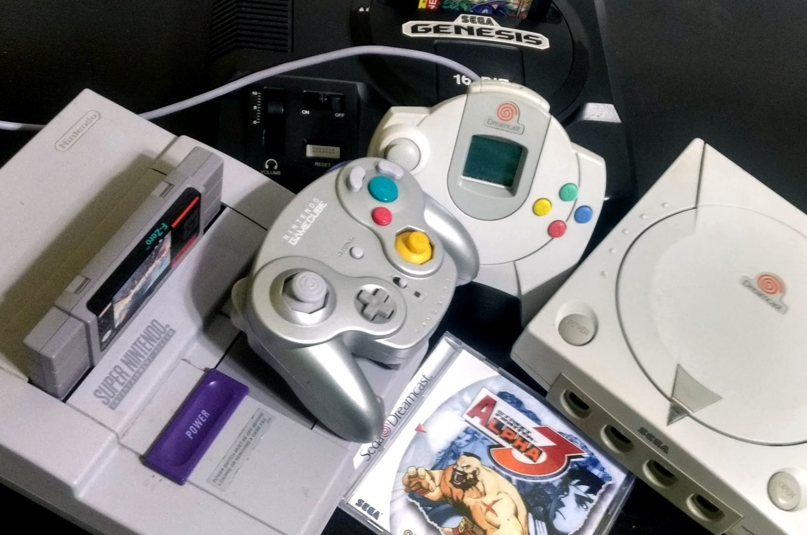
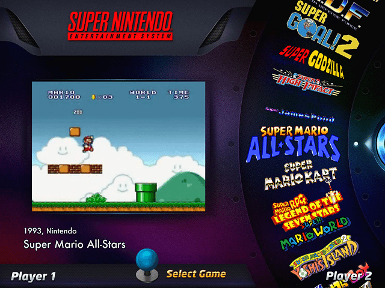
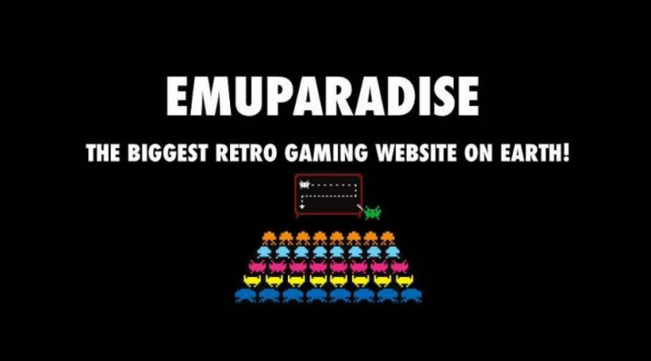
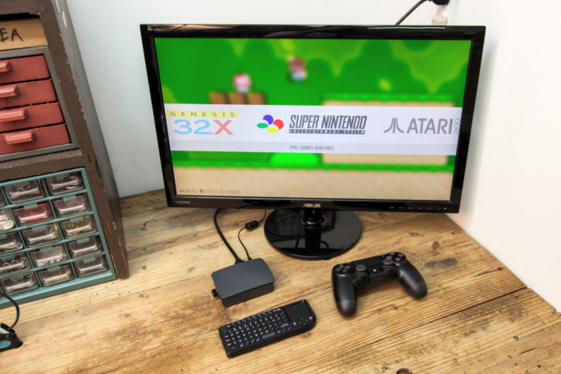
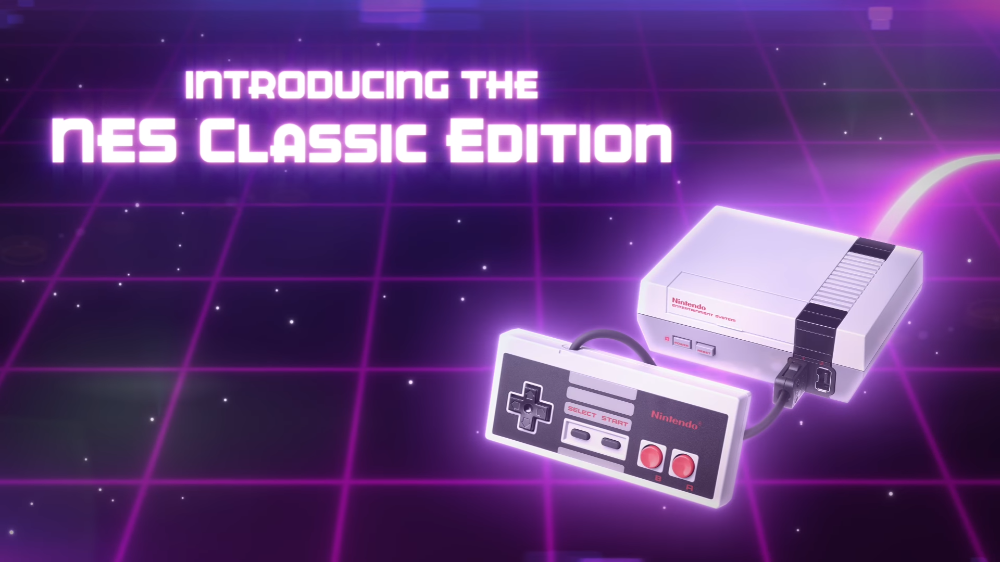
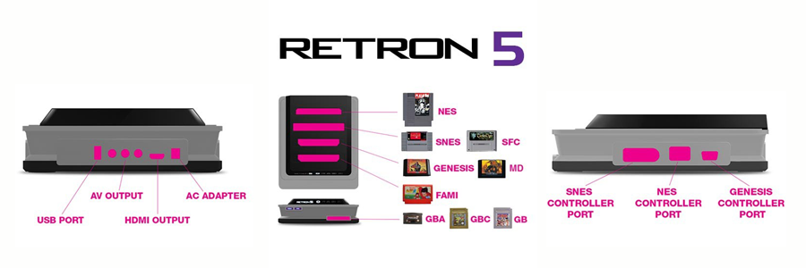

---
{
	title: "In Defense of Original Hardware: A Discussion on ROMs and Playing Retro Games",
	published: "2018-08-10T09:00:00-04:00",
	tags: ["Rockmandash Rambles", "TAY", "Retro Gaming", "Emuparadise", "ROMs"],
	kinjaArticle: true
}
---

As an avid fan of retro gaming (especially on original hardware), [Emuparadise](https://www.emuparadise.me/emuparadise-changing.php)’s decision to take their ROMs down and the discussions that have followed have a left a lot of mixed thoughts in my mind. I thought I’d throw my two cents about the whole situation, as well as clarifying some things that you may not understand about the state of retro gaming with original hardware.

***

## About Nintendo and Emuparadise

Let’s start with the most important part of this whole debate- [Distributing ROMs is illegal, period](https://www.howtogeek.com/262758/is-downloading-retro-video-game-roms-ever-legal/). The legality of ROMs and emulators themselves are a different story (Dumping ROMs for personal use is in a legal grey zone and Emulators are legal), but it’s pretty clear cut that distribution of ROMs is illegal.

Nintendo or any other company have all the right in the world to pursue legal action on these distributors - they’re still profiting on many of these games successors or VC options, and even if they aren’t, they still have their IP to defend. I think it’s fairly ironic that Nintendo is the one trying so hard to stop piracy when their consoles are some of the easiest to pirate with and they put so little effort into making their devices secure (see FreeShop), but it is what it is.

In regards to Emuparidise, you might disagree with their decision to take their ROMs down especially because we don’t know if they were directly pressured to do so, but their actions are pretty defendable and easy to understand too. Since Nintendo is on the right side of the law, they would most likely win a suit and the amount that they’re asking for ([$2M for each Trademark infringement and $150K for each Nintendo game](https://torrentfreak.com/nintendo-sues-console-rom-sites-for-mass-copyright-infringement-180720/?utm_source=feedburner\&utm_medium=feed\&utm_campaign=Feed%3A+Torrentfreak+%28Torrentfreak%29)) would risk the livelihood of the team, as the founder MasJ explains:

> It’s not worth it for us to risk potentially disastrous consequences. I cannot in good conscience risk the futures of our team members who have contributed to the site through the years. We run EmuParadise for the love of retro games and for you to be able to revisit those good times. Unfortunately, it’s not possible right now to do so in a way that makes everyone happy and keeps us out of trouble.
>
> This is an extremely emotional decision for me after running this site for so many years. But I believe it is the right thing for us at this point of time.

Being mad at either of these groups is not helping anyone, and both of these groups were in the right. Ultimately this sucks for fans of retro games though: Sure, there’s other places to get ROMs and games, but Emuparadise was one of the best distribution platforms with lots of abandonware, and no viruses and adware like so many other sites. They provided an easy way to access games that would much harder to get otherwise, and now they’re gone.

***

### About Piracy & Game Preservation

There’s one quote that’ll always ring in my mind about piracy, and it’s still relevant now:

> “*Piracy is almost always a service problem and not a pricing problem.*“- Gabe Newell

The reason so many people flock to solutions like Emuparadise is simply put because they provide a much better solution than the alternative. Even for games that aren’t super obscure like *GoldenEye 007*, you’d have to get an n64 because nothing’s BC with N64(and it isn’t on VC) then and you’d have to either go to a retro game store or go online to eBay and pick it up - which is much more annoying than just downloading an emulator and ROM, then playing it on your PC. Hell, there are people in [certain regions like Iran](https://mashable.com/2017/08/20/nintendo-iran-club/#urKV7Yyt6iqd) where game companies aren’t even supported, and they have no legal way of buying very common games other than importing or from third parties.\
\
Seeing these games go down is a bummer because the industry hasn’t done a good job of archiving games - if every NES, SNES, N64, SMS, TG16, GEN, SAT, DC, etc game was available on like the Switch eShop for an example, I doubt many people would be nearly as upset as they are now. These games are a key part of the history that this industry builds, and to see them be that much harder to access is a tragedy.

That being said, game preservation doesn’t necessarily go hand in hand with piracy and piracy shouldn’t be looked at as the only method of preserving these games. Companies like GOG put a lot of effort to make abandonware up to date and available legally, and if you aren’t familiar with what they’ve done, check out this documentary out if interested. Here’s hoping that groups like Emuparadise use this opportunity to make console games more accessible on modern platforms, to keep the idea of game preservation alive, in a more legal manner.

***

## **So, About How Much Harder...** 

All that being said though, there’s been a lot of misinformation in the wake of all this news about how hard it is to play these games in a legal manner, and that’s been bothering me quite a bit. It’s not impossible, it’s not inherently expensive, it’s not a waste of time because of the inherent age of the systems and it is not impossible to play on original hardware in high quality.

While some poorly sold cult classics games like *Snatcher *and *Earthbound* are getting so expensive to the point in which it makes absolutely no sense to buy them, you can get many retro games for fairly cheap and pretty easily in a legal manner. Obviously there’s emulation boxes like the NES & SNES Mini that have a compilation of games and you can get many online like PS1 games on the PSN store, but even buying the original carts is reasonably cheap. Even great games like *Legend of Zelda: Link to the Past* for SNES is about 20 dollars to get, and many games are about that ball park or less (fun fact, my friend [@crutchcorn](https://twitter.com/crutchcorn) [got 50+ copies of* Sonic 2 *for Game Gear ](https://www.facebook.com/FairGameRetro/photos/a.633159503386168.1073741826.435680173134103/1789448527757254/?type=3\&theater)because they’re so cheap and the retro game store I frequent called [Fair Game](https://www.facebook.com/FairGameRetro/) had so many copies that they struck a deal with him to get rid of em). There’s so many cheap games out there that you can have a great time and not pirate anything, and they’ll look great on your shelf in the process.

Playing your original games isn’t really an issue too: If you don’t mind emulation, there’s great systems like the [Retron 5](<https://smile.amazon.com/Hyperkin-RetroN-Console-not-machine-specific/dp/B00DZIX3CQ/ref=sr_1_1?ascsubtag=db64892324f1887fb0bcf2f0663ff39fc21261d7\&ie=UTF8\&keywords=retron 5\&qid=1533878649\&s=videogames\&sr=1-1\&tag=kinja-20>) that’ll allow you to play multiple systems in one box in HD, and if you’re a sucker for original hardware like me, then those aren’t all that expensive either: A Sega Genesis costs about 20 bucks to get, a PS2 costs about 50 dollars, a Dreamcast costs about 40 dollars (Everyone reading this, buy a Dreamcast it’s great), etc.

If you’re worried about these consoles failing because of their age, I really wouldn’t be - first of all these consoles are pretty reliable or can be repaired for fairly cheap, but more importantly many people in the retro community are hard at work trying to preserve these consoles. With the older consoles, a lot of work has gone into what we call FPGA consoles - these are systems that can perfectly replicate the way that the original hardware worked and pipe them out in glorious HD. For newer, CD based systems, many groups have made alternatives to CDs that allow you to load games on hardware that’s less prone to failure: you can run games off of an SD card for TurboGrafx 16 through the [SuperSD System 3](https://shop.terraonion.com/en/pc-engine/12-super_sd_system_3-pc_engine.html), the Saturn has [Rhea](https://gdemu.wordpress.com/installation/rhea-installation/)/[Phoebe](https://gdemu.wordpress.com/installation/phoebe-installation/), the Dreamcast has [GDEmu](https://gdemu.wordpress.com/), the GC has [SD Gecko](https://www.gc-forever.com/wiki/index.php?title=SDGecko), while the Xbox, PS2, Wii, Wii U can run HDD games through softmodding. There’s also companies like [Polymega ](http://polymega.com/)hard at work trying to make systems that include disk drives that are capable of running these games you know and love.

And if you’re worried that running on original hardware will make your games look like crap, that’s absolutely not the case. By default with the composite cables you’re probably hooking the systems up with, original hardware can look pretty bad on a modern TV thanks to bad scaling or improper handling of the 240p image these consoles put out, but hook them up with high quality RGB systems and these consoles can shine. My Life In Gaming has a great series about how to get great video quality out of original consoles, and you should definitely check it out. That being said - you don’t have to go full Framemeister like they do and still get great video quality: you can get a cheap CRT and hook everything up with SVideo and games will look pretty great, you could hook up stuff through SCART and get a cheaper HDMI scaler or a SCART to Component transcoder, or you can get stuff like the [HD Retrovision](https://www.hdretrovision.com/) cables that’ll go through component, which most modern TVs should have.\
\
All of this means that retro gaming on original hardware with original copies is a viable option, and just because ROMs are less available doesn’t mean retro gaming is no longer feasible. Many people in the retro gaming community have poured a lot of effort into preserving and improving the experience of playing on these consoles, and to say that ROMs are the only option to get into retro gaming is doing a great disservice to everyone in the community. These are my thoughts on the situation, and feel free to comment and talk about your opinions in regards to ROMs, Emulation and the whole Emuparadise situation :)

***

*Thank you for reading! If you want to check out more of my writing, check out my blog *[*RockmanDash Reviews*](https://rockmandash12.kinja.com/)*, as well as *[*FuwaReviews*](https://fuwanovel.net/reviews-hub/)* and *[*AniTAY*](http://anitay.kinja.com/#_ga=2.29830716.283022684.1516595779-1252363867.1516472140)* where I am a contributor. Also *[*follow me on Twitter*](https://twitter.com/RockmanDash12)* if interested!*