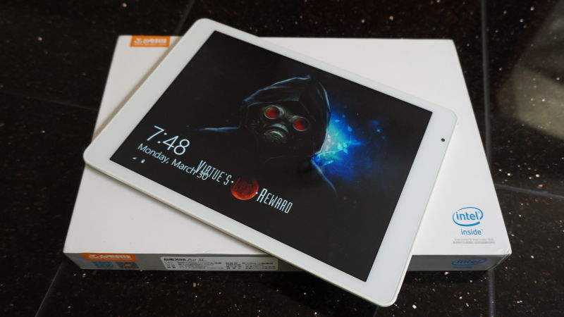

---
{
	title: "Introducing KMTech - News & Reviews about Interesting & Affordable Technology",
	published: "2015-09-17T01:13:48-04:00",
	tags: ["Kevin Mai", "Technology", "KMTech", "GearBest", "About"],
	kinjaArticle: true
}
---

Technology. It’s a field aiming for the best, always making leaps and bounds to push the boundaries, but along the disruption on the high end, there’s a much less talked about aspect that’s just as disruptive... the race to the bottom, where engineering pushes better tech cheaper and cheaper. This is KMTech, my new blog which’ll cover interesting tech products aimed at the Next Billion.

### What is KMTech about?

Like my RockmanDash Reviews blog, it’s another blog covering things I find interesting, but unlike my RockmanDash Reviews blog which was primarily about Visual Novels, KMTech will be focused on news and reviews of import electronics. It’ll be about interesting yet awesome products that don’t break the bank, while not managing to suck in the process.

### What’s the purpose of KMTech?

This answer is three-pronged:

1. I’m a really big fan of tech hardware in general, and because of this, I’ve always wanted to do Tech Reviews. I want to keep my RockmanDash Reviews blog focused on spreading the word of VNs, so I’m making KMTech for the tech half of my blogging.
2. Technology, expecially in the low end has gotten very interesting lately, and there’s not a lot of people in the west covering this material.... so like my VN stuff. This blog is going to be aimed at covering this overlooked aspect of technology, something really lacking in the west.
3. I was recently asked by [GearBest.com](http://www.gearbest.com/), an import retailer if I could do reviews of their products after they read my* Teclast X98 Air II *review, and I couldn’t really say no. Because of this agreement though, I’ll be doing a lot of articles about this, so I didn’t want to flood the blogs i’m affiliated with. (I will be doing my early news posts around the place to get people’s attention and sharing stuff when relevant, but after that I’ll try to keep it on KMTech.)

### Regarding Reviews

On KMTech, I’m receiving products (books, etc) from GearBest free of charge,. If provided, these products are for the sole purpose of reviewing the product, and while I do recieve monitary compensation for these articles and reviews, the money is from GearBest, a retailer that has no influence on the product itself, and will not influence how I review the product. I will not accept any compensation, monetary or other, in order to influence a reviews outcome.

If you want a more specific explaination of the review methodology, I’ll be making a post like my RockmanDash Reviews Methodology which will reflect how it’s done here.

If you have any questions about this policy or one of our reviews, please email me at Kevinmai813@gmail.com or comment in this post below.

### **Where You Can Find KMTech**

You can find KMTech on my kinja blog [KMTech.kinja.com](http://kmtech.kinja.com/#_ga=1.79144861.888615642.1438970662), on the XDA Developer Forum, and on YouTube @ KMTech. I’ll probably branch out and make social media pages, but that isn’t at the table at the moment.
