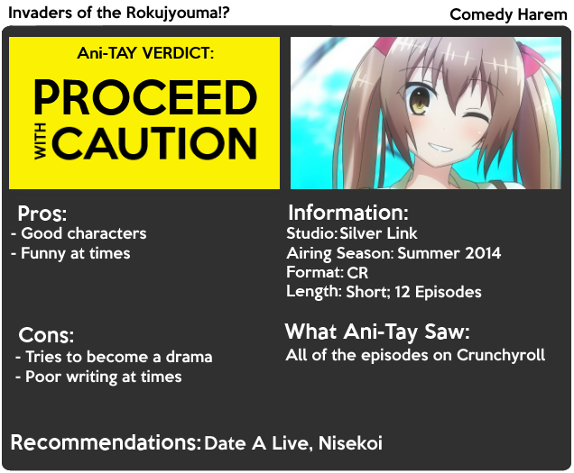

---
{
	title: "Invaders of the Rokujyouma!? : Rockmandash's Ani-TAY Review",
	published: "2014-09-27T19:44:31-04:00",
	tags: ["Rockmandash Reviews", "Ani-TAY", "Tay-Classic", "Review", "Invaders of the Rokujyouma!?", "Invaders"],
	kinjaArticle: true
}
---

Whenever I see a comedy harem show, I immediately think it's one of two things: An enjoyable yet really stupid show that I can't help but love, or a show that's executed poorly. Today, we have *Invaders of the Rokujyouma!?*, a comedy harem adapted by Silver Link that just so happens to be the latter, but has hints of the first catagory.

# Enjoyable Characters

While *Invaders* is very much a harem that does nothing special, the characters that it has are still very enjoyable. All of them fall into a specific trope with a small twist but I couldn't help but smile when I saw them interact with each other. We have Kotarou, our harem protagonist who isn't a pervert or an idiot, a tsundere ghost named Sanae who's reactions are thoroughly enjoyable, a land lady named Shizuka who has an insane wrath, and the list goes on. They are all basic yet enjoyable, which helps keep the show entertaining, even when the plot falls apart. The interactions with each other are what keeps this show interesting, and I really enjoyed them.\
\
Also, I think Yurika deserves her own paragraph. As an airhead magical girl who consistently gets mocked as a cosplayer, she's consistently trotting through failure. Her reactions and personality throughout the show were the show enjoyable, endearing and entertaining, and it made her my favorite character by a long shot. I just wish that the characters (other than Kotarou because of MC OP'ness) knew that she was actually a magical girl and took her seriously.

# Solid Ending

The last episode of Invaders was a return to form that explained a lot about Kotarou's abilities, while being really enjoyable in general. If every episode was like this, I'd love it, but that's not the case. Because of this ending, this show may be more enjoyable in a marathon, and if you are interested in the show, I'd recommend you do so.

# Presentation

Like every show in this genre, the visuals are just average and they do the job. I found that Silver Link did a nice job every now and then in this show, but most of it was pretty normal. The show does the reactions pretty well, the characters look pleasing to the eye, it has good lighting overall and the world looks pretty solid, but it never blew my mind. As for the music itself, it was pretty solid, but it sits in the background, never drawing attention to itself. Once you pay attention to the soundtrack it's actually quite entertaining, but it does nothing special.

# Hilarious, then disappointing.

I loved *Invaders* at the beginning. A harem with the room as the target of said harem, with the protagonist at the side? Silly and entertaining games with nonstop comedy? Unfortunately, it was too good to be true. 1/3rd of the way through the show, they dropped that whole idea completely, and made it into a run of the mill, typical harem show. The antics for the room were done well, and were quite enjoyable and I wish they kept doing that.

When they stopped doing that I was disappointed. They switched into a more traditional harem approach which was more character focused, and because this wasn't done too well, I didn't enjoy it as much. They have running jokes and character interactions which try to keep it entertaining, and I'd never say that Invaders is a horrible show. It's sometimes frustrating, and it's wasted potential, but it's never rubbish.

# Why are you throwing drama into my comedy?

I need to stop expecting every harem show to be another [Date a Live 2](https://anitay.kinja.com/dexs-review-date-a-live-2-1590778711), or [Nisekoi](http://tay.kotaku.com/nisekoi-is-a-harem-romantic-comedy-anime-that-centers-a-1582395958) when I watch a harem comedy. Those shows were comedy first, harem second, and when they do harem, they do it in a funny way. Those were consistently entertaining... but we get shows like this and [Flag](http://anitay.kinja.com/kanojo-ga-flag-wo-oraretara-rockmandashs-ani-tay-revie-1595020190) that try to be a comedy at the beginning, but by the end, would rather prefer to do a character drama, and fail.

Simply put, the show isn't made for something like a character drama. These are characters that are pretty much archetypes, and by taking away the humor for character development, they ruins the direction of the show and made it much less enjoyable. The fact that they went away from the "room has a harem including the main character" concept to a normal harem bothered me, but to try shipping every girl to him in a way that's not particularly good bothered me even more.

What kills it are the harem antics and bad writing. They try to ship Kotarou to everyone, and they try to develop these characters, but neither of them works out well. An Example is episode 9, where they develop the relatively static Yurika pretty well... and everyone finally acknowledges she's a magical girl, but then EVERYONE'S MEMORY GETS REVERTED. Why.... What reason do they have to do that? Every arc has some issue like this, and it bothers me to no end. Every arc also has Kotarou being and being the perfect match for all of these girls, with an insane amount of plot armor, which really detracts from the show. Even though the explanation at the end explains quite a bit about this and makes it less irritating, it doesn't excuse the experience of having to go through that BS. This show would have been so much better if they stuck to the comedy.

*Invaders of the Rokujyouma!?* is another comedy harem show that has let me down, once again. It shows potential, and was enjoyable, but it stopped doing what I loved about it, and the writing fell apart. The ending puts a band-aid on it, but it could have been done better, and I wish it was done better.

***

**Copyright Disclaimer:** Under Title 17, Section 107 of United States Copyright law, reviews are protected under fair use. This is a review, and as such, all media used in this review is used for the sole purpose of review and commentary under the terms of fair use. All footage, music and images belong to the respective companies.

*You can see all my reviews on *[*Rockmandash Reviews*](http://tay.kotaku.com/tag/rockmandash-reviews)*. For an explanation of my review system (which isn't present on this review, but is in most of my reviews), *[*check this out*](https://rockmandash12.kinja.com/rockmandash-rambles-an-explanation-on-my-review-system-1619265485)*.*

*This anime is available on *[*Crunchyroll*](http://www.crunchyroll.com/invaders-of-the-rokujyoma)* for free and legal streaming.*\
**

[Read more](http://www.crunchyroll.com/invaders-of-the-rokujyoma)
