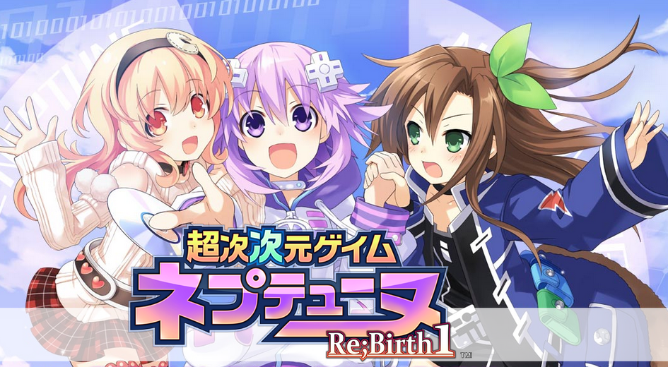
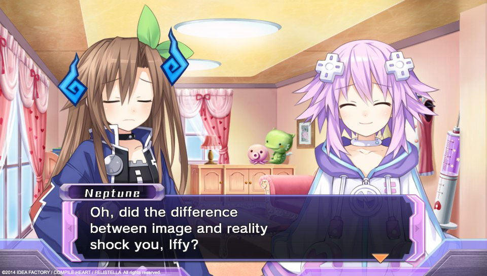
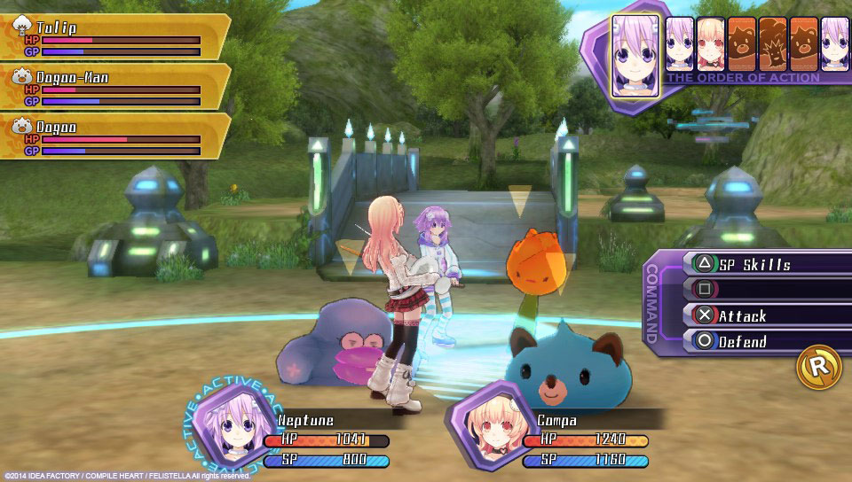
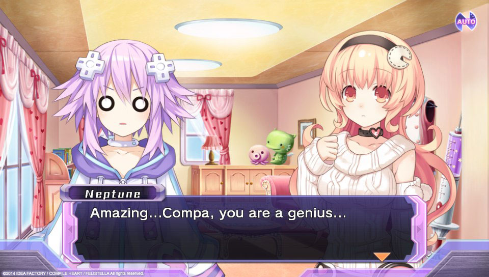

---
{
  title: "Just a Few Thoughts on Hyperdimension Neptunia Re;Birth 1",
  tags: ["Tayclassic", "Hyperdimension Neptunia"],
  published: "2015-08-06T15:19:36-04:00",
  attached: [],
  kinjaArticle: true,
}
---

I picked up Hyperdimension Neptunia Re;Birth for the Vita during the flash sale on PSN a
  few weeks ago, and I rather liked it! Even though there’s already a <a class="sc-1out364-0 hMndXN sc-145m8ut-0 gIacKn js_link" data-ga='[["Embedded Url","External link","http://tay.kinja.com/hyperdimension-neptunia-re-birth-1-the-tay-review-1637235433",{"metric25":1}]]' href="http://tay.kinja.com/hyperdimension-neptunia-re-birth-1-the-tay-review-1637235433" rel="noopener noreferrer" target="_blank">review</a>, I thought I’d might as well talk about it, with some things I’d like to
  mention that wasn’t on the TAY review a while back.

  First off, this game is a lot of fun, with the writing, setup and scenerio being
  just great. From the lack of the 4th wall to the amazing reactions of characters every time something happens, every
  time characters are talking it’s fun and it’s constantly putting a smile on your face. It’s really a strong point of
  the game, being such a fun satire and just an entertaining game in general. Also the voice acting is great too, with
  both the Japanese voices and English voices doing a great job, but I prefer the Japanese voices.

That being said, game has a few issues outside of the writing that’s kept me from loving
it: Gameplay issues.  There are very little variations in design outside of the main aspects as levels are
rehashes of others with the exact same lvl design, character recolors are rampant, and so on. It makes the game feel
more boring than it actually is, and I really wish they had more variation here. Also, This game is a grindfest. Even
if you play normally, you can’t just beat enemies as you go, you’ll need to backtrack and grind grind grind.... It’s
really boring and the thing that’s really holding me back from really loving it. 

Other than that though, this game is pretty fun and I had a good time with it. If you can
get it for cheap (and it’s on sale often), you should pick it up! it’s rather different than other games and it’s
quite fun :)

