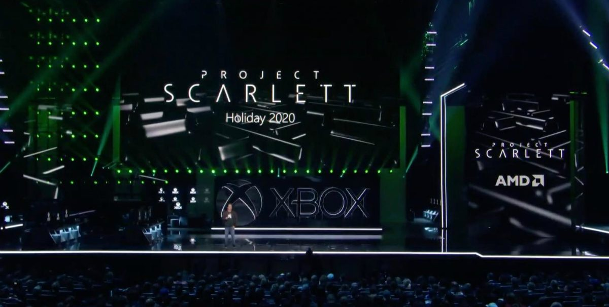
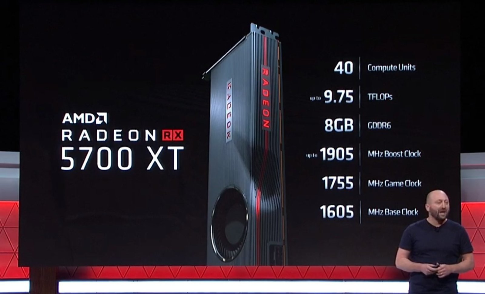
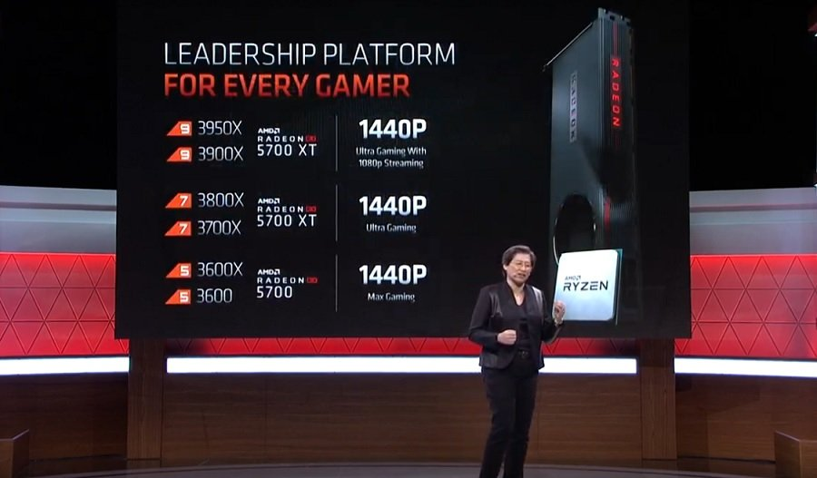
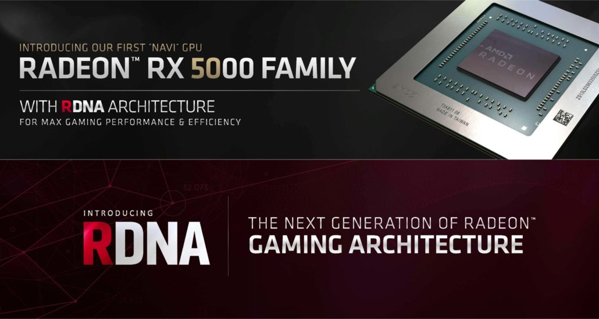

---
{
  title: "Just Some Speculation about Next Gen Consoles and Navi",
  tags:
    [
      "E3 2019",
      "E3",
      "AMD",
      "Navi",
      "Project Scarlett",
      "PS5",
      "Next Gen",
      "Next Gen Playstation",
      "Rockmandash Rambles",
    ],
  published: "2019-06-11T02:32:00-04:00",
  attached: [],
  kinjaArticle: true,
}
---

With Project Scarlett and Next Gen PlayStation already announced with many juicy
  bits and AMD announcing some new components, I’ve been spending some time speculating on what could possibly be in the
  next gen consoles. If you’re not into technobabble, feel free to skip this article, but I’d like to ramble about the
  next generation of gaming from the perspective of AMD and the new Navi cards for a bit here. 

Just for a bit of a
  refresher on what we know about the next generation consoles, feel free to check out the W<a class="sc-1out364-0 hMndXN sc-145m8ut-0 gIacKn js_link" data-ga='[["Embedded Url","External link","https://www.wired.com/story/exclusive-sony-next-gen-console/",{"metric25":1}]]' href="https://www.wired.com/story/exclusive-sony-next-gen-console/" rel="noopener noreferrer" target="_blank">ired Article on the Next Gen PS</a>
  and this <a class="sc-1out364-0 hMndXN sc-145m8ut-0 gIacKn js_link" data-ga='[["Embedded Url","External link","https://www.gamesradar.com/xbox-project-scarlett-specs/",{"metric25":1}]]' href="https://www.gamesradar.com/xbox-project-scarlett-specs/" rel="noopener noreferrer" target="_blank">article about Project Scarlett</a>. I explain the specs we know in
  broad strokes, but if you want to know what they are specifically (even though we really don’t know much in specifics)
  then feel free to check those articles out.

You may not know who AMD is, but they’re a key part of the next generation of
  gaming. They’re the chip maker that powers both the PS4 and Xbox One, they’re the chip maker who will power the
  Project Scarlet and Next Gen PlayStation, they’re making the GPU that’s going into Project Stadia, and they’re one of
  the key players in the PC industry. This year AMD had their very first first time at #E32019 E3, and it was a good
  conference! Really different than what we’d see from one of their normal conferences, but more importantly here at E3
  2019 AMD announced the next generation GPUs code-name Navi, the 5700 XT and 5700 though. Check <a class="sc-1out364-0 hMndXN sc-145m8ut-0 gIacKn js_link" data-ga='[["Embedded Url","External link","https://www.anandtech.com/show/14528/amd-announces-radeon-rx-5700-xt-rx-5700-series/",{"metric25":1}]]' href="https://www.anandtech.com/show/14528/amd-announces-radeon-rx-5700-xt-rx-5700-series/" rel="noopener noreferrer" target="_blank">Anandtech</a> for details, but TL;DR - the RX5700 XT is comparable to an RTX 2070,
  and the RX 5700 is comparable to a 2060.

 From what we know from both Microsoft and Sony, Zen2 and Navi will be the CPU and
  GPU architectures respectively that’ll be the heart of the systems, so what we are seeing from AMD today is what is
  going into the next generation consoles (I think, a bit more on why i’m unsure in a bit). We don’t know how strong
  each of the components are, but given MS and Sony’s claims with 120hz being an aim, and performance that’s ~4x the
  power of an Xbox One X, i’m expecting at least 5700 performance with something like 36CUs. Given how Zen2 is made, it
  would be weird to see anything but an 8c/16t part from AMD because of chiplets and CCX’s, so that’s comparable to a
  Ryzen 3700X, a new CPU announced a few weeks back at Computex. 

All of this sounds
  nice, and I’m expecting pretty damn good performance, but there’s just one thing that’s really, really, really killing
  my excitement - the pricing. The Ryzen 7 3700X is a $330 part, the RX 5700 is a $380 part, sure MS and sony buy bulk
  and they still have to manage to fit in RAM, SSD. Add to the fact they’ll release after the trump tariffs kick in...
  this is looking like a really pricey generation. If you’re like me and you do upgrades whenever new consoles come out
  to get a great experience that’ll at least be console quality for a long time, then you’re looking at $710 alone just
  for CPU and GPU upgrades. Why? Thank stagnant pricing.

 Ever since Polaris (RX 480/RX 470) and Nvidia’s Pascal (GTX 10XX series) came
out, we’ve seen basically stagnant price to performance, and the 5700 cards still didn’t change that. Priced basically
just like how Vega was at launch and priced just like RTX, Navi changes nothing for price to performance even though
every generation that’s basically the bare minimum you’d expect from a new GPU. For me, tech should aim to do the
impossible, or making amazing experiences available to as many people as possible. These past generations fly against
this philosophy, which is a real shame given how much the generations before that have worked to do that. 

Even with next gen looming, price to performance is stagnant. We need more
  performance to run higher resolutions and higher frame rates, to reach the lofty goals that MS and Sony are aiming
  for. With the 5700, we’re still not coming close, and at a much higher price. We’re about what, double GPU perf of an
  Xbox One X? MS said Scarlett’s 4x... Sure, the other 2x could be a result of CPU + SSD, but holy shit this generation
  of gaming is gonna be expensive. When I bought my R9 Fury to match Xbox One X in performance back in 2016, it cost me
  $250 and I got 7.2TFLOP of GPU performance. If i were to buy a GPU now, I’d need to spend $379 to get 7.9 TFLOP in
  performance, in this metric we’ve actually gotten significantly worse! Sure, thanks to IPC and other arch improvements
  there’s gonna be a performance uplift upgrade and maybe a pretty significant one but from a raw performance/compute
  standpoint, price to performance has actually gotten worse. When have you ever seen that in tech, especially after
  that long?

Also worth mentioning - <a class="sc-1out364-0 hMndXN sc-145m8ut-0 gIacKn js_link" data-ga='[["Embedded Url","External link","https://tay.kinja.com/geforce-rtx-and-the-fight-for-the-future-of-gaming-1828278103",{"metric25":1}]]' href="https://tay.kinja.com/geforce-rtx-and-the-fight-for-the-future-of-gaming-1828278103" rel="noopener noreferrer" target="_blank">Ray Tracing</a> has been a bit of a buzz word but it’s really one of the most
  exciting elements about the next generation of gaming. There’s just a small problem? There was nothing about Ray
  Tracing announced or shown here with the Navi and the RX 5700. Both MS and Sony have Navi, but they have also said
  that it would have RT. If both consoles are using this Navi 10 that was announced, how are they doing RT? Sure,
  Microsoft and Sony are using a “custom” version of Navi, but the customization are not usually that drastic. Are they
  using Rapid Packed Math/FP16, which is the only way I could see Navi doing Ray Tracing on current AMD cards? If the
  consoles are not using the same Navi that was just announced today, what differences would they have? WTF is going on,
  and if next gen console Navi isn’t the same as the RX5700, why would you buy a RX 5700 when it’s gonna be usurped by
  something with ray tracing that’ll be the industry standard in a year?

All of this is
  leaving me a bit bummed out, and given what we know I’m speculating a $600 dollar price for each of the consoles or
  more, just another trend in the industry getting more expensive at an extremely fast rate. What are you guys expecting
  price wise for the next consoles? With everything we’ve heard, it’s not going to be cheap at all, and that’s a real
  shame. Would love to read your thoughts, and thanks for listening to me ramble. 

<em>Thank you for reading! If you want to check out more of my
  writing, check out my blog </em><a class="sc-1out364-0 hMndXN sc-145m8ut-0 gIacKn js_link" data-ga='[["Embedded Url","External link","https://rockmandash12.kinja.com/",{"metric25":1}]]' href="https://rockmandash12.kinja.com/" rel="noopener noreferrer" target="_blank"><em>RockmanDash Reviews</em></a><em>, as
  well as </em><a class="sc-1out364-0 hMndXN sc-145m8ut-0 gIacKn js_link" data-ga='[["Embedded Url","External link","https://fuwanovel.net/reviews-hub/",{"metric25":1}]]' href="https://fuwanovel.net/reviews-hub/" rel="noopener noreferrer" target="_blank"><em>FuwaReviews</em></a><em>
  and </em><a class="sc-1out364-0 hMndXN sc-145m8ut-0 gIacKn js_link" data-ga='[["Embedded Url","External link","http://anitay.kinja.com/#_ga=2.29830716.283022684.1516595779-1252363867.1516472140",{"metric25":1}]]' href="http://anitay.kinja.com/#_ga=2.29830716.283022684.1516595779-1252363867.1516472140" rel="noopener noreferrer" target="_blank"><em>AniTAY</em></a><em> where I am a contributor.
  Also </em><a class="sc-1out364-0 hMndXN sc-145m8ut-0 gIacKn js_link" data-ga='[["Embedded Url","External link","https://twitter.com/RockmanDash12",{"metric25":1}]]' href="https://twitter.com/RockmanDash12" rel="noopener noreferrer" target="_blank"><em>follow me on Twitter</em></a><em>
  if interested!</em>

