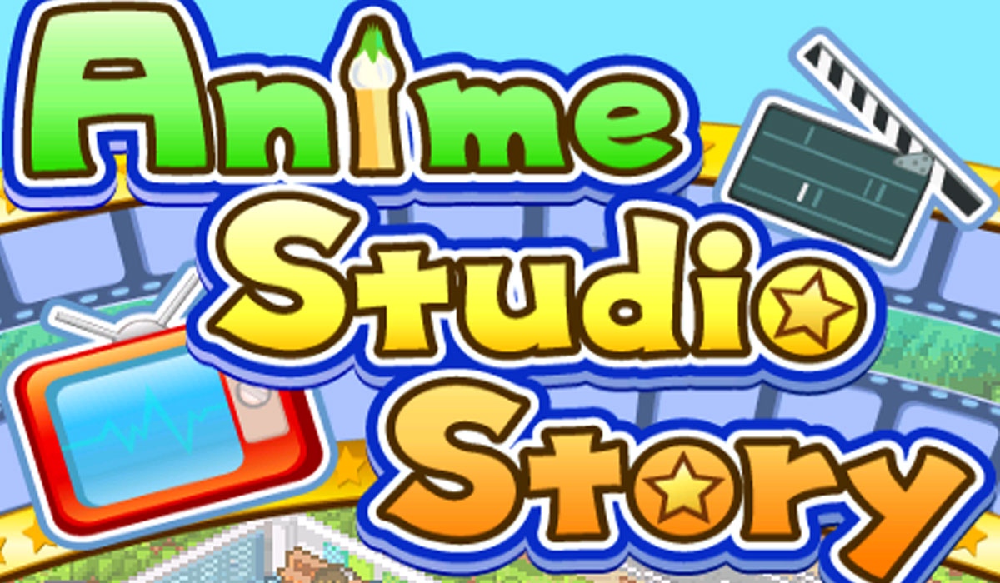
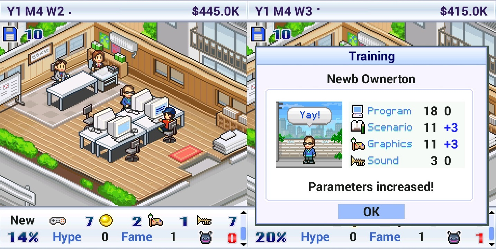
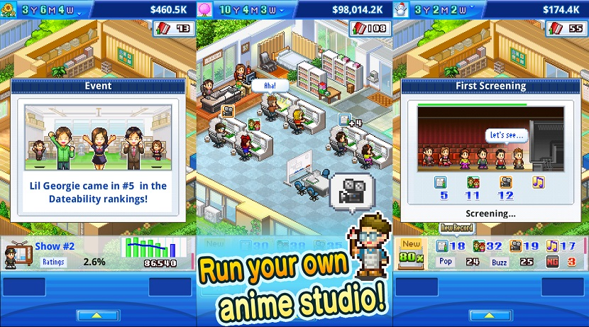
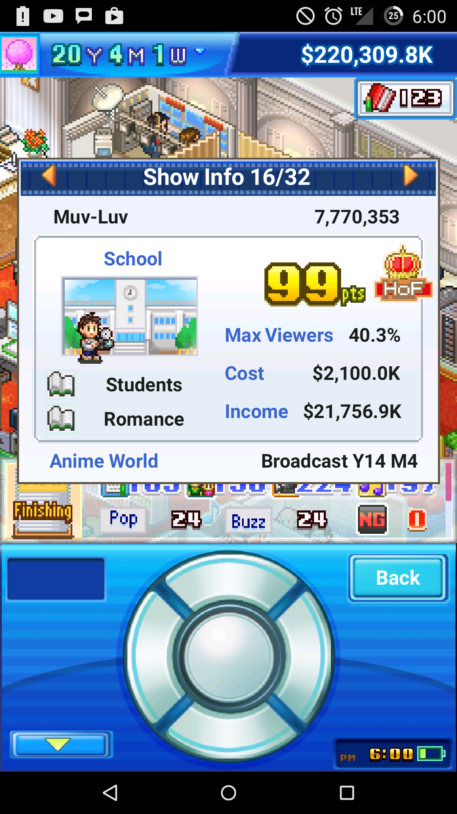
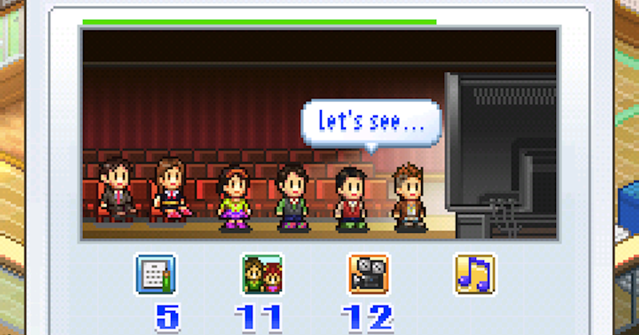

---
{
	title: "Kairosoft Stole All My Free Time Again with Anime Studio Story",
	published: "2015-02-12T21:30:00-05:00",
	tags: ["Rockmandash Rambles", "Rockmandash Reviews", "Kairosoft", "Game Dev Story", "Anime Studio Story", "Tayclassic", "AniTAY", "Simulation", "Mobile", "Android"],
	kinjaArticle: true
}
---

I thought that I'd never be sucked back in like I have been before... but I was wrong. Very wrong. Following the steps of it's predecessor *Game Dev Story* and *Shirobako*, Kairosoft is back ~~for world domination~~ with another new title, *Anime Studio Story*, and... I've put more time into this game then I'd like to admit.

_**Disclaimer: This is a less structured, more ramble-y review than I usually do, akin to my [**Shin Sekai Yori**](http://anitay.kinja.com/shin-sekai-yori-is-a-great-believable-coming-of-age-d-1670092196) review. If you came looking for something that follows a review structure, you won't find it here.**_

Let me fill you in a story: As a little kid in middle school during 2010, I got an iPod Touch for Christmas and was ecstatic. As it was my first real mobile device, I looked all over the web for great games for it (because like every kid at that age, everything was for games, amirite?) and came across a little simulation game called [*Game Dev Story*](http://kotaku.com/tag/game-dev-story)*... *but little did I know what I was getting into. It looked like a relatively innocent game about developing games... but it was much more than that. It was the most addicting game I've ever played, it had one of the best difficulty curves I've seen, it was quite possibly the most portable game I've ever played, and I was hooked to it. One may think that a game about making games would be boring, but with bears as developers, people on fire, an entertaining formula, flexibility to make all the weird virtual games that I wanted to and an amazing 16 bit-esque art style that I adored, it was a recipe for success. While it had some flaws like a relatively dull late game, it was the best game I've ever played on mobile games, and it maybe still the best game on those platforms. I sunk so much time into it, and I got so attached to it: attached to the virtual games I've made, attached to the virtual company that I ran, attached to the virtual people in it, and I loved it. After that, I went and played pretty much every game and loved it, as they did simulation really well with a nice charm, but while they were fun they never had the same hook and feeling that* Game Dev Story* thus I never really sunk that much time into their other games.

Fast forward 5 years and I've pretty much ignored every Kairosoft game after *Beastie Bay.* As I was reading through my news feed, I saw an article stating that they've just released *Anime Studio Story*... and my interest was peaked. Is it the next* Game Dev Story *I've been looking for? Will I like it as much as that? Will it represent anime production well, and Will I enjoy the game? I was really interested in it because it perfectly fits into my parameters, and it's impeccable timing made me want to get it, due to [*Shirobako*](http://kotaku.com/shirobako-is-an-anime-about-making-anime-1680383301), an anime that I've been watching/loving about making anime which peaked my interest about how anime was made, causing me to pay the 5 dollar fee to play an anime studio simulator to make virtual anime, because I like anime. I am glad to say that the answers to all those questions are a resounding YES!, and as the title states, This game has been stealing a ton of my free time as of late.

*Anime Studio Story *is a lot like *Game Dev Story*, and the game mechanics are relatively similar: you start off as a small studio with a secretary and 2 employees, and you start making anime. At the beginning, you only can have 4 employees and will struggle to create anything better than horrible, as shown with an incredibly harsh critic that will give you scores around 50/100, but as you continue through the game, making more anime, more fans and more money, you can get into a new building, hire better staff, and make more, better anime, etc. It's a fun yet dangerously addicting cycle hooks you in, making you smile as your studio starts to succeed or face challenges based on bad decisions you've made. There's no story, but the gameplay is strong enough and fun enough that it overcomes it, and it does everything a simple simulator game should do well, being perfect for the mobile platform.

They've also really nailed the whole easy to learn, difficult to master thing about making these, which makes it that much more enjoyable. From what I know about the process of making anime (which is pretty limited, but it counts for something, right?), I feel like they've captured making anime well while simplifying it for the sake of the game: you pick a station (which will determine who will see it, starting off from a web service and going up), you decide between a setting and two themes, (in which the combination choices are near endless and influence the quality of the show a lot) and the Director, who starts the show off. Once that's done, your staff will make the anime, as represented by 4 values: Writing, Characters, Visuals and Sound, which will all significantly influence the quality of the show. Also, while you are doing that, you need to keep track of the stamina of your employees, create new main characters for your studio (which characters influence the quality of the show and how well it does), rent facilities that will improve the production of the show (which is so much better than the item system of Game Dev Story IMO, but makes it a bit easier), keep track of your fans, and events that are happening around you that will influence the production. While there's no server crash like in *Game Dev Story*, the process is relatively similar to that game, and it works really well as it's simple and fun, but complex enough that you can mess hours in to make the perfect shows.

I think that the reason why I like this and *Game Dev Story* a lot more than with the other games from Kairosoft was the difficulty curve that is just nailed down so well here and was fundamentally different in the others because what they were simulating was pretty different. *Anime Studio Story* and *Game Dev Story *are both about making stuff, and you have the versatility to make whatever fake thing you want while keeping up with a difficulty curve: with the others, you were a lot more limited in what you could do and it felt bogged down. This game allows your creativity to go free (with restrictions of course, as you aren't really making an anime, and you're limited to the tools the game offers) and I really enjoy it. It's the perfect little mobile simulation game, and it's full of little things that it does right that allows you to have so much fun with it, enough fun that makes you overlook the game. It has the charm with the 16 bit visuals and sound (plus, if you don't like the music, you can mute it and play your own in the background) to keep you smiling and coming. it's a game that does everything I want it to do right, and little more. The rest are niceties that just make the experience better.

To sum this game up, it's *Game Dev Story* with anime. That's about it, and **I LOVE IT FOR THAT**. It's just as entertaining, it's just as addicting, it's just as charming, it's everything I loved about *Game Dev Story* but with anime, which is enough to really change the whole ball game again and keep it interesting. It knows that if it if it ain't broke, don't fix it, and it's one of my favorite games on mobile because of it. If you ever felt like playing a simulator game of an Anime Studio, get this right now, and while you're at it, get *Game Dev Story* if you've never played it before.

***

[*Rockmandash*](/authors/reikaze) is a reader on *[*TAY*](http://tay.kotaku.com/)* that finds himself writing a lot about Visual Novels or Anime at *[*Ani-TAY*](http://anitay.kinja.com/)*, but every now and then does a regular Video Game post like this for some strange reason. You can find this game on the *[*Google Play Store*](https://play.google.com/store/apps/details?id=net.kairosoft.android.animestudio_en)*, and I have no idea when it's coming to iOS, if it's not on there.
