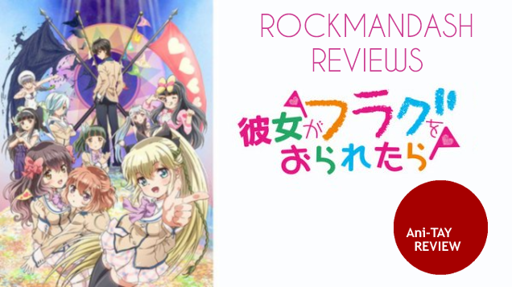
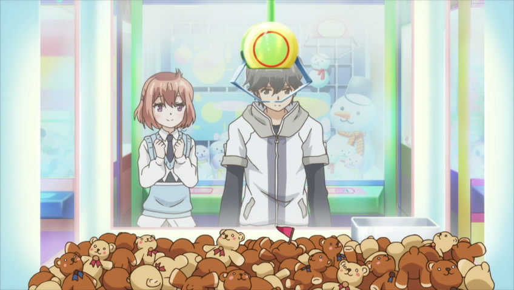
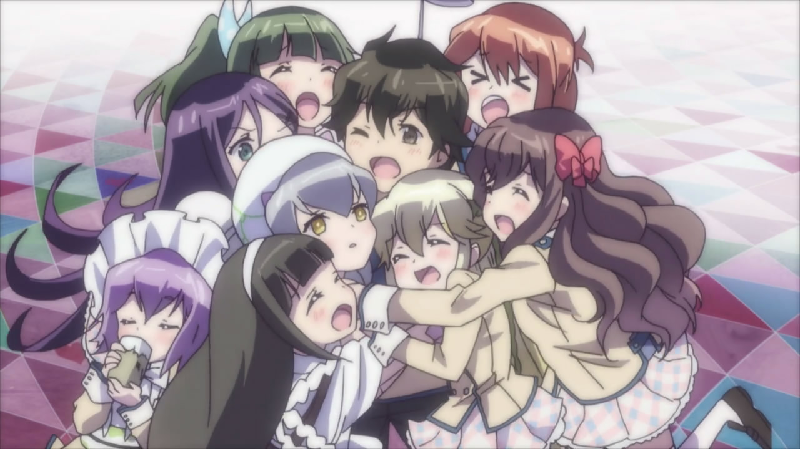
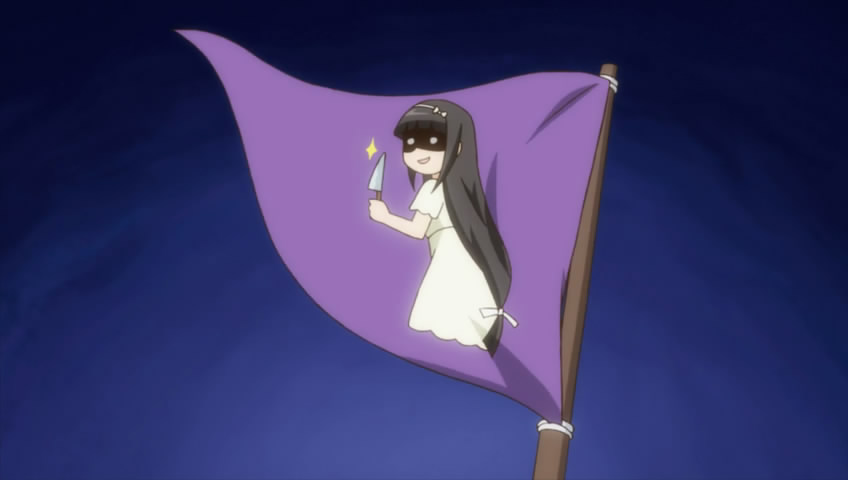
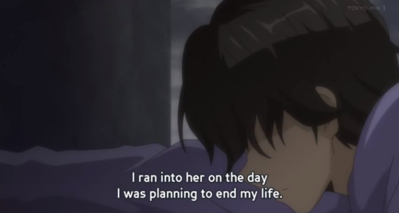
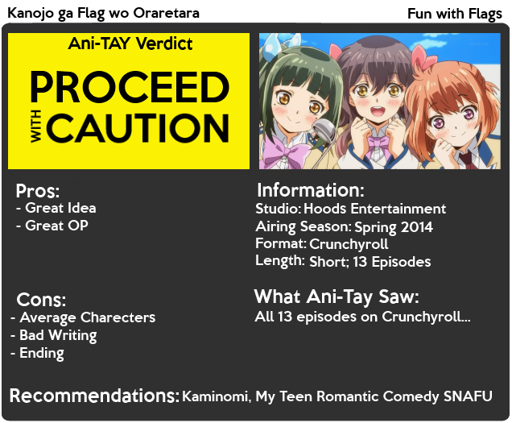

---
{
	title: "Kanojo ga Flag wo Oraretara : Rockmandash's Ani-TAY Review",
	published: "2014-07-02T16:00:00-04:00",
	tags: ["rockmandash reviews", "flag", "kanojo ga flag wo oredera", "ani-tay", "tay-classic", "review"],
	kinjaArticle: true
}
---

Tropes, [flags](http://tvtropes.org/pmwiki/pmwiki.php/Main/EventFlag), [lampshading](http://tvtropes.org/pmwiki/pmwiki.php/Main/LampshadeHanging), etc. If you are a genre savvy viewer, you have probably heard of all these terms before. They are concepts that fans use to describe certain phenomenon in shows, [like how a character monologues endlessly for no end, ignoring everything that's happening, right before certain doom](http://tvtropes.org/pmwiki/pmwiki.php/Main/DeathTropes). It's the small things in the show that fans will notice but are never integral to the plot.... until now. Today we have Kanojo ga Flag wo Oraretara, aka If Her Flag Breaks: a Romantic Comedy Harem show that is about a character seeing these flags, something only viewers of the show should be able to see.

#### The Opening

I love the opening of flag. It's happy, cute, cheerful and enjoyable, which embodies the reason why I watched Flag. Just look at all those flags! It's a great opening that was silly fun, and JUST LOOK AT ALL THOSE FLAGS! How can you not have a stupid smile on your face after watching that?

***

#### The Concept

A show about a guy seeing flags? Just thinking about it is awesome. This show is just as trope-y and glorious in lampshading as I was expecting, and it puts a huge smile on my face whenever I see a flag pop up on somebody's head.. This show follows Hatate Souta, a guy who has the ability to see even flags on the top of people's heads, and manages to amass a harem who live in the Quest Dorm together. Everytime the show is impacted by a flag, it's done usually well, and the flag concept is just a bundle of fun.

#### Presentation

Even though the presentation is quite cute, it's just average, which should be expected because it's being animated by an animation company you probably haven't heard of before: Hoods Entertainment. I have no criticisms, but no praises. Not much to say here.

***

#### Characters

What's a romantic comedy without good characters? Not much, when you think about it, and this show has just average characters. The lead, Hatase Souta is our [Nice Guy](http://tvtropes.org/pmwiki/pmwiki.php/Main/NiceGuy) [Chick Magnet](http://tvtropes.org/pmwiki/pmwiki.php/Main/ChickMagnet) with some depression issues and the rest of the cast can be summed with archetypes. Nanami's a [princess](http://tvtropes.org/pmwiki/pmwiki.php/Main/TomboyPrincess) [tsundere](http://tvtropes.org/pmwiki/pmwiki.php/Main/Tsundere), Akane is a rich [Cuckoo lander](http://tvtropes.org/pmwiki/pmwiki.php/Main/CloudCuckooLander), Kukuno is the [Cool Big Sis](http://tvtropes.org/pmwiki/pmwiki.php/Main/CoolBigSis), Megumu is our [trap](http://tvtropes.org/pmwiki/pmwiki.php/Main/DudeLooksLikeALady) of the show, etc. As Characters, they are really enjoyable, but extremely archetypal, and are never really developed or subverted, giving the feeling that they aren't really trying to do anything unique. I can't forget to mention the absolutely ridiculous harem. Yes, harem is a tag of the show and I should have known this beforehand, but this has to be the most friendly harem I've ever seen. Everyone's extremely friendly about it, and they encourage each other to go for it, it's a game. I find it irritating, yet fun at the same time. It's a weird feeling.

***

#### Enjoyment

I have to say here that I came into this show with certain expectations that most others do not. I was fully expecting something that would act as a [TWGOK](http://tvtropes.org/pmwiki/pmwiki.php/Manga/THEWORLDGODONLYKNOWS) replacement, which is one of my favorite series. Everything I saw showed it would be pretty similar as they are both lampshading romantic comedies. The problem is... TWGOK always jokes at itself and is entertaining all the time. TWGOK never forgets it's premise, which Flag forgot about. TWGOK has great charecters, Flag has archetypes. While they are similar, the small differences really matter, and that's why Flag falls flat on it's face.

#### Story

Flag as a big problem that plagues a few shows this season; That problem is how it flips between different writing tones, causing severe cases of [mood whiplash](http://tvtropes.org/pmwiki/pmwiki.php/Main/MoodWhiplash). Consistency matters, and this show doesn't have a consistent writing tone. Personally, I wished it was just a silly harem show show all the time, like they promised at the start, as the darker parts are just done poorly. To add to that, flag has bad pacing, with here's 13 episodes, the plot doesn't really get anywhere until the end. Characters don't really develop, and the show essentially leaves you hanging on the serious part of the show until very late in into the show.

To make it even worse, because they try to throw in a darker plot, they start **ignoring the reason why you are watching this show in the first place...** hilarious flag antics. Other than the first few episodes, the flags get pushed to the side and forgotten. The show focuses on the characters and tries to be more serious, which can work, as shown in TWGOK, but it just doesn't work here due to poor writing, and the fact that it abandoned why it was good in the first place. Very poor writing.

***

#### Ending

****SPOILERS HERE, SO READ THIS WITH CAUTION. SKIP THIS IF YOU HAVEN'T SEEN THE ENDING****

To add to the bad writing, is a horrible ending. The ending to this show, is absolutely horrible. Everything up to episode 11, was a virtual world.... not real. **THEY MADE THE WHOLE SHOW ABSOLUTELY POINTLESS. FAKE. NOT REAL.** Souta leaves this virtual world to fight against a foe, and with the power of [Deus Ex Machina](http://tvtropes.org/pmwiki/pmwiki.php/Main/DeusExMachina), the rest of the Quest dorm saves him and they reset the real world back to normal. This is bad and lazy writing, but at least it concludes the series. While it's a happy ending, it's an ending that doesn't belong. This show is about [LAMPSHADING](http://tvtropes.org/pmwiki/pmwiki.php/Main/LampshadeHanging) tropes, and they use one of the worst tropes in the book. Do they not know the target audience for this show? This ending can be best described as an excuse, and it was bad.

When I started to watch Flag, I came in expecting a show about... well, Flags. Flag gave us flags at the beginning, and it was glorious, but unfortunately, later on in the show, it dropped the reason why I was even interested in this show, fun times with flags, then it went Deus Ex Machina on us. I'm disappointed with flag, and it is a bundle of missed potential.

### Overall - 6/10 Polarization +2, -2

 

***

**Copyright Disclaimer:** Under Title 17, Section 107 of United States Copyright law, reviews are protected under fair use. This is a review, and as such, all media used in this review is used for the sole purpose of review and commentary under the terms of fair use. All footage, music and images belong to the respective companies.

*You can see all my reviews on *[*Rockmandash Reviews*](http://tay.kotaku.com/tag/rockmandash-reviews)*. For An explanation of my review system, *[*check this out*](https://rockmandash12.kinja.com/rockmandash-rambles-an-explanation-on-my-review-system-1619265485)*.*

