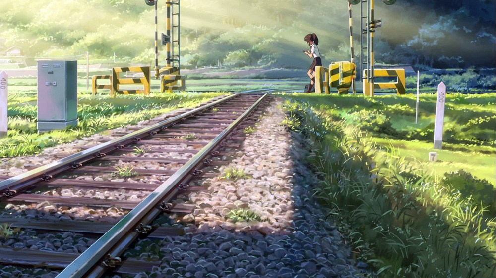
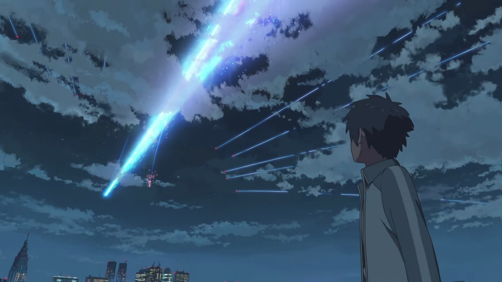
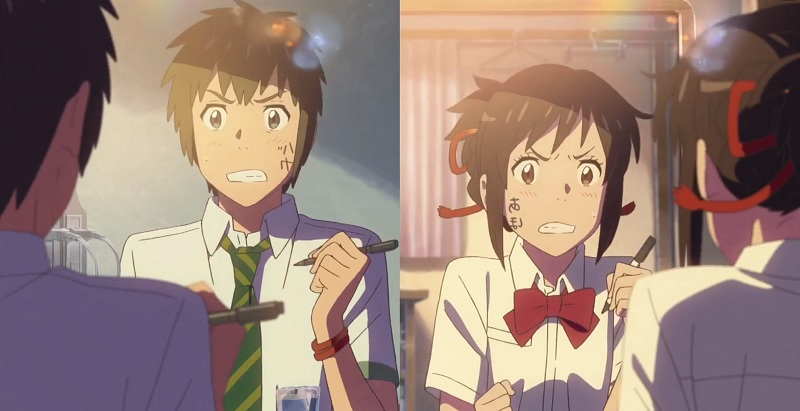
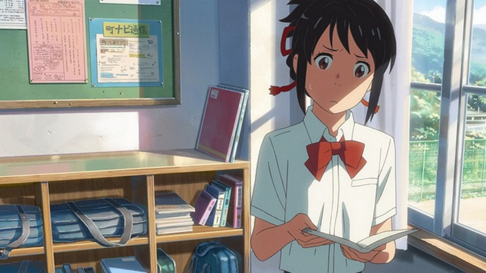
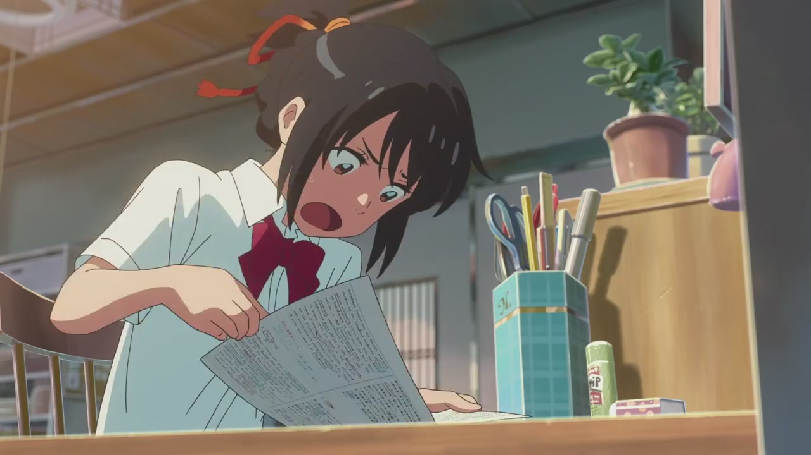
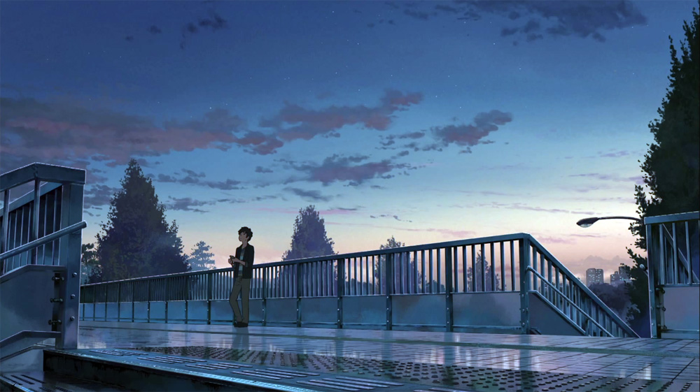
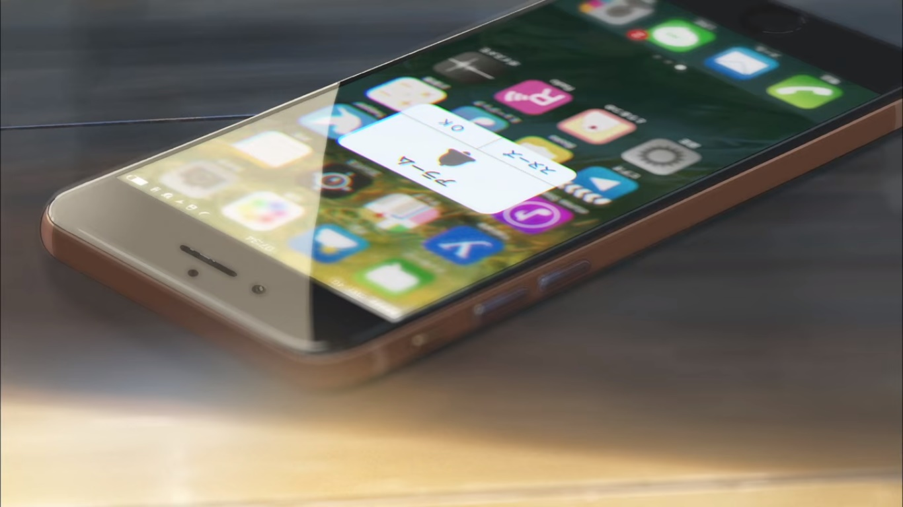
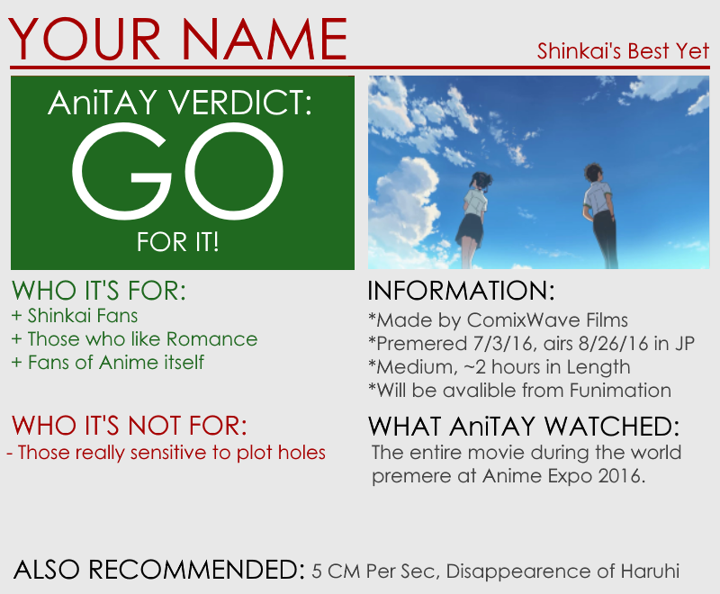

---
{
	title: "Kimi no Na wa (Your Name) : The AniTAY Review",
	published: "2017-04-07T12:00:00-04:00",
	tags: ["The Ani-TAY Review", "RockmanDash Reviews", "Makoto Shinkai", "Your Name", "Kimi no Na wa", "Anime", "AX 2016"],
	kinjaArticle: true
}
---

In the past, you could say that if you’ve seen one of [Makoto Shi](http://tay.kinja.com/the-garden-of-words-the-ani-tay-review-1524606376)[nkai’s movies](http://tay.kinja.com/dexs-review-5-centimeters-per-second-1499521371), you’ve seen them all, with nearly every one of his films being a bittersweet romance that cannot be. With *Kimi no Na wa (Your Name)*, we see this trend broken as we follow the supernatural romance of rural Mitsuha Miyamizu and urban Taki Tachibana as they are linked by bizarre circumstances, trying to figure out why they are somehow swapping bodies. That being said, the change in plot is not the most surprising fact about this movie: in the progress of trying something different however, Makoto Shinkai creates his best film yet, one of the best anime films I’ve ever seen.

**Note: **I watched this film during the world premiere during AX 2016 and this review was originally posted on 7/08/16. before any other major audience had the ability to see it. This means this review avoids spoilers as much as possible.

***

### Still the King of Visuals

Let’s start with the softball here - We’re talking about a Shinkai film, so of course this film looks absolutely phenomenal. This is a man that was able to make a work like *Voices of a Distant Star *pretty much by himself and that movie looked fantastic, so add a competent and perfectionist studio in the form of ComixWave and years of experience and you get something phenomenal, to the point that you could say this is the best looking anime and people wouldn’t be all that surprised you said it. The visuals in Shinkai’s films are almost something we take for granted, but really there is a reason why people jokingly refer to his famous movie *5 Centimeters per Second *as *5 Wallpapers per Second. *The way light reflects in his works, the scenery shots that are jaw dropping, the stunning amount of detail in every shot, it makes the world of the movie feel alive while consistently and relentlessly impressing the audience. The composition of the frames, the flow between scenes, the character design, all of the aspects one can think of when talking about visuals has been masterfully executed here and I have to applaud the master of animation on another job well done. *Kimi no Na wa *looks stunning.

### A Twist on the Usual that Pays Off

Though, staying in the status quo is not the game that *Kimi no Na wa *plays, and we see this primarily through the drastic strides in it takes when changing its story and experience. Slow Paced and bittersweet are not words the can accurately describe a Shinkai work anymore, as this movie does quite a bit different in these aspects.

When looking at the story of a work, one may fixate on the premise, using it to dictate whether they think the story as a whole is great. The issue with this is approach that while you need a premise to base your story around, it is not the end all be all in regards to the quality of the story. The quality of a story primarily depends on the execution of it, not about if the premise seems interesting or not. In regards to *Kimi no Na wa, *while it has more of an interesting premise than your typical Shinkai film, it’s still not all that original in the grand scheme of things. In the end though, this shouldn’t be taken as a criticism for the story of the work: the way they handle it is the most unique I’ve ever seen, and I wouldn’t want this story done in any other way.

In *Kimi no Na wa*, we follow the tale of 2 characters: Mitsuha Miyamizu, a schoolgirl in rural Japan who desires to live in the city even though her fate and family is intertwined with the town, and Taki Tachibana, an aspiring architectural student in Tokyo who lives a typical high school student life with a part time job. With the passing of an unusual comet, the two start dreaming of out of body experiences, in which they quickly realize that these aren’t dreams, but the actual experience of swapping of their bodies and consciousnesses. Of course, like nearly every body swap story that exists out there, hilarity ensues as the two characters take turns exploring and manipulating their alternate lives (fun with boobs, amirite?) but unlike so many out there, *Kimi no Na wa* takes these interactions to make something meaningful out of the story. Instead of just playing it for laughs, the story makes an interesting scenario that pays off in spades later, as well as developing that characters and the world around them.

More impressively, *Kimi no Na wa* does this remarkably quickly, getting you to care about the characters nearly immediately, having you laughing and interested in the character’s circumstances within the first 10 minutes. I’ve always had an issue with Shinkai works because I felt like they were all too impersonal, with the viewer not really getting to know the characters themselves, thus never care about the events they inevitably get themselves into. Because of this, I’ve never personally been able to say that Shinkai films are a good experience in my opinion, films that I can thoroughly enjoy and say I loved… until now, because we truly get to see our two leads grow bonds with their surroundings and those around them, as well as their partner in this body switching insanity.

This is also just one example of a fundamental difference between *Kimi no Na wa *and other Shinkai films: it keeps you engaged throughout your time watching it, always putting a smile on your face. This goes in stark contrast to other Shinkai works, works that prioritize thematic consistency and story structure over the experience one has while watching the work. Watching this movie is a blast, as there is always something to keep your attention, keep you engaged, curious, emotional, etc. The humor of the script and the personality of the cast goes a long way into making a cohesive and engaging experience, and because of the changes in this story I can honestly say that this is the first time where I can say that I fell in love with a Shinkai film.

There is more to *Kimi no Na wa* than just entertaining body swapping however: This is a Shinkai work after all so it does go serious but it is all that much better because of it. In the second half of the movie, *Kimi no Na wa *takes its premise into the next level with a twist that causes the story to stress the bonds it built in a way that can defy time itself, and allows the viewer to experience a love story unlike anything they’ve seen. Going into specifics would be spoilers (something that really should be avoided considering only a few thousand people have seen it thus far), but the work has 3 arcs/phases like *5 Centimeter Per Second *does and as we goes through them we experience a different gamut of emotions throughout the execution of this premise, enabling us to experience loneliness, determination, desperation, and at last, a fulfilling love. They also flow between the arcs very well, so seamlessly that it works to make a cohesive experience, something that can be said for every aspect of the story: *Kimi no Na wa *is a thrilling, engaging journey that is a complete, cohesive experience. It involves wonderful characters in a premise that works perfectly as a base for the emotions that this story is trying to tell, and due to the execution in the first half of the story that gets you so attached to the cast, you can only wish for the best for this cast, and be completely immersed what the story is trying to tell. The execute their plot elements perfectly, and it all pays off, providing an experience that one can only praise. I wasn’t in an ideal viewing situation during the screening of the movie, but even so I was in tears throughout the movie due to the wonderful way that they handled the story.

Through the combination of everything it does, *Kimi no Na wa *becomes the perfect kind of movie, one that creates a kind of connection and tension that people look for in a movie, one that makes you as the viewer enthralled and immersed in the story it has to tell, one that pulls the heartstrings in a way that makes you root harder and harder for the characters involved. Watching the story unfold in *Kimi no Na wa *is watching a perfect package crafted by a mastermind, throwing all elements together in a way that one cannot help but be impressed by, to fall in love with. I’m not the biggest shinkai fan out there, actively showing disdain while everyone surrounds me with hype, but even with that I cannot sit here and say this was a bad movie, this was Shinkai done right, a journey to behold. It’s one that understands the journey it is and executes it in a stroke of perfection in a way that really comes together to make a fantastic movie.

### A Change of Sound as Well

With a drastic change in the way the story is told, other aspects of a work have to go with it, and a place where we can see this change is in who makes the music of the work. One constant throughout Shinkai’s works was the wonderful music by Tenmon, who always composes beautiful yet soft spoken tracks that have made the emotions in a Shinkai work ([or minori work ](http://rockmandash12.kinja.com/rockmandash-reviews-ef-a-fairy-tale-of-the-two-visu-1646035015)[for that matter](http://anitay.kinja.com/ani-tay-reviews-eden-they-were-only-two-on-the-pla-1683418341)), all that much more powerful. Soft spoken and beautiful doesn’t really work for *Kimi no Na wa *though, a story that is much more upbeat and excited than anything that Shinkai has done so something has to be done. While the quality of the music has remained, the staff has not, a change that is better suited for the story that *Kimi no Na wa *has to tell. We got a move from elegance to excitement, so it was time for some outside help which we got it through the band RADWIMPS, a japanese rock band.

I’ve never heard of any of their work before this movie, but they nailed it, with every song fitting perfectly with the scene it was working in tandem with, eliciting emotions as well as any Tenmon score can while being totally different. Tenmon’s sound has always been a quintessential aspect of the strive for perfection that Comix Wave works have had, but as we tear away the beautiful violin, we don’t tear away that perfect fit, instead getting a sound that while more alive, more orchestral and full to suit the places it’s set in and the story it has to tell. It’s execution in the movie is just as great as before, but it’s just different, a difference that fits the work itself.

### Things Done for the Sake of the Story

*Kimi no Na wa* is a wonderful fusion of the supernatural and romance that makes a cohesive, engaging experience, but there is the fact that it is a mixture of these which will inevitably make the story harder to believe at certain points. At no point is this a killer to the movie, never serving to ruin your experience, but there are plot holes occasionally throughout that you may notice that is inevitable given the type of story it’s trying to tell. Once again, not a deal breaker, but definitely worth noting.

There are risks associated with doing something different, but the reasons we take risks in our lives is because the rewards can be oh so sweet. Shinkai, in his pursuit to tell the best story ever, has created *Kimi no Na wa. *It’s a movie that is the best film he’s made yet, all in part because it’s a movie that changed everything that needed to be changed while leaving what was great there. It’s funny, entertaining, gripping, engaging, moving, and romantic; everything I wanted out of a Shinkai film and nothing I didn’t. If you have the opportunity to watch this film, don’t let it go: it’s the best he’s ever done and one of the best anime movies I’ve ever seen.

***

*You’re reading Ani-TAY, the anime-focused portion of Kotaku’s community-run blog, Talk Amongst Yourselves. Ani-TAY is a non-professional blog whose writers love everything anime related. Click *[*here*](http://anitay.kinja.com/)* to check us out. If you want to read more of my writing, check out *[*RockmanDash Reviews*](http://rockmandash12.kinja.com/)* and *[*KMTech*](http://kmtech.kinja.com/)*.*
