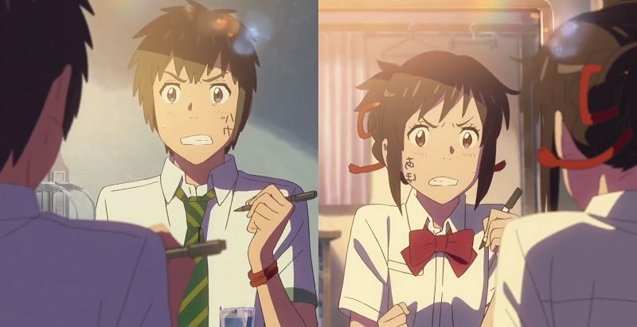
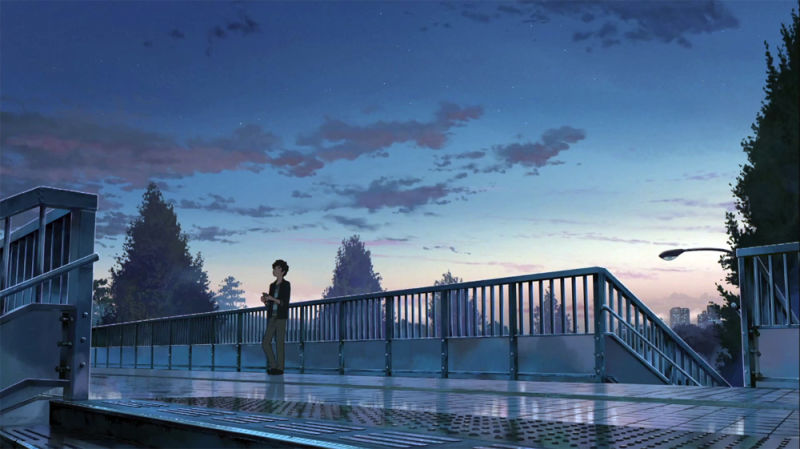

---
{
  title: "Kimi no Na wa/Your Name 's Voice Acting and The Impacts of Different Interpretations",
  tags: ["Rockmandash Rambles", "AniTAY", "Your Name", "Kimi no Na wa"],
  published: "2017-04-14T09:00:00-04:00",
  attached: [],
  license: "cc-by-4",
  oldArticle: true,
}
---

When talking about the influences of the experience in an anime, we rarely
  discuss the impacts of voice acting. Everyone talks about subs vs dubs, or the quality of dubs themselves, but rarely
  do we discuss how these things add to our enjoyment of a show. Today, I’d like to talk about<em> Kimi no Na wa/Your
    Name</em>, a great case of how choices in voice acting can shape your experiences: it’s a fantastic movie with two
  equally as great voice overs, but the different direction in how the lines were presented drastically impacts the
  experience.

<strong>Note: </strong>This article is specifically looking at
  the voice acting of <em>Kimi no Na wa/Your Name. </em>If you want more general thoughts, check out the <a class="sc-1out364-0 hMndXN sc-145m8ut-0 gIacKn js_link" data-ga='[["Embedded Url","External link","https://anitay.kinja.com/kimi-no-na-wa-your-name-the-anitay-review-1783309415",{"metric25":1}]]' href="https://anitay.kinja.com/kimi-no-na-wa-your-name-the-anitay-review-1783309415" rel="noopener noreferrer" target="_blank">AniTAY Review</a>.  Also, this article tries to avoid spoilers, but still
  includes minor spoilers. If you’re trying to figure out which one to watch and don’t have any preferences, skip to the
  end where there’s a <strong><em>TL;DR</em></strong>. 

<iframe allow="accelerometer; autoplay; clipboard-write; encrypted-media; gyroscope; picture-in-picture" allowfullscreen="" frameborder="0" height="315" src="https://www.youtube.com/embed/hRfHcp2GjVI" width="560"></iframe>

The goals of voice acting are the same as any other performance: they aim to make you love
  characters, aim to make the work feel all that more alive, aim to make those moments in a work all that much more
  compelling, etc. While you may have preconceived notations on if sub or dub is better based on the impacts of things
  like how subtitles impact your experience or how things should be experienced in their native language, this article
  is ignoring those, taking a comparison at the performances themselves, not if subs or dubs as concepts are better. I
  personally do not care either way, and with <em>Kimi no Na wa</em>, I find that both of these do what a great
  performance should do, just in different ways. They take different approaches to how characters should be represented,
  how scenes should be executed, and these different approaches give the movie a completely different feel in different
  parts. 

<iframe allow="accelerometer; autoplay; clipboard-write; encrypted-media; gyroscope; picture-in-picture" allowfullscreen="" frameborder="0" height="315" src="https://www.youtube.com/embed/o4-URMnBOPU" width="560"></iframe>

If you asked me, the differences all stem from the notion of what an anime is. In Japan,
  while there are preconceived notions of anime, those are much less than we have here in the west; anime just is in
  Japan. Anime in japan can apply to much more than what we see as anime, being anything animated. In the west, we see
  anime as something inherently foreign, anime that fits into the styles that we all know and love. As such, we tend to
  apply the tropes and archetypes that we see in anime itself to the definition of anime itself, making anime something
  that is ever-changing. A side effect of this is we perceive Anime is inherently *animated* here, larger than life and
  amped up, being able to do things otherwise impossible in a normal TV show, or even in other cartoons. You can see
  this in the way we adapt things from the otakuverse (video games, light novels, visual novels, anime, etc): we tend to
  exaggerate them a bit, because of the effects that our perception has on them. Just look at works like Ace Academy or
  countless cheesy anime dubs to se this.

<iframe allow="accelerometer; autoplay; clipboard-write; encrypted-media; gyroscope; picture-in-picture" allowfullscreen="" frameborder="0" height="315" src="https://www.youtube.com/embed/xOx0Lo_DrCs" width="560"></iframe>

With <em>Kimi no Na wa/Your Name</em>, the dub is anime, the sub just is... and this isn’t
  inherently a bad thing. <em>Kimi no Na wa/Your Name</em> is a very animated film, one with many comedic elements and
  heartfelt emotions, and the way the dub executes them is an uplifting performance that is truly to behold. The dub is
  true to the presentation, acting out how we perceive the visuals, and anime itself. Reactions match the animated
  expressions on screen, matching the emotion that the characters display to the audience. This means the dub enhances
  many moments with strong emotion like the comedy bits in the first half, and it makes the audience comfortable with
  the roles that have and making the work feel very similar to other romantic comedies one may have seen. Of course,
  there is some part of it that is trying to match the Japanese performance, but it takes its own spin on the movie,
  making the dub an engaging and worthwhile experience with it’s own identity.  

<iframe allow="accelerometer; autoplay; clipboard-write; encrypted-media; gyroscope; picture-in-picture" allowfullscreen="" frameborder="0" height="315" src="https://www.youtube.com/embed/a2GujJZfXpg" width="560"></iframe>

The sub however, does not make a performance, it just acts. The Japanese voice cast doesn’t
  try to mold their performance into the style of anime and is solely focused on representing the characters as natural
  as possible. Of course, there are many elements in this movie that would be near impossible to implement in a live
  action, but the voice acting wouldn’t be an indicator of that. The effect of this is that the Japanese voice acting is
  a lot more subdued than it’s English counterpart, with more muted reactions than the English counterpart. While the
  core of the comedy still shines, the comedy doesn’t come nearly as much from the voice acting itself as it does only
  from the source itself.   The benefit of this is when <em>Kimi no Na wa/Your Name </em>takes a more traditional
  Shinkai approach to storytelling, the voice acting serves to enhance the rest of the story instead of trying to lead
  the way, letting the more somber atmosphere of the story itself take change. I feel like this is the better approach
  for a story like this, as the sub can allow for some truly ethereal moments that you simply cannot find in other
  interpretations of the story. Also, I’d argue that the more genuine voice acting also makes the more heartfelt moments
  later on in the story feel all that more compelling and genuine, because we spent the rest of the story seeing them
  more as people than the characters the dub may portray.   

<iframe allow="accelerometer; autoplay; clipboard-write; encrypted-media; gyroscope; picture-in-picture" allowfullscreen="" frameborder="0" height="315" src="https://www.youtube.com/embed/we_YtkNSNJ4" width="560"></iframe>

That being said, there are many parts to this work where the dub did shine, and neither of
  the voiceovers are bad. If you are looking for an enjoyable experience first and foremost, the dub is definitely the
  way to go.A huge problem with Shinkai films in the past was that it was very hard to get attached to the characters,
  the dub makes it easier than ever to care about them, by making them much more enjoyable to watch. I was laughing a
  lot harder in the dub, and so was the audience in the theatre I was in when I was watching the dub, simply because of
  the amazing performances that were put on display. Because of the more inviting nature, this is the better version to
  show to people who are just looking for an enjoyable work, instead of someone looking to be truly wowed.   Either
  way, these voice overs take a significantly different approach to the same story, and show how voice acting can change
  your experience. They show how voice acting can impact atmosphere and tone, impact how you perceive the characters,
  and can directly impact how you enjoy specific scenes themselves. The directing of the voiceovers is another way of
  influencing the direction of a movie, and the different voiceovers <em>Kimi no Na wa/Your Name </em>is a shining
  example of how this is done. 

<strong><em>TL;DR:</em></strong> The dub is more enjoyable and
  better early on, but the sub is more realistic and better in the second half. Both are great though. It’s just that
  the way they handle the voice acting enhance specific scenes, and I prefer the focus the sub has. 

<em><strong>You’re reading Ani-TAY, the anime-focused portion
  of Kotaku’s community-run blog, Talk Amongst Yourselves. Ani-TAY is a non-professional blog whose writers love
  everything anime related. Click </strong></em><a class="sc-1out364-0 hMndXN sc-145m8ut-0 gIacKn js_link" data-ga='[["Embedded Url","External link","http://anitay.kinja.com/",{"metric25":1}]]' href="http://anitay.kinja.com/" rel="noopener noreferrer" target="_blank"><em><strong>here</strong></em></a><em><strong>
  to check us out</strong></em>

