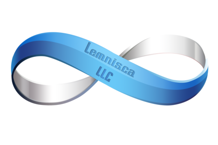

---
{
	title: "Lemnisca Translations becomes a Localization Company",
	published: "2016-06-30T11:54:00-04:00",
	tags: ["News", "Visual Novel", "Lemnisca"],
	kinjaArticle: true
}
---

So I heard you like SciFi? SciFi Visual Novels? If you do, today may be the source of dreams in the future coming true. Lemnisca Translations, a group that has been consistantly translating awesome SciFi Visual Novels like *Never 7* & *Root Double* is now Lemnisca LLC, going legit as a company instead of a fan translation group.\
\
This is kinda big in the world if Visual Novels, at least IMO: We don’t have any group that consistantly works on SciFi Stuff, so we could see some really cool jems brought over that have never been able to come over otherwise. Like they say on their tagline, they are dedicated to localizing truly unique Visual Novels so with their introduction into becoming legit, we may see different types of VNs brought over thanks to Lemnisca. For example, some of the members of this team were essential parts of bringing Steins;Gate over to the west, and now we’re getting S;G 0, something that would have been impossible a few years ago.

Personally, I’m very excited about this news. These past few days have been an Uchikoshi dream of mine (will explain in my AX coverage), but that has gone to the next level. My favorite fan translator is now legit, the same group that’s just as equally as big into the Infinity series and these SciFi VNs as I am, so this makes me very excited. I can’t wait for what they have to offer in the future, and I can only wish them luck for what will come ahead in the future.

Source - [Lemnisca Blog](https://lemniscatranslations.wordpress.com/2016/06/29/big-announcements-new-official-site/)
